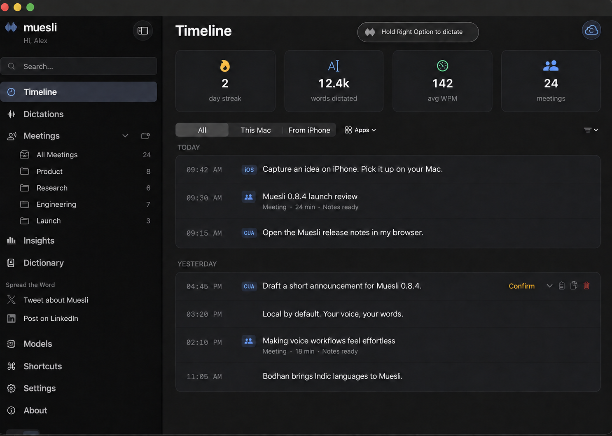

<p align="center">
  
</p>

<h1 align="center">Muesli</h1>

<p align="center">
<a href="https://trendshift.io/repositories/25442?utm_source=repository-badge&amp;utm_medium=badge&amp;utm_campaign=badge-repository-25442" target="_blank" rel="noopener noreferrer"></a>
</p>

<p align="center">
  <strong>Local-first dictation & meeting transcription for macOS</strong><br>
  100% on-device speech-to-text · Zero cloud costs · Privacy by default
</p>

<p align="center">
  <a href="LICENSE"></a>
  <a href="https://buymeacoffee.com/phequals7"></a>
  
  
</p>

---

## What is Muesli?

Muesli is a **lightweight native macOS app** that combines **WisprFlow-style dictation** and **Granola-style meeting transcription** in one tool. All transcription runs locally on Apple Silicon — your audio never leaves your device unless you choose a cloud-backed meeting summary provider.

<p align="center">
  
</p>

### Dictation
Hold your hotkey (or double-tap for hands-free mode) → speak → release → transcribed text is pasted at your cursor. **~0.13 second latency** via Parakeet TDT on the Apple Neural Engine.

### Meeting Transcription
Start a meeting recording → Muesli captures your mic (You) and system audio (Others) simultaneously → VAD-driven chunked transcription happens during the meeting at natural speech boundaries → speaker diarization identifies individual remote speakers (Speaker 1, Speaker 2, etc.) → when you stop, the transcript is ready in seconds, not minutes. Generate structured meeting notes via OpenAI, free OpenRouter models, your ChatGPT Plus/Pro subscription, or local Ollama models.

Live meeting transcripts have two explicit modes. **Nemotron 3.5** provides a multilingual continuous transcript and defaults to using it as the final raw transcript before diarization and note generation. You can instead select any downloaded meeting model as the authoritative final transcript while keeping Nemotron for live preview. **Parakeet Realtime EOU** is a low-latency English preview paired with a separately selected final model. Settings always shows which model owns the final transcript.

Live transcription is off by default. Download Parakeet Realtime EOU or Nemotron 3.5 from Models, then select one under **Settings → Meetings → Transcription**. The waveform-hover preview can be enabled separately from the same section. Downloading a streaming model does not activate it automatically.

---

## Features

- **Native macOS architecture** — Swift, AppKit, and SwiftUI app code with in-process CoreML/ANE, Metal, and LiteRT-LM inference.
- **Multiple ASR models** — Parakeet TDT and Nemotron 3.5 (Neural Engine), Cohere Transcribe 2B (mixed precision CoreML), multilingual Whisper Tiny/Small/Large Turbo (CoreML/ANE via WhisperKit), Qwen3 ASR, SenseVoice Small, Indic ASR, and experimental Gemma 4 E2B.
- **Hold-to-talk & hands-free** — Hold hotkey for quick dictation, or double-tap for sustained recording.
- **Meeting recording** — Captures mic + system audio (including Bluetooth/AirPods) with a CoreAudio process tap by default and ScreenCaptureKit fallback. System audio from Zoom, Teams, and other call clients stays on the Others side of the transcript.
- **Live meeting transcript** — Choose Nemotron 3.5 for multilingual live text with either Nemotron or a separate downloaded final model, or Parakeet Realtime EOU for an English live preview.
- **VAD-driven chunk rotation** — Silero VAD detects natural speech boundaries in real-time, splitting mic audio at pauses instead of fixed intervals. No mid-sentence cuts.
- **Speaker diarization** — Identifies individual speakers in system audio (Speaker 1, Speaker 2, etc.) using FluidAudio's pyannote-based CoreML diarization model.
- **Camera-based meeting detection** — Detects when your webcam + mic activate in a recognized meeting app (Zoom, Chrome, Teams, FaceTime, Slack, WhatsApp). Camera alone (e.g. Photo Booth) won't trigger false positives.
- **Join & Record** — Extracts meeting URLs from calendar events (Zoom, Google Meet, Teams, Webex, Chime, FaceTime). Split-button notification: "Join & Record" opens the meeting + starts recording, "Join Only" opens without recording, "Record Only" starts recording without joining. Platform icons (Zoom, Meet) in the notification panel.
- **Google Calendar integration** — Connect your Google Calendar to see upcoming meetings in the Coming Up section and status bar. Choose whether Muesli watches today, two days, or three days of upcoming events. Event-driven notifications via `EKEventStoreChangedNotification` for instant calendar change detection. Pre-meeting countdowns via Marauder's Map easter egg.
- **Import Audio** — Import m4a, mp4, wav, or mp3 files for offline transcription, speaker diarization, title generation, summaries, and saved meeting history.
- **Meeting export** — Export meeting notes or transcripts as PDF (paginated US Letter) or Markdown. Format picker in the save panel, auto-opens the exported file.
- **Meeting templates** — Built-in and custom templates for meeting notes. Choose a template before or after recording — re-summarize any meeting with a different template.
- **Dismiss calendar events** — Hide irrelevant events from Coming Up, status bar, and menu bar. Dismissed events are pruned automatically.
- **iCloud Text Sync & iPhone Bridge** — Privately sync dictation text, meeting transcripts, notes, summaries, and manual notes with Muesli for iPhone through iCloud. Audio recordings are never synced.
- **Filler word removal** — Automatically strips "uh", "um", "er", "hmm" and verbal disfluencies.
- **AI meeting notes** — BYOK with OpenAI or OpenRouter, sign in with your ChatGPT Plus/Pro subscription (no API key needed), or use local Ollama models. Auto-generated meeting titles. Re-summarize any meeting.
- **ChatGPT OAuth** — Sign in with your existing ChatGPT subscription via browser-based OAuth (PKCE). Tokens stored in the app support directory with owner-only file permissions.
- **Computer Use planner** — Optional voice-driven planner that can execute local app and browser actions from dictated commands with configurable model and timeout settings.
- **Post-meeting hooks** — Run a user-supplied executable after completed meetings. Hooks receive a JSON payload on stdin and log results in the app support directory.
- **Personal dictionary** — Add custom words, phrase matches, and replacement pairs. Jaro-Winkler fuzzy matching auto-corrects transcription output.
- **Model management** — Download, delete, and switch between models from the Models tab. Background downloads that don't block the app.
- **Configurable hotkeys** — Choose any modifier key (Cmd, Option, Ctrl, Fn, Shift) for dictation.
- **Onboarding** — First-launch wizard with model selection, real OS permission verification, hotkey configuration, smoother Accessibility handoff, live dictation test to verify the full pipeline works, and optional summary setup for ChatGPT, OpenAI, OpenRouter, or Ollama. Progress saved on every step — survives crashes and manual quits.
- **Launch at Login** — Start Muesli automatically with macOS login items, with approval-state refresh in Settings.
- **Dark & light mode** — Adaptive theme with toggle in sidebar.
- **SwiftUI dashboard** — Dictation history, meeting notes (Notes-style split view), meeting folders, dictionary, models, shortcuts, settings, about page.
- **Floating indicator** — Frosted glass pill with dynamic waveform, accent color customization, and click-to-stop for meetings.

---

## Install

### Download (recommended)

Download the latest `.dmg` from [Releases](https://github.com/Muesli-HQ/muesli/releases), open it, and drag Muesli to Applications — or double-click to install automatically.

### Homebrew

```bash
brew install --cask muesli
```

Current Homebrew also resolves `brew install muesli` to the official cask; the
`--cask` form is shown to make the app install explicit.

### Build from source

**Requirements:** macOS 14.2+, Xcode 16+

```bash
# Clone
git clone https://github.com/Muesli-HQ/muesli.git
cd muesli

# Build and install to /Applications
./scripts/build_native_app.sh

# Contributor dev build without the maintainer Developer ID certificate
MUESLI_SKIP_SIGN=1 ./scripts/dev-test.sh
```

Release builds are signed by the maintainer Developer ID certificate. External
contributors can use the unsigned dev build for local testing; it installs
`MuesliDev.app` with a separate bundle ID and app data directory.
See [CONTRIBUTING.md](CONTRIBUTING.md) for the full local development workflow.

The selected transcription model downloads on demand (~450 MB for the recommended Parakeet v3).
The app bundle also includes the arm64 LiteRT-LM runtime (~61 MB) for experimental
Gemma 4 support; its ~2.6 GB model weights download only when Gemma is selected.

---

## Agent CLI

Muesli bundles an agent-friendly local CLI inside the app bundle:

- Installed path: `/Applications/Muesli.app/Contents/MacOS/muesli-cli`
- Dev path: `native/MuesliNative/.build/arm64-apple-macosx/debug/muesli-cli`
- Future Homebrew alias: `muesli` once the official cask exposes the bundled binary as a command

The CLI is designed for coding agents such as Codex and Claude Code. It exposes meetings, dictations, raw transcripts, stored notes, and local audio-file transcription. Existing data commands return stable JSON so an agent can analyze them with its own model and write notes back without requiring a user-supplied OpenAI or OpenRouter key. `transcribe` prints plain transcript text by default so it works naturally in shell pipelines.

### What agents should do

1. Discover the CLI:
   ```bash
   command -v muesli-cli || echo "/Applications/Muesli.app/Contents/MacOS/muesli-cli"
   ```
2. Inspect the command contract:
   ```bash
   /Applications/Muesli.app/Contents/MacOS/muesli-cli spec
   ```
3. Transcribe a local audio file:
   ```bash
   /Applications/Muesli.app/Contents/MacOS/muesli-cli transcribe file.mp3
   ```
   Homebrew users should eventually be able to use:
   ```bash
   muesli transcribe file.mp3
   ```
4. List recent meetings or dictations:
   ```bash
   /Applications/Muesli.app/Contents/MacOS/muesli-cli meetings list --limit 10
   /Applications/Muesli.app/Contents/MacOS/muesli-cli dictations list --limit 10
   ```
5. Fetch a full record:
   ```bash
   /Applications/Muesli.app/Contents/MacOS/muesli-cli meetings get 125
   /Applications/Muesli.app/Contents/MacOS/muesli-cli dictations get 42
   ```
6. Summarize or analyze locally in the agent.
7. Write improved meeting notes back:
   ```bash
   cat notes.md | /Applications/Muesli.app/Contents/MacOS/muesli-cli meetings update-notes 125 --stdin
   ```

### Commands

- `muesli-cli spec`
- `muesli-cli info`
- `muesli-cli transcribe <file> [--format text|json|markdown] [--model parakeet-v3|parakeet-v2|parakeet-eou-320ms|sensevoice|qwen3-asr|nemotron35|whisper-tiny|whisper-tiny-english|whisper-small|whisper-small-english|whisper-medium-english|whisper-large-turbo] [--dictionary PATH] [--summarize] [--save-meeting] [--title TITLE] [--output PATH]`
- `muesli-cli meetings list [--limit N] [--folder-id ID]`
- `muesli-cli meetings get <id>`
- `muesli-cli meetings update-notes <id> (--stdin | --file <path>)`
- `muesli-cli dictations list [--limit N]`
- `muesli-cli dictations get <id>`

### Audio transcription

Supported input files: `.mp3`, `.mp4`, `.m4a`, and `.wav`.

Default output is transcript text only:

```bash
muesli-cli transcribe interview.mp3
```

Agent-friendly JSON output uses the normal CLI envelope:

```bash
muesli-cli transcribe interview.m4a --format json
```

```json
{
  "ok": true,
  "command": "muesli-cli transcribe",
  "data": {
    "transcript": "Raw transcript text...",
    "summary": null,
    "durationSeconds": 123.4,
    "wordCount": 420,
    "model": "parakeet-v3",
    "warnings": [],
    "savedMeetingID": null,
    "title": "interview"
  },
  "meta": {
    "schemaVersion": 1,
    "generatedAt": "2026-07-08T00:00:00Z",
    "dbPath": "/Users/example/Library/Application Support/Muesli/muesli.db",
    "warnings": []
  }
}
```

Generate markdown notes with the configured API/local summary backend when available:

```bash
muesli-cli transcribe interview.mp4 --summarize --format markdown --output notes.md
```

`--summarize` uses configured OpenAI, OpenRouter, Ollama, LM Studio, or Custom LLM settings. If the configured backend is unavailable in headless CLI mode, Muesli keeps the transcript and reports a warning instead of discarding the transcription.

Save the import into Muesli as `source = audio_import`:

```bash
muesli-cli transcribe interview.wav --save-meeting --title "Customer Interview"
```

### Dictionary import and export

The app's **Dictionary** tab supports importing and exporting the personal dictionary as JSON. Import merges entries by match word, updates an existing match when the imported definition differs, and appends new words. Export produces the same portable format accepted by `muesli-cli --dictionary`:

```json
[
  {
    "word": "museli",
    "replacement": "muesli",
    "matching_threshold": 0.85
  }
]
```

The CLI also accepts an app `config.json` directly when it contains a `custom_words` array:

```bash
muesli-cli transcribe interview.wav --dictionary ~/Library/Application\ Support/Muesli/config.json
```

`parakeet-eou-320ms` is available for batch file transcription. The CLI chunks the audio internally and returns the completed transcript; it does not expose streaming partials for file transcription.

Direct app-bundle fallback path:

```bash
/Applications/Muesli.app/Contents/MacOS/muesli-cli transcribe file.mp3
```

### JSON contract

Data commands return JSON on stdout. `transcribe` returns plain text by default; pass `--format json` to use the envelope below.

Success shape:

```json
{
  "ok": true,
  "command": "muesli-cli meetings get",
  "data": {},
  "meta": {
    "schemaVersion": 1,
    "generatedAt": "2026-03-17T00:00:00Z",
    "dbPath": "/Users/example/Library/Application Support/Muesli/muesli.db",
    "warnings": []
  }
}
```

Failure shape:

```json
{
  "ok": false,
  "command": "muesli-cli meetings get 999",
  "error": {
    "code": "not_found",
    "message": "No meeting exists with id 999.",
    "fix": "Run `muesli-cli meetings list` to find a valid ID."
  },
  "meta": {
    "schemaVersion": 1,
    "generatedAt": "2026-03-17T00:00:00Z",
    "dbPath": "",
    "warnings": []
  }
}
```

Important meeting fields:

- `rawTranscript`
- `formattedNotes`
- `notesState`
- `calendarEventID`
- `micAudioPath`
- `systemAudioPath`

`notesState` values:

- `missing`
- `raw_transcript_fallback`
- `structured_notes`

### Notes for agent authors

- The CLI is JSON-first and intended to be machine-consumed.
- `transcribe` is text-first by default; use `--format json` for structured agent workflows.
- `formattedNotes` is the only write-back surface in v1.
- `rawTranscript` is read-only and should be treated as source material.
- If `notesState` is `missing` or `raw_transcript_fallback`, agents should prefer summarizing from `rawTranscript`.
- Use `--db-path` or `--support-dir` only when the default Muesli data location is wrong.

---

## Models

| Model | Backend | Runtime | Size | Languages | Latency |
|-------|---------|---------|------|-----------|---------|
| **Parakeet v3** (recommended) | FluidAudio | CoreML / Neural Engine | ~450 MB | 25 languages | ~0.13s |
| Parakeet v2 | FluidAudio | CoreML / Neural Engine | ~450 MB | English only | ~0.13s |
| Parakeet Realtime EOU | FluidAudio | CoreML / Neural Engine | ~430 MB | English only | Live preview |
| **Cohere Transcribe 2B** | CoreML | FP16 encoder + INT8 decoder | ~3.8 GB | 14 languages | ~1s |
| Nemotron 3.5 Multilingual | FluidInference | CoreML / Neural Engine | ~665 MB | 100+ locales | Live; optional final |
| SenseVoice Small | FluidAudio | INT8 CoreML / Neural Engine | ~240 MB | 50+ languages | ~1s |
| Qwen3 ASR | FluidAudio | CoreML / Neural Engine | ~1.3 GB | 52 languages | ~2-3s |
| Indic ASR | CoreML | RNNT | ~618 MB | 7 Indian languages | Experimental |
| Gemma 4 E2B | LiteRT-LM | Metal GPU decoder + CPU audio encoder | ~2.6 GB | Multilingual | Experimental |
| Whisper Tiny Multilingual | WhisperKit | CoreML / Neural Engine | ~153 MB | Multilingual | Fastest Whisper option |
| Whisper Tiny English | WhisperKit | CoreML / Neural Engine | ~153 MB | English only | Fastest English Whisper option |
| Whisper Small Multilingual | WhisperKit | CoreML / Neural Engine | ~250 MB | Multilingual | ~1-2s |
| Whisper Small English | WhisperKit | CoreML / Neural Engine | ~250 MB | English only | ~1-2s |
| Whisper Medium English | WhisperKit | CoreML / Neural Engine | ~1.5 GB | English only | Slower, more accurate English option |
| Whisper Large Turbo Multilingual | WhisperKit | CoreML / Neural Engine | ~626 MB | Multilingual | ~2-4s |

Whisper's Tiny and Small sizes are available as either multilingual or
English-only downloads. The multilingual variants auto-detect the spoken
language by default and also let you pin a language; the English variants stay
focused on English and therefore do not show a language control. Medium English
is available when English accuracy matters more than download size and speed,
while Large Turbo is the strongest multilingual choice for accents, background
noise, and mixed-language audio. Every variant can be downloaded, deleted, and
downloaded again from the Models tab.

The app and `muesli-cli` share Nemotron 3.5's model cache at
`~/.cache/muesli/models/nemotron35-multilingual-2240ms`; downloading it in one
surface makes it available to the other without a second copy.

Cohere Transcribe is a 2B parameter model (#1 on Open ASR Leaderboard) running in mixed precision — FP16 FastConformer encoder on the Neural Engine with INT8 quantized decoders. Includes VAD-gated silence detection to prevent hallucination. Best for high-accuracy multilingual dictation.

Gemma 4 E2B is an experimental multimodal LiteRT-LM backend for direct transcription or on-device transcript cleanup. It is not an ASR-tuned model, so assistant-style outputs are rejected and Parakeet remains the recommended transcription backend. Gemma cannot be selected for ASR and cleanup at the same time.

Meeting echo cancellation uses LocalVQE by default. Release builds ship the
bundled `localvqe-v1.2-1.3M-f32.gguf` model plus the LocalVQE shared libraries,
so users do not need to download an AEC model before their first meeting
transcription. DTLN remains available as the fallback AEC path when LocalVQE
cannot load.

Source/dev builds need the LocalVQE runtime built once with
`./scripts/build_localvqe.sh` (the model is committed; the dylibs under
`native/MuesliNative/LocalVQE/lib/` are not). Without that step, packaging
warns and the app falls back to DTLN. See `CONTRIBUTING.md`.

Models download on demand from HuggingFace. Manage them from the **Models** tab in the dashboard.

---

## Permissions

Muesli needs these macOS permissions (guided during onboarding):

| Permission | Why |
|---|---|
| **Microphone** | Record audio for dictation and meetings |
| **System Audio Recording** | Capture call audio from Zoom/Meet/Teams |
| **Accessibility** | Simulate Cmd+V to paste transcribed text |
| **Input Monitoring** | Detect hotkey presses globally |
| **Camera** *(implicit)* | Detect webcam activation for meeting detection |
| **Calendar** *(optional)* | Show upcoming meetings from Google Calendar |

---

## Tech Stack

| Component | Technology |
|---|---|
| App | Swift, AppKit, SwiftUI |
| Primary ASR | [FluidAudio](https://github.com/FluidInference/FluidAudio) and FluidInference models (Parakeet TDT, Nemotron 3.5, SenseVoice Small, and Qwen3 ASR on CoreML/ANE) |
| Cohere ASR | [Cohere Transcribe](https://huggingface.co/CohereLabs/cohere-transcribe-03-2026) (FP16 encoder + INT8 decoder on CoreML) |
| Indic ASR | AI4Bharat IndicConformer RNNT CoreML backend |
| Gemma ASR / cleanup | [Google LiteRT-LM](https://github.com/google-ai-edge/LiteRT-LM) with Gemma 4 E2B (Metal GPU decoder + CPU audio encoder) |
| Whisper ASR | [WhisperKit](https://github.com/argmaxinc/WhisperKit) (CoreML/ANE) |
| Voice activity | Silero VAD via FluidAudio (streaming, event-driven) |
| Speaker diarization | pyannote via FluidAudio (CoreML on ANE) |
| Camera detection | CoreMediaIO property listeners (event-driven) |
| System audio | CoreAudio process tap by default; ScreenCaptureKit (`SCStream`) fallback |
| Meeting notes | OpenAI / OpenRouter (BYOK), ChatGPT subscription (OAuth), or Ollama |
| Calendar | Google Calendar API (OAuth 2.0) |
| Sync | CloudKit private database for text-only iCloud sync |
| Automation | Computer Use planner and post-meeting executable hooks |
| Export | PDF (NSPrintOperation, paginated US Letter) + Markdown |
| Word correction | Jaro-Winkler similarity (native Swift) |
| Storage | SQLite (WAL mode) |
| Signing | Developer ID + hardened runtime (notarization ready) |

---

## Contributing

Contributions welcome! To get started:

```bash
git clone https://github.com/Muesli-HQ/muesli.git
cd muesli
swift build --package-path native/MuesliNative -c release
swift test --package-path native/MuesliNative
./scripts/test_packaged_cli.sh
```

1,148 tests covering model configuration, custom word and phrase matching, filler removal, transcription routing, data persistence, CLI contract/path-resolution logic, speaker diarization alignment, token consolidation, camera-based meeting detection, CoreAudio system capture, ChatGPT OAuth logic, Ollama summaries, update-flow policy, launch at login, paste/clipboard safety, meeting export, meeting navigation, upcoming-meeting window behavior, and Google Calendar URL extraction.

Current test scope:

- Covered by tests: CLI command contract generation, CLI path-resolution logic, SQLite read/write behavior, note-state classification, meeting/dictation retrieval/update flows, update-flow policy, CoreAudio cleanup, paste/clipboard safety, launch at login, Ollama summary routing, and Computer Use planner foundations.
- Not covered by Swift unit tests: app-bundle packaging and copying `muesli-cli` into `/Applications/Muesli.app/Contents/MacOS`.
- Packaging is verified by `scripts/test_packaged_cli.sh`, which builds an isolated app bundle, checks that `Contents/MacOS/muesli-cli` exists and is executable, and runs `muesli-cli spec` from the packaged path.

Please open an issue before submitting large PRs.

---

## Support

If Muesli saves you time, consider supporting development:

<a href="https://buymeacoffee.com/phequals7"></a>

---

## Acknowledgements

Muesli has been possible because of the generosity of companies such as:

<p>
  <a href="https://www.greptile.com"></a>
  &nbsp;&nbsp;&nbsp;
  <a href="https://openai.com/codex/"></a>
  &nbsp;&nbsp;&nbsp;
  <a href="https://telemetrydeck.com"></a>
  &nbsp;&nbsp;&nbsp;
  <a href="https://www.coderabbit.ai"></a>
</p>

- [FluidAudio](https://github.com/FluidInference/FluidAudio) — CoreML speech models for Apple devices (Parakeet TDT, Qwen3 ASR, Silero VAD, speaker diarization)
- [localai-org/LocalVQE](https://github.com/localai-org/LocalVQE) — on-device acoustic echo cancellation for meeting transcription
- [WhisperKit](https://github.com/argmaxinc/WhisperKit) — Swift Whisper inference on CoreML/ANE
- [Core Audio](https://developer.apple.com/documentation/coreaudio) by Apple — system audio process taps
- [ScreenCaptureKit](https://developer.apple.com/documentation/screencapturekit) by Apple — system audio fallback capture
- [NVIDIA Parakeet](https://huggingface.co/nvidia/parakeet-tdt-0.6b-v3) — FastConformer TDT speech recognition model
- [Cohere Transcribe](https://huggingface.co/CohereLabs/cohere-transcribe-03-2026) — 2B parameter autoregressive ASR (#1 Open ASR Leaderboard)
- [Qwen3-ASR](https://huggingface.co/Qwen/Qwen3-ASR-0.6B) — Multilingual speech recognition (52 languages)
- [AI4Bharat IndicASR](https://huggingface.co/ai4bharat/indic-conformer-600m-multilingual) — IndicConformer multilingual ASR model for Indian languages
- [Google LiteRT-LM](https://github.com/google-ai-edge/LiteRT-LM) — Native on-device Gemma runtime with Swift APIs and Metal acceleration
- [Gemma 4 E2B LiteRT-LM](https://huggingface.co/litert-community/gemma-4-E2B-it-litert-lm) — Experimental multimodal transcription and cleanup model
- [pyannote](https://github.com/pyannote/pyannote-audio) — Speaker diarization (via FluidAudio CoreML conversion)

---

## License

[MIT](LICENSE) — free and open source.

---

## Resources

- [Apple Neural Engine speech-to-text on Mac](https://muesli.works/apple-neural-engine-speech-to-text-mac) — how Muesli uses Apple Silicon, CoreML, and local ASR for fast dictation.
- [Local speech-to-text glossary](https://muesli.works/local-speech-to-text-glossary) — ASR, VAD, diarization, acoustic echo cancellation, Parakeet, Whisper, and Qwen3 ASR.
- [Best dictation apps for Mac](https://muesli.works/best-dictation-apps-mac) — a practical comparison of Mac dictation tools.
- [Offline dictation for Mac](https://muesli.works/offline-dictation-mac) — why local-first voice typing matters.
- [Local meeting transcription for Mac](https://muesli.works/local-meeting-transcription-mac) — meeting notes without adding a bot.

---

## Star History

<a href="https://www.star-history.com/?repos=Muesli-HQ%2Fmuesli&type=date&legend=top-left">
   <picture>
   <source media="(prefers-color-scheme: dark)" srcset="https://api.star-history.com/chart?repos=Muesli-HQ/muesli&type=date&theme=dark&legend=top-left" />
   <source media="(prefers-color-scheme: light)" srcset="https://api.star-history.com/chart?repos=Muesli-HQ/muesli&type=date&legend=top-left" />
   
   </picture>
</a>
