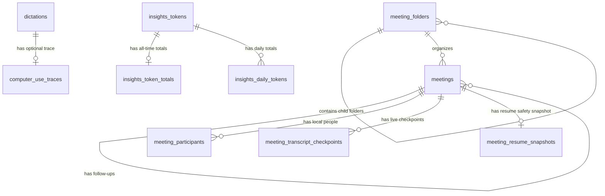

# Muesli SQLite database guide

This document is the contributor and coding-agent map of Muesli's local SQLite
database. It explains ownership, relationships, sync boundaries, and the safe
way to evolve the schema. The executable source of truth remains
[`DictationStore.migrateIfNeeded()`](native/MuesliNative/Sources/MuesliCore/DictationStore.swift).
Update this guide whenever that schema changes.

## Where the database lives

The database filename is `muesli.db` inside the active app's Application
Support directory. Common locations are:

- Stable: `~/Library/Application Support/Muesli/muesli.db`
- Default development app: `~/Library/Application Support/MuesliDev/muesli.db`
- Fixed development lanes: `MuesliDevA`, `MuesliDevB`, or `MuesliDevC` in the
  corresponding Application Support directory

Use `muesli-cli info` to resolve the active database instead of assuming a path.
Do not edit a user's database directly while Muesli is running.

## Storage rules at a glance

- SQLite foreign keys are enabled, the journal mode is WAL, and connections use
  a five-second busy timeout.
- `dictations` and `meetings` are the two durable history roots. Timeline is a
  query across these tables, not a separate table.
- History deletion is soft at first through `deleted_at`. Old tombstones are
  purged after the retention window so CloudKit can observe deletions.
- Only the text-record subset of dictations and meetings participates in iCloud
  sync. A column living on one of those tables is not automatically a synced
  field.
- People, folders, computer-use traces, live checkpoints, resume snapshots,
  audio paths, destination-app attribution, and Insights caches are local-only.
- There is no FTS table. Global search currently uses parameterized `LIKE`
  queries over selected dictation, meeting, trace, and participant fields.
- ISO-8601 strings are used for user-visible event times such as `timestamp` and
  `start_time`. Sync bookkeeping such as `updated_at` and `deleted_at` uses Unix
  time stored as `REAL`.

## Relationship map



Insights record rows point to dictation or meeting IDs through a logical
`(kind, record_id)` pair rather than a foreign key. This lets the cache rebuild
independently from soft-deleted source history.

## Table catalog

### Primary history

#### `dictations`

One row per completed dictation, voice note, iPhone import, or computer-use
command that becomes history.

- Primary key: `id`
- Content: `raw_text`, `app_context`, `word_count`, `duration_seconds`
- Timing: `timestamp`, `started_at`, `ended_at`, `created_at`
- Origin/type: `source` (`dictation`, `cua`, or `ios` in current flows)
- Local destination attribution: `target_app_name`, `target_app_bundle_id`
- Sync/tombstone bookkeeping: `updated_at`, `deleted_at`, `cloud_*`,
  `last_synced_at`, `sync_dirty`

`app_context` remains cleanup/correction context. Destination-app fields are
separate local presentation metadata and are deliberately absent from the sync
record and CLI JSON contract.

#### `meetings`

One row per meeting recording, imported recording, note-only meeting, failed
meeting, or iPhone meeting record.

- Primary key: `id`
- Content: `title`, `raw_transcript`, `formatted_notes`, `manual_notes`,
  `word_count`
- Timing: `start_time`, `end_time`, `duration_seconds`, `created_at`
- Lifecycle: `meeting_status` (`recording`, `processing`, `completed`,
  `note_only`, or `failed`)
- Origin/type: `source` (`meeting`, `audio_import`, or `ios`)
- Local files: `mic_audio_path`, `system_audio_path`, `saved_recording_path`
- Calendar snapshot: `calendar_event_id`, `calendar_occurrence_key`,
  `calendar_source`, `calendar_id`, `calendar_series_id`,
  `calendar_occurrence_start`
- Organization: `folder_id`
- Applied notes template snapshot: `selected_template_*`
- Follow-up thread: `follow_up_to_id` locally and
  `follow_up_to_record_name` across devices
- Sync/tombstone bookkeeping: `updated_at`, `deleted_at`, `cloud_*`,
  `last_synced_at`, `sync_dirty`

Calendar IDs are lookup metadata, not unique meeting identities. A calendar
occurrence can be recorded more than once.

### History-owned local detail

| Table | Purpose | Key and deletion behavior | Sync scope |
|---|---|---|---|
| `computer_use_traces` | Final status, message, and JSON event trace for a CUA dictation | Unique `dictation_id`; cascades with its dictation | Local-only |
| `meeting_participants` | Calendar-attendee or Apple Contact name/email snapshots, including source and calendar suppression state | `(meeting_id, participant_identifier)`; cascades with its meeting | Local-only |
| `meeting_transcript_checkpoints` | Incremental live transcript recovery segments | `id`; cascades with its meeting | Local-only |
| `meeting_resume_snapshots` | Safety copy used while resuming a finished meeting | One row per `meeting_id`; cascades with its meeting | Local-only |

Participant identifiers describe provenance and identity, while the stored name
and email are snapshots. Calendar entries normally use a normalized email-based
identifier; manually selected Contacts use the local Contacts identifier. The
`source` column distinguishes `calendar` from `manual` rows. Removing a calendar
attendee sets `is_suppressed` so a later EventKit refresh does not make that row
visible again; removing a manually added Contact deletes its row. Never put a
Contacts identifier into CloudKit, telemetry, or export metadata.

Before an EventKit meeting begins, an initial launch refresh and subsequent
`EKEventStoreChanged` notifications reconcile the calendar-owned participant
rows. Manual Contacts remain untouched, and suppressed calendar rows preserve
explicit local removals. This reconciliation is lifecycle/event-driven. The
unreleased direct Google OAuth integration does not import or persist meeting
participants; Google calendars exposed through macOS Calendar use this EventKit
path.

### Organization and state

#### `meeting_folders`

Stores the local nested Meetings sidebar hierarchy.

- Primary key: `id`
- Parent relationship: `parent_id -> meeting_folders.id`
- Ordering: `sort_order`
- Meetings reference folders through `meetings.folder_id`
- Local-only; folder membership is not part of `SyncTextRecord`

#### `cloud_sync_state`

Opaque key/value state used by the CloudKit sync engine. Values are binary and
must be treated as implementation-owned serialization, not application data for
manual editing.

#### `local_migrations`

Records one-time local data migrations that cannot be represented by idempotent
DDL alone. `identifier` is the stable migration key and `completed_at` is Unix
time. This is not a numbered schema-version table.

### Derived Insights cache

All Insights tables are rebuildable, local-only derivatives. They must never be
treated as the authoritative source for dictation or meeting history.

| Table | Purpose |
|---|---|
| `insights_cache_meta` | Cache generation/version metadata |
| `insights_tokens` | Deduplicated normalized token dictionary |
| `insights_record_cache` | Per-dictation or per-meeting contribution snapshot |
| `insights_daily_cache` | Daily word, session, meeting, and duration totals |
| `insights_token_totals` | All-time dictation/meeting counts per token |
| `insights_daily_tokens` | Per-day dictation/meeting counts per token |

## What is not stored in `muesli.db`

- Downloaded ASR and language-model weights
- Audio recordings and waveform cache files
- Configuration and custom-dictionary preferences stored in app configuration
- OAuth credentials and tokens
- Logs and diagnostic bundles

Database rows may hold local paths or references to some of these resources,
but the resources themselves remain files or platform-managed secrets.

## How to evolve the schema safely

1. Update the fresh-database `CREATE TABLE` definition in
   `DictationStore.migrateIfNeeded()`.
2. Add an idempotent upgrade path for existing databases. Existing Muesli code
   commonly attempts `ALTER TABLE ... ADD COLUMN` and tolerates only the known
   duplicate-column case.
3. Use `local_migrations` for a one-time data rewrite or backfill. Guard and
   record it in the same transaction so it cannot run repeatedly.
4. Add or replace indexes explicitly. Do not turn calendar metadata into a
   uniqueness constraint without considering repeated recordings.
5. Update every explicit column list and row decoder (`dictationColumns`,
   `meetingColumns`, sync queries, and `make*Record` helpers). Positional SQLite
   decoders make column order significant.
6. Decide the sync boundary deliberately. Adding a SQLite column does not grant
   permission to add it to `SyncTextRecord`, CloudKit, telemetry, exports, or CLI
   JSON.
7. Add tests for a fresh schema, a representative legacy schema, migration
   idempotence, nullable historical rows, decoding, default values, round-trip
   behavior, and read/write behavior.
8. Update this document and any user-facing model/provider lists affected by
   the change.

For multi-row writes, prefer one connection and transaction. Run potentially
blocking database and file work outside the SwiftUI main actor, especially in
audio startup and meeting lifecycle paths.

## Safe inspection

Quit the relevant Muesli build first, copy the database plus its `-wal` and
`-shm` companions when present, and inspect the copy:

```bash
sqlite3 "/path/to/copied-muesli.db" '.tables'
sqlite3 "/path/to/copied-muesli.db" '.schema meetings'
sqlite3 "/path/to/copied-muesli.db" 'PRAGMA foreign_key_check;'
```

Use normal store APIs for mutations. Direct SQL writes bypass sync bookkeeping,
tombstones, cache invalidation, and application-level invariants.
