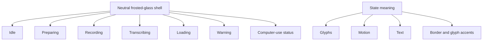

# Neutral Floating Pill System - Plan

## Goal Capsule

- **Objective:** Unify every floating pill state under one neutral frosted-glass visual system, including recording.
- **Product authority:** The confirmed neutral-glass direction governs the pill surface, state emphasis, and scope boundaries.
- **Open blockers:** None.
- **Execution profile:** Three dependency-ordered code units with focused style-contract tests, existing geometry coverage, a full native test pass, and live AppKit visual validation.
- **Stop conditions:** Stop if neutral styling requires a state, geometry, interaction, or settings behavior change that conflicts with R7 or R8.
- **Tail ownership:** The implementation owner carries the change through visual validation, code review, PR delivery, and CI resolution.

---

## Product Contract

**Product Contract preservation:** Unchanged.

### Summary

Every floating pill state will use one neutral frosted-glass shell.
State meaning will come from glyphs, motion, text, and restrained border or glyph accents instead of filled backgrounds.

### Problem Frame

The recording pill established a translucent surface with visible depth and desktop context.
The warning and computer-use presentations leave that material family for frost-free semantic fills, while the primary states vary in tint intensity.
The result feels like several adjacent status components instead of one coherent floating indicator.

### Key Decisions

- **Neutral glass is the shared visual identity.** (session-settled: user-directed — chosen over semantic glass and an accent continuum: the material should carry the identity instead of state-colored fills.) Governs R1, R3, R5.
- **Recording also becomes neutral.** (session-settled: user-directed — chosen over keeping recording accent-tinted: every state should belong to one surface family.) Governs R1, R2.

### Requirements

**Shared surface**

- R1. Idle, preparing, recording, transcribing, loading, warning, and computer-use status must use the same neutral frosted-glass shell.
- R2. Recording must remove the configured accent from its fill while preserving its recognizable recording content.
- R3. State color must be limited to restrained border or glyph accents rather than surface fills.

**State clarity**

- R4. Each state must remain distinguishable through its existing combination of glyph, motion, text, and restrained accents.
- R5. Warning and computer-use status must preserve their urgency or mode recognition without frost-free semantic fills.
- R6. Pill content must remain legible on bright, dark, and visually busy desktop backgrounds.

**Behavioral continuity**

- R7. The visual restyle must preserve state transitions, pill geometry, controls, pointer hit regions, drag behavior, and anchor placement.
- R8. The work must not introduce new states or change when an existing state appears.

### Key Flows

This visual-system change introduces no new user flow.
Existing state transitions and interactions remain authoritative under R7 and R8.

### Acceptance Examples

- AE1. Unified surface family
  - **Covers R1, R3, R6.**
  - **Given:** Every pill state is captured over the same mixed-light desktop background.
  - **When:** The captures are compared side by side.
  - **Then:** Every state reads as neutral frosted glass without a state-colored fill.

- AE2. Neutral recording
  - **Covers R2, R4, R7.**
  - **Given:** Dictation or meeting recording is active.
  - **When:** The recording pill appears.
  - **Then:** The shell remains neutral while the waveform and recording controls still identify the state and behave as before.

- AE3. Neutral warning
  - **Covers R3, R4, R5.**
  - **Given:** A warning replaces the idle or loading presentation.
  - **When:** The warning pill appears.
  - **Then:** The shell remains neutral and restrained accent cues keep the warning unmistakable.

- AE4. Neutral computer-use status
  - **Covers R3, R4, R5.**
  - **Given:** Computer-use cursor mode is active.
  - **When:** Its status pill appears.
  - **Then:** The shell remains neutral and the mode stays recognizable without a blue fill.

- AE5. Unchanged behavior
  - **Covers R7, R8.**
  - **Given:** A user transitions between states, moves the pill, or activates an existing control.
  - **When:** The neutral-glass restyle is present.
  - **Then:** State timing, geometry, placement, and interaction outcomes match the current behavior.

### Success Criteria

- A side-by-side review of all visible states reads as one floating surface family.
- Recording, warning, loading, transcribing, and computer-use status remain recognizable without relying on filled color.
- The shell retains visible translucency and content contrast across representative desktop backgrounds.

### Scope Boundaries

- The work covers the floating pill only; it does not restyle the transcript panel or other application surfaces.
- The work does not change state flow, interaction behavior, pill size, placement rules, or hit targets.
- The work does not replace the existing glyph or motion language except where a small visual adjustment is required for neutral-glass legibility.
- The work does not add a user-selectable surface-style setting.

### Sources / Research

- `native/MuesliNative/Sources/MuesliNativeApp/Models.swift` defines the four primary dictation states.
- `native/MuesliNative/Sources/MuesliNativeApp/FloatingIndicatorSurfaceStyle.swift` owns the shared neutral-glass policy, while `FloatingIndicatorController.swift` applies it to the primary, loading, warning, and computer-use variants.
- `native/MuesliNative/Tests/MuesliTests/FloatingIndicatorGeometryTests.swift` and `native/MuesliNative/Tests/MuesliTests/FloatingIndicatorPlacementTests.swift` protect control geometry and placement behavior.

---

## Planning Contract

### Key Technical Decisions

- KTD1. **Use one presentation-style resolver and one neutral-shell applicator.** The resolver owns role-specific tint, border, and content accents; every primary and transient rendering path uses the same shell applicator. Governs R1, R2, R3, R5.
- KTD2. **Preserve each route's existing layout and transition order.** Primary states apply the shell after content layout, while transient routes replace only their direct layer styling. Governs R7, R8.
- KTD3. **Test the style contract at a pure seam and validate the material live.** Automated tests pin role-to-style invariants; a dev-lane review proves blur, contrast, and state recognition on real desktop content. Governs R1 through R7.

### Assumptions

- The neutral tint uses the existing Catppuccin Mocha base `1e1e2e` for every role. Tint opacity is fixed at 0.44 for collapsed idle, 0.72 for hovered idle and loading, 0.62 for preparing and transcribing, 0.60 for recording, and 0.72 for warning and computer-use status.
- Recording keeps the configured global accent as a restrained 0.42-alpha border cue, not a fill. Warning uses amber and computer-use status uses blue at 0.58 alpha on the border and 0.95 alpha on their existing semantic glyphs.
- Text and recording controls remain white. Secondary text must use at least 0.82 alpha; primary controls and warning text use at least 0.95 alpha.
- When Reduce Transparency is enabled, the shared shell replaces the translucent tint with an opaque `1e1e2e` backing while retaining the same state glyphs and accents. When Increase Contrast is enabled, the shell increases its border to 2 points and raises neutral or semantic border opacity to at least 0.80. State recognition never depends on color alone.
- `ComputerUseCursorOverlay` is a circular pre-attachment fallback rather than a floating pill and remains unchanged.
- The persisted accent setting and its use across the rest of the application remain unchanged.

### Sequencing

1. Establish the shared style contract and direct test seam in U1.
2. Move primary states and loading onto that contract in U2.
3. Move warning and computer-use status onto it in U3, then run cross-state visual and behavioral verification.

### Risks and Mitigations

- **Stale transition chrome:** A prior route can leave hidden glass or a solid fill behind. The shared applicator overwrites glass visibility, tint geometry, content background, and border on every entry.
- **Lost state recognition:** Neutral fills reduce large color cues. Preserve motion, glyphs, text, and restrained semantic accents, then validate all roles side by side.
- **Bright-background contrast:** Frost and thin accents can wash out. Validate over light, dark, and busy desktops before accepting opacity values.
- **Accessibility display modes:** System contrast or transparency preferences can erase the intended material or weaken the state cue. Resolve those preferences through the shared style contract and refresh the visible shell when macOS reports an accessibility-display change.
- **Accidental geometry drift:** Recording controls and computer-use placement have specialized hit and positioning rules. Do not modify frames, layout helpers, transition durations, panel level, or mouse-event policy.

---

## Implementation Units

### U1. Shared neutral-surface contract

- **Goal:** Create one testable presentation-style contract and one shell application path for every floating pill role.
- **Requirements:** R1, R3, R5, R6, R7; KTD1, KTD3.
- **Dependencies:** None.
- **Files:**
  - `native/MuesliNative/Sources/MuesliNativeApp/FloatingIndicatorController.swift`
  - `native/MuesliNative/Sources/MuesliNativeApp/FloatingIndicatorSurfaceStyle.swift`
  - `native/MuesliNative/Tests/MuesliTests/FloatingIndicatorStyleTests.swift`
- **Approach:**
  1. Add an internal presentation-role/style seam that resolves neutral tint, tint opacity, border accent, and content accents without changing layout data.
  2. Add a shared shell applicator that shows and sizes the existing `NSVisualEffectView`, applies the neutral tint layer, clears direct background fills, and applies the resolved border.
  3. Keep icon, label, waveform, frame, and interaction layout outside the shared shell applicator.
- **Patterns to follow:** Extend `setupGlassLayer`, `applyGlassState`, `applyTintLayerGeometry`, and `styleForState` rather than adding another material stack.
- **Test scenarios:**
  - Every presentation role resolves to glass enabled, a neutral `1e1e2e` tint, and a clear direct content background.
  - Recording, warning, and computer-use accents resolve only to border or glyph channels.
  - Every role resolves to the documented tint, border, glyph, and text opacity values.
  - Reduce Transparency resolves an opaque neutral backing; Increase Contrast resolves a 2-point, at-least-0.80-alpha border without changing the role's glyph or text.
- **Verification:** The focused style suite proves the resolver contract without introspecting private AppKit layers.

### U2. Primary states and loading

- **Goal:** Adopt the neutral shell for idle, preparing, recording, transcribing, and loading while preserving their current content and behavior.
- **Requirements:** R1, R2, R4, R6, R7, R8; AE1, AE2, AE5; KTD1, KTD2.
- **Dependencies:** U1.
- **Files:**
  - `native/MuesliNative/Sources/MuesliNativeApp/FloatingIndicatorController.swift`
  - `native/MuesliNative/Tests/MuesliTests/FloatingIndicatorStyleTests.swift`
  - `native/MuesliNative/Tests/MuesliTests/FloatingIndicatorGeometryTests.swift`
  - `native/MuesliNative/Tests/MuesliTests/FloatingIndicatorPlacementTests.swift`
- **Approach:**
  1. Route `applyGlassState` through the shared shell after the existing state content is laid out.
  2. Replace recording's configured accent fill with the neutral tint and retain the configured accent only as a restrained border cue.
  3. Route loading through the shared shell while preserving spinner creation, label layout, sizing, and mutual-exclusion guards.
- **Execution note:** Treat this as a visual restyle; preserve the existing state and geometry tests unchanged unless a new assertion targets the style seam.
- **Patterns to follow:** Preserve the current `setState` ordering, waveform lifecycle, loading guards, and stable-anchor sizing path.
- **Test scenarios:**
  - Covers AE1. Each primary state and loading resolves to the shared neutral shell.
  - Covers AE2. A non-default configured accent does not become the recording fill and remains available as the recording border cue.
  - Covers AE5. Dictation and meeting recording retain existing sizes, waveform/control layout, and hit-region mapping.
  - Covers AE5. Loading still rejects recording and computer-use cursor mode and keeps its existing size and spinner layout.
- **Verification:** Focused style, geometry, placement, and dictation-policy suites pass; live review confirms idle, preparing, recording, transcribing, and loading remain recognizable.

### U3. Warning and computer-use status

- **Goal:** Replace the frost-free warning and computer-use fills with the shared neutral shell and restrained semantic accents.
- **Requirements:** R1, R3, R4, R5, R6, R7, R8; AE3, AE4, AE5; KTD1, KTD2.
- **Dependencies:** U1, U2.
- **Files:**
  - `native/MuesliNative/Sources/MuesliNativeApp/FloatingIndicatorController.swift`
  - `native/MuesliNative/Tests/MuesliTests/FloatingIndicatorStyleTests.swift`
  - `native/MuesliNative/Tests/MuesliTests/NemotronStreamingTests.swift`
- **Approach:**
  1. Route warning through the shared shell, replace the amber fill with an amber border/glyph accent, and use light text on neutral glass.
  2. Route computer-use status through the shared shell, replace the blue fill with a blue border/status-glyph accent, and preserve its status-bar level and mouse transparency.
  3. Leave warning dismissal, loading replacement, cursor return-frame restoration, mutual-exclusion guards, sizing, and transition durations unchanged.
  4. Refresh the active presentation when macOS accessibility display options change, preserving the current state or transient route.
- **Execution note:** Run live AppKit review after automated checks because layer blur and contrast are not fully represented by the pure style seam.
- **Patterns to follow:** Reuse the warning and cursor animation blocks for content/layout while replacing only their material setup.
- **Test scenarios:**
  - Covers AE3. Warning resolves to neutral glass with amber border/glyph accents and light text rather than an amber fill.
  - Covers AE4. Computer-use status resolves to neutral glass with blue border/glyph accents and light text rather than a blue fill.
  - Covers AE5. Warning remains ignored during recording and computer-use status, and warning dismissal still restores idle.
  - Covers AE5. Computer-use status keeps its existing placement, panel level, mouse transparency, and return-frame behavior.
- **Verification:** Focused style and dictation-policy suites pass; live review confirms warning and computer-use status remain immediately recognizable.

---

## Verification Contract

Use a worktree-isolated SwiftPM scratch path resolved through `scripts/muesli_spm_cache.sh` for every direct `swift test` invocation.

1. Run `git diff --check` before tests and before commit.
2. Run the focused `FloatingIndicatorStyleTests`, `FloatingIndicatorGeometryTests`, `FloatingIndicatorPlacementTests`, and `NemotronDictationModePolicyTests` suites.
3. Run the complete `native/MuesliNative` Swift test suite and report the final Swift Testing suite total rather than the earlier XCTest wrapper line.
4. Run `./scripts/dev-test.sh --lane A` and inspect every presentation over light, dark, and busy desktop content, then repeat the representative primary, warning, and computer-use states with Reduce Transparency and Increase Contrast enabled separately.
5. Exercise idle collapsed and hovered, preparing, dictation recording, meeting recording active and paused, transcribing, multiline computer-use transcript, loading, warning, and computer-use status.
6. Recheck drag-at-edge placement and every meeting recording control region after the visual restyle.

---

## Definition of Done

- U1 is complete when every presentation role resolves through one neutral-shell contract and its pure style tests pass.
- U2 is complete when primary states and loading use the shared neutral shell without changing their behavior or geometry.
- U3 is complete when warning and computer-use status use the shared neutral shell with restrained semantic accents.
- Every acceptance example passes in automated or live validation at its highest credible seam.
- The full native test suite passes with the final Swift Testing totals recorded.
- Live review confirms state recognition, translucency, and content contrast across representative desktop backgrounds.
- Reduce Transparency produces an opaque neutral fallback, Increase Contrast produces the documented stronger border, and neither mode removes the non-color state cue.
- The diff contains no unrelated refactor, abandoned experiment, generated secret, or change to persisted accent behavior.
- Code review findings are resolved or recorded durably, the branch is pushed, the pull request is updated or opened, and CI reaches a decided state.
