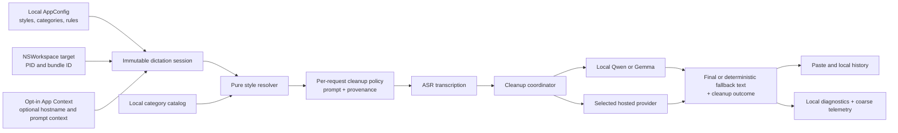
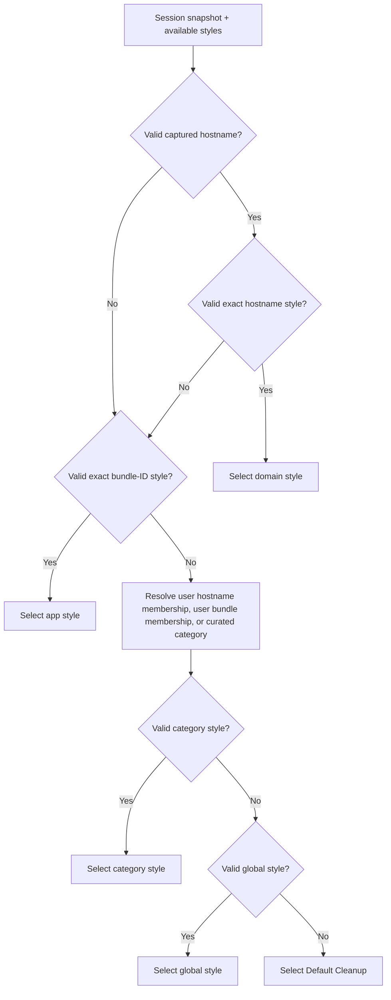
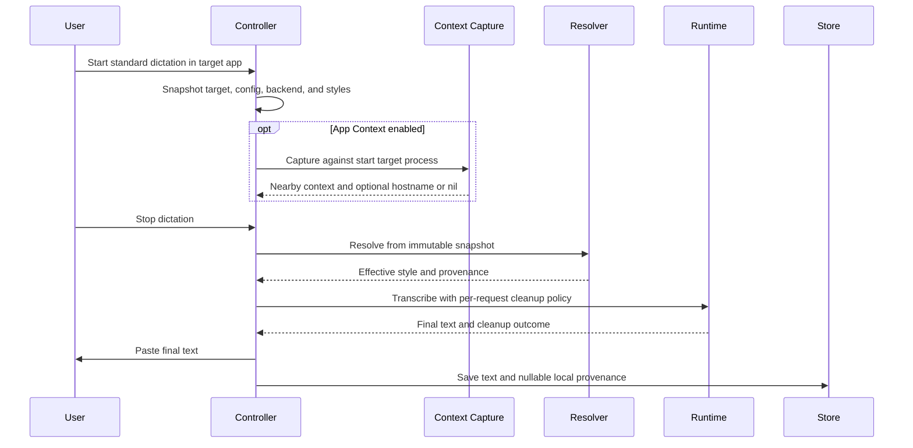
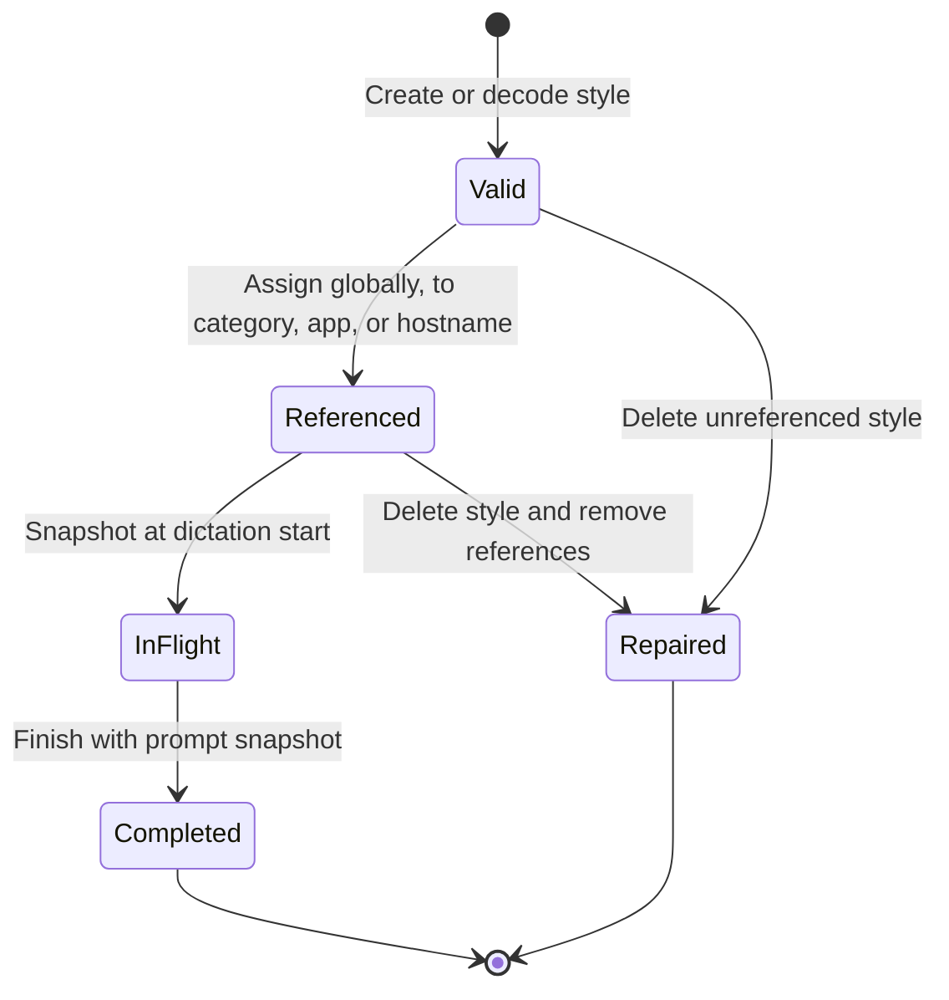
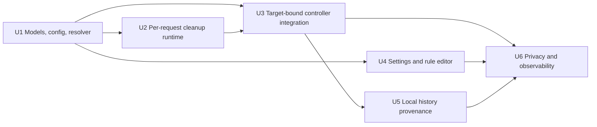

# Per-App Dictation Styles

## Goal Capsule

- **Objective:** Select a local-first dictation cleanup style from the target app or website while preserving the current global cleanup behavior for users who do not opt in.
- **Authority:** The Product Contract defines behavior. The Planning Contract defines implementation constraints. Current repository instructions and code patterns govern details not fixed here.
- **Execution profile:** Deep, cross-cutting native macOS feature. Implement U1 through U6 in dependency order and keep each unit independently verifiable.
- **Stop conditions:** Stop for product direction if implementation would require a new OS permission, send app identity or hostname to telemetry, change cleanup backend per style, or expand into a listed non-goal.
- **Tail ownership:** The executor owns the Verification Contract and Definition of Done. Do not publish, open a pull request, or change the plan artifact unless separately directed.

## Product Contract

### Summary

Muesli will offer an opt-in Adaptive Styles layer on top of AI Cleanup. A user keeps one global default style, can choose styles for fixed app categories, and can add exact app or website overrides. Style resolution stays on-device. The selected style changes cleanup instructions only; the cleanup backend, model, credentials, and App Context privacy setting remain global.

### Problem Frame

Muesli already captures the target app, optional nearby context, and optional browser URL, but it applies one cleanup prompt to every standard dictation. Users must choose between a generic prompt and manually switching prompts as they move among messages, email, documents, and code. The missing behavior is deterministic adaptation to the destination without weakening Muesli's local-first defaults or making dictation depend on context permissions.

### Definitions

- **Dictation style:** A stable built-in or user-created set of cleanup, tone, and formatting instructions composed with Muesli's invariant transcript-safety rules.
- **Global style:** The existing active cleanup prompt, presented as the default when no adaptive rule resolves.
- **Target identity:** The target process and normalized bundle ID captured when dictation starts, plus an optional normalized hostname obtained through the existing App Context path for that same process.
- **Category:** One of the fixed v1 groups: Messages, Email, Writing, or Code.
- **Exact override:** A style assigned directly to one normalized bundle ID or hostname.
- **Selection source:** `domain`, `app`, `category`, `global`, or `built_in_fallback`.
- **Cleanup outcome:** `applied`, `fallback_empty`, `fallback_rejected`, `fallback_error`, `skipped_disabled`, `skipped_unavailable`, or `skipped_streaming`.

### Actors

- **A1 — Dictating user:** Configures styles and expects the target selected at recording start to control output.
- **A2 — Local Muesli runtime:** Captures identity, resolves a style, runs or routes cleanup, pastes text, and stores local provenance.
- **A3 — Selected hosted cleanup provider:** Receives the transcript, composed style instructions, and any separately enabled App Context content when the user chose a cloud backend.

### Key Flows

- **F1 — Configure:** A1 enables Adaptive Styles, chooses category styles, and adds app or website membership and exact overrides.
- **F2 — Native app dictation:** A2 snapshots the target and configuration, resolves app/category/global precedence, cleans with the configured backend, pastes, and stores the result.
- **F3 — Website dictation:** When App Context is enabled and hostname capture succeeds for the start target, A2 checks hostname rules before app rules; otherwise F2 continues without a domain candidate.
- **F4 — Failure and repair:** Invalid references, unavailable identity/context, or cleanup failure fall through without losing the transcript; configuration edits repair future references without changing an in-flight snapshot.
- **F5 — Inspect:** A1 can see the applied style, selection source, and cleanup outcome on new local history records without exposing raw target identity to analytics.

### Requirements

- **R1 — Backward-compatible opt-in:** Adaptive Styles defaults off for old and new configurations, and the current active cleanup prompt remains the global style.
- **R2 — Style library:** The style library includes read-only built-ins for Default Cleanup, Message, Email, Writing, and Code plus existing and new custom styles.
- **R3 — Safety contract:** Every style used after Adaptive Styles opt-in may change formatting and light register, but it must preserve meaning, facts, names, dictated wording, and deletion intent.
- **R4 — Category configuration:** First enable seeds Message, Email, Writing, and Code built-ins for the matching fixed categories; a user can change each style and assign an app or hostname to a category.
- **R5 — Exact rules:** A user can assign a style directly to a normalized bundle ID or exact normalized hostname.
- **R6 — Deterministic precedence:** Resolution checks a valid hostname override, valid bundle-ID override, resolved category style, global style, then Default Cleanup.
- **R7 — Resilient references:** A missing, empty, or deleted style reference is ignored and resolution continues at the next precedence level.
- **R8 — Stable target:** A standard dictation uses one session-ID-bound target process and configuration snapshot captured at recording start, and it rejects context returned for a different process or bundle.
- **R9 — Identity rules:** Bundle-ID matching does not require Accessibility; hostname matching consumes only the existing App Context URL result and never triggers OCR, Screen Recording, an extension, or a new permission prompt.
- **R10 — Backend independence:** Style selection never changes the cleanup backend, model, credentials, network policy, or whether App Context is sent.
- **R11 — Clear configuration lifecycle:** Built-ins are duplicated before editing, custom styles remain name-unique and non-empty, and deletion repairs every global, category, app, and hostname reference after confirmation.
- **R12 — Failure continuity:** Identity, context, style, or cleanup failure preserves the existing deterministic filler cleanup, custom-word correction, paste, and history flow.
- **R13 — Local provenance:** New local app history stores a style name snapshot, stable style ID when available, selection source, and cleanup outcome; legacy/imported rows remain blank and the existing CLI JSON contract does not gain these fields in v1.
- **R14 — Privacy-safe observability:** Local debug logs may carry style IDs and resolution outcomes, while TelemetryDeck receives only coarse source, built-in/custom, outcome, and backend values.
- **R15 — Accessible UX:** Every style and rule action is keyboard reachable, VoiceOver labeled, non-color-dependent, and exposes validation and inherited/fallback state in text.
- **R16 — Local-only administration:** Styles and rules remain in the existing local config and are not added to CloudKit or another sync or administration surface.

### Acceptance Examples

- **AE1:** Given an upgraded config, when Adaptive Styles has never been enabled, then cleanup uses the existing active prompt exactly as the global path does today.
- **AE2:** Given App Context is off and Slack has an exact bundle-ID style, when dictation starts in Slack, then the exact app style applies without Accessibility access.
- **AE3:** Given Chrome is on `docs.google.com` and hostname capture succeeds, when both domain and Chrome rules exist, then the `docs.google.com` rule wins.
- **AE4:** Given URL capture fails or returns no hostname, when the Chrome bundle rule is absent, then category or global resolution continues and dictation is not blocked.
- **AE5:** Given dictation starts in Mail and the user focuses Notes while speaking, then the Mail target and start-session configuration determine the style.
- **AE6:** Given the user edits or deletes the selected custom style while speaking, then the current dictation uses its immutable prompt snapshot and the next dictation uses repaired configuration.
- **AE7:** Given an exact rule points to a missing style, when a valid category style exists, then the category style applies.
- **AE8:** Given a cloud cleanup timeout, rejection, empty output, or provider error, then the filler-cleaned ASR text is pasted and history records the matching fallback outcome.
- **AE9:** Given Nemotron double-tap live streaming, when text is pasted incrementally, then style cleanup remains skipped and history records `skipped_streaming`; normal hold-to-talk remains eligible.
- **AE10:** Given an iCloud-imported or pre-migration dictation, when history renders it, then no style badge is inferred and no style metadata is uploaded.
- **AE11:** Given `MAIL.Example.com.:443` and `mail.example.com` are entered as hostname rules, then normalization treats them as the same exact hostname and rejects the duplicate.
- **AE12:** Given AI Cleanup is off, when the user edits style rules, then settings remain editable but clearly state that rules will not run until cleanup is enabled.
- **AE13:** Given Adaptive Styles is enabled for the first time, then each category receives its matching built-in style while the global style remains unchanged.
- **AE14:** Given CloudKit acknowledges the same local text version, then local provenance is preserved; given remote text replaces local text, then provenance is cleared.

### Success Criteria

- Every normal, non-streaming dictation resolves one immutable effective style or a documented skip before cleanup starts.
- All precedence, migration, fallback, race, privacy, and local-model reuse scenarios in the Verification Contract pass.
- Existing users who leave Adaptive Styles off observe no configuration or output-selection change.
- No new macOS permission or browser extension is required.
- No bundle ID, hostname, app name, style name, style ID, prompt, transcript, URL, selected text, or OCR text is emitted to TelemetryDeck.

### Scope Boundaries

#### In Scope

- Global, category, exact bundle-ID, and exact hostname style selection for standard dictation.
- Fixed local category and target catalogs with user overrides.
- Built-in and custom style editing, assignment, repair, and deletion flows.
- Local history provenance, privacy disclosures, diagnostics, telemetry allowlisting, migrations, and accessibility.

#### Out of Scope

- Snippets, text expansion, or reusable insertion blocks.
- Selected-text Command Mode, rewriting, or action execution.
- Shared or team styles, cross-device style sync, team policy, and administration.
- AI-learned personal style, automatic server-side classification, or prompt recommendations.
- Per-window, per-document, path, query, wildcard, or registrable-domain rules.
- Safari extensions or browser-specific extensions.
- Style-specific cleanup backends, models, credentials, or App Context policies.
- Adaptive cleanup for meetings, Computer Use, voice notes, or Nemotron double-tap streaming.

### Dependencies

- macOS target identity from `NSWorkspace` and `NSRunningApplication.bundleIdentifier`.
- Existing opt-in Accessibility-based App Context capture for browser hostname availability.
- Existing cleanup backends and failure fallback behavior.
- Existing JSON configuration and SQLite migration patterns.

## Planning Contract

### Key Technical Decisions

#### KTD1 — Use categories and exact bundle-ID and hostname rules

Implement both rule layers. Categories reduce setup cost, bundle IDs work without Accessibility, and hostname rules close the high-value web-app gap. Exact hostname support is conditional on the existing App Context opt-in. A missing hostname silently falls back to bundle/category/global resolution. Category membership resolves in this order: user hostname, user bundle ID, curated hostname, then curated bundle ID. This implements R4-R6 and R9.

The category-first shape follows current Flow behavior, while exact local identifiers give Muesli a deterministic override path. Hostnames are matched exactly after local normalization. Do not infer parent domains, inspect paths or queries, or add a Safari extension. See [Flow Styles](https://docs.wisprflow.ai/articles/2368263928-how-to-setup-flow-styles), [Flow Context Awareness](https://docs.wisprflow.ai/articles/4678293671-feature-context-awareness), and [Safari web-extension permissions](https://developer.apple.com/documentation/safariservices/managing-safari-web-extension-permissions).

#### KTD2 — Resolve from an immutable dictation session snapshot

Generalize the existing correction target capture into a dictation target/session snapshot. Bind the target process at recording start. Snapshot styles, assignments, backend, model, cleanup enablement, and App Context policy at the same boundary. Start one early context capture against that process, tag the result with the session and target identity, and reject a mismatched or late result. Enrich the session with its hostname result, then resolve once before cleanup. This implements R6-R8.

Do not re-read the frontmost app for selection after recording starts and do not mutate `AppConfig.activeTranscriptCleanupPromptId` per dictation. Apple documents the frontmost app and bundle identifier as process metadata, while Accessibility attribute reads can be unavailable or fail. See [NSWorkspace.frontmostApplication](https://developer.apple.com/documentation/appkit/nsworkspace/frontmostapplication), [NSRunningApplication.bundleIdentifier](https://developer.apple.com/documentation/appkit/nsrunningapplication/bundleidentifier), [AXIsProcessTrusted](https://developer.apple.com/documentation/applicationservices/1460720-axisprocesstrusted), and [AXUIElementCopyAttributeValue](https://developer.apple.com/documentation/applicationservices/1462085-axuielementcopyattributevalue).

#### KTD3 — Keep style selection pure and centrally testable

Add a pure resolver and a dictation-specific category catalog instead of embedding precedence in views or `MuesliController`. Inputs are the session config snapshot, normalized bundle ID, optional normalized hostname, and available style definitions. Output includes the selected prompt snapshot, style identity/name snapshot, source, and category. This implements R4-R8 and R13.

User category membership outranks the curated catalog. Category derivation checks hostname membership before bundle membership. Do not reuse meeting-detection catalogs because their ownership and semantics differ.

#### KTD4 — Preserve serialized cleanup keys and add tolerant style fields

Keep `active_transcript_cleanup_prompt_id`, `custom_transcript_cleanup_prompts`, and `post_processor_system_prompt` as the global compatibility layer. Add an opt-in flag and rule collections with snake_case keys, stable category IDs, and empty/default tolerant decoding. Style assignments reference IDs rather than copying prompt text. This implements R1, R7, R11, and R16.

The user-facing term becomes “style,” but persisted legacy keys are not renamed. Existing custom prompt IDs and text survive decoding. When Adaptive Styles is off, the global prompt follows the current path unchanged. When it is on, the effective system prompt composes an invariant meaning-preservation envelope with the selected instructions; this deliberately narrows any legacy custom prompt that conflicts with transcript safety without dropping its configuration.

Use this v1 configuration shape:

| Persisted key | Value | Default and invariant |
|---|---|---|
| `adaptive_dictation_styles_enabled` | Boolean | `false`; gates all target-specific resolution. |
| `dictation_style_category_assignments` | Category-ID to style-ID map | Seed missing entries on first enable; each value is a reference. |
| `dictation_style_app_rules` | App rule array | One normalized bundle ID per rule, a display-name snapshot, and optional category/style references. |
| `dictation_style_domain_rules` | Domain rule array | One exact normalized hostname per rule and optional category/style references. |

An exact style reference and category membership may coexist in one target rule. The exact style wins while present; removing it reveals category inheritance without losing membership.

Validate and persist style configuration as one whole-file transaction before publishing it to runtime or UI. Add a throwing, style-specific durable update seam without refactoring unrelated settings transactions. On a write failure, keep the prior live and on-disk configuration and show an accessible error. During migration, built-in IDs are reserved, the first valid custom occurrence keeps a non-reserved unique ID, later colliding custom entries receive new IDs in the candidate transaction, and the last valid normalized app/domain rule wins. Do not publish sanitized state unless the atomic save succeeds.

#### KTD5 — Pass the effective prompt per request without reloading local model weights

Replace the mutable global-prompt dependency in dictation transcription with an explicit per-call cleanup snapshot. Hosted cleanup and Gemma already accept a request prompt. For local Qwen, keep the loaded model keyed by model URL and apply the request template inside the existing serialized inference gate before response/reset. Changing only the style must not discard or reload the manager. This implements R3, R8, R10, and R12.

Model changes may still rebuild the manager. Concurrent requests must not leak one style template into another request.

#### KTD6 — Return structured cleanup outcome metadata

Return final transcription text together with cleanup outcome and selected-style provenance rather than inferring success in the controller. Keep deterministic filler cleanup and custom-word correction in their current order. This gives history, local diagnostics, and telemetry one source of truth for R12-R14.

#### KTD7 — Keep target identity local and telemetry coarse

Resolve bundle IDs and hostnames on-device. Cloud cleanup receives the transcript, composed style prompt, and only the App Context content already authorized by the user. Telemetry uses a fixed enum allowlist and never receives identity or prompt fields. This implements R9, R10, R14, and R16.

OCR remains a separate Screen Recording boundary and is never activated for style selection. See Apple's [ScreenCaptureKit capture guidance](https://developer.apple.com/documentation/screencapturekit/capturing-screen-content-in-macos).

#### KTD8 — Store nullable local provenance outside `app_context`

Add nullable SQLite columns for style ID, style name snapshot, selection source, and cleanup outcome. Treat them as one optional provenance tuple. Clear the tuple on local deletion and when remote text replaces local text, but preserve it when CloudKit acknowledges the same local version. Unknown future source/outcome values degrade to an unavailable badge instead of making the row unreadable. Do not overload the pipe-delimited `app_context` value, expose the tuple through existing CLI JSON, or add it to `SyncTextRecord` or CloudKit records. This implements R13 and R16.

### High-Level Technical Design

These diagrams are directional. They fix ownership, sequencing, and data boundaries but do not prescribe Swift type names or exact signatures.

#### Component and data-flow shape



#### Selection decision flow



#### Dictation session sequence



#### Configuration reference lifecycle



### Assumptions

- Adaptive Styles ships off by default because exact upgrade parity is more important than immediate automatic adaptation.
- The fixed v1 categories are Messages, Email, Writing, and Code; unknown targets have no category and use the global style.
- The initial curated bundle and hostname catalog is local, reviewable data and covers common macOS messaging, mail, writing, and developer tools without claiming exhaustive classification.
- Hostname rules are valuable enough for v1 only because they reuse the existing App Context opt-in. A requirement for permission-free website rules would move domains out of v1.
- Exact hostname matching preserves subdomains, lowercases, removes a trailing dot and port, and rejects path/query identity; it does not use public-suffix inference.
- Built-in prompt wording can be tuned during implementation without changing the schema, but its behavioral contract in R3 is fixed.
- Voice notes keep their current global cleanup and App Context behavior; only target-specific resolution is excluded.

### Implementation Constraints

- Preserve the unrelated working-tree edits in `native/MuesliNative/Sources/MuesliNativeApp/SettingsView.swift`, `native/MuesliNative/Sources/MuesliNativeApp/DashboardRootView.swift`, and `native/MuesliNative/Sources/MuesliNativeApp/RecentHistoryWindowController.swift`.
- Do not match app display names. A missing bundle ID is an unmatched target.
- Do not store or log URL paths, queries, selected text, nearby text, or OCR as style-selection keys.
- Do not add a second URL capture. Consume the existing App Context result so selection adds no latency or permission prompt.
- Do not preload or reconfigure a local model merely because the target style changes.
- New test suites must be added to the appropriate explicit filter in `scripts/run_ci_test_shard.sh` and verified by `scripts/test_ci_test_shards.sh`.

### System-Wide Impact

- **State lifetimes:** `AppConfig` is durable local state. The dictation session is an immutable ephemeral snapshot. Style provenance is durable local history. Changes to one lifetime must cross an explicit copy or persistence boundary.
- **Failure propagation:** ASR failure ends the dictation without paste/history. Style resolution never throws and falls through. Cleanup failure pastes deterministic fallback text. History or telemetry failure is recorded locally but never suppresses a successful paste.
- **Runtime/cache:** Backend and model preloading retain current ownership. A style-only change affects the request template, not model cache identity. Model URL changes retain the current reload path.
- **Context:** Bundle identity remains permission-free. Hostname and nearby context share the existing Accessibility capture and policy. A browser tab change during the early AX read cannot be atomic with the hotkey; the captured hostname is a point-in-time hint bound to the start browser process.
- **Persistence:** Config edits publish only after atomic save. SQLite provenance is nullable and additive. Local deletion and remote replacement clear the full tuple. Same-version CloudKit acknowledgement preserves it.
- **Shared interfaces:** `DictationRecord` remains consumable by the app and CLI, but v1 CLI JSON stays unchanged. `SyncTextRecord` remains the explicit CloudKit projection and excludes style fields.
- **Excluded entry points:** Meetings and Computer Use keep their existing no-cleanup behavior. Voice notes use the global prompt. Live streaming records a skip without acquiring a target-specific policy.
- **Observability:** One outcome value feeds history, local diagnostics, and the coarse telemetry mapper. Telemetry failure has no effect on paste or storage.

### Risks & Dependencies

| Risk | Integrity or privacy invariant | Mitigation and release proof |
|---|---|---|
| Qwen template leaks across requests or style changes reload weights | One request sees one prompt; cache identity is the model URL. | Apply templates inside the inference gate; prove concurrency isolation and one load for style-only changes. |
| AX returns a hostname from a changed tab or wrong process | Domain selection never crosses the captured process/session boundary. | Capture early, tag target/session, reject mismatches, use exact host only, and document the same-process tab timing limitation. |
| Config save fails after UI mutation | Definitions and every reference publish as one durable version. | Persist a validated candidate before publishing; inject save failure and prove zero live/on-disk change. |
| Hand-edited JSON contains reserved, duplicate, or colliding IDs | Resolution is deterministic and unrelated settings survive. | Centralize sanitation and conflict policy; test reserved IDs, duplicate custom IDs, normalized target collisions, and repeated decode/save. |
| SQLite migration stops after some columns | Existing rows remain readable and the next launch completes migration. | Introspect each column, ignore only duplicate-column cases, throw other errors, test every partial schema, and never drop columns on rollback. |
| Remote text or local deletion leaves stale provenance | Provenance describes the exact current local text or is fully nil. | Update delete, clear-history, tombstone, remote insert, remote overwrite, and same-version echo tests. |
| Prompt style changes meaning or invents content | Dictation preserves the transcript-safety contract. | Compose the invariant envelope only after opt-in, retain rejection/fallback checks, and test adversarial custom instructions. |
| Privacy copy understates cloud or debug behavior | Disclosure matches actual request, sync, telemetry, and local-log boundaries. | Review hosted payloads, private iCloud text sync, local-only rules/provenance, and debug-log retention before release. |

### Sequencing



## Implementation Units

### U1. Add style models, configuration migration, catalog, and pure resolver

- **Goal:** Establish the stable data contract and deterministic selection seam that unlocks U2-U6.
- **Requirements:** R1-R7, R9, R11, R16; follows KTD1, KTD3, and KTD4.
- **Dependencies:** None.
- **Files:**
  - `native/MuesliNative/Sources/MuesliNativeApp/Models.swift`
  - `native/MuesliNative/Sources/MuesliNativeApp/ConfigStore.swift`
  - `native/MuesliNative/Sources/MuesliNativeApp/DictationStyleResolver.swift` (new)
  - `native/MuesliNative/Tests/MuesliTests/ModelsTests.swift`
  - `native/MuesliNative/Tests/MuesliTests/DictationStyleResolverTests.swift` (new)
  - `scripts/run_ci_test_shard.sh`
- **Approach:** Add stable built-in style and category IDs, normalized bundle/hostname target values, category membership overrides, exact style rule collections, selection source, and result types. Decode new config fields to Adaptive Styles off and empty user overrides while retaining legacy prompt keys and custom IDs. Centralize normalization, curated classification, invalid-reference fallthrough, and deletion repair as pure functions.
- **Test scenarios:**
  - Decode a pre-feature config containing a custom active prompt; expect Adaptive Styles off, the same global ID/text, and empty rule collections.
  - Round-trip every new field through snake_case JSON; expect stable IDs and no loss of legacy fields.
  - Resolve a valid domain, app, category, global, and built-in fallback chain; expect the first valid style at each precedence tier.
  - Point higher tiers at missing or empty style IDs; expect resolution to continue rather than mask lower valid tiers.
  - Normalize mixed-case hosts with a port/trailing dot and reject a duplicate; preserve meaningful subdomains and reject path/query rule identity.
  - Classify a curated hostname before a curated bundle, apply user membership before the curated catalog, and return no category for unknown targets.
  - Delete a referenced custom style; expect every affected style reference removed or repaired, target rules and category membership preserved unless semantically empty, the global selection repaired, unrelated assignments preserved, and an existing session prompt value unchanged.
  - Decode reserved/duplicate style IDs and normalized target collisions; expect the documented deterministic candidate and no live change if its atomic save fails.
- **Verification:** `AppConfigTests` and `DictationStyleResolverTests` pass and the resolver has no AppKit, network, database, or telemetry dependency.

### U2. Make cleanup prompt and outcome per-request across all backends

- **Goal:** Apply the effective style without mutable prompt races or local model reloads.
- **Requirements:** R3, R8, R10, R12, R14; follows KTD2, KTD5, and KTD6.
- **Dependencies:** U1.
- **Files:**
  - `native/MuesliNative/Sources/MuesliNativeApp/TranscriptionRuntime.swift`
  - `native/MuesliNative/Sources/MuesliNativeApp/Qwen3PostProcessor.swift`
  - `native/MuesliNative/Sources/MuesliNativeApp/Gemma4LiteRTBackend.swift`
  - `native/MuesliNative/Sources/MuesliNativeApp/TranscriptCleanupClient.swift`
  - `native/MuesliNative/Tests/MuesliTests/TranscriptionRuntimeTests.swift`
  - `scripts/run_ci_test_shard.sh`
- **Approach:** Introduce an explicit per-dictation cleanup policy containing backend/model config, composed prompt snapshot, and provenance. Return final text with a structured cleanup outcome. Keep backend/model configuration global. Let Qwen load by model URL, apply the request template only inside its serialized inference gate, and reset request state before releasing the gate.
- **Test scenarios:**
  - Send distinct style prompts through hosted, Gemma, and local adapter seams; expect each request to receive its own composed prompt and unchanged backend/model selection.
  - Run two serialized local requests with different prompts; expect no prompt leakage and one model load when the model URL is unchanged.
  - Change only the style; expect no Qwen manager discard, preload, or model-weight reload. Change the model; expect the existing reload behavior.
  - Return empty, rejected, unavailable, incompatible, timed-out, and throwing cleanup results; expect deterministic fallback text and the matching outcome enum.
  - Disable cleanup; expect no provider call, deterministic current behavior, and `skipped_disabled`.
  - Apply custom-word correction after successful and failed cleanup; expect its current final-stage ordering.
- **Verification:** `TranscriptionCoordinatorTests`, `InferenceGateTests`, and the added cleanup-policy tests prove prompt isolation, model reuse, and outcome mapping.

### U3. Bind target context and style resolution to the standard dictation session

- **Goal:** Use the app selected at recording start for one complete dictation without changing excluded modes.
- **Requirements:** R5-R10, R12; covers F2-F4 and follows KTD2, KTD3, KTD5, and KTD6.
- **Dependencies:** U1 and U2.
- **Files:**
  - `native/MuesliNative/Sources/MuesliNativeApp/MuesliController.swift`
  - `native/MuesliNative/Sources/MuesliNativeApp/DictationCorrectionMonitor.swift`
  - `native/MuesliNative/Sources/MuesliNativeApp/ScreenContextCapture.swift`
  - `native/MuesliNative/Tests/MuesliTests/DictationStyleSessionTests.swift` (new)
  - `native/MuesliNative/Tests/MuesliTests/ScreenContextCaptureTests.swift` (new if the extraction needs a separate seam)
  - `scripts/run_ci_test_shard.sh`
- **Approach:** Generalize the existing correction target into a session target. Capture process identity and configuration for both hold and toggle starts. Make App Context capture operate against that start process instead of re-reading the frontmost app. Resolve from the captured context and pass the per-request policy into normal transcription. Keep correction monitoring on the same target snapshot.
- **Test scenarios:**
  - Start in Mail, change focus to Notes, then finish; expect Mail bundle/context resolution and the Mail-derived style.
  - Start in a browser, return `docs.google.com` from the bound process, and configure both domain and browser rules; expect the domain rule.
  - Deny Accessibility, terminate the target, return malformed URL data, or omit the bundle ID; expect deterministic bundle/category/global fallback with no new permission prompt or lost paste.
  - Change or delete rules and styles after start; expect the in-flight prompt snapshot to remain stable and the next session to use repaired config.
  - Exercise hold and toggle normal dictation; expect identical selection semantics.
  - Exercise Computer Use and meetings; expect no style cleanup. Exercise voice notes; expect global style only. Exercise Nemotron double-tap; expect `skipped_streaming` and no replace-after-stream behavior.
- **Verification:** `DictationStyleSessionTests` prove start-target stability and mode boundaries; existing `DictationCorrectionMonitorTests`, `ComputerUseExecutorTests`, and Nemotron policy tests remain green.

### U4. Build the accessible style and adaptive-rule settings experience

- **Goal:** Let users understand, create, assign, inspect, and repair styles without exposing internal IDs.
- **Requirements:** R1-R5, R9-R11, R15; covers F1 and follows KTD1, KTD3, and KTD4.
- **Dependencies:** U1.
- **Files:**
  - `native/MuesliNative/Sources/MuesliNativeApp/SettingsView.swift`
  - `native/MuesliNative/Sources/MuesliNativeApp/ConfigStore.swift`
  - `native/MuesliNative/Sources/MuesliNativeApp/TranscriptCleanupPromptsManagerView.swift`
  - `native/MuesliNative/Sources/MuesliNativeApp/DictationStyleRulesView.swift` (new)
  - `native/MuesliNative/Sources/MuesliNativeApp/DictationStyleSettingsModel.swift` (new)
  - `native/MuesliNative/Tests/MuesliTests/DictationStyleSettingsTests.swift` (new)
  - `scripts/run_ci_test_shard.sh`
- **Approach:** Present the current picker as “Global style,” rename user-facing “cleanup presets” to “styles,” and add an Adaptive Styles toggle and manager. Show four category rows, then exact app/site rules with inherited category and effective style. Add apps through an installed `.app` picker with a running/recent convenience list. Add websites through a host-or-URL field normalized to an exact hostname. Keep built-ins read-only with Duplicate to edit. Keep controls editable while cleanup is off, with an inactive explanation. Explain that website rules depend on App Context and Accessibility but never OCR.
- **Test scenarios:**
  - Enable and disable Adaptive Styles; expect configuration to persist while runtime activation changes and the global style stays unchanged.
  - Select an installed app; expect bundle ID plus display-name snapshot stored, with a clear validation error when no bundle ID exists.
  - Add a URL and a host that normalize to the same hostname; expect inline duplicate rejection and no second rule.
  - Assign a target to a category, then add/remove an exact style; expect the displayed effective source to change between exact, inherited, and global.
  - Duplicate a built-in, create/edit a custom style, and reject empty or case-insensitive duplicate names using the existing editor conventions.
  - Delete a style used by global/category/app/domain assignments; expect a confirmation naming affected assignment counts and one repaired config transaction.
  - Inject a config persistence failure while adding, editing, or deleting; expect the prior UI/runtime configuration retained and an accessible error.
  - Navigate all controls by keyboard and inspect VoiceOver labels/hints; expect target, category, selected style, inherited state, errors, and destructive actions to be spoken without relying on color.
- **Verification:** `DictationStyleSettingsTests` cover normalization, duplicate detection, effective-state presentation, and deletion repair; a signed dev build passes the manual keyboard and VoiceOver matrix.

### U5. Persist and render local style provenance

- **Goal:** Make new history records explain which style path and cleanup result produced their text without changing sync.
- **Requirements:** R12, R13, R15, R16; covers F5 and follows KTD6 and KTD8.
- **Dependencies:** U3.
- **Files:**
  - `native/MuesliNative/Sources/MuesliCore/StorageModels.swift`
  - `native/MuesliNative/Sources/MuesliCore/DictationStore.swift`
  - `native/MuesliNative/Sources/MuesliNativeApp/DictationRowView.swift`
  - `native/MuesliNative/Tests/MuesliTests/DictationStoreTests.swift`
  - `native/MuesliNative/Tests/MuesliTests/MuesliCLITests.swift`
- **Approach:** Add idempotent nullable columns for style ID, style name snapshot, selection source, and cleanup outcome. Introspect and add each missing column, ignore only duplicate-column errors, and fail all other migration errors. Extend local insert/read paths and render a compact accessible history badge/help description only when metadata exists. Keep the CLI JSON projection, `SyncTextRecord`, CloudKit fields, and `app_context` unchanged.
- **Test scenarios:**
  - Migrate a legacy database; expect all new columns present, existing rows readable with nil metadata, and repeated migration safe.
  - Start from every partial combination of provenance columns and inject a non-duplicate migration error; expect recovery to complete missing columns or fail loudly without changing row content.
  - Insert and read applied, fallback, disabled, and streaming outcomes; expect exact local round trips and unchanged text/search/delete behavior.
  - Rename or delete the current custom style after a dictation; expect history to retain the saved display-name snapshot.
  - Build dirty sync records and import cloud records; expect no style metadata in `SyncTextRecord`, no upload field, and no inferred metadata on import.
  - Acknowledge the same local text through CloudKit, then overwrite it with different remote text; expect provenance preserved for the echo and fully cleared for the replacement.
  - Delete one row, clear all history, and apply a tombstone; expect no retained style name/ID/source/outcome. Decode unknown future raw values; expect readable text and no misleading badge.
  - Render a legacy row and a new styled row; expect no empty badge on the former and a VoiceOver-readable style/source/outcome description on the latter.
  - Serialize existing CLI dictation list/show payloads for styled and unstyled records; expect the established JSON schema with no provenance fields.
- **Verification:** `DictationStoreTests` prove schema migration, round-trip integrity, and sync exclusion; existing iCloud sync tests remain green.

### U6. Finish privacy disclosure, diagnostics, telemetry, and rollout proof

- **Goal:** Make the feature auditable and its local/cloud boundary unambiguous without collecting target identity.
- **Requirements:** R9, R10, R12-R16; follows KTD6 and KTD7.
- **Dependencies:** U3, U4, and U5.
- **Files:**
  - `native/MuesliNative/Sources/MuesliNativeApp/TranscriptCleanupDebugLogger.swift`
  - `native/MuesliNative/Sources/MuesliNativeApp/MuesliController.swift`
  - `native/MuesliNative/Sources/MuesliNativeApp/DictationStyleObservability.swift` (new)
  - `native/MuesliNative/Tests/MuesliTests/DictationStyleObservabilityTests.swift` (new)
  - `docs/privacy.html`
  - `README.md`
  - `scripts/run_ci_test_shard.sh`
  - `scripts/test_ci_test_shards.sh`
- **Approach:** Extend environment-gated local cleanup diagnostics with selected style ID/source/category/outcome. Build `dictation.completed` parameters through a pure allowlisted mapper that emits only selection source, built-in/custom classification, cleanup outcome, and backend. Update privacy copy to distinguish local rule/provenance storage, hosted cleanup payloads, optional private-iCloud text sync, telemetry, and local debug-log retention. Separate Accessibility App Context from Screen Recording OCR. Document the Adaptive Styles behavior and streaming limitation.
- **Test scenarios:**
  - Build an orthogonal telemetry matrix across selection sources `domain`, `app`, `category`, `global`, and `built_in_fallback`; built-in/custom classification; and every cleanup outcome; expect only fixed coarse keys and enum values.
  - Supply bundle ID, hostname, app/style names, IDs, prompt, transcript, URL, selected text, and OCR to the observability boundary; expect none in telemetry output.
  - Write local debug events for applied and fallback outcomes; expect provenance present only under the existing opt-in debug logger and existing rotation behavior preserved.
  - Read the Settings and privacy disclosures for local and hosted backends; expect explicit cloud payload, local matching, App Context, Accessibility, and OCR boundaries.
  - List CI filters after adding suites; expect every new suite assigned once and no stale filter.
- **Verification:** `DictationStyleObservabilityTests` prove the telemetry allowlist, shard-inventory validation passes, and manual privacy review matches actual local/hosted request construction.

## Verification Contract

### Automated Gates

1. Validate that every explicit CI filter still maps to a test suite:

   ```bash
   bash scripts/test_ci_test_shards.sh
   ```

2. Run the core shard with an isolated SwiftPM scratch channel:

   ```bash
   source scripts/muesli_spm_cache.sh
   export MUESLI_SWIFTPM_SCRATCH_PATH="$(muesli_resolve_spm_scratch_path "$(muesli_worktree_spm_scratch_channel per-app-styles-core)")"
   bash scripts/run_ci_test_shard.sh core
   ```

3. Run the dictation/transcription shard in a different scratch channel:

   ```bash
   source scripts/muesli_spm_cache.sh
   export MUESLI_SWIFTPM_SCRATCH_PATH="$(muesli_resolve_spm_scratch_path "$(muesli_worktree_spm_scratch_channel per-app-styles-dictation)")"
   bash scripts/run_ci_test_shard.sh dictation-transcription
   ```

4. Run the full native test suite after focused gates pass:

   ```bash
   source scripts/muesli_spm_cache.sh
   swift test --package-path native/MuesliNative --scratch-path "$(muesli_resolve_spm_scratch_path "$(muesli_worktree_spm_scratch_channel per-app-styles-full)")"
   ```

### Manual Signed-App Matrix

Build and install an isolated development lane:

```bash
./scripts/dev-test.sh --lane A
```

Verify these behaviors in the signed app:

| Scenario | Expected evidence |
|---|---|
| Upgrade/default | Adaptive Styles is off; current global cleanup output selection is unchanged. |
| Exact native app | A chosen app style applies without Accessibility. |
| Category | A category member inherits its category style and displays the inherited source. |
| Exact website | With App Context and Accessibility enabled, an exact hostname beats browser/category/global. |
| Website fallback | With Accessibility denied or App Context off, website matching is skipped and lower precedence applies without a new prompt. |
| Focus race | Switching apps during recording does not change the start target or style. |
| Settings race | Editing/deleting a style during recording changes only the next dictation. |
| Local Qwen | Alternating styles does not visibly reload model weights and each output follows its own prompt. |
| Gemma and hosted | The same precedence applies; backend selection does not change. |
| Provider failure | Final text still pastes, history records fallback, and no identity appears in telemetry. |
| Cleanup off | Rules remain editable but inactive; deterministic current cleanup remains. |
| Streaming | Nemotron double-tap stays live and records `skipped_streaming`. |
| History | New rows show accessible provenance; legacy/imported rows do not fabricate it. |
| Accessibility | Full configuration works with keyboard and VoiceOver; errors and inherited/fallback states are spoken. |
| Privacy | UI and `docs/privacy.html` accurately state local identity resolution and cloud payload boundaries. |

### Verification Evidence Contract

- Record the exact command, exit status, and pass/fail totals for each automated gate.
- Record the app build identifier, macOS version, cleanup backend/model, Accessibility state, App Context state, and target app/site for manual cases.
- Capture local debug evidence for one applied and one fallback case with transcript/context content redacted from the report.
- Inspect the final TelemetryDeck parameter builder or captured debug representation and confirm the denylist fields cannot enter the event.
- Exercise config persistence failure, every partial database schema, local delete/clear, same-version CloudKit echo, and remote text replacement as release gates.
- Treat any local-model reload on style-only change, focus-dependent target switch, unhandled migration error, lost paste, or identity-bearing telemetry as a release blocker.

## Definition of Done

- U1-U6 satisfy their named requirements, scenarios, and verification outcomes.
- Adaptive Styles remains off on legacy decode and the existing active prompt remains the global selection.
- The resolver implements domain, app, category, global, and built-in fallback precedence with invalid-reference continuation.
- Standard dictation binds target, configuration, and prompt to one session; focus and settings races are covered.
- Local, Gemma, and hosted cleanup accept the same per-request style contract; style-only switches do not reload Qwen weights.
- Every cleanup failure preserves deterministic cleanup, custom words, paste, storage, and a correct outcome.
- Style configuration and history migrations are tolerant and idempotent; CloudKit carries no style rule or provenance fields.
- Config repair is one durable transaction, partial SQLite schemas recover safely, and local/remote text replacement cannot retain stale provenance.
- Settings and history meet keyboard, VoiceOver, validation, and non-color-only requirements.
- Privacy copy matches request construction, and telemetry has a tested coarse allowlist with no identity or content fields.
- Focused shards, full native tests, shard inventory, and the signed-app matrix pass with recorded evidence.
- Snippets, Command Mode, shared/team styles, cross-device/team administration, and browser extensions remain outside the implementation diff; excluded modes receive no adaptive-style behavior beyond the compatibility, skip-outcome, and regression-test handling required here.
- Unrelated pre-existing working-tree edits remain intact.
- Experimental, abandoned, duplicate, and dead-end code from implementation attempts is removed before completion.

## Appendix

### Repository Grounding

- `native/MuesliNative/Sources/MuesliNativeApp/Models.swift` owns cleanup presets and tolerant `AppConfig` decoding.
- `native/MuesliNative/Sources/MuesliNativeApp/MuesliController.swift` already snapshots a correction target on hold and toggle starts.
- `native/MuesliNative/Sources/MuesliNativeApp/ScreenContextCapture.swift` owns opt-in AX context and browser URL capture.
- `native/MuesliNative/Sources/MuesliNativeApp/TranscriptionRuntime.swift` snapshots cleanup configuration but currently keeps the system prompt in mutable coordinator state.
- `native/MuesliNative/Sources/MuesliNativeApp/Qwen3PostProcessor.swift` serializes cached mutable LLM inference and currently binds its template at model load.
- `native/MuesliNative/Sources/MuesliCore/DictationStore.swift` uses idempotent SQLite column migration and keeps `app_context` separate from synced text records.
- `native/MuesliNative/Sources/MuesliNativeApp/SettingsView.swift` and `native/MuesliNative/Sources/MuesliNativeApp/TranscriptCleanupPromptsManagerView.swift` provide the existing cleanup and editor UX patterns.

### External Sources

- [Wispr Flow — How to set up Flow Styles](https://docs.wisprflow.ai/articles/2368263928-how-to-setup-flow-styles)
- [Wispr Flow — Context Awareness](https://docs.wisprflow.ai/articles/4678293671-feature-context-awareness)
- [Apple — NSWorkspace.frontmostApplication](https://developer.apple.com/documentation/appkit/nsworkspace/frontmostapplication)
- [Apple — NSRunningApplication.bundleIdentifier](https://developer.apple.com/documentation/appkit/nsrunningapplication/bundleidentifier)
- [Apple — AXIsProcessTrusted](https://developer.apple.com/documentation/applicationservices/1460720-axisprocesstrusted)
- [Apple — AXUIElementCopyAttributeValue](https://developer.apple.com/documentation/applicationservices/1462085-axuielementcopyattributevalue)
- [Apple — Capturing screen content in macOS](https://developer.apple.com/documentation/screencapturekit/capturing-screen-content-in-macos)
- [Apple — Managing Safari web-extension permissions](https://developer.apple.com/documentation/safariservices/managing-safari-web-extension-permissions)
