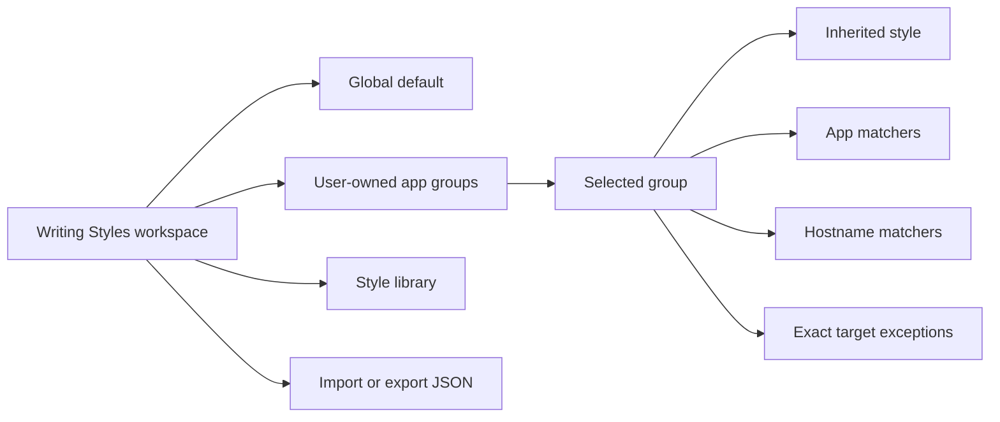
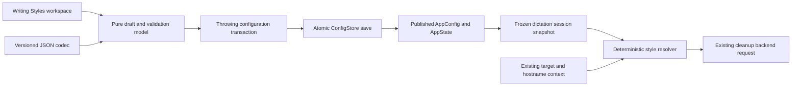
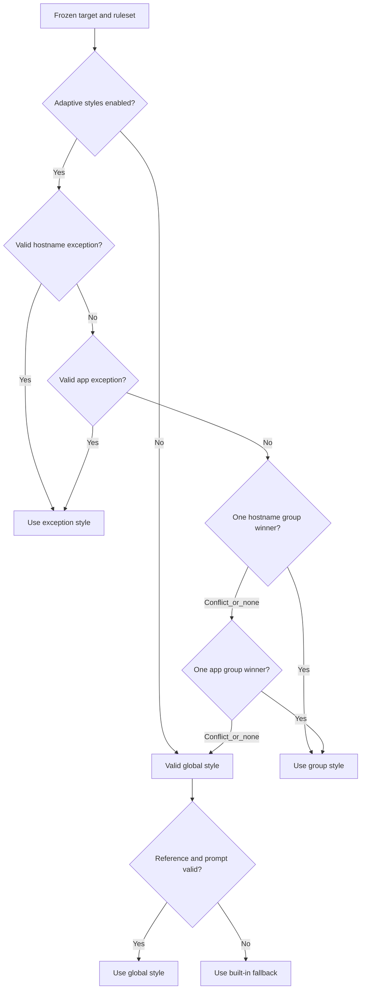
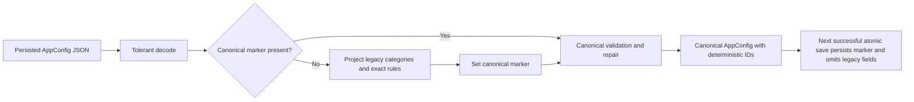
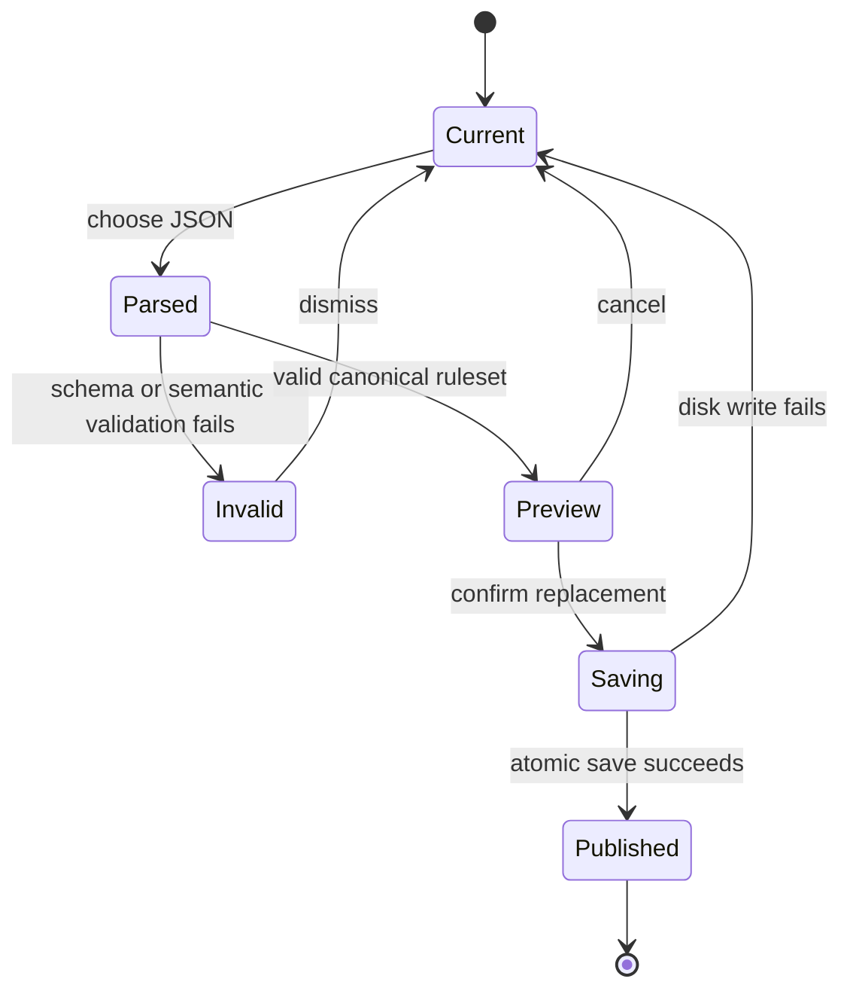

# Dynamic Dictation Style Groups - Plan

## Goal Capsule

- **Objective:** Replace fixed dictation categories and fragmented settings with one UI-first workspace for reusable app groups, per-target exceptions, and portable JSON import/export.
- **Product authority:** This Product Contract supersedes the fixed-category and split-settings behavior in `docs/plans/2026-08-09-001-feat-per-app-dictation-styles-plan.md` where they conflict. The prior plan remains authoritative for unchanged runtime safety, cleanup, privacy, and failure-continuity behavior.
- **Execution profile:** Deep, cross-cutting Swift implementation across persisted configuration, deterministic resolution, frozen dictation sessions, JSON portability, settings UX, observability, and migration.
- **Authority order:** Product Contract requirements and settled Key Decisions; Planning Contract KTDs; Implementation Units; repository instructions and current source patterns.
- **Stop conditions:** Stop for a product behavior that contradicts the Product Contract, a migration that cannot preserve a valid legacy assignment, a persistence path that can partially publish failed changes, or a proposal that requires a new permission or target-identity telemetry.
- **Tail ownership:** `x-code` owns implementation, focused and full verification, simplification, code review, atomic commits, the stacked PR update, and requested PR screenshots. This planning run changes only this artifact.
- **Open blockers:** None. Import activation follows Assumption A1 unless the user revises it before implementation.

---

## Product Contract

### Summary

Muesli will provide one Writing Styles workspace centered on user-defined app groups. Each group owns a style and deterministic local target matchers. A global default, per-target exceptions, and versioned JSON import/export complete the model without making JSON a second live editor.

### Problem Frame

The current branch exposes one global selector, a separate style library, and a separate Adaptive Styles rules sheet. The rules sheet asks users to understand fixed categories, category inheritance, exact app rules, exact website rules, and effective-source labels at the same time. The configuration is capable, but the product surface mirrors its storage and precedence mechanics instead of the user's intent: “use this writing style in these apps.”

Fixed Messages, Email, Writing, and Code categories also constrain users to Muesli's taxonomy. A user who wants groups such as Client Work, Social, Research, or Arabic Writing must repurpose a fixed category or create many exact rules. The redesign must make groups user-owned while retaining deterministic, local-first selection.

### Definitions

- **Writing style:** A built-in or user-created set of cleanup, tone, and formatting instructions composed with Muesli's transcript-safety rules.
- **App group:** A user-owned named collection with one writing style and one or more target matchers.
- **Target:** A normalized app bundle ID or website hostname captured for the dictation destination.
- **Matcher:** An exact target value or a simple wildcard pattern that matches a full bundle ID or hostname.
- **Target exception:** A writing style assigned directly to one exact target. It does not change group membership.
- **Specificity:** The deterministic rank used when more than one group matcher accepts a target: exact before wildcard, then more literal content before less literal content.
- **Global default:** The writing style used when no valid target exception or app group resolves.
- **Portable ruleset:** The versioned JSON representation of writing styles, app groups, matchers, target exceptions, and global default. It excludes unrelated application configuration.

### Key Decisions

- **UI-first authority.** JSON is an import/export format, not a second live editor. (session-settled: user-approved — chosen over config-first and dual-editor models: one authority avoids synchronization conflicts while retaining portability.) Governs R2, R17-R21.
- **Group-first workspace.** Users organize targets into reusable collections instead of maintaining an ordered routing table or app inventory matrix. (session-settled: user-directed — chosen over ordered rules and an assignment matrix: reusable groups best match the intended mental model.) Governs R3-R5, R12-R13.
- **Deterministic local classification.** Target identity is matched against user configuration without suggestions, an LLM, or a network call. (session-settled: user-directed — chosen over suggested and automatic inference: predictable local behavior preserves Muesli's positioning.) Governs R6-R13, R23-R25.
- **One resolved group.** A target inherits from at most one app group; exact target exceptions handle deviations. (session-settled: user-directed — chosen over priority-ordered or composed groups: single inheritance keeps effective behavior explainable.) Governs R7-R10.
- **Editable starter groups.** First enable seeds useful examples that immediately become ordinary user-owned groups. (session-settled: user-directed — chosen over a blank slate and mandatory guided setup: onboarding stays fast without retaining fixed categories.) Governs R4-R5, R22.
- **Exact and wildcard matchers.** Groups accept exact targets and simple full-value wildcards, with a live match preview. (session-settled: user-directed — chosen over exact-only and advanced condition builders: wildcards add useful range without URL paths, window titles, or Boolean logic.) Governs R6-R8, R12.
- **Specificity resolves overlap.** Exact matches outrank wildcards, narrower wildcards outrank broader ones, and equal-specificity conflicts require correction. (session-settled: user-approved — chosen over group ordering and blanket overlap rejection: outcome follows matcher intent rather than list position.) Governs R7-R10, R13.
- **Narrow atomic import.** Import previews and replaces the complete portable ruleset in one successful action. Merge semantics and full-app configuration export are deferred. Governs R17-R21.

### Workspace Shape



The workspace keeps global default, groups, styles, and portability in one navigable surface. Selecting a group exposes its style, matchers, current match preview, conflicts, and exceptions without exposing the underlying persistence collections.

### Actors

- A1. **Dictating user:** Creates styles and groups, assigns targets, imports or exports a ruleset, and expects the effective result to be understandable before dictation.
- A2. **Local Muesli runtime:** Captures target identity, resolves one immutable effective style, and degrades to the global path when configuration or context is unavailable.
- A3. **Selected cleanup backend:** Receives the resolved style instructions and any separately authorized App Context. It does not receive rule configuration or target identity solely for classification.

### Requirements

**Workspace and configuration model**

- R1. Adaptive writing styles remain optional, and the existing active cleanup style remains the global default for users who do not enable them.
- R2. Dictation settings open one Writing Styles workspace for the global default, app groups, style library, target exceptions, and JSON portability.
- R3. A user can create, rename, duplicate, and delete any app group and assign one writing style to it.
- R4. First enable seeds editable starter groups for common communication, writing, and coding destinations without changing the global default.
- R5. A seeded group has no protected category identity and supports the same rename, delete, matcher, and style actions as a user-created group.

**Target matching and resolution**

- R6. A group accepts normalized bundle-ID and hostname matchers as exact values or full-value patterns where `*` is the only wildcard token.
- R7. One target resolves to at most one group: an exact match wins, then the matching wildcard with the most literal characters; an equal-specificity tie is a configuration conflict.
- R8. A live preview shows currently known apps or hostnames matched by each matcher and identifies overlaps before save or import.
- R9. Resolution checks a valid exact target exception, the single resolved group style, the global default, then the built-in cleanup fallback.
- R10. An unresolved runtime tie, invalid reference, unavailable target identity, or unavailable hostname never blocks dictation and continues through the valid fallback chain.
- R11. Each standard dictation freezes its target, resolved style instructions, backend, model, and authorized context at dictation start.
- R12. An exact target can have a style exception without joining a group, and removing the exception reveals its group or global inheritance.
- R13. The workspace explains the effective style and source for every known target in text, including exact exception, group inheritance, global default, and conflict states.

**Styles and lifecycle**

- R14. Built-in and custom writing styles are reusable by the global default, any app group, and any target exception.
- R15. Built-in styles remain read-only and can be duplicated for editing; custom style names and instructions remain valid, non-empty, and unique.
- R16. Style or group deletion previews affected assignments and repairs all future references in one successful configuration transaction without changing an in-flight dictation snapshot.

**JSON portability**

- R17. Export produces a versioned portable ruleset containing writing styles, app groups, matchers, target exceptions, and the global default.
- R18. Export excludes credentials, cleanup backend settings, model locations, App Context settings, telemetry preferences, history, and unrelated application configuration.
- R19. Import validates schema version, identifiers, style references, normalized matchers, wildcard syntax, duplicates, and equal-specificity conflicts before mutation.
- R20. Import presents a human-readable preview of additions, changes, removals, and conflicts before replacing the current portable ruleset atomically.
- R21. Cancelled or invalid import leaves the complete current configuration unchanged; merge and live file-watching behavior are not available in this version.

**Compatibility, privacy, and access**

- R22. Existing fixed-category adaptive configuration upgrades to behaviorally equivalent editable groups instead of also receiving starter groups.
- R23. Bundle-ID and hostname classification runs on-device and does not emit target values, matcher patterns, group names, or style names to telemetry.
- R24. Hostname matching uses only the existing App Context URL result, strips path and query data, and never triggers OCR, Screen Recording, a browser extension, or a new permission prompt.
- R25. Style selection does not change the cleanup backend, model, credentials, network policy, or whether App Context is sent.
- R26. Every workspace action is keyboard reachable and VoiceOver labeled; inheritance, conflicts, validation, and destructive impact are understandable without color.

### Key Flows

- F1. First enable
  - **Trigger:** A1 enables adaptive writing styles for the first time.
  - **Actors:** A1, A2
  - **Steps:** Muesli preserves the current global default, creates editable starter groups, and opens the consolidated workspace.
  - **Outcome:** A1 can use, rename, or delete the starters without accepting a permanent taxonomy.
  - **Covers:** R1-R5, R22.

- F2. Create and inspect a group
  - **Trigger:** A1 creates or selects an app group.
  - **Actors:** A1
  - **Steps:** A1 names the group, chooses a style, adds exact or wildcard matchers, and reviews matches and conflicts.
  - **Outcome:** One valid group configuration is saved atomically, or validation leaves the previous configuration unchanged.
  - **Covers:** R3, R6-R8, R13-R16, R26.

- F3. Resolve a dictation style
  - **Trigger:** A1 starts standard dictation into a target app or website.
  - **Actors:** A1, A2, A3
  - **Steps:** A2 freezes target and configuration, checks an exact exception, resolves at most one group by specificity, and falls through to the global or built-in style when needed.
  - **Outcome:** Cleanup uses one explainable immutable style without changing backend or context policy.
  - **Covers:** R7, R9-R13, R23-R25.

- F4. Apply a target exception
  - **Trigger:** A1 assigns a different style to one app or hostname.
  - **Actors:** A1, A2
  - **Steps:** The exact target style becomes effective without changing group membership; removing it restores inherited behavior.
  - **Outcome:** One-off behavior does not require a new group or duplicated matchers.
  - **Covers:** R9, R12-R16.

- F5. Export and import a ruleset
  - **Trigger:** A1 exports, reviews, or imports Writing Styles JSON.
  - **Actors:** A1, A2
  - **Steps:** Export emits only the versioned portable ruleset. Import validates the whole document and previews its replacement impact before confirmation.
  - **Outcome:** A confirmed valid import replaces the ruleset atomically; every other outcome changes nothing.
  - **Covers:** R17-R21, R23.

### Acceptance Examples

- AE1. **Covers R1, R4-R5.** Given an existing user enables adaptive writing styles, when the workspace opens, then the existing global default is unchanged and every starter group can be renamed or deleted.
- AE2. **Covers R3, R6, R13.** Given a custom Client Work group, when the user assigns a style and adds exact Mail and Slack bundle IDs, then both targets show that group style as their effective inherited result.
- AE3. **Covers R6-R8.** Given `com.microsoft.*`, when installed Microsoft apps are known, then the preview lists matching bundle IDs without matching unrelated apps.
- AE4. **Covers R7-R9.** Given `*.google.com` and `docs.google.com`, when dictation starts on `docs.google.com`, then the exact matcher wins without reference to group order.
- AE5. **Covers R7-R10, R13.** Given two wildcard matchers with equal specificity accept a newly seen target, when dictation starts, then the conflict is visible in settings and resolution continues to the global default.
- AE6. **Covers R9, R12.** Given Slack inherits the Communication group style and has an exact target exception, when the exception is removed, then Slack immediately returns to the Communication style.
- AE7. **Covers R10-R11.** Given the browser hostname is unavailable, when a browser bundle matcher or global default is valid, then dictation continues with the first valid fallback and no new permission prompt.
- AE8. **Covers R11, R16.** Given the selected style or group is edited while dictation is active, when cleanup runs, then the active dictation uses its frozen instructions and the next dictation uses the repaired configuration.
- AE9. **Covers R17-R18.** Given a ruleset export, when its JSON is inspected, then it contains style-system data and no credentials, backend settings, App Context preferences, history, transcript text, or telemetry settings.
- AE10. **Covers R19-R21.** Given an import with an unknown style reference or ambiguous wildcard tie, when validation runs, then the preview identifies the problem and confirming cannot partially mutate current settings.
- AE11. **Covers R17-R21.** Given a valid export is imported without edits, when the preview and replacement complete, then the effective style for every represented target is unchanged.
- AE12. **Covers R22.** Given fixed-category configuration from the current feature branch, when it upgrades, then each valid category becomes an ordinary editable group, its target and style assignments remain effective, and no duplicate starter group is added.
- AE13. **Covers R23-R25.** Given a hosted cleanup backend, when a group matcher selects a style, then matching stays local and the provider receives only the style prompt plus separately authorized context.
- AE14. **Covers R26.** Given keyboard and VoiceOver navigation, when the user creates a group, adds a matcher, resolves a conflict, previews import, or confirms deletion, then every control, state, and consequence is announced without relying on color.

### Success Criteria

- A user can create a group, add an installed app or hostname matcher, assign a style, and understand the effective result without leaving the Writing Styles workspace.
- Every known target has one textual effective state: exact exception, group inheritance, global default, or conflict with safe fallback.
- Export followed by unchanged import preserves the complete style-system meaning.
- Existing users who leave adaptive writing styles off observe no selection or cleanup behavior change.
- The redesign adds no OS permission, browser extension, target-identity telemetry, or cloud classification dependency.

### Scope Boundaries

**In scope**

- One consolidated Writing Styles workspace.
- User-created and editable starter app groups.
- Exact and simple wildcard bundle-ID and hostname matchers.
- Exact target style exceptions and deterministic specificity resolution.
- Versioned style-system JSON export, validation, preview, and atomic replacement import.
- Migration from the current fixed-category configuration, privacy disclosure, accessibility, and failure continuity.

**Out of scope**

- A live JSON editor, watched configuration file, partial merge import, or full application configuration export.
- AI or heuristic classification, prompt recommendations, and automatic group suggestions.
- Multiple active groups, drag-order precedence, composed prompts, advanced Boolean conditions, window titles, URL paths, and query matching.
- Snippets, selected-text Command Mode, shared or team styles, cross-device style sync, team policy, and administration.
- Browser extensions, new permissions, style-specific backends, style-specific credentials, and style-specific App Context policy.

### Dependencies and Assumptions

- App bundle IDs can be unavailable. Missing identity follows the global fallback path.
- Hostname candidates depend on the existing optional App Context and Accessibility path. Wildcards do not widen captured URL data.
- The match preview uses targets currently known to Muesli. A future unseen target can still match a valid wildcard at runtime.
- Existing built-in and custom cleanup styles remain the style content substrate; this work changes organization, matching, and management behavior.

### Sources and Research

- `docs/plans/2026-08-09-001-feat-per-app-dictation-styles-plan.md` defines the current feature's runtime safety, privacy, compatibility, and fixed-category product shape.
- `native/MuesliNative/Sources/MuesliNativeApp/Models.swift` contains the current fixed category, app rule, hostname rule, and tolerant configuration models.
- `native/MuesliNative/Sources/MuesliNativeApp/DictationStyleResolver.swift` contains the current deterministic local resolver and fallback behavior.
- `native/MuesliNative/Sources/MuesliNativeApp/SettingsView.swift`, `native/MuesliNative/Sources/MuesliNativeApp/DictationStyleRulesView.swift`, and `native/MuesliNative/Sources/MuesliNativeApp/TranscriptCleanupPromptsManagerView.swift` show the three current settings surfaces.
- `native/MuesliNative/Sources/MuesliNativeApp/ConfigStore.swift` provides the current sorted JSON and atomic whole-config persistence boundary.
- `native/MuesliNative/Tests/MuesliTests/DictationStyleResolverTests.swift` and `native/MuesliNative/Tests/MuesliTests/DictationStyleSettingsTests.swift` define current compatibility, precedence, repair, and persistence behavior.

---

## Planning Contract

Product Contract unchanged.

### Assumptions

- Assumption 1. Import preserves the local `adaptiveDictationStylesEnabled` value. The import preview states whether the imported rules will be active immediately, but import never enables adaptive routing by itself.
- Assumption 2. The live match preview draws from running applications, application bundles selected through the existing picker, and targets already present in configuration. It does not add target-history persistence.
- Assumption 3. The existing global cleanup fields and custom style collection remain canonical because meeting cleanup, standard dictation cleanup, and compatibility code already consume them.
- Assumption 4. First enable seeds editable Messages, Email, Writing, and Code groups from the existing curated catalog. Seeding occurs only when neither canonical groups nor legacy adaptive assignments exist.
- Assumption 5. Deleting a referenced custom style requires choosing one valid replacement style in the impact confirmation. The same transaction reassigns the global default, groups, and exceptions before removing the style; cancelling or failing the transaction changes nothing.

### Key Technical Decisions

- KTD1. Store canonical groups and exact exceptions in `AppConfig`, while retaining the existing global style and custom style fields. Add one configuration-schema marker that distinguishes an uninitialized profile from a migrated or user-initialized ruleset. Decode legacy category and exact-rule fields for migration, but stop encoding them after canonical conversion. One strict canonical validator serves settings drafts, imports, and configuration commits; only legacy decode projection may omit malformed legacy records. `ConfigStore.saveDictationStyleConfiguration` remains the atomic publication seam and rejects invalid canonical state instead of repairing it. Covers R1-R5, R14-R16, R19-R22.
- KTD2. Separate exact-target normalization from wildcard-pattern normalization. A pattern is lowercased and trimmed, matches the complete normalized target, and uses `*` as its only metacharacter. Exact targets retain the current bundle-ID and hostname validation, including hostname port removal and trailing-dot normalization. Specificity is the number of non-wildcard characters. Reject a pattern that cannot match any syntactically valid target. Covers R6-R8, R19.
- KTD3. Validate cross-group ambiguity by determining whether equal-specificity patterns of the same target kind have any common valid target. Overlap inside one group is harmless. A cross-group overlap with unequal specificity is valid, while an equal-specificity overlap blocks every canonical save or import. Runtime repeats the same ranking and falls through when previously persisted or newly observed data is ambiguous. The validator is the single owner of these rules; UI, codec, and store consume its diagnostics. This avoids list-order semantics and makes preview completeness independent of the known-target sample. Covers R7-R10, R13, R19-R21.
- KTD4. Migrate legacy configuration before general sanitation can discard information. Materialize only a legacy category with a valid assigned style; missing or invalid category styles and their membership are omitted so current global fallback behavior remains unchanged. Convert valid category membership on an exact app or hostname rule into a matcher on that group. Convert a valid direct style on the same legacy rule into an exact exception, so rules carrying both valid fields produce both canonical records. Derive stable migration IDs from legacy category identity. Set the marker in memory and persist it lazily on the next successful whole-config save; a restart before save repeats the same projection. Covers R1, R4-R5, R10, R16, R22.
- KTD5. Preserve current website-first compatibility within each precedence tier: exact hostname exception, exact bundle-ID exception, resolved hostname group, resolved bundle-ID group, global default, then built-in fallback. A hostname group candidate outranks an app group candidate because the current resolver treats the specific website identity before its browser container. Missing or invalid hostname context skips hostname candidates without changing permissions or blocking paste. Covers R7, R9-R13, R24-R25.
- KTD6. Keep `DictationStyleSessionSnapshot` as the immutable runtime boundary. The snapshot copies the canonical ruleset, target process, backend, model, and context policy at start; base browser context may add the matching hostname before cleanup, but late or mismatched context is rejected and OCR never participates in selection. Adaptive selection remains limited to standard dictation. Covers R9-R11, R16, R23-R25.
- KTD7. Implement portability as a narrow codec and staged replacement transaction. Decode a versioned portable document into a separate model, validate without lossy sanitation, compute a semantic diff, and only then construct one full `AppConfig` candidate. The global-default projection carries both its style reference and the exact `postProcessorSystemPrompt` bytes because current runtime behavior depends on both fields; import reconstructs both without silently reconciling divergence. Inside the throwing save seam, compare the validated portable projection with the post-sanitation candidate before any disk write, then publish only the returned persisted candidate. Covers R17-R21.
- KTD8. Consolidate the current three settings surfaces into one Writing Styles workspace. Reuse the existing pure settings mutations, application picker, style validation, deletion-impact pattern, and AppKit JSON panels. Keep invalid edits as unsaved local drafts, disable Save or Import confirmation, and present a textual conflict summary through VoiceOver. Covers R2-R5, R8, R12-R21, R26.
- KTD9. Change runtime provenance to the coarse sources `exception`, `group`, `global`, and `built_in_fallback`. Keep historical source strings readable in stored history. Telemetry remains limited to the existing allowlisted source/class/outcome/backend fields; target values, patterns, group identifiers, and style identity never enter analytics. Optional local JSONL diagnostics may retain a stable group identifier but not matcher or target values. Covers R13, R23-R25.
- KTD10. Group deletion removes the group and its owned matchers, but retains independent exact exceptions and all style definitions. The confirmation reports affected matcher and known-target counts plus surviving exceptions. Cancel or write failure retains the full prior candidate, while a successful delete exposes another valid group or global fallback for targets without exceptions. Covers R12-R16, R21.

### Legacy Migration Matrix

| Legacy input | Canonical result | Repair or fallback |
|---|---|---|
| Category with a valid style assignment | One editable group with the category display name, assigned style, and curated targets | Missing or invalid assignment omits the group and preserves global fallback |
| Exact rule with `categoryID` only | Exact matcher added when the category group has a valid style | Unknown or unassigned category membership is omitted |
| Exact rule with `styleID` only | Exact target exception | Unknown style is omitted |
| Exact rule with both fields | Group matcher plus exact target exception | Each valid side migrates independently |
| Duplicate exact legacy target | Preserve the current last-valid-rule behavior before projection | Earlier duplicate is omitted |
| Canonical marker already present | No legacy conversion or starter seeding | Strict canonical validation; invalid state remains non-publishable |
| No canonical or legacy adaptive data | Leave uninitialized until first enable | First enable seeds editable starter groups |

### Deletion Matrix

| Deleted object | Removed | Retained | Effective result |
|---|---|---|---|
| Group | Group and its matcher records | Exact exceptions, styles, and other groups | Exception remains first; otherwise another valid group or global fallback |
| Exact exception | Only that exception | Group membership and styles | Group inheritance or global fallback becomes visible |
| Custom style | Style definition after references are reassigned | Groups and exceptions; global assignment remains valid | Selected replacement style applies through each target's existing source |

Every delete is previewed, cancellable, and committed through one validated configuration transaction. A failed write retains the prior persisted, controller, app-state, and frozen-session values.

### High-Level Technical Design

These sketches define boundaries and invariants, not exact Swift types or signatures.

#### Component topology



#### Matcher language

```text
target-kind := bundle-id | hostname
pattern     := normalized literal content with zero or more "*" tokens
match       := the pattern accepts the complete normalized target
rank        := exact before wildcard; then greater non-"*" character count
conflict    := different groups with equal rank can accept one common valid target
```

#### Resolution decision flow



#### Decode and migration data flow



#### Import lifecycle



### Sequencing

1. Characterize the current decoder, resolver precedence, and frozen-session behavior before replacing storage types.
2. Establish the canonical model and idempotent migration before changing UI or runtime provenance.
3. Implement matcher validation and deterministic resolution before portability or workspace editing consumes them.
4. Adapt session runtime and observability against the canonical resolver.
5. Add strict portability and its preview transaction.
6. Replace the split settings surfaces after every mutation and import operation can produce a validated candidate.
7. Finish with documentation, manual accessibility verification, full tests, simplification, and PR screenshots.

### System-Wide Impact

| Surface | Change | Invariant |
|---|---|---|
| Persisted `AppConfig` | Canonical groups, matchers, exceptions, and schema marker replace encoded fixed categories | Tolerant legacy decode and atomic whole-config writes remain |
| Cleanup style library | Existing built-in/custom styles remain shared references | Prompt safety, naming validation, and global style behavior remain |
| Dictation runtime | Resolver consumes canonical rules and emits new coarse provenance | Frozen start target, backend/model policy, and standard-mode boundary remain |
| Browser context | Existing normalized hostname becomes a matcher candidate | No URL path/query storage, OCR dependency, extension, or new permission |
| Settings | One workspace replaces global/rules/library sheets | All edits are drafts until one validated save succeeds |
| Import/export | New narrow codec and diff preview | No unrelated configuration, secrets, context, history, or enabled-state mutation |
| History and analytics | New source values appear for new dictations | Existing history stays readable and telemetry remains allowlisted |

### Risks and Mitigations

- **Migration loss:** A legacy exact rule can carry group membership and a direct style. Mitigate with the KTD4 matrix, pre-change characterization fixtures, idempotence tests, and projection-equivalence assertions.
- **Silent import repair:** Existing sanitation can normalize or deduplicate invalid input. Mitigate by validating the portable model before `AppConfig` construction and rejecting any round-trip fidelity difference per KTD7.
- **Wildcard ambiguity:** Known-target preview cannot prove two patterns never overlap. Mitigate with pairwise language-intersection validation for equal-specificity cross-group patterns and runtime conflict fallback.
- **Resolver drift:** UI effective-state text and runtime could choose different winners. Mitigate by making both consume the same resolver result and conflict diagnostics rather than duplicating precedence logic.
- **Session race:** A style edit or late hostname result could affect an active dictation. Mitigate by preserving snapshot identity checks and testing current versus next-session behavior.
- **Privacy regression:** A richer resolver could tempt raw target analytics. Mitigate with a pure telemetry allowlist test and documentation assertions that distinguish local debug logs from analytics.
- **UI complexity:** Group, matcher, exception, style, and import concepts can still overwhelm one sheet. Mitigate with a navigable workspace, progressive disclosure, persistent textual effective state, keyboard order, and task-based screenshot review.

---

## Implementation Units

### U1. Canonical ruleset and idempotent legacy migration

- **Goal:** Persist user-owned groups and exact exceptions without losing valid fixed-category behavior.
- **Requirements:** R1, R3-R5, R14-R16, R22; F1; AE1, AE8, AE12; KTD1, KTD4, KTD10.
- **Dependencies:** None. This is the shared foundation for U2-U6.
- **Files:** `native/MuesliNative/Sources/MuesliNativeApp/Models.swift`, `native/MuesliNative/Sources/MuesliNativeApp/DictationStyleResolver.swift`, `native/MuesliNative/Sources/MuesliNativeApp/ConfigStore.swift`, `native/MuesliNative/Tests/MuesliTests/ModelsTests.swift`, `native/MuesliNative/Tests/MuesliTests/ConfigStoreTests.swift`, `native/MuesliNative/Tests/MuesliTests/DictationStyleResolverTests.swift`.
- **Approach:** Add canonical group, typed matcher, and exact-exception models plus the initialization marker. Migrate inside tolerant `AppConfig` field decode before strict canonical validation. Use deterministic migration IDs and lazy persistence. Preserve global/custom style storage and exact global prompt bytes. Encode only canonical fields after migration. Keep starter-group construction as a pure operation invoked by first enable.
- **Test scenarios:**
  - Decode a legacy config with adaptive styles off and no assignments; expect the global style and disabled state unchanged, no starter groups, and an uninitialized canonical state.
  - Enable an uninitialized config; expect editable Messages, Email, Writing, and Code starter groups, the existing global style unchanged, and no protected category semantics.
  - Decode each row of the Legacy Migration Matrix, including a rule with both category and direct style; expect equivalent group and exception outcomes.
  - Decode duplicate exact legacy rules; expect the last valid legacy rule to determine the canonical projection.
  - Decode a legacy category with a missing or invalid style assignment; expect no synthesized category default and the same global fallback as the current resolver.
  - Decode malformed adaptive-style fields beside valid unrelated preferences and credential placeholders; expect tolerant omission of only malformed style data, preserved unrelated values, and no overwrite of the source bytes.
  - Restart twice before any save, then save once; expect identical deterministic group IDs each time and one persisted canonical marker without duplicate projection.
  - Decode, encode, and decode the migrated candidate twice; expect stable IDs, no duplicate groups or starters, and no encoded legacy fields.
  - Delete a custom style referenced globally, by a group, and by an exception; expect the chosen replacement on every reference in one candidate while a previously captured session value remains independently usable.
  - Force `ConfigStore` replacement failure; expect disk content, controller config, and published app state to remain unchanged.
- **Verification:** Migration fixtures prove behavioral projection and idempotence. Model round trips contain the canonical keys only. Focused `core` shard tests pass.

### U2. Wildcard validation, conflict detection, and effective resolution

- **Goal:** Resolve one explainable style for exact and wildcard app or hostname matchers without list-order behavior.
- **Requirements:** R6-R10, R12-R13, R19; F2-F4; AE2-AE7, AE10; KTD2, KTD3, KTD5.
- **Dependencies:** U1.
- **Files:** `native/MuesliNative/Sources/MuesliNativeApp/DictationStyleResolver.swift`, `native/MuesliNative/Sources/MuesliNativeApp/DictationStyleSettingsModel.swift`, `native/MuesliNative/Tests/MuesliTests/DictationStyleResolverTests.swift`, `native/MuesliNative/Tests/MuesliTests/DictationStyleSettingsTests.swift`.
- **Approach:** Introduce pure pattern canonicalization, full-target matching, specificity ranking, pairwise equal-rank overlap detection, and conflict diagnostics inside the strict validator shared by settings, codec, and store. Rebuild settings mutations and effective-state text around the canonical resolver. Keep lossy repair limited to legacy projection.
- **Test scenarios:**
  - Normalize uppercase bundle and hostname patterns with whitespace, hostname ports, and trailing dots; expect canonical lowercase patterns consistent with exact-target normalization.
  - Validate `com.microsoft.*`, `*.google.com`, repeated `*`, interior wildcards, invalid separators, URL paths, queries, empty values, and a wildcard that cannot match a valid target; expect only grammar-valid patterns accepted.
  - Resolve an exact target against a broad and narrow wildcard; expect exact first, then the wildcard with more literal characters, independent of group array order.
  - Validate two equal-specificity patterns from different groups with a common valid target; expect a blocking conflict even when no known target currently demonstrates it.
  - Validate overlapping patterns in one group and unequal-specificity patterns across groups; expect no conflict.
  - Resolve a browser target with both hostname and app exceptions; expect hostname exception first, then app exception when hostname is absent.
  - Resolve a hostname-group conflict with a valid app-group candidate; expect safe continuation to the app-group candidate, then global or built-in fallback when no lower candidate is valid.
  - Bypass UI validation with an invalid canonical candidate and call the persistence seam; expect rejection with no silent deduplication, reference repair, disk write, or published-state change.
  - Remove an exact exception; expect the shared effective-state result to immediately describe group or global inheritance.
- **Verification:** Pure resolver and settings tests cover happy, edge, invalid, and fallback paths; no UI-specific precedence implementation remains.

### U3. Frozen-session runtime, provenance, and privacy boundary

- **Goal:** Apply canonical style resolution during standard dictation without changing context capture, cleanup transport, or in-flight behavior.
- **Requirements:** R9-R11, R13, R16, R23-R25; F3-F4; AE5-AE8, AE13; KTD5, KTD6, KTD9.
- **Dependencies:** U2.
- **Files:** `native/MuesliNative/Sources/MuesliNativeApp/DictationCorrectionMonitor.swift`, `native/MuesliNative/Sources/MuesliNativeApp/TranscriptionRuntime.swift`, `native/MuesliNative/Sources/MuesliNativeApp/MuesliController.swift`, `native/MuesliNative/Sources/MuesliNativeApp/ScreenContextCapture.swift`, `native/MuesliNative/Sources/MuesliNativeApp/DictationStyleObservability.swift`, `native/MuesliNative/Sources/MuesliNativeApp/TranscriptCleanupDebugLogger.swift`, `native/MuesliNative/Tests/MuesliTests/DictationStyleSessionTests.swift`, `native/MuesliNative/Tests/MuesliTests/TranscriptionRuntimeTests.swift`, `native/MuesliNative/Tests/MuesliTests/DictationStyleObservabilityTests.swift`, `native/MuesliNative/Tests/MuesliTests/DictationStoreTests.swift`.
- **Approach:** Adapt the existing session snapshot and request provenance to canonical group/exception sources. Preserve process and session identity checks, base browser capture before optional OCR, and adaptive cleanup only for standard mode. Store new coarse source strings for new history rows while accepting existing values on read. Keep analytics construction in the current pure allowlist.
- **Test scenarios:**
  - Start dictation with one group style, edit or delete it before completion, and finish cleanup; expect the active session to use frozen instructions and the next session to use repaired configuration.
  - Capture a base browser hostname before OCR completes; expect hostname matching to resolve without waiting for or reading OCR text.
  - Deliver context with a mismatched session ID, process ID, or bundle ID; expect rejection and deterministic app/global fallback.
  - Disable App Context or deny Accessibility for a browser target; expect no hostname candidate, no permission request, and successful lower-precedence cleanup and paste.
  - Run standard, streaming, selected-text command, meeting, and other excluded modes; expect adaptive selection only in standard dictation.
  - Map each new selection source through observability; expect only source, built-in/custom class, cleanup outcome, and backend keys, with no target, matcher, group, style, prompt, or context values.
  - Read history rows with legacy `domain`, `app`, and `category` sources and write rows with new sources; expect both to remain displayable without a database rewrite.
- **Verification:** The `dictation-transcription` shard proves snapshot, context, mode, and allowlist behavior. No test observes a new permission request or target value in analytics.

### U4. Strict portable ruleset codec and atomic replacement preview

- **Goal:** Export and import only Writing Styles data with complete validation, a semantic preview, and all-or-nothing persistence.
- **Requirements:** R17-R23; F5; AE9-AE13; KTD1, KTD3, KTD7, KTD10.
- **Dependencies:** U1, U2.
- **Files:** `native/MuesliNative/Sources/MuesliNativeApp/DictationStyleRulesetCodec.swift` (new), `native/MuesliNative/Sources/MuesliNativeApp/DictationStyleSettingsModel.swift`, `native/MuesliNative/Sources/MuesliNativeApp/ConfigStore.swift`, `native/MuesliNative/Sources/MuesliNativeApp/MuesliController.swift`, `native/MuesliNative/Tests/MuesliTests/DictationStyleRulesetCodecTests.swift` (new), `native/MuesliNative/Tests/MuesliTests/DictationStyleSettingsTests.swift`, `native/MuesliNative/Tests/MuesliTests/ConfigStoreTests.swift`, `scripts/run_ci_test_shard.sh`.
- **Approach:** Follow `CustomWordDictionaryCodec` only for pure encode/decode separation and `DictionaryView` for JSON panels. Use strict version handling and replace semantics. Produce a preview model with additions, changes, removals, conflicts, and local activation status. Confirm through a throwing controller transaction that validates the candidate, obtains the store's post-sanitation projection before writing, rejects any fidelity difference, and publishes only the returned persisted candidate. Add the new test suite to the `core` shard.
- **Test scenarios:**
  - Export a ruleset with built-ins, custom styles, groups, wildcards, exceptions, and a global default; expect deterministic JSON with no unrelated `AppConfig` fields.
  - Export the same semantic configuration with reordered collections; expect stable encoded ordering and equivalent content.
  - Decode unknown versions, duplicate IDs, duplicate matchers, invalid wildcards, missing style references, reserved-ID collisions, and equal-rank cross-group conflicts; expect validation errors and no candidate mutation.
  - Import a valid ruleset while adaptive styles are off; expect the preview to say rules remain inactive and the confirmed save to preserve the disabled flag.
  - Export a configuration whose active global style ID and stored global prompt intentionally diverge, then import it unchanged; expect both values and effective global output to round-trip exactly.
  - Compare additions, changes, removals, and effective-target changes against current configuration; expect human-readable preview counts and detail without raw transcript or context data.
  - Cancel a valid preview and reject an invalid document; expect byte-for-byte current persisted configuration and unchanged published state.
  - Make the store's canonicalization produce a different portable projection; expect rejection before disk write and unchanged persisted and published state.
  - Force the confirmed save to fail; expect the previous ruleset and runtime state unchanged with a recoverable error.
  - Export and re-import without edits; expect portable projection and represented-target effective styles to remain equivalent.
- **Verification:** Codec, preview, transaction, and failure tests pass in the `core` shard. A redaction assertion rejects every excluded sensitive or unrelated key class from exported JSON.

### U5. Consolidated Writing Styles workspace

- **Goal:** Replace the fragmented settings with one keyboard- and VoiceOver-complete workspace for global, groups, styles, exceptions, and portability.
- **Requirements:** R2-R5, R8, R12-R21, R23-R26; F1-F2, F4-F5; AE1-AE3, AE6, AE9-AE10, AE14; KTD8, KTD10.
- **Dependencies:** U1, U2, U4.
- **Files:** `native/MuesliNative/Sources/MuesliNativeApp/SettingsView.swift`, `native/MuesliNative/Sources/MuesliNativeApp/DictationStyleRulesView.swift` (rename to `WritingStylesView.swift`), `native/MuesliNative/Sources/MuesliNativeApp/TranscriptCleanupPromptsManagerView.swift` (refactor into a reusable style-library pane), `native/MuesliNative/Sources/MuesliNativeApp/DictationStyleSettingsModel.swift`, `native/MuesliNative/Sources/MuesliNativeApp/DictionaryView.swift` (pattern reference only unless shared panel helpers are extracted), `native/MuesliNative/Tests/MuesliTests/DictationStyleSettingsTests.swift`.
- **Approach:** Present one Settings entry and one workspace with Global, Groups, and Styles navigation plus Import and Export actions. Use installed-app selection and hostname entry inside a selected group. Show matcher previews, exact exceptions, effective source, validation, and deletion impact in text. Preserve invalid edits locally until Save or Cancel. Reuse the current style editor instead of duplicating built-in/custom CRUD.
- **Test scenarios:**
  - Toggle adaptive styles for an uninitialized profile; expect the global style unchanged and the workspace focused on editable starter groups.
  - Create, rename, duplicate, and delete a group in the pure workspace model; expect stable IDs, unique non-empty names, deletion impact, and one committed transaction.
  - Delete, cancel deletion, and force write failure for a group whose target has group-only, exception-only, and combined records; expect the Deletion Matrix outcome on success and the complete prior state on every non-success path.
  - Add an application through the `.app` picker and a hostname or wildcard through text entry; expect normalized draft values, match preview, and shared resolver effective text.
  - Create an equal-specificity conflict; expect Save disabled, a textual conflict summary, focusable conflicting rows, and no persisted mutation. Cancel should restore the last saved state.
  - Add and remove an exact exception; expect group membership unchanged and the effective-state text to switch between exception and inheritance.
  - Duplicate a built-in style, edit a custom style, and delete a referenced custom style; expect read-only built-ins and a required replacement selection with complete affected-assignment preview before commit.
  - Open valid and invalid imports, cancel preview, confirm replacement, and simulate write failure; expect the UI to mirror U4 outcomes and retain the previous settings after every non-success path.
  - Navigate all controls by keyboard and inspect VoiceOver output for group actions, matcher kind, effective source, inactive state, conflicts, deletion impact, import changes, and errors; expect no state conveyed by color alone.
- **Verification:** Pure workspace-state tests pass in `DictationStyleSettingsTests.swift`. Manual verification records screenshots and accessibility observations for the required states in the Verification Contract.

### U6. Documentation, full verification, and delivery evidence

- **Goal:** Align privacy and product documentation, prove the complete behavior, and prepare an auditable stacked PR update.
- **Requirements:** R1, R10-R11, R17-R26; all flows; AE5, AE7-AE14; KTD6-KTD9.
- **Dependencies:** U1-U5.
- **Files:** `README.md`, `docs/privacy.html`, `scripts/run_ci_test_shard.sh`, all test files named by U1-U5, and PR screenshots stored in the repository's existing or PR-upload workflow without committing unrelated generated artifacts.
- **Approach:** Replace fixed-category wording with user-owned groups and strict portability. Preserve explicit local/cloud, App Context, Accessibility, and OCR boundaries. Run focused shards before the full Swift package suite. Exercise the installed dev app in an isolated lane and capture Settings screenshots for the empty/starter, configured group, conflict, and import-preview states. Update the existing stacked PR rather than creating an unrelated branch or PR.
- **Test scenarios:**
  - Search docs and UI copy for stale fixed-category or split-surface language; expect only migration or historical references to remain.
  - Inspect telemetry fixtures for forbidden target, matcher, group, style, prompt, transcript, URL, OCR, context, credential, and backend-config values; expect none. Inspect export fixtures for credentials, backend/model/App Context settings, telemetry preferences, history, transcript text, URL path/query, OCR, and unrelated configuration; expect none.
  - Run the focused `core` and `dictation-transcription` shards in distinct scratch paths; expect every named suite to execute and pass.
  - Run the full Swift package suite in its own scratch path; expect no failures and no package-local `.build` growth caused by the verification commands.
  - Install an isolated dev lane and exercise first enable, group configuration, conflict correction, exception removal, import cancel/confirm, Accessibility denial, and save failure; expect the Product Contract outcomes and continuous dictation fallback.
  - Review four PR screenshots at readable scale and with no personal target names, transcripts, URLs, credentials, or unrelated desktop content; expect each image to demonstrate a distinct required workspace state.
- **Verification:** Every gate below passes or the PR remains explicitly not ready with the failing command and evidence recorded.

---

## Verification Contract

### Automated gates

Use distinct resolved scratch paths for concurrent or sequential lanes. Do not share one scratch path between worktrees or simultaneous processes.

| Gate | Command | Required evidence |
|---|---|---|
| Core model, migration, settings, codec, and persistence | `MUESLI_SWIFTPM_SCRATCH_PATH="<isolated-core-path>" bash scripts/run_ci_test_shard.sh core` | `ModelsTests`, `ConfigStoreTests`, `DictationStyleResolverTests`, `DictationStyleSettingsTests`, and `DictationStyleRulesetCodecTests` execute and pass |
| Session, context, runtime, history, and observability | `MUESLI_SWIFTPM_SCRATCH_PATH="<isolated-dictation-path>" bash scripts/run_ci_test_shard.sh dictation-transcription` | `DictationStyleSessionTests`, `TranscriptionRuntimeTests`, `DictationStyleObservabilityTests`, and related cleanup suites execute and pass |
| Full native package regression | `swift test --package-path native/MuesliNative --scratch-path "<isolated-full-path>"` | Full suite exits zero with no unexpected skips or failures |
| Dev-app integration | `./scripts/dev-test.sh --lane A` | The app builds, installs as the isolated lane, and launches with the workspace reachable |

### Manual behavior contract

| Scenario | Expected result |
|---|---|
| First enable | Global style remains unchanged; editable starter groups appear once |
| Exact and wildcard app matching | Preview and runtime select the same group by specificity |
| Website unavailable | Browser app or global fallback succeeds with no new permission or OCR prompt |
| Cross-group conflict | Save/import is blocked; the draft remains editable; runtime safely falls through |
| Exact exception removal | Effective text returns to group or global inheritance immediately |
| Active-session edit | Current dictation uses frozen instructions; next dictation uses the new ruleset |
| Valid import while disabled | Preview says inactive; confirmed import preserves disabled state |
| Invalid, cancelled, or failed import | Persisted and published configuration remain unchanged |
| Hosted cleanup | Provider payload changes only by selected style instructions and separately authorized App Context |
| Keyboard and VoiceOver | Every action, validation state, source, conflict, and destructive consequence is announced without color dependence |

### PR visual evidence

Capture and attach these screenshots to the stacked PR after the dev-app gate passes:

1. Writing Styles workspace after first enable, showing the global default and editable starter groups.
2. A configured group with exact and wildcard matchers, live preview, and textual effective source.
3. An equal-specificity conflict with the blocking explanation visible.
4. A valid import replacement preview showing additions, changes, removals, and local activation state.

Use synthetic group, app, hostname, and style names. Crop to the app window and exclude personal desktop, transcript, URL path/query, account, and credential data.

### Failure and rollback contract

- A decoder or migration failure must retain a usable global cleanup path and must not overwrite the source file.
- A validation failure must remain in draft or preview state and must not call the persistence transaction.
- A disk-write failure must leave persisted config, controller config, app state, and the current session snapshot unchanged.
- A context failure must skip only the unavailable candidate and continue cleanup and paste.
- A test or manual-gate failure blocks PR readiness. Record the exact failing gate; do not weaken validation or bypass permissions to make it pass.

---

## Definition of Done

- U1-U6 are complete in dependency order, and each unit's named automated and manual scenarios pass.
- The canonical persisted model contains groups and exact exceptions, legacy migration is behaviorally equivalent and idempotent, and old fields are decode-only.
- The resolver implements the Product Contract precedence, wildcard specificity, equal-rank conflict detection, and safe fallback through one shared result used by runtime and UI.
- Standard dictation preserves frozen target, style, backend/model, and context policy; excluded modes and late or mismatched context remain unchanged.
- Export is narrow and deterministic. Import is strict, previewed, preserves the local enabled state, and publishes only after one successful atomic save.
- Settings exposes one Writing Styles workspace with no remaining user-facing fixed categories or separate adaptive/library management flow.
- Privacy, telemetry, local debug logging, App Context, Accessibility, OCR, and hosted cleanup boundaries match R23-R25 and updated documentation.
- The core shard, dictation-transcription shard, full Swift package suite, and isolated dev-app verification pass with recorded results.
- Keyboard and VoiceOver verification passes for creation, matching, conflict, deletion, import, and failure states.
- Four sanitized screenshots are attached to the stacked PR, and the PR targets the intended stack above `feat/meeting-transcript-cleanup`.
- The final diff contains no abandoned experiments, duplicate resolver logic, stale fixed-category UI, unrelated files, secrets, or generated personal data.
