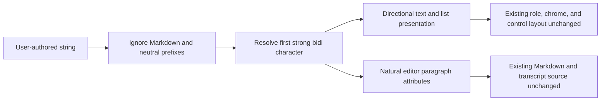
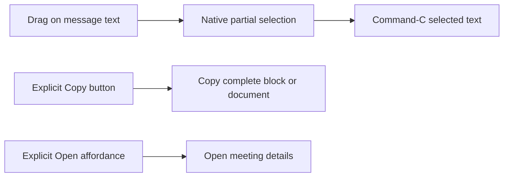

# Meeting RTL Text and Selection - Plan

## Goal Capsule

- **Objective:** Make authored, transcribed, and assistant-generated meeting text render and edit with natural bidirectional direction, and make read-only meeting content reliably selectable and copyable.
- **Scope:** Meeting title, notes, transcript bubbles, chat turns, and meeting text editors in the native macOS app.
- **Execution profile:** Bounded SwiftUI/AppKit presentation fix with shared direction logic, interaction cleanup, focused tests, and signed visual QA.
- **Authority:** This plan and the current source on `xshaheen/dev`; existing meeting role placement, markdown semantics, persistence, copy actions, and resize-performance behavior remain unchanged unless explicitly listed here.
- **Stop conditions:** Stop if correct selection requires replacing the existing markdown renderer or transcript/chat data model, if a proposed direction change mirrors app chrome or reverses speaker-role placement, or if AppKit natural-direction attributes corrupt Markdown serialization or undo behavior.
- **Open blockers:** None.

## Product Contract

### Problem Frame

Meeting content is rendered through several independent SwiftUI and AppKit paths. Most SwiftUI containers force `.leading` alignment under the app's LTR environment, so Arabic paragraphs, headings, lists, titles, and chat content anchor to the wrong side. The AppKit Markdown editor also creates paragraph styles without natural alignment or writing direction.

Text selection is nominally enabled in notes, transcript bubbles, and chat content, but it is not a coherent interaction contract. In particular, assistant chat bubbles attach a whole-bubble tap-to-copy gesture around selectable text, which can compete with drag selection. Users should be able to select part of their content and use standard macOS copy behavior without accidentally copying the entire response.

### Key Decisions

- **Content direction, not application direction.** Resolve direction per user-authored text block and never flip the meeting screen's controls, navigation, metadata, or role-based bubble placement. Governs R1-R5.
- **First-strong bidirectional behavior.** Neutral prefixes such as timestamps, punctuation, Markdown markers, and digits do not decide direction; the first strong LTR or RTL character does. Governs R1-R4.
- **Native selection wins over bubble shortcuts.** Preserve explicit whole-content Copy buttons, but remove any parent gesture that competes with partial text selection. Governs R6-R8.
- **No content transformation.** Direction and selection are presentation behaviors only; stored Markdown, transcripts, chat turns, exports, and sync payloads remain byte-for-byte unchanged. Governs R2 and R9.

### Requirements

- R1. Each title, Markdown line, transcript message, and chat turn resolves LTR or RTL from its first strong bidirectional character, with LTR as the neutral-only fallback.
- R2. Mixed Arabic/English content keeps Unicode bidirectional ordering inside the line; direction logic must not reverse strings, inject directional control characters, or rewrite punctuation.
- R3. Arabic headings, paragraphs, list markers, checkboxes, and indentation align from the right; English equivalents retain their current left alignment.
- R4. Direction is resolved after removing presentation-only Markdown/list prefixes so `#`, `-`, `1.`, timestamps, or emoji do not override the actual prose direction.
- R5. An RTL meeting title anchors to the right and its overflow marquee travels in the correct direction; LTR title behavior remains unchanged.
- R6. Users can drag-select and copy partial text in rendered notes, transcript messages, user chat turns, and assistant chat answers.
- R7. Notes selection operates within one rendered Markdown block at a time, and transcript/chat selection operates within one message; continuous selection across separate blocks or bubbles is not required. Existing whole-document Copy controls cover multi-block notes and transcripts.
- R8. Explicit whole-item Copy controls remain available, but clicking or dragging the message body no longer copies the whole assistant answer. A live-transcript bubble that can open meeting details uses a separate Open affordance instead of a body-wide tap gesture.
- R9. Editable notes, transcript, title, and chat composer use native natural writing direction and remain selectable without changing save, Markdown serialization, focus, undo, or command behavior.
- R10. Direction detection is local, deterministic, synchronous, and allocation-conscious; it introduces no language model, network request, locale switch, or per-frame view-tree duplication.
- R11. Copy and Open controls remain keyboard-focusable and VoiceOver-labeled; RTL list marker/body reading order stays logical, and whole-item copy confirmation is exposed accessibly. Native partial selection is the pointer/keyboard text interaction, while the explicit Copy action is the VoiceOver fallback.

### Acceptance Examples

- AE1. Given an Arabic title beginning with punctuation or digits, the title anchors right; hovering an overflowing title scrolls toward the hidden content and focusing it restores normal editable selection.
- AE2. Given Arabic and English paragraphs in the same notes document, each line independently aligns to its natural side without mirroring the Notes/Transcript/Chat tabs or header controls.
- AE3. Given an Arabic bullet, checkbox, or numbered item, its marker appears on the right leading edge and nested indentation grows inward; an English list remains unchanged.
- AE4. Given `ناقشنا API v2 وخطة Q3`, the paragraph is RTL while the embedded Latin tokens remain readable in their natural order.
- AE5. Given an Arabic transcript line in a user or non-user bubble, the text is RTL but the bubble remains on the side selected by the existing speaker-role rule.
- AE6. Given a chat answer, dragging across part of its text and pressing Command-C copies only the selection; the explicit Copy button still copies the complete answer.
- AE7. Given Markdown editing in Arabic, typing, selection, formatting commands, undo, save, and re-open preserve the same Markdown source while the paragraph uses natural AppKit alignment.
- AE8. Given neutral-only content such as `2026-08-12` or emoji, layout falls back to LTR and remains stable.
- AE9. Given a committed live-transcript message is selected, later partial or committed messages do not replace its view identity or clear its selection. Selection inside the actively changing partial tail may reset only when that tail's own text changes; the whole-transcript Copy control remains available.
- AE10. Given keyboard or VoiceOver navigation, Copy and Open affordances are reachable and labeled, copy confirmation is announced, and an RTL list item is read as one logical marker/body item rather than in visual implementation order.

### Scope Boundaries

**In scope**

- Authored, transcribed, and assistant-generated meeting title/body content.
- Rendered notes/summary Markdown, including headings and lists.
- Completed and live transcript message text.
- Standard and floating meeting chat turns and composer.
- Existing notes/transcript/Markdown editing surfaces.
- Partial selection, Command-C, and existing explicit Copy actions.

**Out of scope**

- Translating or mirroring application chrome, navigation, menus, metadata, or toolbar icons.
- Changing speaker detection, speaker labels, or which side represents the user.
- Reordering or rewriting persisted text with Unicode control characters.
- A single selection spanning multiple independently rendered bubbles.
- Changes to transcription, cleanup prompts, exports, sync schemas, or database storage.

## Planning Contract

### Key Technical Decisions

- KTD1. Add one shared direction resolver in `native/MuesliNative/Sources/MuesliNativeApp/NaturalTextDirection.swift`. It compares the earliest Unicode first-strong LTR match with the earliest RTL/Arabic-letter match, skips neutral characters, and exposes SwiftUI alignment/layout-direction values plus AppKit writing-direction equivalents. Static compiled matchers and short-circuiting keep the work linear and local. Covers R1-R4, R10.
- KTD2. Apply direction at the smallest content-owning boundary. `MeetingMarkdownContent` resolves each stripped Markdown line; transcript and user-chat bubbles resolve only their textual contents; `MarqueeTitleTextField` resolves the title. Do not put RTL environment state on `MeetingDetailView`, `MeetingChatView`, or role-positioning containers. Covers R1-R5.
- KTD3. For Markdown lists, use a direction-aware row container so the marker and text exchange visual leading edges while preserving the existing source order and indentation depth. Headings and plain lines use direction-aware frame alignment and multiline alignment. Covers R2-R4.
- KTD4. Remove the assistant bubble's whole-container tap-to-copy gesture from `MeetingChatView.swift`. In `LiveTranscriptView.swift`, move the optional click-to-open behavior from the selectable bubble body to a distinct Open affordance. Keep existing selection modifiers and visible Copy buttons in place, adding selection only where a concrete surface lacks it. Covers R6-R8, R11.
- KTD5. Configure `MarkdownRichTextEditor` with natural AppKit base writing direction and natural paragraph alignment in both rendered and typing attributes. Preserve selected ranges while external Markdown is reapplied, and verify serialization and toolbar mutations remain source-stable. Covers R9.

### High-Level Technical Design

Directional behavior stays below semantic layout decisions:

Selection and whole-item copy become separate interactions:

### Sources and Existing Patterns

- `native/MuesliNative/Sources/MuesliNativeApp/MeetingNotesView.swift` already enables selection for rendered Markdown but hard-codes leading alignment for every heading, paragraph, and list row.
- `native/MuesliNative/Sources/MuesliNativeApp/MeetingDetailView.swift` already enables selection in completed transcript bubbles and owns the direction-insensitive title marquee.
- `native/MuesliNative/Sources/MuesliNativeApp/MeetingChatView.swift` already makes both chat roles selectable, but the assistant bubble also attaches a body-wide tap-to-copy gesture.
- `native/MuesliNative/Sources/MuesliNativeApp/LiveTranscriptView.swift` enables selection on the feed, but selectable bubbles attach a body-wide optional Open gesture and all content rows force leading alignment.
- `native/MuesliNative/Sources/MuesliNativeApp/MarkdownRichTextEditor.swift` already uses a selectable `NSTextView`; its generated paragraph styles currently omit natural alignment and base writing direction.
- The installed AppKit SDK defines natural writing direction through Unicode Bidirectional Algorithm first-strong rules. A local runtime probe of SwiftUI `TextEditor` confirmed its backing `NSTextView` uses natural base direction and alignment and remains selectable, so the raw notes/transcript editors do not need a replacement abstraction.

## Implementation Units

### U1. Centralize natural direction resolution

- **Files:** `native/MuesliNative/Sources/MuesliNativeApp/NaturalTextDirection.swift`; `native/MuesliNative/Tests/MuesliTests/NaturalTextDirectionTests.swift`
- **Requirements:** R1, R2, R4, R10; KTD1.
- **Approach:** Introduce a small value type for LTR/RTL resolution using Unicode bidirectional classes and a documented neutral-only fallback. Keep the resolver independent of views and persistence so every surface shares the same rules.
- **Test scenarios:** Arabic and Hebrew resolve RTL; Latin/Cyrillic resolve LTR; punctuation, digits, timestamps, Markdown markers, and emoji are skipped; mixed text follows its first strong character; empty and neutral-only strings fall back LTR; embedded Latin tokens do not change an Arabic-first result.
- **Depends on:** None.

### U2. Render notes, titles, and transcripts directionally

- **Files:** `native/MuesliNative/Sources/MuesliNativeApp/MeetingNotesView.swift`; `native/MuesliNative/Sources/MuesliNativeApp/MeetingDetailView.swift`; `native/MuesliNative/Sources/MuesliNativeApp/LiveTranscriptView.swift`; `native/MuesliNative/Tests/MuesliTests/MeetingNotesInlineMarkdownTests.swift`; `native/MuesliNative/Tests/MuesliTests/MeetingTextInteractionTests.swift`; `native/MuesliNative/Tests/MuesliTests/LiveTranscriptPresentationTests.swift`
- **Requirements:** R1-R8, R10-R11; KTD2-KTD4.
- **Approach:** Apply per-line direction to Markdown headings, body lines, list markers, and indentation. Apply content direction inside completed and live transcript bubbles while leaving bubble ownership alignment unchanged. Make the title field, its passive marquee text, frame alignment, and travel sign direction-aware. Preserve existing working selection placement; remove the live bubble's body-wide Open gesture and provide a distinct Open affordance when `onOpen` exists.
- **Test scenarios:** Arabic/English headings and paragraphs align independently; Arabic and English list structures place markers on their natural leading edge; nested RTL indentation remains bounded; completed/live transcript direction does not change `message.isUser` placement; RTL/LTR title geometry chooses the correct anchor and marquee sign; notes and transcript content remain selectable; committed live-message identity survives later updates; partial-tail selection policy matches AE9; Copy/Open controls satisfy R11.
- **Depends on:** U1.

### U3. Separate chat selection from whole-answer copy

- **Files:** `native/MuesliNative/Sources/MuesliNativeApp/MeetingChatView.swift`; `native/MuesliNative/Tests/MuesliTests/MeetingTextInteractionTests.swift`
- **Requirements:** R1, R2, R6-R8, R10-R11; KTD2, KTD4.
- **Approach:** Reuse directional Markdown rendering for assistant answers and apply the shared direction to user turns and the composer. Remove the assistant bubble body tap gesture; retain the explicit Copy button and native text selection.
- **Test scenarios:** Arabic user and assistant turns render RTL without swapping role sides; Latin turns remain LTR; the source contract has no whole-bubble copy gesture; assistant and user content remain selectable; the Copy button still copies the complete turn, updates its confirmation state, and satisfies R11.
- **Depends on:** U1, U2.

### U4. Give editing surfaces natural AppKit direction

- **Files:** `native/MuesliNative/Sources/MuesliNativeApp/MarkdownRichTextEditor.swift`; `native/MuesliNative/Sources/MuesliNativeApp/MeetingDetailView.swift`; `native/MuesliNative/Tests/MuesliTests/MarkdownRichTextEditorTests.swift`; `native/MuesliNative/Tests/MuesliTests/MeetingNotesInlineMarkdownTests.swift`; `native/MuesliNative/Tests/MuesliTests/MeetingTextInteractionTests.swift`
- **Requirements:** R2, R4, R9; KTD5.
- **Approach:** Set natural base writing direction and natural paragraph alignment in the custom Markdown text view and every generated paragraph style. Preserve the two native SwiftUI `TextEditor` paths for raw notes/transcript: an installed-runtime probe confirms their backing `NSTextView` already uses natural base direction (`-1`), natural alignment (`4`), and selectable text, so they need regression coverage rather than a replacement wrapper. Ensure typing attributes, rich Markdown re-rendering, heading/list commands, selection restoration, and placeholder drawing remain coherent.
- **Test scenarios:** Arabic and English Markdown paragraphs receive natural writing attributes; a mixed document keeps per-paragraph direction; selected ranges survive external Markdown application; formatting and undo retain direction attributes; serialize-after-render produces the original Markdown for Arabic headings, bold spans, and lists; native raw notes/transcript editors preserve natural direction, selection, debounce-save, and source text in signed-app QA.
- **Depends on:** U1.

### U5. Validate interaction, performance, and signed UI behavior

- **Files:** `CHANGELOG.md`; affected focused test suites above.
- **Requirements:** R1-R11.
- **Approach:** Add the shipped behavior to the dev changelog, run focused direction/Markdown/chat/transcript tests, run the native suite required by the touched surfaces, and rebuild the signed dev app. Visually inspect Arabic, English, and mixed content at wide and narrow window sizes.
- **Test scenarios:** Drag-select and Command-C partial notes/transcript/chat text; whole-answer Copy still works; RTL title and lists remain correct after resize; live transcript updates do not flicker or duplicate view trees; keyboard navigation and VoiceOver retain logical reading order; editing and reopening content preserve source text.
- **Depends on:** U2-U4.

## Verification Contract

- **Focused automated:** Direction resolver, Markdown rendering/serialization, title-direction geometry, transcript/chat structural interaction, and editor selection-preservation suites pass.
- **Regression:** Existing `MeetingDetailResponsiveLayoutTests`, `MeetingNotesInlineMarkdownTests`, `MarkdownRichTextEditorTests`, and meeting-chat tests pass without weakening current assertions.
- **Build:** `./scripts/dev-test.sh --local-only` succeeds with the configured development identity, installs `/Applications/MuesliDev.app`, and deep signature verification passes.
- **Manual interaction matrix:** Arabic-only, English-only, mixed Arabic/English, neutral-prefix, RTL list, and multiline mixed-direction samples are checked in title, notes, completed/live transcript, standard/floating chat, and edit mode.
- **Selection proof:** Partial drag selection plus Command-C is verified independently from each explicit whole-content Copy button.
- **Accessibility proof:** Keyboard focus, VoiceOver labels/reading order, and copy confirmation are verified for directional lists and the Copy/Open affordances.
- **Performance proof:** Repeated window resizing and live transcript refresh remain smooth; direction resolution performs no network/language-detection work and does not introduce duplicate hidden content trees.

## Risks and Mitigations

- **Global RTL accidentally mirrors controls or role sides.** Mitigation: direction modifiers live only on content subtrees; tests assert existing bubble-role placement.
- **List markers and indentation become visually reversed.** Mitigation: test direction-aware rows separately for bullets, checkboxes, numbers, and nesting.
- **Chat copy gesture still wins over selection.** Mitigation: remove the parent gesture rather than attempting gesture precedence; retain the explicit button.
- **Live click-to-open conflicts with selection.** Mitigation: move Open to its own labeled affordance and keep committed message identity stable as the feed grows.
- **AppKit rich text loses Markdown fidelity.** Mitigation: apply paragraph attributes without source characters and use existing round-trip serialization tests with Arabic fixtures.
- **Direction detection becomes expensive during live transcription.** Mitigation: static Unicode matchers, first-strong short-circuiting, lazy transcript rows, and no language classifier.

## Definition of Done

- Arabic and Hebrew user content aligns naturally across title, notes, transcript, chat, and editors; LTR content is unchanged.
- Mixed bidirectional lines remain readable without stored-text mutation or injected direction controls.
- RTL list markers and indentation use the correct leading edge.
- Partial text selection and Command-C work in rendered notes, transcript bubbles, and both chat roles.
- Assistant message-body clicks no longer copy the whole answer; live transcript bubble bodies no longer intercept selection to open details; explicit Copy/Open affordances preserve both actions.
- Committed live-transcript selections survive unrelated feed updates; only an actively changing partial tail may reset its own selection.
- Copy/Open affordances remain keyboard reachable and VoiceOver-labeled, with accessible copy confirmation and logical RTL list reading order.
- Existing save, undo, Markdown serialization, speaker-role placement, responsive layout, and live-update behavior remain intact.
- Focused tests, relevant regression tests, signed build, deep signature verification, and the manual RTL/selection matrix pass.
- `CHANGELOG.md` describes the change without referencing branch mechanics or pull requests.
