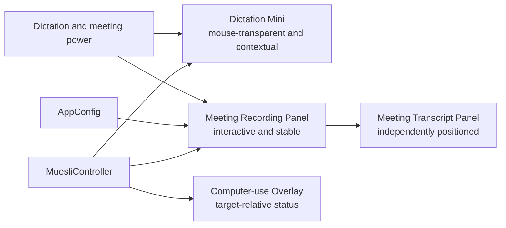
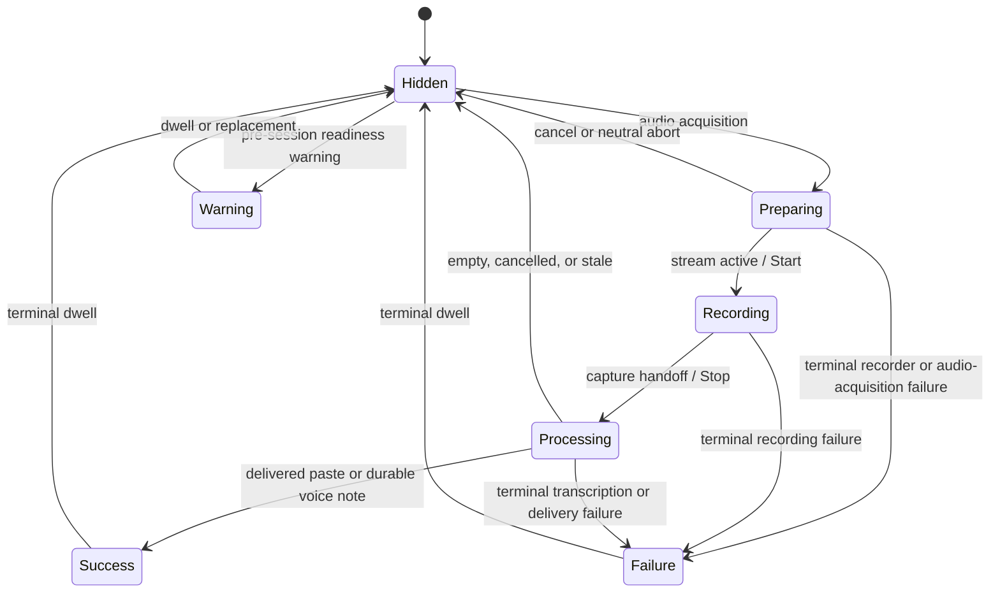
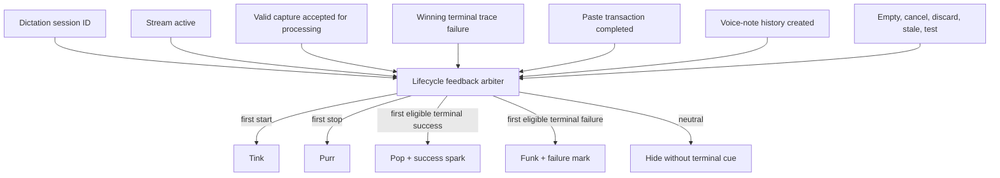
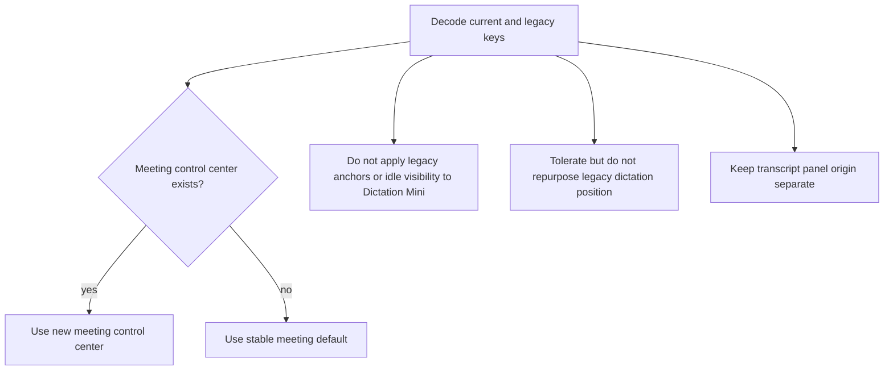

# Contextual Dictation Mini and Independent Meeting Panel - Plan

## Goal Capsule

- **Objective:** Replace the persistent, fixed dictation pill with an idle-hidden contextual Mini beside the focused text insertion caret, while extracting meeting recording controls into an independently positioned interactive panel.
- **Product authority:** The session-settled visual direction under `docs/art-direction/muesli-mini-indicator/` governs state silhouettes, lifecycle sounds, contextual placement, and surface ownership.
- **Open blockers:** None. Caret polling, movement threshold, and terminal-state dwell times are tuning constants, not product forks.
- **Execution profile:** Seven dependency-ordered units covering characterization, surface extraction, contextual geometry, animation, lifecycle feedback, configuration migration, and macOS visual QA.
- **Stop conditions:** Stop if the split cannot preserve meeting stop/pause/transcript safety, if the active dictation target cannot remain keyboard-accessible, or if truthful success/failure feedback would require claiming delivery the app cannot observe.
- **Tail ownership:** The implementation owner carries the work through focused and full native tests, live AppKit validation, code review, PR delivery, and CI resolution.

---

## Product Contract

**Product Contract preservation:** Bootstrap contract captures the session-settled decisions unchanged.

### Summary

Muesli will use two unrelated floating surfaces for two different jobs. Dictation gets a small, temporary, non-interactive Mini beside the focused insertion caret. Meeting recording keeps durable, draggable controls in a separate panel that appears only for a real active recording.

### Problem Frame

The current `FloatingIndicatorController` combines a persistent dictation affordance, transient dictation and computer-use states, meeting recording controls, meeting transcript ownership, drag state, and one saved anchor. That architecture forces short dictation feedback and long-lived meeting controls into the same visibility and geometry model. It also keeps idle chrome on screen and makes the user look away from their active context.

### Actors

- A1. **Dictating user** — starts, stops, cancels, or completes short dictation while focused in another macOS app.
- A2. **Meeting recorder** — needs persistent, aimable controls and live transcript access during an actual meeting recording.

### Key Decisions

- **Dictation uses a contextual Mini and has no fixed/classic presentation.** (session-settled: user-directed — chosen over preserving the fixed pill as an option: feedback should stay near the active text insertion context and leave no idle chrome.) Governs R1, R2, R3, R9.
- **Processing is an animated point-field orb.** (session-settled: user-directed — chosen over a generic spinner or three-dot capsule: transcription generation needs a distinct computational silhouette.) Governs R4.
- **Start, stop, success, and failure have distinct truthful sounds.** (session-settled: user-directed — chosen over reusing one completion cue: users should understand the lifecycle without looking.) Governs R5, R6.
- **Dictation Mini and Meeting Recording Panel are independent concepts.** (session-settled: user-directed — chosen over one controller with modes: their visibility, positioning, interaction, and lifetime requirements conflict.) Governs R7, R8, R10.
- **Meeting chrome appears only after capture is live.** (session-settled: user-approved — chosen over showing on teleconference detection or asynchronous startup: failed starts must not strand an orphan panel.) Governs R8.
- **The first Mini release is feedback-only.** (session-settled: user-approved — chosen over adopting Monologue's expanded modes/commands menu: command selection is a separate interaction design.) Governs R3, R11.
- **Meeting controls retain their existing visual language in this slice.** (session-settled: user-approved — chosen over redesigning both surfaces together: the architectural split comes first.) Governs R7, R11.

### Requirements

**Dictation Mini**

- R1. Idle dictation must create no visible panel; preparing, recording, processing, success, failure, and pre-session dictation readiness warnings may show the Mini. A warning never replaces active recording or processing.
- R2. The Mini must appear beside the focused text insertion caret, choose an edge-safe quadrant, follow meaningful caret movement while preparing or recording, freeze through processing, and reacquire the post-insertion caret once for terminal feedback.
- R3. The Mini must be a non-activating, normally mouse-transparent surface with no drag, hover expansion, stop button, mode menu, or focus transfer.
- R4. Preparing uses an orange seed, recording uses an orange-to-amber waveform on warm charcoal glass, processing uses an orange-to-amber point field on a darker charcoal orb, success uses a `#62d691` completion spark, failure uses a `#ff6961` terminal mark, and a nonterminal readiness warning uses a compact labeled capsule with a non-color warning glyph. Dictation Mini does not inherit the shared panel palette or app-wide accent.

**Lifecycle audio and outcomes**

- R5. Start sounds only when the microphone stream is active; stop sounds only when capture hands off to processing; success sounds only after non-empty text completes its paste transaction or a voice note is durably stored; terminal recording, transcription, or delivery failure uses a distinct failure sound. Delivery-only failure must also expose the existing retained-history recovery affordance so truthful Failure feedback cannot imply that recoverable text was lost.
- R6. Every lifecycle cue is emitted at most once per dictation session and respects `soundEnabled`; test mode suppresses all cues. Cancellation, discard, and stale capture emit no further cue, while empty/no-speech emits no terminal Success or Failure after any already-truthful Start or Stop governed by R5. Audible cues are serialized within the foreground session; starting a newer session consumes but suppresses unresolved terminal audio from older sessions.

**Meeting Recording Panel**

- R7. The Meeting Recording Panel must own its own `NSPanel`, stable saved position, drag and hit-testing state, live waveform, pause/resume, stop, elapsed duration, transcript toggle/panel, and recording/paused/finalizing status.
- R8. Detection alone must never show the panel. It appears only after meeting capture is live, remains available while recording, paused, or finalizing, and closes only when finalization reaches success/failure/discard or startup fails. Recording controls disable and the expanded transcript closes at the recording-to-finalizing handoff.
- R9. Neither surface controller may directly mutate the other's visibility, position, or size. Existing workflow-level mutual exclusion may cancel or block the other workflow, and meeting-owned settings may affect only the Meeting Recording Panel.

**Configuration and continuity**

- R10. Remove dictation-facing fixed anchor, custom drag, idle-hotkey, and “show floating indicator” controls. Preserve tolerant decoding of their legacy keys but do not reinterpret a legacy dictation position as a meeting position; the Meeting Recording Panel uses its own stored center or a stable meeting-specific default.
- R11. Preserve current meeting controls/transcript behavior, neutral glass accessibility fallbacks, computer-use feedback, backend loading/warning feedback, menu-bar controls, and dictation/meeting mutual exclusion except where this contract explicitly changes them.

### Key Flows

- F1. **Successful paste dictation:** hotkey prepares audio → Mini appears beside the focused caret → stream-active starts waveform and Start cue → stop hands capture to processing and plays Stop → orb animates at the frozen anchor → non-empty paste transaction completes → Mini reacquires the post-insertion caret once → Success cue/spark → Mini disappears.
- F2. **Voice note:** dictation follows F1 through processing → non-empty history row is durably created without paste → Success cue/spark → Mini disappears.
- F3. **Neutral or failed dictation:** cancel, discard, stale work, test mode, and empty/no-speech hide without terminal sound; the first terminal recording/transcription/delivery failure wins Failure cue/mark and later nested handlers cannot replay it.
- F4. **Meeting recording:** detection may prompt elsewhere but shows no panel → explicit/automatic start completes capture setup → Meeting Recording Panel appears at its saved stable position → pause/resume, duration, waveform, transcript, and stop remain meeting-owned → stop closes the expanded transcript and changes the compact panel to non-interactive finalizing status → terminal success/failure/discard closes the compact panel.
- F5. **Independent overlap guards:** meeting start cancels or blocks dictation through existing policy; neither controller borrows the other's panel, anchor, provider, timers, or visibility state during that transition.

### Acceptance Examples

- AE1. **Idle-hidden contextual start**
  - **Covers R1, R2, R3.**
  - **Given:** Muesli is idle and no floating dictation surface is visible.
  - **When:** The user starts dictation with the focused insertion caret near any edge on any attached display.
  - **Then:** A mouse-transparent preparing seed appears in the first fitting quadrant with caret clearance and never steals focus.

- AE2. **Stable recording-to-processing transition**
  - **Covers R2, R4, R5.**
  - **Given:** Dictation is recording and the Mini has reacquired after a meaningful caret move.
  - **When:** Capture stops and transcription begins.
  - **Then:** Stop sounds once, the waveform morphs to the point-field orb at the same anchor, and further caret movement cannot move it.

- AE3. **Truthful success**
  - **Covers R4, R5, R6.**
  - **Given:** Processing yields non-empty text.
  - **When:** A paste transaction finishes, or voice-note history is durably stored.
  - **Then:** Success sounds once, a brief success spark replaces the orb, and the Mini dismisses after its dwell.

- AE4. **Failure and neutral terminals**
  - **Covers R4, R5, R6.**
  - **Given:** Two internal handlers observe the same terminal failure, or a session instead ends by cancellation/empty speech.
  - **When:** terminal feedback is resolved.
  - **Then:** Failure produces exactly one red mark and one Failure cue; cancellation and empty speech produce neither Success nor Failure.

- AE5. **Independent meeting controls**
  - **Covers R7, R8, R9.**
  - **Given:** A teleconference app is detected but no recording is active.
  - **When:** capture later starts, the user drags the meeting panel, toggles transcript, pauses, resumes, and stops.
  - **Then:** no panel appears before capture is live; the panel retains its own position and controls while Dictation Mini remains hidden; elapsed capture time advances only while unpaused; stop closes the expanded transcript and leaves compact finalizing status until the terminal outcome closes it.

- AE6. **Legacy configuration**
  - **Covers R10, R11.**
  - **Given:** an existing config contains `show_floating_indicator`, `show_hotkey_on_floating_indicator`, `indicator_anchor`, and `indicator_origin` but no meeting-control position.
  - **When:** the new version decodes and later saves the config.
  - **Then:** decoding succeeds, dictation ignores fixed-anchor behavior, the legacy dictation center is not repurposed, and meeting controls use their own stored center or stable default without moving the transcript panel.

### Success Criteria

- Idle has zero dictation chrome, and active dictation feedback is immediately findable beside the focused caret without blocking the insertion point or upcoming text.
- Recording and processing have unmistakably different motion and silhouette at 1x and 2x scale.
- Lifecycle audio can be understood eyes-free and never lies about cancellation, empty output, stale work, or undelivered text.
- Meeting controls remain stable and fully usable across dictation state changes, pointer movement, display changes, pause/resume, and transcript toggling.
- Existing configs decode without data loss, while new UI exposes no fixed dictation position or Classic presentation.

### Scope Boundaries

#### Included

- Dictation Mini state visuals, contextual placement/follower policy, accessibility behavior, and lifecycle audio.
- Meeting recording control extraction, independent persistence, duration display, and existing transcript-panel ownership.
- Computer-use routing changes required to stop it from borrowing the dictation panel.
- Legacy config decoding and settings cleanup.

#### Deferred to Follow-Up Work

- Dogfood-driven tuning beyond the initial caret polling interval, movement threshold, and terminal dwell constants.
- A broader routed/per-event sound configuration system anticipated by `docs/plans/2026-08-14-001-feat-multilingual-transcription-quality-plan.md`.

#### Outside This Product Slice

- Monologue's expanded modes, record/cancel menu, branding, exact animation, or asset copying.
- A visual redesign of the existing meeting control and live-transcript surfaces.
- Caret, selected-text, or private text-content inspection for placement.
- Changes to meeting detection, dictation transcription, cleanup, storage, or paste mechanisms except to report their existing observable terminal outcomes.

### Sources / Research

- `docs/art-direction/muesli-mini-indicator/brief.md`, `feedback.md`, `implementation-outline.md`, and `split-surfaces-05.html` define the approved visual and behavioral direction.
- `native/MuesliNative/Sources/MuesliNativeApp/FloatingIndicatorController.swift` is the current combined surface and contains the reusable waveform, material, geometry, and meeting interaction code.
- `native/MuesliNative/Sources/MuesliNativeApp/MuesliController.swift` owns truthful audio, dictation queue, delivery, terminal trace, and meeting-capture boundaries.
- `native/MuesliNative/Sources/MuesliNativeApp/ComputerUseCursorOverlay.swift` already provides a separate fallback panel and is the natural owner for computer-use-only feedback.
- `native/MuesliNative/Sources/MuesliNativeApp/Models.swift` and `SettingsView.swift` own the legacy indicator configuration and appearance controls.
- `native/MuesliNative/Tests/MuesliTests/FloatingIndicatorGeometryTests.swift`, `FloatingIndicatorPlacementTests.swift`, `QoLTests.swift`, and `AppearanceEffectsTests.swift` provide characterization seams to split rather than discard.
- Project history around the current meeting panel confirms that showing controls only after capture is live prevents orphan UI after asynchronous startup failure.

---

## Planning Contract

### Key Technical Decisions

- KTD1. **Give every floating surface one owner and one window.** `MuesliController` will coordinate a `DictationMiniIndicatorController`, a `MeetingRecordingPanelController`, and the existing computer-use overlay; no facade may share their position, visibility, hover, drag, power-provider, timer, or transcript state. Governs R7, R8, R9, R11.
- KTD2. **Keep contextual placement pure and Accessibility sampling bounded.** A pure placement policy selects lower-left, lower-right, upper-left, then upper-right with 10 points of caret clearance. An Accessibility provider resolves the focused element's selected-range bounds, converts Quartz coordinates to AppKit coordinates, and polls at roughly 10 Hz only while preparing or recording; movement below 4 points is ignored and processing freezes the last anchor. Terminal feedback reacquires the post-insertion caret once. The focused element frame is the fallback when range bounds are unavailable, and the Mini stays hidden when neither anchor resolves. Display removal may rehome a frozen frame to a surviving display without resuming caret following. Governs R2, R3.
- KTD3. **Model terminal Mini feedback explicitly.** Mini presentation extends beyond `DictationState` with success, failure, and neutral terminal outcomes; a terminal hold cannot be erased by the queue's immediate idle reconciliation, but a newer active session may supersede it. Governs R1, R4, R6.
- KTD4. **Use a delivery-aware foreground feedback arbiter without rewriting trace semantics.** A small pure policy records Start, Stop, and one terminal Mini/audio result per session ID. It serializes cues inside the foreground session and, when a newer session starts, consumes but suppresses older unresolved terminal audio so sound cannot be misattributed. Existing winning trace failures feed Failure eligibility, while observable paste completion, durable voice-note storage, target mismatch, and missing persistence independently resolve feedback after the pipeline outcome. Governs R5, R6.
- KTD5. **Migrate positions only across equivalent semantics.** Add a meeting-control center with a stable meeting-specific default; tolerate the retired dictation-position keys without applying them. `meetingPanelOrigin` remains the live transcript window's bottom-left origin and is never conflated with either center. Governs R7, R10.
- KTD6. **Preserve the full computer-use lifecycle in its own overlay.** Move computer-use preparing, recording waveform and power source, target cursor, transcript/status, stop/cancel, failure, and terminal-message routing out of the dictation Mini rather than retaining a hidden dependency on the retired shared panel. Governs R9, R11.

### Assumptions

- `PasteController.pasteAndWait` completion is the strongest delivery boundary the current app can observe; this plan does not claim that a target app semantically accepted the text.
- A target-app mismatch is a terminal delivery failure for Mini/audio feedback even when Muesli safely retains the transcript in history.
- Voice-note success requires a non-empty transcript and a created dictation-history row; audio-only retention or an empty transcript remains neutral.
- The initial success dwell is 350 milliseconds before a short fade; failure holds for 1.2 seconds before fading. Both are named constants covered by deterministic state tests and remain dogfood-tunable.
- Meeting elapsed time starts from the active session and freezes while paused, matching captured recording time without changing persisted meeting-duration semantics.
- Reduce Motion replaces continuous point-field movement with a restrained pulse/static phase, reduces recording waveform amplitude and frequency without making it static, and holds a static completion mark instead of animating the success burst. Reduce Transparency and Increase Contrast reuse `FloatingIndicatorSurfaceStyle` behavior.

### High-Level Technical Design

These sketches describe ownership and flow, not exact types or method signatures.

#### Surface ownership

#### Dictation Mini lifecycle

#### Terminal feedback data flow

#### Legacy configuration migration

### Sequencing

1. Characterize ownership and lifecycle seams before moving AppKit code (U1).
2. Establish independent computer-use and meeting surfaces so the legacy controller can be retired safely (U2–U3).
3. Build contextual placement and Mini visuals on a clean surface boundary (U4).
4. Route dictation lifecycle/audio outcomes through the new controllers (U5).
5. Remove legacy dictation settings behavior and complete compatibility cleanup (U6).
6. Run full automated and live multi-display/accessibility verification, then remove dead shared code (U7).

### Risks and Mitigations

- **Orphan meeting chrome:** Keep the panel hidden until `MeetingSession.start()` succeeds; stop transitions it to owner-token-guarded finalizing status, while start failure, discard, matching final completion, and shutdown close it.
- **Terminal feedback races:** Queue reconciliation can request idle immediately after a job completes. Give terminal presentations generation tokens and explicit holds; newer active work wins, stale dismissals do nothing.
- **Duplicate failure sounds:** Nested audio, pipeline, storage, and delivery handlers may all observe one failure. Route them through the per-session arbiter and test first-winner behavior.
- **Misleading success:** Play success only after the observable paste completion or a created voice-note history row. Treat target mismatch and missing voice-note storage as failure, not success.
- **Caret jitter and Accessibility cost:** Poll only during preparing/recording, ignore sub-threshold movement, and centralize clearance, threshold, polling, and animation constants so dogfooding can tune them without controller rewrites.
- **Coordinate-system bugs:** Keep Quartz-to-AppKit conversion and display selection in pure helpers; test negative-origin, vertically offset, and disconnected displays.
- **Config semantic collision:** Keep meeting control center and transcript-panel origin as different keys and value meanings; tolerate but ignore retired dictation positions, and pin precedence/idempotence in tests.
- **Accessibility regression:** Give every visual state a non-color silhouette, freeze or reduce motion when requested, and refresh glass/contrast on accessibility display notifications.
- **Scope growth from the old controller:** Preserve generic loading/warning and computer-use behavior, but do not carry idle hover, fixed anchors, or dictation click/drag behavior into the new Mini.
- **Aggregate processing leakage:** Keep meeting finalization in status/activity ownership only; only queued/running dictation jobs may drive Mini processing, and a newer recording presentation outranks an older job's terminal visual.

---

## Implementation Units

### U1. Characterize independent routing and terminal semantics

- **Goal:** Lock current safety behavior and the new separation contract at pure/testable seams before extracting UI code.
- **Requirements:** R5, R6, R8, R9, R11; AE4, AE5; KTD1, KTD3, KTD4.
- **Dependencies:** None.
- **Files:**
  - `native/MuesliNative/Sources/MuesliNativeApp/MuesliController.swift`
  - `native/MuesliNative/Sources/MuesliNativeApp/FloatingIndicatorController.swift`
  - `native/MuesliNative/Tests/MuesliTests/FloatingIndicatorGeometryTests.swift`
  - `native/MuesliNative/Tests/MuesliTests/QoLTests.swift`
  - `native/MuesliNative/Tests/MuesliTests/MeetingsNavigationTests.swift`
- **Approach:**
  1. Inventory every current `indicator` call and classify it as dictation, meeting, computer-use, or generic transient feedback.
  2. Add characterization tests proving meeting controls appear only after capture activation, dictation state changes do not affect the meeting transcript controller, and terminal trace winners are the only failure candidates.
  3. Preserve existing mutual-exclusion and startup-failure ordering as code moves.
- **Execution note:** Test-first characterization; do not change visual output in this unit.
- **Test scenarios:**
  - A detected teleconference with no active capture does not create meeting panel state.
  - An asynchronous meeting start failure leaves no meeting panel or transcript panel visible.
  - A dictation preparing/recording/processing transition does not change meeting position or transcript visibility.
  - Repeated terminal failure observations for one session produce one eligible terminal event; cancellation and empty outcomes remain neutral.
- **Verification:** Focused meeting-navigation, indicator geometry, and dictation terminal-policy suites pass unchanged or with characterization-only additions.

### U2. Separate computer-use and shared surface primitives

- **Goal:** Remove computer-use feedback from the dictation/meeting window before the old controller is split.
- **Requirements:** R9, R11; KTD1, KTD6.
- **Dependencies:** U1.
- **Files:**
  - `native/MuesliNative/Sources/MuesliNativeApp/ComputerUseCursorOverlay.swift`
  - `native/MuesliNative/Sources/MuesliNativeApp/FloatingIndicatorSurfaceStyle.swift`
  - `native/MuesliNative/Sources/MuesliNativeApp/MuesliController.swift`
  - `native/MuesliNative/Tests/MuesliTests/NemotronStreamingTests.swift`
  - `native/MuesliNative/Tests/MuesliTests/QoLTests.swift`
- **Approach:**
  1. Make the existing computer-use overlay the sole owner of audio acquisition, recording waveform and power, target cursor, live transcript/status capsule, stop/cancel/failure, and short terminal status presentation.
  2. Reuse pure surface-style and coordinate helpers without accepting a dictation or meeting controller reference.
  3. Route CUA audio acquisition, stream-active, stop, cancel, failure, transcript, warning, status, show, and hide calls directly to it while retaining current level, mouse transparency, clamping, and text wrapping.
  4. Audit the remaining generic loading/warning calls: dictation readiness uses Mini transient feedback, meeting/import work uses its foreground/status-bar surface, and novelty feedback does not borrow either core panel.
- **Test scenarios:**
  - Cursor and labeled cursor frames clamp on primary, negative-origin, and vertically offset displays.
  - Long CUA transcript status wraps and caps to the active screen as before.
  - CUA show/hide never creates or changes Dictation Mini or Meeting Recording Panel state.
  - CUA acquiring, stream-active, stop, cancel, and failure events retain their current feedback without calling either core controller.
  - Reduce Transparency and Increase Contrast preserve the current CUA material fallbacks.
- **Verification:** Focused `NemotronStreamingTests`, CUA geometry tests, and surface-style tests pass.

### U3. Extract Meeting Recording Panel ownership

- **Goal:** Move meeting recording controls and transcript ownership into an independent stable controller.
- **Requirements:** R7, R8, R9, R11; AE5; KTD1, KTD5.
- **Dependencies:** U1, U2.
- **Files:**
  - `native/MuesliNative/Sources/MuesliNativeApp/MeetingRecordingPanelController.swift` (new)
  - `native/MuesliNative/Sources/MuesliNativeApp/FloatingMeetingTranscriptPanel.swift`
  - `native/MuesliNative/Sources/MuesliNativeApp/FloatingIndicatorController.swift`
  - `native/MuesliNative/Sources/MuesliNativeApp/MuesliController.swift`
  - `native/MuesliNative/Sources/MuesliNativeApp/Models.swift`
  - `native/MuesliNative/Tests/MuesliTests/MeetingRecordingPanelTests.swift` (new)
  - `native/MuesliNative/Tests/MuesliTests/FloatingMeetingTranscriptPlacementTests.swift`
  - `native/MuesliNative/Tests/MuesliTests/FloatingIndicatorGeometryTests.swift`
  - `native/MuesliNative/Tests/MuesliTests/ModelsTests.swift`
- **Approach:**
  1. Extract meeting waveform, pause/resume, stop, transcript-toggle hit regions, drag/persistence, and callback wiring into a dedicated `NSPanel` controller.
  2. Move `FloatingMeetingTranscriptPanelController` ownership and its manual-dismiss latch under the meeting controller; keep the transcript window's saved origin independent.
  3. Add `meetingRecordingPanelCenter` with a stable meeting-specific default; tolerate but never repurpose the legacy dictation center, and leave the transcript window's `meetingPanelOrigin` untouched.
  4. Add an elapsed label driven from the active session start time and a meeting-owned timer that stops on close.
  5. Expose pause/resume, transcript toggle, and stop as ordered accessible controls with state-aware labels/actions and keyboard activation; expose duration and status as readable values.
  6. Show only after capture is live. At stop handoff, disable recording controls, close the expanded transcript, and enter compact finalizing status; close/reset only on the matching final success/failure/discard, startup failure, or shutdown. Guard finalization callbacks with a meeting owner token/generation so an older completion cannot close or mutate a newer meeting panel.
- **Patterns to follow:** Preserve the existing meeting click-region mapping, neutral glass style, waveform code, and “show after capture is live” ordering.
- **Test scenarios:**
  - Panel is absent during detection and asynchronous startup, then appears after capture activation.
  - Pause/resume, transcript toggle, inert waveform region, and stop map to the same actions as today.
  - Drag saves the meeting control center independently from the transcript panel origin and restores/clamps it across displays.
  - A new meeting center wins; without one, a stable meeting default is used and a legacy dictation origin is ignored across repeated round-trips.
  - Elapsed time starts with the active session, freezes while paused, resumes without counting the pause, and its timer is invalidated on every close path.
  - VoiceOver and keyboard navigation discover and activate pause/resume, transcript toggle, and stop in order without treating waveform or duration as buttons.
  - Stop closes the expanded transcript and leaves a disabled compact finalizing panel until the matching terminal outcome; startup failure, discard, terminal completion, and app shutdown leave neither meeting surface visible.
  - A stale finalization callback from an older meeting cannot close or alter a newer meeting panel.
- **Verification:** New meeting-controller suite plus existing transcript-placement, meeting-chat, and meeting-navigation suites pass.

### U4. Build contextual placement and Mini presentation

- **Goal:** Implement the idle-hidden, caret-relative, feedback-only Dictation Mini and its full visual state vocabulary.
- **Requirements:** R1, R2, R3, R4, R9, R11; AE1, AE2, AE3, AE4; KTD2, KTD3.
- **Dependencies:** U2, U3.
- **Files:**
  - `native/MuesliNative/Sources/MuesliNativeApp/DictationMiniPlacement.swift` (new)
  - `native/MuesliNative/Sources/MuesliNativeApp/DictationMiniIndicatorController.swift` (new)
  - `native/MuesliNative/Sources/MuesliNativeApp/FloatingIndicatorSurfaceStyle.swift`
  - `native/MuesliNative/Sources/MuesliNativeApp/FloatingIndicatorController.swift` (dictation ownership extracted; file remains until U7 deletes it)
  - `native/MuesliNative/Tests/MuesliTests/DictationMiniPlacementTests.swift` (new)
  - `native/MuesliNative/Tests/MuesliTests/DictationMiniIndicatorTests.swift` (new)
  - `native/MuesliNative/Tests/MuesliTests/FloatingIndicatorStyleTests.swift`
- **Approach:**
  1. Implement pure screen selection, ordered quadrant placement, clamping, threshold, and processing-anchor freeze policies.
  2. Resolve the focused insertion caret through macOS Accessibility; poll meaningful moves only during preparing/recording and stop polling at processing/terminal/idle.
  3. Reuse Muesli's glass and waveform vocabulary while applying the approved Contextual Spark tokens (`#32312f` → `#181817`, `#ff7043`, `#ffb04d`, `#62d691`, `#ff6961`); add a deterministic circular point-field layer for processing and compact success/failure terminal visuals.
  4. Add the compact labeled readiness warning only when no capture/job owns the Mini; it keeps the contextual anchor, announces once, and dismisses or yields to a newer active session deterministically.
  5. Make the panel non-activating and mouse-transparent, with generation-safe animations and terminal holds.
  6. Let screen removal rehome a frozen processing/terminal frame to a fitting surviving display without restarting caret following.
  7. Honor Reduce Motion, Reduce Transparency, Increase Contrast, scale changes, and non-focus-dependent accessibility announcements without adding interaction. Announce recording active, processing, warning, terminal success, and terminal failure once per accepted transition; neutral dismissal stays silent.
- **Test scenarios:**
  - All four caret-relative quadrants are selected in order and remain inside each display's visible frame, including negative origins and an indicator wider than the display.
  - Caret travel below threshold does not move the Mini; travel at or above threshold reacquires; display changes select the new screen.
  - Processing keeps the last recording anchor despite caret movement; terminal states reacquire the current caret once and then freeze.
  - Removing the anchor's display rehomes the frozen frame once to a surviving display and keeps caret following disabled.
  - Idle closes the panel and stops caret polling; stale animation/dismiss callbacks cannot close a newer session.
  - Preparing, recording, processing, readiness warning, success, and failure resolve to distinct dimensions, accessibility labels, and non-color silhouettes.
  - An injected accessibility sink receives each eligible transition once, with no neutral/cancel announcement.
  - Reduce Motion preserves mutually distinct preparing, reduced-amplitude recording, static/restrained processing, static success, and failure silhouettes; contrast/transparency fallbacks remain legible.
  - A hotkey-started session remains findable when the mouse pointer is parked on another display because placement is derived only from the focused insertion caret.
  - Focused controls without selected-range bounds use their element frame; controls without either geometry keep the Mini hidden.
- **Verification:** New Mini placement/presentation suites and existing surface-style tests pass; no legacy fixed-anchor, drag helper, or mouse-location follower remains reachable from dictation. Before U6 removes any legacy presentation controls, run a live AppKit checkpoint covering all Mini states, typing and selection changes, multiple displays, 1x/2x scale, unsupported Accessibility controls, and Reduce Motion; stop and retain the reversible fallback if this checkpoint fails.

### U5. Route lifecycle audio, delivery, and terminal visuals

- **Goal:** Make each visual and auditory transition correspond to one observable dictation lifecycle fact.
- **Requirements:** R4, R5, R6, R9; AE2, AE3, AE4; KTD3, KTD4.
- **Dependencies:** U4.
- **Files:**
  - `native/MuesliNative/Sources/MuesliNativeApp/DictationLifecycleFeedback.swift` (new)
  - `native/MuesliNative/Sources/MuesliNativeApp/SoundController.swift`
  - `native/MuesliNative/Sources/MuesliNativeApp/MuesliController.swift`
  - `native/MuesliNative/Tests/MuesliTests/DictationLifecycleFeedbackTests.swift` (new)
  - `native/MuesliNative/Tests/MuesliTests/AppearanceEffectsTests.swift`
  - `native/MuesliNative/Tests/MuesliTests/PasteControllerTests.swift`
- **Approach:**
  1. Rename the current Insert sound API to Stop semantics, prewarm/add distinct Success and Failure system sounds, and retain one global `soundEnabled` gate.
  2. Add a pure per-session foreground-audibility arbiter for Start, Stop, terminal Success/Failure, neutral completion, cleanup, serialized in-session playback, and suppression of unresolved older terminal cues when a newer session starts.
  3. Feed standard Start from stream-active; move streaming Start behind successful recorder activation. Feed standard Stop only after a valid capture becomes a queued job and streaming Stop only after final capture is accepted. Missing WAV, short, cancelled, and stale captures remain silent.
  4. Leave existing session-trace claim timing intact. Resolve feedback Success only after `pasteAndWait`, complete streaming final-text delivery, or confirmed voice-note history creation; resolve target mismatch, terminal delivery failure, and missing voice-note storage as feedback Failure while preserving recoverable history and surfacing the existing retained-history recovery affordance for delivery-only failures.
  5. Drive matching Mini terminal visuals from the same accepted feedback outcome and keep test/cancel/discard/empty paths silent.
  6. Separate aggregate activity routing so meeting finalization never drives Mini processing; session/generation identity prevents an older queued job's visual from replacing a newer recording, and foreground audibility suppresses its unresolved terminal cue once the newer session starts.
- **Test scenarios:**
  - Repeated stream-active and audio-restored events for one session emit one Start and one Stop.
  - A non-empty completed paste emits one Success after paste completion; a created voice-note row emits one Success without paste.
  - Streaming emits Start only after successful activation, Stop only after accepted final capture, delivers any final remainder, and cannot claim Success with zero delivered text.
  - Target mismatch, recorder start failure, transcription failure, and voice-note persistence failure each emit one Failure even when nested handlers repeat the error.
  - Empty output, short recording, cancel, discard, stale terminal work, and test mode emit neither Success nor Failure and show no terminal success/failure visual.
  - `soundEnabled=false` suppresses playback without suppressing visual transitions or corrupting dedup state.
  - Immediate Stop-to-Failure playback is serialized, and an older queued job completing after a newer recording starts emits neither a misleading terminal sound nor a replacing terminal visual.
  - A delivery-only failure exposes retained-history recovery while an unrecoverable failure does not claim recoverability.
- **Verification:** Feedback-policy, sound, paste, audio-session, and standard dictation pipeline suites pass with deterministic injected event sinks where needed.

### U6. Migrate configuration and settings

- **Goal:** Remove fixed dictation presentation controls while preserving existing configurations and separate meeting positions.
- **Requirements:** R9, R10, R11; AE6; KTD5.
- **Dependencies:** U3, U4.
- **Files:**
  - `native/MuesliNative/Sources/MuesliNativeApp/Models.swift`
  - `native/MuesliNative/Sources/MuesliNativeApp/SettingsView.swift`
  - `native/MuesliNative/Sources/MuesliNativeApp/StatusBarController.swift`
  - `native/MuesliNative/Sources/MuesliNativeApp/MuesliController.swift`
  - `native/MuesliNative/Tests/MuesliTests/ModelsTests.swift`
  - `native/MuesliNative/Tests/MuesliTests/QoLTests.swift`
- **Approach:**
  1. Keep the meeting-control center introduced in U3 distinct from the existing transcript-panel origin; decode it directly or use the stable meeting default.
  2. Keep legacy dictation keys decode-tolerant but inactive and never repurpose their center for meeting placement.
  3. After U4's live contextual-placement checkpoint passes, remove the Floating Indicator visibility, idle-hotkey, and position controls from Appearance settings and remove the menu-bar Hide/Show Floating Button command; retain the independent global sound-effects preference.
  4. Rename the retained meeting hover preference/coding key so it explicitly refers to the Meeting Recording Panel, route it only inside that controller, and decode the old `show_meeting_transcript_on_indicator_hover` key as a fallback for both true and false values.
  5. Replace controller refresh/write paths with explicit Mini and meeting-panel operations and remove dead fixed-anchor callbacks.
- **Test scenarios:**
  - Fresh config has no fixed dictation position behavior and uses the stable meeting default.
  - New meeting center wins; when absent the stable meeting default wins and legacy dictation origin is ignored.
  - Legacy anchor/visibility/hotkey keys decode without error but cannot show idle Mini or alter its placement.
  - Meeting control center and transcript panel origin round-trip independently and preserve negative display coordinates.
  - Repeated decode/save cycles are idempotent and do not keep reapplying migration.
  - Both legacy true and false meeting-hover values migrate to the renamed meeting-only preference without affecting Mini behavior.
- **Verification:** Focused `ModelsTests`, `ConfigStoreTests`, settings-policy, and geometry suites pass.

### U7. Retire shared code and validate the complete experience

- **Goal:** Remove the obsolete shared controller and prove the two-surface contract in native use.
- **Requirements:** R1 through R11; F1 through F5; AE1 through AE6.
- **Dependencies:** U1–U6.
- **Files:**
  - `native/MuesliNative/Sources/MuesliNativeApp/FloatingIndicatorController.swift` (delete only after all ownership moves)
  - `native/MuesliNative/Tests/MuesliTests/FloatingIndicatorGeometryTests.swift` (split/rename only after coverage moves)
  - `native/MuesliNative/Tests/MuesliTests/FloatingIndicatorPlacementTests.swift` (split/rename only after coverage moves)
  - `native/MuesliNative/Tests/MuesliTests/QoLTests.swift`
  - `docs/art-direction/muesli-mini-indicator/*`
- **Approach:**
  1. Remove dead idle hover, fixed-anchor, shared drag, shared meeting-mode, and attachment APIs only after their replacement tests pass.
  2. Sweep every former `indicator.` call to prove it routes to exactly one surface owner.
  3. Run live dictation and meeting scenarios across displays and accessibility modes; tune only the centralized placement/motion constants when evidence requires it.
  4. Preserve the approved art-direction artifacts as the visual review reference and record any deliberate implementation deviation.
- **Execution note:** Cleanup follows proof; do not delete the legacy controller early to make compilation drive the design.
- **Test scenarios:**
  - Short hold, toggle dictation, voice note, empty speech, cancellation, target change, recorder failure, and transcription failure all terminate with the specified Mini/audio behavior.
  - Manual, calendar, detected-app, resumed, paused, discarded, failed-start, finalizing, and normally completed meetings show/hide only the Meeting Recording Panel and transcript surface at the correct boundaries.
  - Dictation and meeting mutual exclusion leaves no orphan windows, event monitors, timers, or power providers.
  - CUA cursor/transcript/status behavior is unchanged and never reveals the Mini or meeting panel.
  - App relaunch, display attach/detach, full-screen Spaces, 1x/2x displays, Reduce Motion, Reduce Transparency, Increase Contrast, and VoiceOver preserve reachability and state recognition.
- **Verification:** All focused suites, the full native suite, a named dev-lane build, and manual visual acceptance pass before delivery.

---

## Verification Contract

Use the repository's shared SwiftPM scratch-path resolver and a unique lane/channel for this work. Do not run concurrent worktrees against the same scratch path.

1. Run `git diff --check` before tests and before commit.
2. Run focused tests after each unit:
   - `swift test --package-path native/MuesliNative --scratch-path "$HOME/Library/Caches/muesli-spm/worktrees/contextual-mini/test" --filter 'DictationMini|DictationLifecycleFeedback|SoundController|PasteController'`
   - `swift test --package-path native/MuesliNative --scratch-path "$HOME/Library/Caches/muesli-spm/worktrees/contextual-mini/test" --filter 'MeetingRecordingPanel|FloatingMeetingTranscript|MeetingsNavigation'`
   - `swift test --package-path native/MuesliNative --scratch-path "$HOME/Library/Caches/muesli-spm/worktrees/contextual-mini/test" --filter 'ComputerUse|NemotronStreaming|FloatingIndicator|AppearanceEffects|QoL|ModelsTests|ConfigStoreTests'`
3. Run the Linux-parity repository checks where applicable:
   - `./scripts/test_classify_changed_files.sh`
   - `./scripts/test_ci_test_shards.sh`
   - `./scripts/verify_update_flow.sh --skip-dmg`
4. Run the complete native test suite through `./scripts/dev-test.sh --lane A`. If packaging again fails only because the known LocalVQE runtime is unavailable, record the successful compile/test evidence separately and do not delete or replace external runtime state without approval.
5. Live dictation QA in at least TextEdit and one browser/editor: hold, toggle, voice note, target switch, empty speech, cancel, audio failure, transcription failure, rapid repeated sessions, and queued dictations.
6. Live meeting QA: detected app without recording, manual start, startup failure, active/pause/resume, drag, transcript show/hide, stop, discard, and relaunch position restore.
7. Geometry/accessibility QA: primary and negative-origin secondary displays, caret at every screen edge, caret movement across displays, pointer parked away from typing focus, controls with and without selected-range bounds, full-screen Space, 1x/2x scale, Reduce Motion, Reduce Transparency, Increase Contrast, and VoiceOver labels/announcements.
8. Capture screenshots or a short visual demo covering preparing, recording, processing orb, success, failure, and the independent meeting panel for PR review.

---

## Definition of Done

- U1–U7 are complete in dependency order and every requirement, flow, and acceptance example is covered by automated or live evidence at its highest credible seam.
- Idle dictation shows no panel; active Mini placement is contextual, edge-safe, mouse-transparent, and stable through processing/terminal feedback.
- Preparing, recording, processing, success, and failure match the approved visual direction and remain distinguishable with reduced motion and without relying on color alone.
- Start, Stop, Success, and Failure are distinct, preference-gated, once per session, and truthful at the defined observable boundaries; cancel/discard/test/empty remain silent.
- Meeting controls and transcript ownership are fully independent from dictation and computer-use surfaces, appear only after capture is live, show elapsed capture time excluding pauses, retain compact finalizing status after stop, and close on every terminal/startup-failure path.
- Fixed dictation anchor, drag, hover, hotkey, and visibility settings are no longer user-facing or behaviorally active; legacy config decoding and independent meeting-position tests pass.
- Computer-use, loading/warning, menu-bar, storage, trace, and mutual-exclusion behavior has no regression outside the explicit contract.
- Focused tests, Linux-parity checks, the full native suite, named-lane build, and live multi-display/accessibility QA are complete with exact outcomes recorded.
- The diff contains no unrelated user work, abandoned compatibility facade, copied competitor assets, secret, or broad redesign of meeting/transcript surfaces.
- Code review findings are resolved or recorded durably, the branch is pushed, a PR is opened or updated, and CI/review reaches a decided merge-ready state.
- The shipping release notes describe the retired fixed/idle indicator controls and the new idle-hidden caret-contextual Mini.
