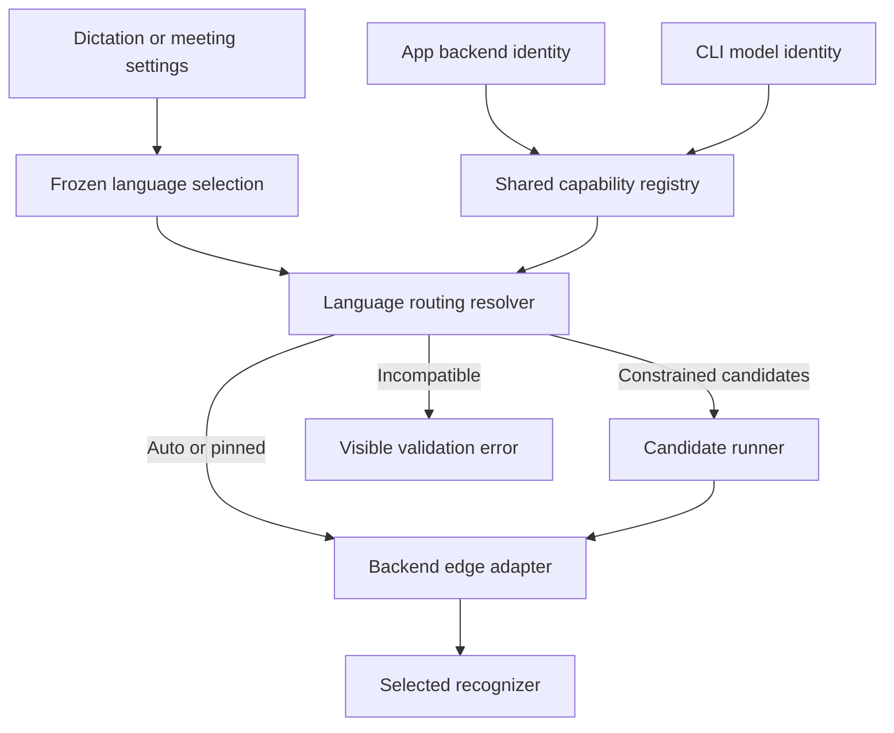
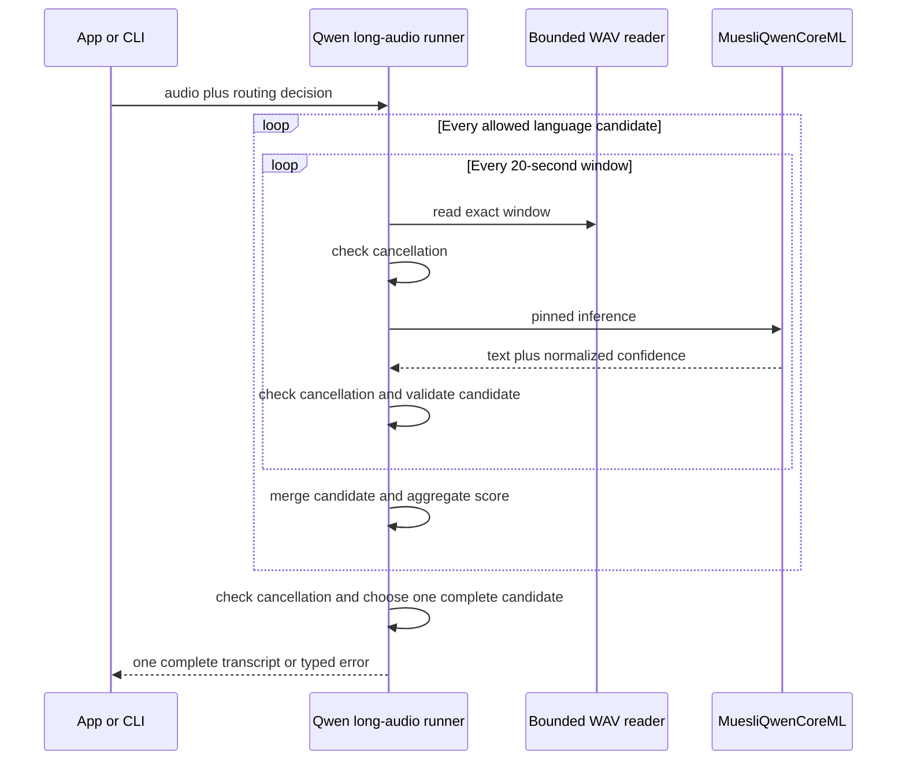
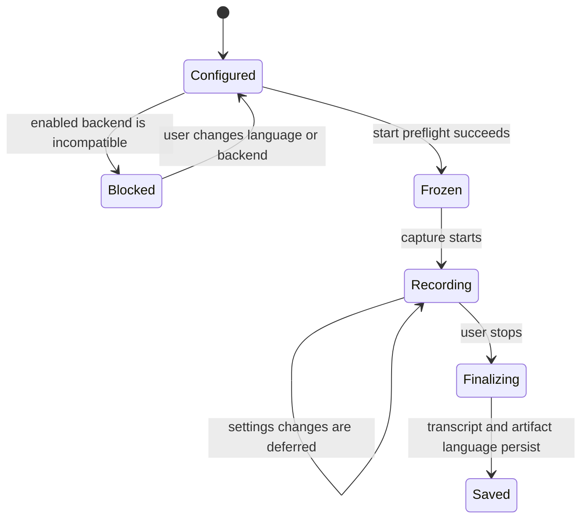
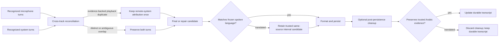

# Language-Aware Transcription and FluidAudio Upgrade - Plan

## Goal Capsule

- **Objective:** Upgrade FluidAudio from 0.15.1 to 0.15.5 without losing Qwen3 ASR, make language intent truthful at every model boundary, fix long Qwen dictations, give meetings an independent Auto-or-one-language selector, remove evidence-backed whole-segment speaker-playback duplicates across `You` and remote speakers, and keep Arabic meeting speech Arabic through finalization.
- **Product authority:** This plan is the single active authority for local transcription language routing, meeting final-transcript integrity, the FluidAudio upgrade, Qwen ownership, and Qwen long-audio behavior. It supersedes the overlapping local-ASR portions of the earlier multilingual, Qwen, and hosted-ASR drafts.
- **Execution profile:** Deep native macOS migration delivered as six dependency-ordered units. Each unit must leave the app buildable and preserve the selected model.
- **Authority order:** Product Contract; Planning Contract; Implementation Units; repository instructions and current source patterns; exact upstream source and license.
- **Stop conditions:** Stop if an implementation silently changes models, converts an explicit language selection to unrestricted Auto, translates trusted Arabic meeting evidence into English, publishes an evidence-backed whole-segment playback duplicate as both `You` and a remote speaker, deletes ambiguous or mixed local speech to force deduplication, advertises constrained candidates without passing within-backend confidence conformance, publishes a partial long-form transcript, duplicates the Qwen model cache, removes retained-audio recovery, or copies third-party source without attribution.
- **Tail ownership:** The executor owns implementation, migration, tests, signed-app and CLI acceptance, documentation, review, and delivery. The plan itself is not an execution tracker.
- **Open blockers:** None.

---

## Product Contract

### Summary

Muesli will treat spoken-language intent as a typed input to transcription instead of translating one profile into unrelated provider defaults. Dictation may use Auto, one language, or a constrained set. Meetings use an independent Auto-or-one-language selection. Meeting transcript language stays separate from the language used for titles, summaries, and notes. Finalization removes evidence-backed speaker-playback duplicates and rejects downstream processing that translates trusted Arabic transcript evidence into English.

Muesli will upgrade maintained FluidAudio consumers to 0.15.5. Qwen remains available through an Apache-attributed Muesli-owned Core ML target because FluidAudio removed that backend after 0.15.2. Qwen app and CLI calls will use the same bounded long-audio runner.

### Problem Frame

The current `LanguageProfile` stores selected languages, an optional dominant language, and the meeting-output policy in one type. A multi-language selection without a dominant language becomes unrestricted Auto for Whisper and Nemotron, English for Cohere, Hindi for Indic ASR, and an unhinted Qwen call. The UI nevertheless says the model will detect between the selected languages. No current backend receives an allowed-language set.

Meetings reuse the dictation profile even though meeting recognition and meeting artifact language are separate user decisions. The setting does not provide the requested direct choice between Auto and one spoken language.

Meeting capture records microphone and system audio as separate tracks. Although microphone VAD already consumes the echo-cancelled stream, speaker playback can still leak into both tracks. `TranscriptReconciler` deliberately preserves every non-empty overlapping microphone turn, so the same remote utterance can appear once as `You` and once as `Others` or a diarized speaker.

Meeting chunks and repair paths also publish cleaned recognizer output without validating that it still matches the frozen spoken-language authority. Arabic can therefore be present in live or earlier transcript evidence and then be replaced by an English translation from the final recognizer or repair pass. Prompting the model to preserve language is necessary but is not a sufficient finalization contract.

Qwen currently resamples the entire WAV and calls FluidAudio once. FluidAudio 0.15.1 documents a 30-second Core ML limit and a 512-token decoder cache, both consistent with the observed long-input failures. FluidAudio 0.15.5 is the current upstream release and carries maintained Parakeet long-transcription seam fixes plus VAD and diarization improvements needed by Muesli's other FluidAudio consumers. Qwen was removed in 0.15.3, so a direct version bump would make Muesli fail to compile and remove a selected model.

### Definitions

- **Dictation language selection:** Auto, one explicit language, or a selected language set with an optional dominant-language tie-breaker.
- **Meeting spoken language:** Auto or one explicit language. The value is frozen when recording starts.
- **Meeting artifact language:** The independently resolved language for the title, summary, notes, headings, regeneration, and artifact fallback prose.
- **Backend capabilities:** The supported languages, routing modes, confidence support, safe duration, streaming behavior, and workload eligibility declared for one recognizer.
- **Routing decision:** A typed result of resolving user intent against backend capabilities. It is Auto, pinned, constrained candidates, fixed language, or incompatible.
- **Constrained candidates:** One complete request-level decode per allowed language, followed by deterministic selection of one complete transcript using comparable within-backend confidence and safety checks.
- **Complete publication:** A transcript becomes visible, persisted, pasted, or printed only after every required inference succeeds.
- **Cross-track playback duplicate:** A whole atomic microphone segment whose time materially overlaps and whose text is equivalent to a system-audio utterance caused by speaker bleed.
- **Language-valid Arabic meeting transcript:** A transcript candidate that preserves Arabic wording and any embedded English technical terms instead of translating the speech into English.

### Actors and Flows

- F1. Dictation configuration
  - **Actors:** Dictating user and Muesli runtime.
  - **Steps:** The user selects Auto, one language, or a language set. Muesli shows the exact behavior supported by the selected model and blocks incompatible combinations.
  - **Outcome:** The next dictation freezes one truthful routing input.
- F2. Meeting configuration
  - **Actors:** Meeting user and Muesli runtime.
  - **Steps:** The user chooses Auto or one spoken language independently from the artifact-output policy. Muesli validates and freezes the choice with enabled live and final recognizers.
  - **Outcome:** Recording starts only with compatible frozen meeting language and model authorities. Later settings changes apply to the next meeting.
- F3. Constrained dictation
  - **Actors:** Dictating user and local recognizer.
  - **Steps:** A capable backend decodes the complete request once per allowed language, rejects unsafe outputs, selects one complete transcript by normalized confidence, and continues through the existing cleanup pipeline once.
  - **Outcome:** The model considers only the selected candidates and never falls through to unrestricted Auto.
- F4. Long Qwen transcription
  - **Actors:** App or CLI user and the owned Qwen runtime.
  - **Steps:** Muesli reads bounded overlapping windows, transcribes them sequentially, validates empty windows, merges proven overlap, and checks cancellation before publication.
  - **Outcome:** One complete transcript is published or one typed terminal error is returned.
- F5. Dependency upgrade
  - **Actors:** Muesli runtime and package maintainer.
  - **Steps:** Muesli first replaces FluidAudio Qwen APIs with its owned target, then upgrades FluidAudio and repairs maintained consumers.
  - **Outcome:** Qwen remains selectable while other FluidAudio models use 0.15.5.
- F6. Meeting transcript finalization
  - **Actors:** Meeting participant and Muesli finalization pipeline.
  - **Steps:** Muesli reconciles microphone and system tracks, removes only evidence-backed playback duplicates, validates repaired or final transcript candidates against the frozen spoken language, and retains the trusted candidate for the same source and interval when final processing translates the speech.
  - **Outcome:** Each evidence-backed whole-segment playback duplicate has one remote-speaker attribution, ambiguous or mixed local speech remains preserved, and trusted Arabic evidence remains Arabic in the persisted final transcript.

### Key Decisions

- KD1. Use one consolidated implementation plan for the upgrade, Qwen reliability, and language enhancement. (session-settled: user-directed — chosen over separate upgrade, Qwen, and language plans because the dependency and routing changes must land in one coherent sequence.) Governs R1-R22.
- KD2. An explicit language selection is authoritative. (session-settled: user-directed — chosen over unrestricted multilingual auto-detection because the user already knows the allowed languages and current Auto quality is poor.) Governs R1-R5, R8, R9, R21.
- KD3. Meetings expose Auto or one spoken language independently from dictation and artifact output. (session-settled: user-directed — chosen over reusing the multi-language dictation profile because meeting recognition needs a simpler explicit control.) Governs R6-R9, R20-R22.
- KD4. Upgrade FluidAudio without a comparative model benchmark. (session-settled: user-directed — chosen over a benchmark-gated model bake-off because the upgrade and behavior contract are already decided.) Governs R14-R16, R18.
- KD5. Preserve Qwen and the selected-model contract. (session-settled: user-approved — chosen over removing Qwen or silently substituting another recognizer because model changes alter language and accuracy semantics.) Governs R10-R17, R19.

### Requirements

#### Language intent and capability truth

- R1. Auto detection MUST be used only when the frozen selection is Auto; an explicit language or set MUST NOT silently resolve to unrestricted Auto.
- R2. One selected dictation language MUST produce a pinned decode when the backend supports it and a visible incompatibility when it does not.
- R3. A multi-language dictation selection MUST use a backend-declared constrained-set mechanism. The first release MUST declare constrained capability only for the English-Arabic pair on Qwen and multilingual Whisper; every other set MUST remain selected and resolve to a visible incompatibility. If either required backend cannot pass the fixed confidence-conformance contract, this enhancement release is blocked rather than silently pinning one language, shrinking the set, or falling back to Auto.
- R4. A dominant language in a multi-language selection MUST act only as a deterministic tie-breaker and MUST NOT remove the other allowed language from consideration.
- R5. Backends MUST declare supported languages, Auto, single-pin, constrained-candidate, fixed-language, code-switching, confidence, maximum safe duration, streaming, and workload capabilities in one provider-neutral registry shared by app and CLI.

#### Meeting language authority

- R6. Meetings MUST persist an independent spoken-language selection with exactly two shapes: Auto or one `TranscriptionLanguage`.
- R7. Muesli MUST freeze meeting spoken language together with live and final model authorities at recording start and use those values through capture, repair, fallback, and finalization.
- R8. Meeting model or language settings changed during recording MUST apply to the next meeting and MUST NOT mutate the active session.
- R9. Meeting artifact language MUST remain independent from spoken-language selection and MUST be stored with the meeting so regeneration does not adopt later settings.
- R21. In this release, when Arabic is the frozen explicit meeting language and trusted pre-final transcript evidence contains Arabic, every final recognizer, selective-repair, full-session transcription fallback, and cleanup candidate that would replace that evidence MUST preserve its Arabic wording. A candidate that converts the Arabic speech into English prose MUST be rejected, the trusted Arabic evidence MUST remain authoritative, and conventional English technical terms spoken within Arabic MUST remain unchanged. Rejecting optional post-persistence cleanup MUST keep the already-durable transcript and MUST NOT change the meeting's terminal outcome.
- R22. When temporal and semantic evidence identifies a whole atomic microphone segment as the same speaker-playback utterance in the system track, final reconciliation MUST publish it once under the system or diarized remote-speaker identity. Reconciliation MUST run before adjacent microphone segments are merged, preserve any mixed or semantically distinct local speech, and MUST NOT globally suppress a legitimately repeated phrase.

#### Qwen ownership and long audio

- R10. Qwen MUST remain available on macOS 15 and later under the same model identity, download, readiness, deletion, warmup, memory, and cache behavior.
- R11. Muesli MUST own the minimal non-streaming Qwen Core ML implementation derived from FluidAudio 0.15.1 and retain Apache 2.0 attribution; `Qwen3StreamingManager` MUST NOT be copied.
- R12. Qwen audio MUST use 20-second windows with 2-second overlap, exact sample coverage, bounded reading, sequential inference, and conservative multilingual merge. App and CLI preflight MUST cap Qwen source audio at 20 minutes and candidate-window work at 134 inference calls; larger inputs fail before inference with a typed duration-limit error.
- R13. Qwen MUST publish no partial result after a failed window or cancellation; cancellation checks MUST run before and after every inference and before merge and return. A window that exhausts decoder-cache capacity MUST fail the whole request with a typed cache-capacity error.

#### Dependency, compatibility, and observability

- R14. FluidAudio MUST resolve exactly to 0.15.5, and the duplicated runtime version metadata MUST match the resolved package.
- R15. All maintained FluidAudio consumers MUST preserve their current model identity, cache, download, preload, transcription, VAD, diarization, and meeting behavior after API migration.
- R16. Existing language-profile configuration MUST migrate deterministically: dictation keeps its selected set and dominant tie-breaker; meeting spoken language becomes the sole selected language when exactly one existed, otherwise the legacy dominant language when one was set, and Auto only when neither authority existed; old dominant-output Arabic or English becomes the corresponding explicit artifact language and every other old output policy becomes Automatic.
- R17. App and CLI MUST share Qwen inference, language routing, long-audio geometry, merge, cancellation, and typed failure semantics; CLI MUST accept Auto, one language, or a comma-separated language set.
- R18. Traces and diagnostics MUST record the content-free frozen selection, capabilities, routing result, candidate count, window count, failing window, timings, backend identity, cross-track suppression count, language-preservation outcome, and terminal outcome without audio, transcript fragments, paths, or model confidence values. The local-only trace MAY additionally record the score-normalization version, per-candidate validity, a nonnumeric margin class (`clear`, `near_tie`, `exact_tie`, or `invalid`), the backend-selected candidate or auto-detected language, and typed reasons for duplicate suppression or translated-candidate rejection. Those language values are content-derived. All of these local-only fields are excluded from telemetry, CLI envelopes, incidents, text exports, and CloudKit.
- R19. Missing, deleted, or incompatible selected models MUST remain selected and visibly unavailable; Muesli MUST NOT rewrite persisted selection to another downloaded model.
- R20. Meeting imports and retranscription MUST freeze the current meeting spoken-language selection and apply the same capability validation as live meetings.

### Acceptance Examples

- AE1. Given English is selected for dictation and Qwen is active, when transcription starts, then every Qwen window receives the English hint and the trace records `pinned`.
- AE2. Given English and Arabic are selected without a dominant language and Qwen is active, when transcription runs, then Qwen completes and merges every required window under English, repeats the complete request under Arabic, selects one request-level candidate by normalized confidence, and never performs an unhinted Auto decode.
- AE3. Given English and Arabic are selected with Arabic dominant, when candidate scores tie under the routing rule, then Arabic wins; otherwise the higher-confidence allowed candidate wins.
- AE4. Given three selected languages and a backend whose constrained-candidate maximum is two, when the user selects that backend or starts dictation, then Muesli reports incompatibility and does not start unrestricted Auto transcription.
- AE5. Given an English-only backend and Arabic is selected, when configuration is validated, then the backend is disabled or recording is blocked with an English-only explanation.
- AE6. Given a meeting is configured for Arabic, when recording starts with compatible live and final backends, then every meeting chunk and final repair pass receives Arabic while titles and notes follow the separate artifact-language snapshot.
- AE7. Given a meeting is configured for Auto and the final backend cannot auto-detect, when recording starts, then Muesli blocks start and directs the user to choose one language or another backend.
- AE8. Given an active Arabic meeting, when the user changes live backend, final backend, or meeting language in Settings, then the active session keeps its frozen authorities and the new values apply to the next meeting.
- AE9. Given a saved meeting is regenerated after global language settings change, when title and notes are regenerated, then the stored artifact-language snapshot remains authoritative.
- AE10. Given a Qwen input of 45 seconds, when transcription runs, then it processes `0-20s`, `18-38s`, and `36-45s` in order and publishes one transcript containing the final utterance.
- AE11. Given Arabic-English speech crosses a Qwen window boundary, when both windows repeat at least three normalized words, then the proven duplicate appears once; with no proven overlap, both spans remain in order.
- AE12. Given a silent middle window, when its non-overlap center satisfies the silence gate and Qwen returns empty text, then processing continues; an empty speech-bearing center fails the whole transcription.
- AE13. Given cancellation during the final Qwen inference, when the model returns late, then the post-inference cancellation check discards the result and neither app nor CLI publishes text.
- AE14. Given an existing Qwen cache created under FluidAudio 0.15.1, when the owned runtime first loads after upgrade, then it validates and reuses the same files without a move or download.
- AE15. Given FluidAudio 0.15.5 is resolved, when app and CLI model smoke tests run, then Parakeet, SenseVoice, Nemotron, VAD, diarization, and Qwen load through their intended owners.
- AE16. Given CLI `--language ar,en` with Qwen, when the file completes, then CLI uses the same constrained candidates and long-audio runner as the app; unsupported model-language combinations exit nonzero without a transcript.
- AE17. Given a selected model is deleted or becomes unavailable, when settings reload or transcription starts, then its identifier remains selected, the UI shows Unavailable, and the operation is blocked without choosing another model.
- AE18. Given meeting audio is imported or retranscribed with Arabic selected, when the operation starts, then it freezes Arabic, validates the requested backend, and passes Arabic through every transcription call.
- AE19. Given a migrated dictation profile selects a set other than exactly English and Arabic, when configuration loads or transcription starts, then the set remains selected, the UI reports that constrained recognition is unavailable in this release, and transcription is blocked without pinning one language or using Auto.
- AE20. Given Qwen input exceeds 20 minutes or its requested candidate set would exceed 134 window-candidate calls, when app or CLI preflight runs, then inference does not start and a typed duration-limit error is returned without transcript output.
- AE21. Given speaker output creates one atomic microphone segment equivalent to a temporally overlapping system segment and a separate atomic microphone segment containing a local interruption in the same interval, when the meeting is finalized, then the playback segment appears once as `Others` or its diarized remote speaker and the distinct interruption remains as `You`. A single mixed mic segment containing both playback and local speech is preserved whole rather than partially rewritten.
- AE22. Given an explicit Arabic meeting whose trusted pre-final transcript contains Arabic wording and conventional English technical terms, when a final recognizer, repair, or synchronous cleanup candidate returns an English translation, then Muesli rejects that candidate, persists the trusted Arabic transcript with the English terms unchanged, and records the content-free rejection reason.
- AE23. Given a completed explicit Arabic meeting whose durable raw transcript contains Arabic wording, when optional post-persistence cleanup returns an English translation, then Muesli discards the cleanup result, keeps the durable Arabic transcript unchanged, and leaves the meeting completed.

### Success Criteria

- Qwen completes 45-second and 100-105-second app and CLI fixtures with beginning, middle, and ending markers present.
- English, Arabic, and Arabic-English fixtures prove pinned and constrained routing without unrestricted Auto fallback.
- Meeting tests prove Auto and explicit language behavior across start, live chunks, final repair, backend changes, save, sync, and regeneration; explicit Arabic never becomes an English translation during finalization.
- Speaker-route fixtures prove an evidence-backed whole-segment remote playback duplicate cannot be published under both `You` and a remote speaker, while ambiguous, mixed, and genuinely overlapping local speech survives.
- FluidAudio resolves to 0.15.5 and all direct FluidAudio consumers compile and pass their focused tests.
- Existing Qwen users reuse their model files and keep download, delete, warmup, and memory-pressure behavior.
- Verification uses deterministic behavior and fixture acceptance only. It does not introduce WER/CER comparison, model ranking, or a benchmark gate.

### Scope Boundaries

**In scope**

- Local dictation and meeting language intent, capability validation, routing, final-language validation, and diagnostics.
- An independent meeting Auto-or-one-language selector and persisted artifact-language snapshot.
- Evidence-backed microphone/system playback deduplication during meeting finalization.
- Qwen non-streaming Core ML ownership, language hints, bounded long audio, app and CLI parity.
- FluidAudio 0.15.5 migration for every current direct consumer.
- Configuration, SQLite, CloudKit, CLI, documentation, and attribution changes required by this scope.

**Outside this plan**

- Hosted ASR, hosted meeting transcription, credential migration, consent, uploads, and provider fallback.
- Automatic cross-model fallback or model substitution.
- Comparative model evaluation, WER/CER scoring, or a model-selection benchmark.
- Live Qwen streaming, timestamps, diarization, or meeting-preview support.
- Equal quality claims for all listed languages; the constrained multilingual release matrix is English and Arabic.
- General cleanup-prompt redesign, dictionary redesign, OCR context, meeting lifecycle detection, and lifecycle sounds except for the meeting language-preservation guard and regression protection at their existing seams.

### Dependencies and Sources

- FluidAudio 0.15.5 is the current release and introduces a breaking `DownloadUtils` to `ModelHub` migration: <https://github.com/FluidInference/FluidAudio/releases/tag/v0.15.5>.
- FluidAudio removed Qwen in PR 676 before 0.15.3: <https://github.com/FluidInference/FluidAudio/pull/676>.
- FluidAudio 0.15.1 Qwen source and tests are Apache 2.0; the pinned source revision is `ed66535b696c5c6d69a71f508e87bf3491e1b1fd`: <https://github.com/FluidInference/FluidAudio/tree/ed66535b696c5c6d69a71f508e87bf3491e1b1fd/Sources/FluidAudio/ASR/Qwen3>.
- The Core ML Qwen limit and cache geometry are defined by the 0.15.1 config and manager: <https://github.com/FluidInference/FluidAudio/blob/v0.15.1/Sources/FluidAudio/ASR/Qwen3/Qwen3AsrConfig.swift> and <https://github.com/FluidInference/FluidAudio/blob/v0.15.1/Sources/FluidAudio/ASR/Qwen3/Qwen3AsrManager.swift>.

---

## Planning Contract

### Key Technical Decisions

- KTD1. **Put the capability and routing contract in `MuesliCore`.** `TranscriptionBackendID`, `TranscriptionWorkload`, `TranscriptionBackendCapabilities`, `TranscriptionLanguageSelection`, and `LanguageRoutingDecision` stay independent from FluidAudio, SwiftUI, model downloads, and hosted transport. App and CLI adapters map their existing model identities into the shared registry. Covers R1-R5, R17.
- KTD2. **Split the existing combined language profile into three authorities.** (session-settled: user-directed — chosen over keeping one dictation-and-meeting profile because meetings require Auto or one explicit spoken language and a separate artifact language.) `DictationLanguageProfile` keeps the selected set and dominant tie-breaker. `MeetingSpokenLanguageSelection` stores Auto or one language. `MeetingOutputLanguagePolicy` remains independent. Covers R1-R9, R16.
- KTD3. **Use constrained candidate decoding only when confidence is comparable.** (session-settled: user-directed — chosen over unrestricted Auto because explicit allowed languages must influence inference.) Qwen and multilingual Whisper start with this capability disabled. `BackendCandidateScore` is comparable only between complete candidates from the same backend, model revision, audio, and decode options. Qwen completes all windows under one pinned language, merges that transcript, and aggregates the selected token's log-softmax probability over every emitted lexical token, excluding prompt, control, and EOS tokens. Whisper uses the token-count-weighted mean of WhisperKit segment `avgLogprob` for a complete pinned decode. Zero-token, missing, or non-finite scores fail conformance. Scores within `0.0001` tie; a valid dominant language wins that tie, otherwise stable ISO-code order does. Fixed within-backend fixtures must prove that labeled English and Arabic inputs select their matching language and same-window Arabic-English inputs preserve unique sentinels from both languages without translation or omission before the registry enables exactly that pair. Enabled backends run complete candidates sequentially, require every candidate to succeed, and choose one transcript for publication; language is never switched at a window seam. A backend without the enabled contract reports incompatibility, and failure by either required backend blocks this enhancement release under R3. These are correctness tests, not a model comparison. Covers R1-R5, R17.
- KTD4. **Freeze meeting language and model authorities together.** Explicit selection must be supported by live and final recognizers. Auto requires Auto support. Start preflight blocks an invalid configuration. Settings changes never mutate an active meeting and apply to the next session. Covers R6-R9, R20.
- KTD5. **Create a dedicated `MuesliQwenCoreML` target before upgrading FluidAudio.** (session-settled: user-approved — chosen over a permanent FluidAudio fork or removing Qwen because Muesli needs a narrow maintained ownership boundary.) Port the config, non-streaming manager, model wrappers, RoPE, and mel extractor from 0.15.1. Adapt model loading to the existing Muesli-managed plan. Exclude the upstream streaming manager. Covers R10-R15.
- KTD6. **Reuse the current Qwen cache in place.** The owned plan keeps `Library/Application Support/FluidAudio/Models/qwen3-asr-0.6b/int8` as a compatibility path and pins the model repository revision plus a reviewed SHA-256 manifest. Markerless legacy files are adopted only after the required file set and every digest match; mismatch routes through the existing repair download. Successful validation backfills the existing Muesli completion marker. No migration copies 1.3 GB of model files. Covers R10, R14-R16.
- KTD7. **Use bounded sequential Qwen windows and conservative merge.** Each request-level language candidate independently runs twenty-second windows advancing by eighteen seconds, then merges before KTD3 compares complete candidates. Spaced text requires at least a three-word normalized suffix-prefix anchor. Unspaced text requires eight normalized graphemes. An uncertain boundary preserves both spans. The runner accepts an injected silence classifier so it remains independent from FluidAudio; the app and CLI classifiers require both bounded energy checks and the existing VAD to classify the non-overlap center as silence. Disagreement, unavailable evidence, and near-threshold input are indeterminate and fail closed. The runner enforces R12's total-duration and total-work ceilings before its first bounded read. Covers R12, R13.
- KTD8. **Upgrade FluidAudio only after Qwen callers have switched owners.** (session-settled: user-directed — chosen over staying pinned or attempting a direct bump because the upgrade is required and current FluidAudio no longer contains Qwen.) Update the package pin, resolution, duplicated telemetry version, and all changed public APIs in one compile-clean unit. Covers R10, R14, R15.
- KTD9. **Keep confidence and content private.** Routing traces record decisions, counts, durations, and typed reasons. They do not store candidate text, scores, audio, paths, or model logits. Raw ASR, cleanup, and final output remain separate local diagnostic artifacts under their existing privacy contract. Covers R18.
- KTD10. **Preserve unavailable model identity.** Availability validation becomes non-mutating. The UI reports unavailable or incompatible selections and runtime preflight blocks them. Only explicit user selection changes persisted model identity. Covers R19.
- KTD11. **Reconcile speaker playback on atomic segments before readable-turn merging.** (session-settled: user-directed — chosen over trusting echo cancellation alone because speaker-route bleed still reaches both recognized tracks.) `TranscriptReconciler` uses temporal overlap plus multilingual-normalized whole-segment text equivalence as evidence of a cross-track duplicate and keeps the system or diarized remote segment. It never removes part of a mic segment: mixed segments, ambiguous overlap, and semantically distinct simultaneous local speech are preserved whole. Covers R22.
- KTD12. **Treat Arabic preservation as a validation and rollback gate, not only a prompt.** (session-settled: user-directed — chosen over accepting the final model unconditionally because Arabic meeting speech is currently translated into English.) For explicit Arabic, raw batch evidence or finalized streaming output selected as the durable transcript authority is trusted evidence when it contains Arabic; display-only partials, provisional UI captions, and generated cleanup results are not. A typed per-source, per-interval gate classifies replacement candidates as accepted, rejected-keep-prior, no-speech, or failed before collectors publish them; completion order never defines authority. A candidate that materially removes Arabic script while replacing it with English prose is rejected, while ordinary English technical terms and genuine Arabic-English code-switching remain valid. Invalid repair preserves the trusted candidate for the same source and interval, and optional post-persistence cleanup simply keeps the already-durable transcript when rejected. Auto and other explicitly selected languages do not infer a rejection authority from this first-release rule. Covers R7, R21.

### High-Level Technical Design

The routing contract separates user intent from provider adapters and makes incompatibility a first-class result.

Qwen owns one bounded protocol for app and CLI.

Meeting language and backend authorities are frozen together after start preflight; later settings changes affect only the next session.

Meeting finalization applies conservative evidence gates before the transcript is formatted or persisted.

### Migration and Compatibility

- Decode the existing `LanguageProfile` before removing its serialized shape. U1 keeps a deprecated read-only compatibility projection so unchanged callers compile; U3 switches dictation and CLI callers, U4 switches meeting, UI, import, summary, storage, and sync callers, then removes the projection.
- Preserve selected dictation languages and dominant language. Multi-language profiles change from misleading Auto behavior to the constrained-capability resolver.
- Derive meeting spoken language from the sole selected language when the old profile had exactly one; otherwise use the old dominant language when present; use Auto only when neither authority existed.
- Map old dominant-output Arabic or English to the corresponding explicit artifact language. Map every other old output policy to Automatic.
- Continue decoding and mirroring legacy provider pins for rollback compatibility until one later cleanup release removes them. The legacy combined-language projection mirrors the dictation profile only; older builds ignore the new independent meeting fields, because no lossless downgrade representation exists.
- Add nullable meeting language columns through an idempotent SQLite migration. Pre-migration rows have no historical per-meeting language authority, so both new fields remain null and resolve as Auto spoken language plus the pre-migration Automatic artifact policy. The migrated global profile becomes a default only for newly started meetings and is never stamped onto historical rows.
- Add CloudKit fields as optional and version-tolerant. Older peers ignore them; newer peers preserve them during round trips.
- Keep the Qwen cache path unchanged and update only ownership names, readiness tests, deletion routing, and attribution.

### System-Wide Impact

- **Configuration:** One combined structure becomes three authorities with deterministic decoding and atomic save behavior.
- **Runtime:** Four provider-specific language parameters collapse into one typed routing decision at `TranscriptionRuntime` and meeting entry points.
- **Meeting finalization:** Atomic mic/system reconciliation precedes readable-turn merging, and typed Arabic-preservation decisions protect trusted evidence at synchronous and post-persistence replacement seams.
- **Storage and sync:** Meetings persist spoken-selection and artifact-language snapshots for reproducible regeneration.
- **Dependency surface:** The upgrade affects every direct FluidAudio import, not only Qwen.
- **Resources:** Constrained English-Arabic dictation performs two sequential decodes on supported models. Capability limits prevent unbounded fan-out and concurrent Core ML memory spikes.
- **Privacy:** New trace fields are identifiers and counts only. Existing local-only transcript and audio boundaries remain unchanged.
- **Licensing:** Derived Qwen source carries exact upstream provenance and Apache 2.0 notice in source and product attribution.

### Risks and Mitigations

- **FluidAudio API drift:** Characterize all direct imports and repair them in the version-bump unit. Run focused VAD, diarization, meeting, and model tests before signed-app acceptance.
- **Owned Qwen maintenance:** Keep the target limited to the five non-streaming transitive source components plus Muesli orchestration. Record the upstream tag and commit in every derived file.
- **Candidate latency:** Run candidates sequentially and cap support through backend capabilities. Do not run an unbounded set or load another recognizer for language identification.
- **Candidate ambiguity:** Require normalized confidence from the same backend and deterministic tie-breaking. Reject non-finite scores and do not fall back to Auto.
- **Boundary deletion:** Use minimum word/grapheme anchors and prefer duplicated text over lost speech when overlap is uncertain.
- **Silent empty windows:** Inspect only the non-overlap center so repeated overlap energy does not hide an omitted speech region.
- **Meeting setting drift:** Freeze language and model authorities together. Defer every later settings change to the next meeting.
- **Playback-dedup false positives:** Require both temporal and semantic evidence, prefer preserving ambiguous turns, and test genuine interruptions and repeated phrases separately from speaker bleed.
- **Language-gate false positives:** Apply the rejection gate only to explicit spoken-language selections, compare against accepted source evidence, and permit English technical terms and genuine code-switching inside Arabic.
- **Unavailable model normalization:** Replace selection-rewriting helpers with read-only availability results and tests that preserve identifiers through deletion and relaunch.
- **Cache duplication:** Adopt the current Qwen directory in place and test legacy markerless, managed-complete, partial, deleted, and interrupted states.

### Delivery Sequence

1. Land the shared capability contract and configuration migration without changing backend calls.
2. Extract Qwen and switch app and CLI to `MuesliQwenCoreML` while FluidAudio remains at 0.15.1.
3. Route dictation and CLI language intent through the shared resolver and add bounded Qwen audio.
4. Add and persist the meeting selector and artifact-language snapshot, then enforce meeting language preservation and cross-track playback reconciliation.
5. Upgrade FluidAudio to 0.15.5 and repair all remaining consumers.
6. Complete integrated diagnostics, attribution, documentation, and signed-app acceptance.

---

## Implementation Units

### U1. Add the shared capability contract and migrate language configuration

- **Goal:** Establish truthful provider-neutral routing and split the existing combined profile without changing model ownership.
- **Requirement slice:** R1-R5 at configuration and resolution boundaries; R16, R18, R19; KTD1-KTD3, KTD9, KTD10.
- **Files:** `native/MuesliNative/Sources/MuesliCore/TranscriptionLanguageRouting.swift` (new); `native/MuesliNative/Sources/MuesliNativeApp/Models.swift`; `native/MuesliNative/Sources/MuesliNativeApp/AppState.swift`; `native/MuesliNative/Sources/MuesliNativeApp/ModelsView.swift`; `native/MuesliNative/Sources/MuesliNativeApp/SettingsView.swift`; `native/MuesliNative/Sources/MuesliNativeApp/LanguageProfileSettingsModel.swift`; `native/MuesliNative/Sources/MuesliNativeApp/ConfigStore.swift`; `native/MuesliNative/Sources/MuesliNativeApp/SessionTraceRuntime.swift`; `native/MuesliNative/Sources/MuesliCLI/TranscribeCommand.swift`; `native/MuesliNative/Tests/MuesliTests/TranscriptionLanguageRoutingTests.swift` (new); `native/MuesliNative/Tests/MuesliTests/LanguageSelectionPresentationTests.swift` (new); `native/MuesliNative/Tests/MuesliTests/ModelsTests.swift`; `native/MuesliNative/Tests/MuesliTests/ConfigStoreTests.swift`; `native/MuesliNative/Tests/MuesliTests/LanguageProfileSettingsModelTests.swift`.
- **Approach:** Add stable shared backend IDs, capability descriptors, workload-aware validation, and typed routing results. Add and migrate dictation, meeting-spoken, and artifact-output authorities while retaining a deprecated read-only `LanguageProfile` compatibility projection for unchanged consumers. Update the dictation settings surface to render Auto, one language, English-Arabic constrained mode, incompatible capability, and persisted-unavailable model states with the exact resolved behavior before start. U3 switches dictation and CLI consumers; U4 switches meeting and artifact consumers and then removes the projection.
- **Test scenarios:**
  - Empty, single, English-Arabic, dominant, oversized, unsupported, fixed-English, and legacy-conflict selections resolve to the expected typed decision.
  - An explicit unsupported language never returns Auto or a provider default.
  - The English-Arabic pair resolves to constrained candidates only after its backend passes the fixed confidence-conformance contract and declares capacity two.
  - Auto, single, constrained, incompatible, and unavailable selector states preserve the requested model and language identifiers and show the resolved behavior without silent mutation.
  - Legacy profiles migrate according to R16, map output policy per R16, save atomically, round-trip through JSON, and keep unchanged callers buildable through the compatibility projection.
  - Trace snapshots encode selection and routing identifiers without transcript or confidence.
- **Verification:** Run the focused routing, model, config-store, and settings-model suites.
- **Dependencies:** None.

### U2. Extract the non-streaming Qwen Core ML runtime

- **Goal:** Remove every app and CLI dependency on FluidAudio's deleted Qwen API while preserving current short-input behavior and cache ownership.
- **Requirement slice:** R10, R11; R15 and R17 for Qwen ownership and shared lifecycle only; KTD5, KTD6.
- **Files:** `native/MuesliNative/Package.swift`; `native/MuesliNative/Sources/MuesliQwenCoreML/Qwen3AsrConfig.swift` (new); `native/MuesliNative/Sources/MuesliQwenCoreML/Qwen3AsrManager.swift` (new); `native/MuesliNative/Sources/MuesliQwenCoreML/Qwen3AsrModels.swift` (new); `native/MuesliNative/Sources/MuesliQwenCoreML/Qwen3RoPE.swift` (new); `native/MuesliNative/Sources/MuesliQwenCoreML/WhisperMelSpectrogram.swift` (new); `native/MuesliNative/Sources/MuesliQwenCoreML/Qwen3ModelIntegrity.swift` (new); `native/MuesliNative/Sources/MuesliCore/ManagedASRModelDownloads.swift`; `native/MuesliNative/Sources/MuesliNativeApp/Qwen3AsrBackend.swift`; `native/MuesliNative/Sources/MuesliCLI/TranscribeCommand.swift`; `native/MuesliNative/Sources/MuesliNativeApp/ModelDeletionExecutor.swift`; `THIRD_PARTY_NOTICES.md` (new); `native/MuesliNative/Tests/MuesliTests/Qwen3CoreMLTests.swift` (new); `native/MuesliNative/Tests/MuesliTests/BackendTests.swift`; `native/MuesliNative/Tests/MuesliTests/ModelsTests.swift`.
- **Approach:** Create a library target used by both executables. Port only the required Apache-licensed 0.15.1 source, rename public symbols into Muesli ownership, replace upstream download types with `ManagedASRModelPlan`, and expose text plus KTD3's normalized token confidence. Pin the model repository revision and checked-in digest manifest; validate legacy and newly downloaded artifacts before readiness or marker backfill. Add exact source provenance headers and full license notice. Keep FluidAudio pinned at 0.15.1 for this unit.
- **Test scenarios:**
  - The extracted config, RoPE, prompt tokens, model file names, stateful decoder capacity, and vocabulary loading match the pinned source.
  - Auto, English, and Arabic short fixtures reach the expected prompt path and return finite normalized confidence.
  - Managed-complete and markerless legacy caches load in place only when every required artifact and SHA-256 digest matches the pinned manifest; missing, partial, or tampered caches repair through existing download coordination.
  - Download cancellation, deletion during load, warmup failure, unload, and memory pressure retain existing behavior.
  - App and CLI adapters contain no `Qwen3AsrManager` reference from the FluidAudio module.
- **Verification:** Run Qwen core, managed-download, backend, deletion, and model tests under FluidAudio 0.15.1.
- **Dependencies:** U1.

### U3. Route dictation and CLI through constrained language decisions and bounded Qwen audio

- **Goal:** Honor dictation hints at inference time and make every supported Qwen duration reliable through one shared runner.
- **Requirement slice:** R1-R5, R10-R13, R17, R18; KTD3, KTD7, KTD9.
- **Files:** `native/MuesliNative/Sources/MuesliQwenCoreML/Qwen3LongAudioRunner.swift` (new); `native/MuesliNative/Sources/MuesliQwenCoreML/Qwen3AudioWindowReader.swift` (new); `native/MuesliNative/Sources/MuesliQwenCoreML/Qwen3TranscriptMerger.swift` (new); `native/MuesliNative/Sources/MuesliNativeApp/TranscriptionRuntime.swift`; `native/MuesliNative/Sources/MuesliNativeApp/Qwen3AsrBackend.swift`; `native/MuesliNative/Sources/MuesliNativeApp/WhisperCppBackend.swift`; `native/MuesliNative/Sources/MuesliNativeApp/Nemotron35StreamingBackend.swift`; `native/MuesliNative/Sources/MuesliNativeApp/CohereTranscribeBackend.swift`; `native/MuesliNative/Sources/MuesliNativeApp/IndicASRBackend.swift`; `native/MuesliNative/Sources/MuesliNativeApp/SenseVoiceBackend.swift`; `native/MuesliNative/Sources/MuesliNativeApp/Gemma4LiteRTBackend.swift`; `native/MuesliNative/Sources/MuesliNativeApp/MuesliController.swift`; `native/MuesliNative/Sources/MuesliNativeApp/DiagnosticErrorCatalog.swift`; `native/MuesliNative/Sources/MuesliCLI/TranscribeCommand.swift`; `native/MuesliNative/Tests/MuesliTests/Qwen3LongAudioTests.swift` (new); `native/MuesliNative/Tests/MuesliTests/TranscriptionRuntimeTests.swift`; `native/MuesliNative/Tests/MuesliTests/WhisperVocabularyTests.swift`; `native/MuesliNative/Tests/MuesliTests/DiagnosticIncidentTests.swift`; `native/MuesliNative/Tests/MuesliTests/CLITests.swift`.
- **Approach:** Replace provider-specific language parameters with a frozen shared decision. Add KTD3 confidence to Qwen and Whisper adapters. Run complete language candidates sequentially; within each Qwen candidate, run and merge bounded windows sequentially before comparing request-level candidates. Use bounded AVFoundation reads, post-call cancellation checks, the injected app/CLI silence classifier, typed window errors, and conservative word/grapheme merge. Add CLI `--language auto|<code>[,<code>...]` with the same resolver.
- **Test scenarios:**
  - App and CLI pass identical Auto, pinned, candidate-set, and incompatible decisions to injected adapters.
  - Every local dictation adapter consumes Auto or a validated pinned/fixed decision, or reports incompatibility; Cohere, Indic, Nemotron, SenseVoice, and Gemma cannot retain their old English, Hindi, or Auto defaults behind the shared resolver.
  - Qwen uses one call per request-level language candidate through 20 seconds and exact `0-20`, `18-38`, `36-45` geometry per candidate at 45 seconds, including fractional source sample rates.
  - Qwen and Whisper keep constrained capability disabled until fixed English, Arabic, and same-window Arabic-English fixtures pass KTD3's exact token inclusion, aggregation, finite-score, epsilon-tie, matching-language selection for labeled monolingual inputs, and deterministic-selection rules.
  - Same-window Arabic-English fixtures contain unique sentinel phrases in both languages, vary language order and gain, and require the winning candidate to preserve both sentinels without translation or omission. Failure blocks this enhancement release under R3; it never weakens the selected set.
  - Vocabulary prompt tokens retain Whisper Auto detection, while pinned and constrained paths use explicit languages.
  - Spaced, punctuation-varied, Arabic-English, unspaced, no-overlap, and ambiguous-overlap fixtures preserve unique speech.
  - Silent empty centers continue only when VAD and energy agree. Low-gain speech, whispers, background noise, clipped audio, unavailable VAD, disagreement, and exact threshold boundaries fail closed.
  - A decoder-capacity failure returns the typed cache-capacity error and no text. Inputs at and above the 20-minute and 134-call ceilings exercise exact preflight boundaries without beginning inference when over limit.
  - Cancellation before, during, after the last inference, and before merge returns no text. A failed middle window returns typed `2/3` context and no partial transcript or stdout.
  - Failed and cancelled app dictations keep the frozen retained-audio policy and content-free diagnostics.
- **Verification:** Run Qwen long-audio, transcription runtime, Whisper, diagnostic, retained-audio, and CLI suites; then transcribe 45-second and 100-105-second fixtures through injected and real-model paths.
- **Dependencies:** U1, U2.

### U4. Add meeting language authority and final-transcript integrity

- **Goal:** Let users select Auto or one explicit meeting language, preserve it through finalization, remove evidence-backed speaker-playback duplicates, and keep artifact-output behavior independently reproducible.
- **Requirement slice:** R5-R9, R15, R16, R18-R22; KTD2, KTD4, KTD9-KTD12.
- **Files:** `native/MuesliNative/Sources/MuesliNativeApp/SettingsView.swift`; `native/MuesliNative/Sources/MuesliNativeApp/Models.swift`; `native/MuesliNative/Sources/MuesliNativeApp/MuesliController.swift`; `native/MuesliNative/Sources/MuesliNativeApp/MeetingSession.swift`; `native/MuesliNative/Sources/MuesliNativeApp/MeetingStreamingPartialSession.swift`; `native/MuesliNative/Sources/MuesliNativeApp/TranscriptReconciler.swift`; `native/MuesliNative/Sources/MuesliNativeApp/MeetingTranscriptLanguageValidator.swift` (new); `native/MuesliNative/Sources/MuesliNativeApp/MeetingTranscriptCleanup.swift`; `native/MuesliNative/Sources/MuesliNativeApp/MeetingTranscriptCleanupValidator.swift`; `native/MuesliNative/Sources/MuesliNativeApp/MeetingOutputLanguage.swift`; `native/MuesliNative/Sources/MuesliNativeApp/MeetingSummaryClient.swift`; `native/MuesliNative/Sources/MuesliNativeApp/AudioFileImportController.swift`; `native/MuesliNative/Sources/MuesliCore/StorageModels.swift`; `native/MuesliNative/Sources/MuesliCore/DictationStore.swift`; `native/MuesliNative/Sources/MuesliNativeApp/MuesliICloudSyncEngine.swift`; `native/MuesliNative/Sources/MuesliNativeApp/MuesliCKSyncEngine.swift`; `native/MuesliNative/Tests/MuesliTests/MeetingLanguageSelectionTests.swift` (new); `native/MuesliNative/Tests/MuesliTests/MeetingSessionTests.swift`; `native/MuesliNative/Tests/MuesliTests/TranscriptReconcilerTests.swift`; `native/MuesliNative/Tests/MuesliTests/MeetingTranscriptLanguageValidatorTests.swift` (new); `native/MuesliNative/Tests/MuesliTests/MeetingTranscriptCleanupTests.swift`; `native/MuesliNative/Tests/MuesliTests/MeetingOutputLanguageTests.swift`; `native/MuesliNative/Tests/MuesliTests/MeetingSummaryClientTests.swift`; `native/MuesliNative/Tests/MuesliTests/AudioFileImportControllerTests.swift`; `native/MuesliNative/Tests/MuesliTests/ICloudSyncTests.swift`.
- **Approach:** Add the selector to meeting speech-recognition settings, filtered and explained by the combined live/final capability intersection. Snapshot language and model authorities at start. Remove active-session authority mutation from settings changes. Resolve the snapshot for every batch, streaming, tail, selective-repair, full-session transcription fallback, import, and retranscription call. At the existing `TranscriptReconciler` seam, evaluate atomic segments before readable-turn merging; suppress a microphone segment only when KTD11 proves it is the system track's playback duplicate, and preserve ambiguous or mixed overlap. Under KTD12, apply a typed per-source, per-interval decision before raw and cleaned evidence enters collectors, with no-speech and failed outcomes kept distinct from translated-candidate rejection; separately extend the existing post-persistence cleanup validator so a translated optional cleanup result is discarded while the durable transcript and terminal outcome remain unchanged. Summary, title, artifact fallback prose, import, and regeneration APIs accept the frozen spoken-language decision and persisted artifact language explicitly instead of reading `AppConfig.languageProfile`. Persist both with the meeting, sync them as optional fields, then remove U1's compatibility projection.
- **Test scenarios:**
  - Auto and each supported explicit language save, reload, migrate, and freeze independently from dictation settings.
  - Start preflight accepts compatible live/final pairs and blocks explicit or Auto mismatches without creating a live meeting row.
  - Mic, system, tail, selective repair, full-session transcription fallback, and unified Nemotron paths receive the frozen selection.
  - Speaker-route playback with an equivalent atomic mic/system pair keeps one remote-system turn; a separate local interruption during the same interval remains attributed to `You`, a mixed mic segment is preserved whole, and a legitimately repeated phrase outside the overlap remains present.
  - Explicit Arabic raw batch evidence or finalized durable streaming output followed by an English-translated final, repair, full-session transcription fallback, or synchronous cleanup candidate rejects the translated candidate and retains Arabic wording plus embedded English technical terms; display-only partials never become rollback authority, and Auto, other explicit languages, and genuine Arabic-English code-switching are not falsely rejected.
  - Per-source and per-interval language decisions distinguish accepted, rejected-keep-prior, no-speech, and failed candidates independent of task completion order; rejected repair preserves existing segments.
  - Optional post-persistence cleanup that translates a durable Arabic transcript is discarded without changing the transcript or the meeting's completed terminal state.
  - Backend and language settings changed during recording leave the active session unchanged and apply to the next meeting.
  - Import and retranscription freeze and validate the current meeting spoken-language selection.
  - Artifact language remains stable through save, app relaunch, sync round-trip, regeneration, resume recording, and follow-up meeting flows.
  - Old rows and older CloudKit records decode without the new optional fields.
- **Verification:** Run meeting language, session, output-language, storage-migration, sync, streaming-partial, and controller tests.
- **Dependencies:** U1, U3.

### U5. Upgrade FluidAudio to 0.15.5 and migrate maintained consumers

- **Goal:** Complete the dependency upgrade after Qwen is independent and keep every maintained FluidAudio feature working.
- **Requirement slice:** R10, R14, R15, R19; KTD5, KTD8, KTD10.
- **Files:** `native/MuesliNative/Package.swift`; `native/MuesliNative/Package.resolved`; `native/MuesliNative/Sources/MuesliNativeApp/DiarizerRuntimePolicy.swift`; affected model download and cache adapters; `native/MuesliNative/Tests/MuesliTests/BackendTests.swift`; `native/MuesliNative/Tests/MuesliTests/StreamingVadControllerTests.swift`; meeting, diarization, transcript reconciliation, and model tests proven affected by API-diff inspection or 0.15.5 compiler errors.
- **Approach:** First add and run deterministic 0.15.1 characterization tests for cache readiness and repair, representative result shapes, VAD speech transitions, diarization segment invariants, and meeting partial/final routing. Then pin exactly 0.15.5, resolve the package, update duplicated telemetry metadata, and compile the complete dependency surface. Treat `rg -l '^import FluidAudio' native/MuesliNative/Sources native/MuesliNative/Tests` as the mandatory audit and compile inventory, adding an edit target only when the upstream API diff or compiler proves a migration is required. Adapt removed or renamed download, model, Parakeet, Nemotron, VAD, diarization, and result APIs while keeping Muesli-managed downloads where they already own validation and cache behavior. Remove all compatibility code that existed only for FluidAudio Qwen symbols.
- **Test scenarios:**
  - Package resolution records 0.15.5 and the expected upstream revision; telemetry reports the same version.
  - The same deterministic characterization tests pass unchanged immediately before and after the pin change.
  - Parakeet v2/v3, Parakeet EOU, SenseVoice, Nemotron, VAD, diarization, imports, meeting chunks, and transcript normalizers compile and pass focused tests.
  - Existing complete and partial caches keep their readiness and repair behavior across the upgrade.
  - Qwen builds without importing FluidAudio in its target or adapters and still reuses its existing cache.
  - App and CLI help/model catalogs retain the same user-facing identities except for corrected ownership attribution.
  - Repository and revision identifiers for Parakeet v2/v3, Parakeet EOU, SenseVoice, Nemotron, VAD, and diarization match the recorded 0.15.1 baseline; any upstream identity change blocks the upgrade for explicit review.
  - Deleting or invalidating a selected model preserves its identifier and blocks use without persisting a substitute.
- **Verification:** Resolve packages, run the full Swift test suite, run Linux-mirrored helper checks, and build/install a signed development lane.
- **Dependencies:** U2, U3, U4.

### U6. Finish integrated diagnostics, documentation, and acceptance

- **Goal:** Prove the consolidated behavior on the shipped surfaces and document the new ownership and language semantics.
- **Requirement slice:** Integrated acceptance for R1-R22 and all KTDs.
- **Files:** `README.md`; `native/MuesliNative/Sources/MuesliNativeApp/AboutView.swift`; `native/MuesliNative/Sources/MuesliNativeApp/Models.swift`; `native/MuesliNative/Sources/MuesliNativeApp/SessionTraceRuntime.swift`; `native/MuesliNative/Sources/MuesliNativeApp/DiagnosticErrorCatalog.swift`; `native/MuesliNative/Tests/MuesliTests/SessionTraceRuntimeTests.swift`; `native/MuesliNative/Tests/MuesliTests/DiagnosticIncidentTests.swift`; focused acceptance fixtures and provenance under `native/MuesliNative/Tests/MuesliTests/Fixtures/`.
- **Approach:** Update model support, ownership, language behavior, CLI syntax, attribution, and troubleshooting documentation. Add end-to-end trace assertions and real-model smoke instructions without introducing comparative scoring or a model-selection gate.
- **Test scenarios:**
  - Diagnostics distinguish Auto, pinned, constrained, fixed, incompatible, duration-limit, cache-capacity, empty-window, failed-window, cancellation, translated-candidate rejection, and cross-track duplicate suppression outcomes. Local-only tests cover normalization version, validity, margin class, detected language, and typed meeting-integrity reasons while proving those content-derived fields do not cross export boundaries.
  - README, About, model descriptions, and CLI help identify FluidAudio 0.15.5 for maintained models and Muesli-owned Apache-derived Qwen code.
  - English, Arabic, Arabic-English, short Qwen, long Qwen, meeting Auto, meeting explicit-language, speaker-route deduplication, and translated-final rejection acceptance flows reach one terminal outcome.
  - Local-only traces remain excluded from CloudKit, telemetry, CLI envelopes, incidents, and text exports; retained audio remains independently governed.
- **Verification:** Run full native tests, helper checks, signed-app smoke, CLI smoke, `git diff --check`, and attribution review.
- **Dependencies:** U1-U5.

---

## Verification Contract

| Gate | Command or action | Units | Done signal |
|---|---|---|---|
| Focused Swift suites | `swift test --package-path native/MuesliNative --filter <affected-suite>` | U1-U5 | Every unit's named suites pass before integration. |
| Full native suite | `swift test --package-path native/MuesliNative` | U5, U6 | All Swift tests pass with FluidAudio 0.15.5 resolved. |
| Development app | `./scripts/dev-test.sh --lane A` | U3-U6 | `/Applications/MuesliDevA.app` builds, installs, launches, and uses its isolated data directory. |
| Linux CI contracts | `./scripts/test_classify_changed_files.sh` | U5, U6 | Changed-file classification passes. |
| CI shard contracts | `./scripts/test_ci_test_shards.sh` | U5, U6 | Native test shards remain complete. |
| Update flow | `./scripts/verify_update_flow.sh --skip-dmg` | U5, U6 | Update verification passes without building the DMG. |
| Candidate conformance | Run fixed same-backend English, Arabic, and same-window Arabic-English correctness fixtures with sentinel phrases, language-order changes, and gain changes. | U2, U3 | KTD3 score construction is finite and deterministic, the winning candidate preserves both mixed-language sentinels without translation or omission, and both required backends enable only the English-Arabic pair. This is not a comparative model benchmark. |
| Qwen real-model acceptance | Run short English and Arabic pinned checks, one 45-second Arabic-English app check, and one 100-105-second Arabic-English CLI check with consented scripted fixtures. | U2, U3, U6 | Expected markers are present, each scripted phrase spanning a window boundary appears exactly once, and automated injected tests retain the full duration/language matrix and prove no partial publication on failure or cancellation. |
| Meeting acceptance | Record short Auto, Arabic, and English meetings with compatible live/final pairs; change model and language settings during recording; then attempt to start the next meeting with an incompatible pair and regenerate the saved meeting after changing global settings. | U4, U6 | Hints reach every transcription path, the active meeting keeps its frozen authorities, the next incompatible start is blocked, and stored artifact language remains stable. |
| Meeting transcript integrity | Record an explicit Arabic meeting containing conventional English technical terms over speaker output; inject one equivalent atomic mic/system playback pair, one separate simultaneous local interruption, one mixed mic segment, an English-translated final candidate, and an English-translated optional cleanup result. | U4, U6 | The equivalent playback segment appears once under the remote speaker, the separate interruption and mixed segment remain under `You`, both translated replacements are rejected, and the persisted transcript retains Arabic wording plus the English technical terms without changing its completed terminal state. |
| Qwen ownership audit | Inspect compiled imports, the pinned model revision and digest manifest, model cache paths, and lifecycle tests. | U2 | Qwen has no FluidAudio Qwen dependency, legacy and downloaded artifacts are digest-verified, and no duplicate cache exists. |
| FluidAudio package audit | Inspect `Package.swift`, `Package.resolved`, the direct-import inventory, model repository/revision identities, and runtime telemetry. | U5 | FluidAudio is exactly 0.15.5, every direct consumer was compiled and reviewed, non-Qwen model identities match the recorded 0.15.1 baseline, and telemetry reports the same version. |
| License audit | Inspect derived-file headers, `THIRD_PARTY_NOTICES.md`, About, and README. | U2, U6 | Apache attribution names FluidAudio v0.15.1 and the exact source revision. |
| Diff hygiene | `git diff --check` | U1-U6 | No whitespace or conflict-marker errors remain. |
| Superseded-code review | Review the full diff and use `rg` for removed FluidAudio Qwen symbols, the deprecated `LanguageProfile` compatibility projection, old provider-specific routing parameters, and the 0.15.1 runtime version constant. | U6 | No abandoned adapter, obsolete provider-specific routing path, stale version constant, or dead compatibility code remains. |

No verification gate compares models, calculates WER/CER, ranks providers, or can silently substitute the user's selected model.

---

## Definition of Done

- U1 is done when app and CLI share one capability resolver, legacy configuration migrates deterministically, and explicit unsupported selections cannot become Auto.
- U2 is done when app and CLI use the attributed Muesli-owned Qwen target under FluidAudio 0.15.1 and all existing Qwen caches and lifecycle actions remain valid.
- U3 is done when Qwen long inputs, language hints, conservative merge, cancellation, empty-window behavior, and app/CLI parity pass deterministic and real-model acceptance, and both Qwen and multilingual Whisper have enabled the English-Arabic constrained capability by passing KTD3. Failure of either gate blocks this enhancement release; it does not ship a degraded fallback.
- U4 is done when meetings expose Auto or one spoken language, freeze compatible language and model authorities together, cover import and retranscription, reject final processing that translates explicit Arabic speech, remove evidence-backed cross-track playback duplicates without losing genuine local speech, and persist independent artifact language through storage, sync, and regeneration.
- U5 is done when FluidAudio 0.15.5 is resolved and every maintained consumer passes focused and full native verification without Qwen regression.
- U6 is done when diagnostics, privacy boundaries, documentation, attribution, signed-app acceptance, and CLI acceptance are complete.
- Every successful request keeps one accepted Raw ASR result and no translated replacement; every request, including no-speech and failed paths, keeps exactly one terminal outcome.
- No explicit language selection is ignored, no model is silently substituted, and no partial long-form transcript is represented as complete.
- No trusted Arabic meeting evidence is replaced by an English translation, no evidence-backed whole-segment playback duplicate is published under both `You` and a remote speaker, and ambiguous or mixed local speech is never deleted to force deduplication.
- Missing or deleted model selections remain intact and visible until the user explicitly changes them.
- No duplicate Qwen model download or cache migration occurs.
- No benchmark, temporary experiment, abandoned adapter, obsolete provider-specific routing path, or dead compatibility code remains in the final diff.
