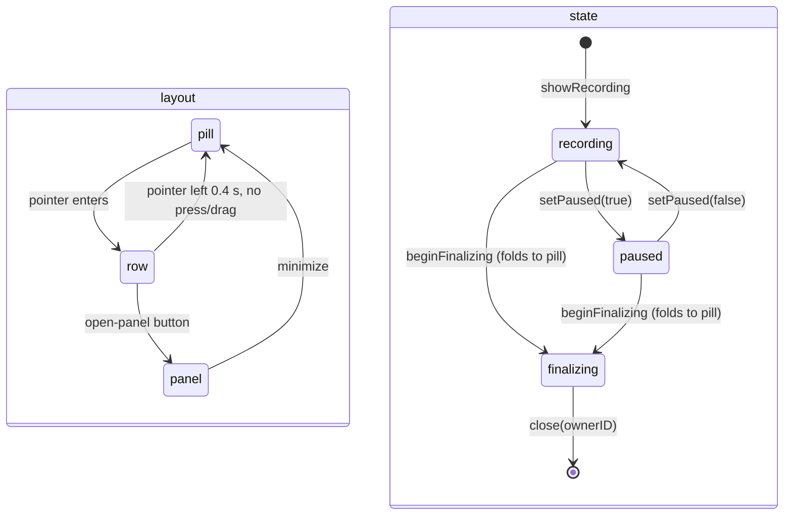
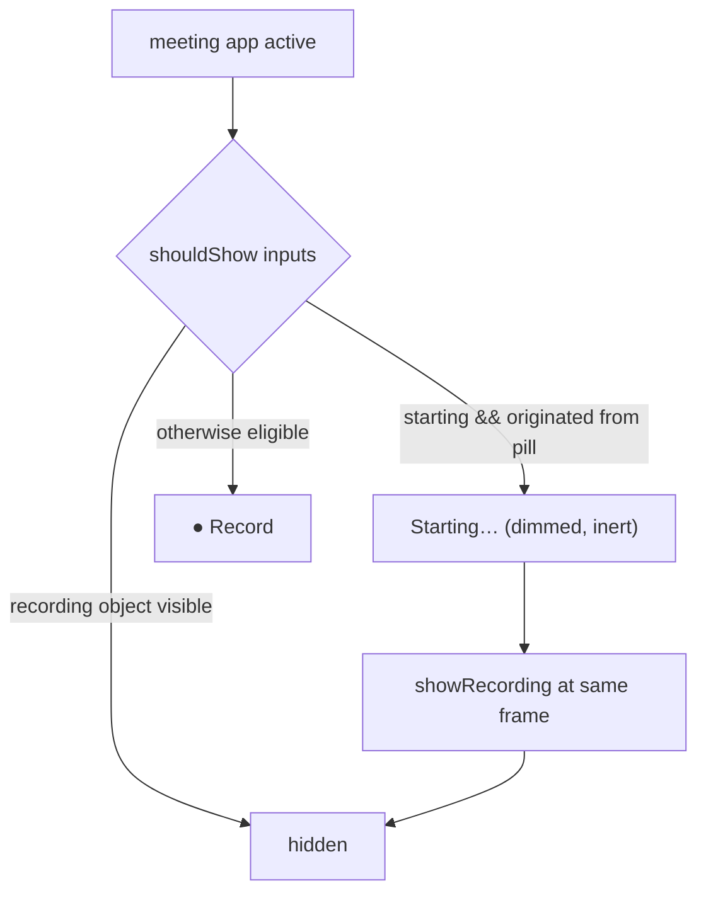

# Three-State Meeting Panel - Plan

## Goal Capsule

- **Objective:** Merge the meeting recording capsule and the floating transcript panel into one 22 pt-based Contextual Spark glass object with three sizes — a pill (recording dot + live clock), a hover row (wave, pause/resume, stop, open-panel), and a sticky panel (the row as header + Transcript · Chat · My notes body) — anchored at one position, remembered across recordings, handed off in place from the Record pill, and redesigned in the Mini's visual language.
- **Product authority:** Art-direction node `merged-panel-three-states-17` (`docs/art-direction/muesli-mini-indicator/merged-panel-three-states-17.html`) governs sizes, palette, states, and interaction; `docs/plans/2026-08-19-001-feat-contextual-dictation-mini-plan.md` governs the dictation/meeting surface boundary this plan must not cross.
- **Open blockers:** None. The Dictation Mini stays untouched by this plan; its code-review fixes are landing in a separate stream on this branch (commits `43f71ca5`, `95ca8d4c`), so U1 starts after that stream settles.
- **Execution profile:** Eight dependency-ordered units: shared primitives and CI guard, persistence, three-layout geometry and hover interaction, pill/row chrome and accessibility, panel layout with the transcript body, Record-pill hand-off continuity, device QA, then docs and CHANGELOG from the device evidence.
- **Stop conditions:** Stop if the merged object cannot keep pause, stop, discard, and the transcript reachable in every size; if the panel's focus rules (key only on demand, keystrokes stay with the call) cannot be preserved inside one window; or if the Dictation Mini's behaviour or tests must change beyond extracting shared primitives.
- **Tail ownership:** The implementation owner carries the work through focused and full native tests, the CI shard guard, a dev-lane build with live AppKit validation, code review, PR delivery, and CI resolution.

---

## Product Contract

### Summary

One glass object replaces two: at rest it is the Record pill with a live clock; on hover it unfolds into a row with the wave, pause/resume, stop, and one button that opens the panel; the panel keeps that row as its header, adds the tab strip (Transcript · Chat · My notes · Live/Paused · copy) and the existing feed, chat, and notes body, and folds back to the pill from a minimize button. One anchor, one remembered choice, no second window.

### Problem Frame

The previous slice split dictation feedback from meeting controls but kept two meeting windows with two visual languages: a 224 × 46 blue-black HUD bar for controls and a 360 × 320 transcript panel with its own saved origin, hover rule, and dismiss button, beside a 72 × 22 warm glass Record pill and a 14–22 pt warm glass Mini. The bar cannot be minimized, the transcript panel has to be found and placed separately, and the Record → bar hand-off changes size at the saved spot. The user asked for one object that minimizes to the recording time, expands on hover to the controls, and converts into the full panel — redesigned in this phase.

### Key Decisions

- **One object, three sizes, one window.** Pill, row, and panel are layouts of one `NSPanel`; the separate transcript window and its saved origin are retired. (session-settled: user-directed — chosen over keeping the capsule and the transcript panel as two windows: the user asked to merge them so there is one position and one object.) Governs R1–R4, R7, R14.
- **Hover opens the row; a button opens the panel.** The row appears on hover and folds back when the pointer leaves; only the open-panel button opens the panel, so a stray hover never covers the call. (session-settled: user-directed — chosen over the proposed click-to-expand row: the user asked for expand-on-hover with an icon that converts the row into the panel.) Governs R2, R3.
- **Minimized keeps the clock.** The pill shows the live clock, not a bare dot. (session-settled: user-approved — proposed with the bare-dot alternative surfaced; the user kept it "as you designed it".) Governs R1.
- **The base pill frame is the canonical anchor.** `meeting_recording_panel_center` keeps meaning "the 72 pt pill's center"; every other size derives from it, the held corner is chosen once per recording, and the pill's dot + clock never move when the row unfolds. Chosen over saving whichever size was dragged, which re-centres the pill after an edge-clamped expand (the inward-drift class already fixed once in `CHANGELOG.md`), and over re-deriving the corner on every reopen, which jumps a dragged panel across the display. Governs R4.
- **Remembered panel, entry point decides the first time.** `meeting_panel_open: Bool?` — `nil` keeps today's entry-point behaviour (pill, hotkey, status bar open the panel; calendar and auto-detect do not); after the first user toggle the last choice wins for every start that can present the floating object; starts that open the meeting document (`foregroundNotes`: Quick Note, Join & Record, calendar menu items) always rest as the pill. Chosen over per-entry-point memory (two preferences to explain for one object) and session-only memory (re-opening the panel every call). Governs R5.
- **The hand-off never leaves an empty spot.** A pill-originated start shows the Record pill dimmed as "Starting…" until capture is live; the Record pill stays hidden while the object is on screen, including finalizing. Chosen over a panel "starting" state because the panel must keep appearing only after capture is live. Governs R15, R16.
- **Dictation Mini behaviour is untouched.** Only glass, palette, and wave primitives are extracted; the surfaces still share no state. Governs R11, R18.

### Requirements

**Three-size object**

- R1. Pill: 72 × 22 pt, 8 pt coral dot with 3 pt amber core at x = 9, the clock in 11 pt semibold tabular digits at 92 % ink; `h:mm:ss` widens the pill once to 86 pt at the first hour and it stays there while recording or paused; the widened pill derives from the base pill and holds the pill's held edge.
- R2. Row: 196 × 22 pt (210 × 22 after the hour step, same held edge) — dot + clock, a 48 pt wave slot, pause/resume, stop, and an open-panel button (24 pt hit boxes, 10 pt semibold SF Symbols at 86 % ink); it opens when the pointer enters the pill and folds back 0.4 s after the pointer leaves unless a press or drag holds it; the pill's dot + clock stay in place and the controls unfold on the side with room (trailing by default, leading in mirrored order when the pill sits against the right edge), so no control appears under the resting pointer; after a minimize or the finalizing fold, hover is suppressed until the pointer leaves the pill once; a hover never opens the panel.
- R3. Panel: 360 × 320 pt default, resizable from 360 × 240 — a 30 pt header (dot + clock, the spark wave stretched across the free width and absorbing the hour step, then one trailing cluster pause · stop ‖ minimize behind a hairline), a 28 pt tab strip (Transcript · Chat · My notes, Live/Paused indicator, copy), and the body (live feed, chat, notes editor); it opens from the row's open-panel button, stays until minimized, drags by its header only (clicks inside the body never drag or discard), and hover does nothing while it is open.
- R4. The 72 pt base pill frame is the canonical anchor: the saved center is the base pill's center, never a widened or clamped frame's; the held corner is chosen when the object first shows (trailing edge held in the right half of the display, bottom edge held in the lower half) and kept for the recording across drags, minimize and reopen, re-chosen only when a derived row or panel would not fit 12 pt inside the display on that axis; row and panel extend from that corner, clamped 12 pt inside the pill's display; dragging any size moves the anchor by the pointer delta; resizing the panel keeps the held corner; minimizing returns to the anchor; display reconciliation keeps the anchor.
- R5. The open/minimized choice is remembered in `meeting_panel_open` (`Bool?`): `nil` → the start entry point's presentation decides; otherwise the remembered value, for starts whose presentation can present the floating object (`floatingPanel`/`compactControl`, `backgroundPill`); `foregroundNotes` starts always rest as the pill; the key is written only by a user-initiated open or minimize (row open-panel button, header minimize, status-bar Open/Minimize Meeting Panel) — the start-time presentation resolved from `nil`, the finalizing fold, discard and close never write it.
- R6. Size changes animate the window frame over 0.16 s ease-out with content fading in after the frame; Reduce Motion makes them instant; hover still works under Reduce Motion.

**States**

- R7. Recording: the dot halo breathes on a 1.6 s cycle, the clock runs, the wave is live in row and panel header.
- R8. Paused: amber still dot; clock frozen at 70 % ink; the wave slot reads "Paused" in row and panel header; the pause button shows the play glyph; the panel's Live indicator reads "Paused"; pause from the status bar mirrors in every size.
- R9. Finalizing: the object folds to the pill; the dot pulses amber on a 0.9 s cycle; in the pill the status word (Finalizing, Transcribing, Cleaning, Titling, Summarizing; amber, 10 pt) replaces the clock and the pill widens once to fit the widest word, holding the held edge; in the row the clock stays at 70 % ink and the status word fills the wave slot; pause, stop and open-panel are disabled at 36 %; hover still opens the row; the panel cannot open; the object closes when the meeting is saved.
- R10. Status bar "Pause/Resume", "Stop", "Discard" keep working in every size; "Show/Hide Live Transcript" becomes "Open/Minimize Meeting Panel".

**Visual language**

- R11. Every size uses the Contextual Spark glass (`#211f1e` at 62 %, 1 pt 16 % white edge, radius 11 for pill/row and 14 for the panel, compositor shadow, coral/amber/ink palette) and the Mini's seeded spark wave engine; the panel body restyles the tab strip and the feed (coral "You", 92 % ink "Others", 10 pt speaker labels) in the same palette; the legacy `FloatingMeetingPanelSurfaceStyle` look, the 224 × 46 bar, and the separate transcript window are retired.

**Panel behaviour carried over**

- R12. Tab switching, copy of the visible tab's payload, the notes editor writing through to the meeting, chat with the live transcript, and "open notes" from the feed keep working as they do in the current transcript panel, with the same availability gating (Chat hidden without a usable chat backend, My notes hidden without meeting context); the selected tab, transcript, chat context, notes draft and copy payload survive open, minimize, reopen and the finalizing fold within one recording.
- R13. Focus rules are preserved inside the merged window: the window never becomes key on its own (`orderFront`, never `makeKey`); Chat and My notes take key focus explicitly when selected and release it when left; an outside click while Chat is open closes Chat, while My notes is open hands the keyboard back; the key-release bounce window is kept; minimizing releases focus first.
- R14. The retired `meeting_panel_origin`, the "Show transcript on hover" switch, and the transcript dismiss chevron are removed; their legacy config keys are ignored on load and not migrated — the first post-upgrade panel derives from the pill anchor (`meeting_recording_panel_center`), and the CHANGELOG says so.

**Hand-off and Record pill**

- R15. A start that originates from the Record pill shows the pill as "Starting…" (dimmed, inert, same frame) until capture is live, then the recording pill appears at the same frame; start failure restores the Record pill.
- R16. The Record pill is hidden while the object is on screen, including finalizing, and re-syncs when the object closes.

**Accessibility**

- R17. Pill: one accessibility button labelled "Meeting recording, ‹clock›, ‹recording|paused|status›" with custom actions Open panel, Pause/Resume, Stop; row and panel: a group whose buttons are labelled, with key order pause → stop → open-panel (row) or pause → stop → minimize → tabs → copy (panel); pause, resume, finalizing, panel opened and minimized are announced once; Reduce Transparency paints an opaque `#211f1e`; Increase Contrast uses a 2 pt 82 % edge; Reduce Motion stops pulse, morph and live wave motion — in every size, re-applied on the accessibility display-options notification.

**Boundaries**

- R18. The Dictation Mini's behaviour, sizes, and tests do not change; extracted primitives keep `DictationMiniIndicatorTests` green.

### Key Flows

- F1. Record pill → object
  - **Trigger:** The user clicks the Record pill while a meeting app is active.
  - **Steps:** Pill shows "Starting…" → capture live → the object appears at the pill frame; if `meeting_panel_open` is `nil` and the entry point is pill/hotkey/status bar, the panel opens; otherwise the pill rests.
  - **Covered by:** R4, R5, R15, R16
- F2. Hover, act, open, minimize
  - **Trigger:** The pointer enters the pill.
  - **Steps:** Row unfolds toward the nearest corner → user pauses/resumes or stops, or clicks open-panel → panel unfolds from the same corner and stays → user reads the transcript, types notes, or chats → user clicks minimize → pill returns to the anchor → choice saved; leaving the row without clicking folds it back after 0.4 s.
  - **Covered by:** R2, R3, R4, R5, R6, R12, R13
- F3. Stop → finalizing → close
  - **Trigger:** Stop from the row, the panel header, the status bar, a notification, auto-stop, or the 3 h limit.
  - **Steps:** Focus released, object folds to the pill with the status word, controls disable → status advances → object closes → Record pill policy re-syncs.
  - **Covered by:** R9, R13, R16

### Acceptance Examples

- AE1. Covers R2, R4. Given the pill sits 12 pt from the right and bottom edges, when the pointer enters, then the dot and clock keep their frame and the controls unfold to their left, the row's trailing edge staying 12 pt from the right edge; when the user opens the panel, then its bottom-right corner stays where the pill's was; when the user minimizes, then the pill returns to its original frame.
- AE2. Covers R5. Given `meeting_panel_open` is absent and recording starts from the Record pill, then the panel opens and the key stays absent; given the user minimized it during that recording, when the next recording starts from a calendar notification, then the object rests as the pill; given the user then opens the panel and the call ends with it open (finalizing fold), when the next recording starts from the hotkey or a detection prompt, then the panel opens; when the next recording starts from Quick Note or Join & Record (the meeting document opens), then the object rests as the pill.
- AE3. Covers R2. Given the row is open, when the pointer leaves for 0.3 s and returns, then the row stays; when the pointer leaves for 0.5 s, then the pill is back; given the pointer leaves during a drag, then the row stays until the drag ends.
- AE4. Covers R8, R10. Given the object is the pill, when the user picks "Pause Meeting Recording" in the status bar, then the pill shows an amber still dot and a frozen clock; hovering shows "Paused" and the play glyph; opening the panel shows "Paused" in the tab strip.
- AE5. Covers R13. Given the panel is open on My notes and the user is typing, when the user clicks into Zoom, then the keyboard goes to Zoom and the panel stays open; given Chat is open, when the user clicks into Zoom, then Chat closes and the panel stays open on Transcript.
- AE6. Covers R9. Given the panel is open, when the user stops the recording, then the object folds to the pill reading "Transcribing", hovering shows the row with disabled controls, and open-panel does nothing.
- AE7. Covers R15, R16. Given the user clicks the Record pill, when capture takes two seconds to start, then the pill reads "Starting…" and is inert; given a meeting is finalizing, when the detector re-emits the meeting app as a candidate, then no Record pill appears over the finalizing pill.
- AE8. Covers R17. Given VoiceOver is on and the object is the pill, when the cursor lands on it, then VoiceOver reads one button with the clock and state and offers Open panel, Pause, Stop as custom actions.
- AE9. Covers R1, R2. Given elapsed time reaches 1:00:00 while recording, then the pill widens once to 86 pt and the row to 210 pt keeping the held edge, and neither changes width again while recording or paused; given finalizing begins, then the pill widens once more to fit "Transcribing"/"Summarizing" without clipping, keeping the held edge.
- AE10. Covers R4. Given the panel is open and the user drags it across the display midline, when the user minimizes and reopens it, then it reopens at the same frame (the held corner did not change).
- AE11. Covers R17. Given VoiceOver is on, when the row is open, then it reads as a group with pause, stop and open-panel in that order; when the panel is open, then minimize, the tabs and copy follow in order; given Reduce Transparency, Increase Contrast or Reduce Motion is toggled mid-recording, then every size re-applies within one redraw.
- AE12. Covers R15. Given the user clicks the Record pill and capture fails to start while the meeting app is still active, then the "Starting…" pill returns to "Record" at the same frame, is clickable again, and no recording object is visible; given the meeting app went away during that start, then no Record pill returns.

### Success Criteria

- A meeting recording shows at most one floating object for its whole lifetime, at the spot the user chose, readable at 1× and 2×.
- Pause/resume, stop, and the recording time are reachable from a hover; the transcript from one click.
- Typing in the meeting app is never interrupted by the object: hovering, opening, minimizing, or dragging it leaves the keyboard with the call.
- `swift test --package-path native/MuesliNative` and `./scripts/test_ci_test_shards.sh` pass; `DictationMiniIndicatorTests` is unchanged.

### Scope Boundaries

#### Included

- The three-size object (all layouts, all states), geometry and persistence, the panel body migration and restyle, focus rules, retired settings and menu rename, Record-pill hand-off continuity, accessibility, shared primitive extraction, art-direction node, CHANGELOG.

#### Deferred to Follow-Up Work

- Fixed-width pills (both at 86 pt) instead of the one-time hour step, if the step reads badly in use.
- A pause/resume hotkey (today the meeting hotkey only starts/stops).
- A keyboard shortcut to open/minimize the panel.
- The pending Dictation Mini code-review fixes (AX polling cost, stale idle dot, dead parameters) — separate stream.
- Auto-minimize after inactivity and hover-opens-panel — rejected for now, revisit only with live evidence.
- A one-time row "peek" (unfold ~1.5 s, fold back) the first time the object rests as a pill on a device, to teach that controls live behind the hover — revisit if first-run discoverability shows up in dogfooding.

#### Outside This Product Slice

- New panel features (bookmarks, highlights, summaries while recording).
- Changing the Dictation Mini's behaviour or the status-bar menu structure beyond the one rename.

### Sources / Research

- `native/MuesliNative/Sources/MuesliNativeApp/MeetingRecordingPanelController.swift` — current states, 30 Hz timer, `resolvedFrame`/`clampedDragOrigin`/`clampedFrame`, transcript ownership, hitTest routing, drag threshold.
- `native/MuesliNative/Sources/MuesliNativeApp/FloatingMeetingTranscriptPanel.swift` — `FloatingMeetingTranscriptModel`, tabs, copy, notes/chat, `show(beside:in:)` placement, `orderFront` never `makeKey`, `selectTab` focus rules, outside-click monitor, key-release bounce window, `.resizable` borderless panel with `contentMinSize`.
- `native/MuesliNative/Sources/MuesliNativeApp/MeetingRecordButtonController.swift` — 72 × 22 glass pill, `MeetingRecordButtonPolicy`, decor-view-above-glass, click-vs-drag handling.
- `native/MuesliNative/Sources/MuesliNativeApp/DictationMiniIndicatorController.swift` — `DictationMiniPalette`, `DictationMiniRendering`, `DictationMiniSpikeEngine`, private `DictationMiniWaveformView`, morph via `NSAnimationContext`, Reduce Motion gating, accessibility sink.
- `native/MuesliNative/Sources/MuesliNativeApp/MuesliController.swift` — `startMeetingRecording` sets `isStartingMeetingRecording` before the async start; `showRecording` only after `meetingSession.start()`; `syncMeetingRecordButton`; `updateConfig` → `applyConfiguration`; `updateMeetingTranscript`, `setMeetingChatContext`, `toggleMeetingTranscriptPanel`; finalizing status words; `MeetingStartPresentation`.
- `native/MuesliNative/Sources/MuesliNativeApp/StatusBarController.swift` — Pause/Resume, Show/Hide Live Transcript, Stop, Discard items.
- `native/MuesliNative/Sources/MuesliNativeApp/Models.swift`, `SettingsView.swift` — `AppConfig` keys and custom `init(from:)` (encoding is synthesized; optionals encode with `encodeIfPresent`), the "Show transcript on hover" row; `Tests/MuesliTests/ModelsTests.swift` (`AppConfigTests`).
- `native/MuesliNative/Sources/MuesliNativeApp/LiveTranscriptView.swift`, `MeetingChatView.swift` — feed and chat views reused in the panel body.
- `scripts/run_ci_test_shard.sh`, `scripts/test_ci_test_shards.sh` — suite-to-shard registration; `MeetingRecordButtonTests` is currently unregistered.
- `CLAUDE.md` — NSHostingView sizing trap (`sizingOptions = []`), floating panel user-positioned note (superseded for the merged object by this plan), `CHANGELOG.md:125` inward-drift bug class.

---

## Planning Contract

### Key Technical Decisions

- KTD1. **One controller, three layouts.** `MeetingRecordingPanelController` owns one `NSPanel` and gains `layout: pill | row | panel` orthogonal to `state: hidden | recording | paused | finalizing`; the header (dot, clock, wave slot, pause, stop, open-panel) is one AppKit view reused by row and panel — in the panel the wave slot stretches to the free width and pause · stop move into a trailing cluster with minimize; the panel body is an `NSHostingView` (`sizingOptions = []`) below the header. Rationale: single-sourced ownerID guards, drag, persistence and close paths (Key Decision "one window"). Governs R1–R6.
- KTD2. **Geometry is pure and static.** `nonisolated static` helpers beside `resolvedFrame`: `pillFrame(anchorCenter:content:screens:)` (the base 72 pt frame plus derived widened frames), `heldCorner(for pill:, in screen:)` chosen once per recording and stored on the controller, `frame(for layout:, anchoredTo pill:, corner:, size:, screen:)`, `anchorCenter(afterDragging frame:, layout:, corner:, …)` returning the base pill center, and `pillSize(for content:)` where content is the clock (mm:ss / h:mm:ss) or a status word. Rationale: the panel reads `NSScreen.screens` directly; invariants must be testable like the existing geometry suite. Governs R4, R1.
- KTD3. **Morph by window-frame animation.** `NSAnimationContext.runAnimationGroup` with `panel.animator().setFrame` at `DictationMiniRendering.morphDuration`, ease-out, gated by `accessibilityDisplayShouldReduceMotion`; content fades via layer opacity after the frame; no layer transforms. Rationale: proven in the Mini; safe because no child window is involved. Governs R6, R17.
- KTD4. **Hover state machine with grace.** A tracking area on the content view opens the row on `mouseEntered`; `mouseExited` arms a 0.4 s timer that folds to the pill unless the pointer is inside, a press is down, a drag is live, or the layout is panel; after a minimize or the finalizing fold, hover is armed only once the pointer has left the pill; the row's controls unfold away from the pill (mirrored order on a leading unfold) and become hittable when the unfold completes; the grace timer is injectable for tests; Reduce Motion keeps the behaviour and drops the animation. Rationale: hover must never fight drag or the open-panel click, and a resting pointer must never land on Stop. Governs R2, R3.
- KTD5. **The panel body is the transcript panel's content, re-hosted.** Keep `FloatingMeetingTranscriptModel`, the feed/chat/notes views, copy and tab logic; move the tab strip into a Spark-styled header row below the AppKit header; retire the separate window, `show(beside:in:)` placement, and `meeting_panel_origin`. The focus rules (explicit key on Chat/Notes, release on leave, outside-click monitor, key-release bounce) move into a `MeetingPanelBodyCoordinator` owned by the merged controller. Rationale: behaviour the users rely on stays; only the window changes. Governs R3, R12, R13, R14.
- KTD6. **Resizable only as a panel.** Keep `.resizable` in the style mask (as the transcript panel does) and pin `contentMinSize == contentMaxSize` in the pill and row layouts, releasing to 360 × 240 minimum in the panel layout; the held corner is kept by re-anchoring after a resize ends; the pill and row are fixed-size. Rationale: a runtime style-mask toggle on a visible non-activating panel is the riskier path; pinning sizes avoids it. Governs R3, R4.
- KTD7. **Extract shared Contextual Spark primitives.** `ContextualSparkGlassSurface` (HUD material + decor tint above the glass + edge + continuous radius + accessibility refresh) and a hoisted, internal, parameterised `ContextualSparkWaveformView` driven by `DictationMiniSpikeEngine`; colours from `DictationMiniPalette`; `FloatingIndicatorSurfaceStyle.swift` stays for its other consumers (computer-use overlay, chat/live views). Governs R11, R18.
- KTD8. **Persist with a nullable key and a one-way apply.** `meeting_panel_open: Bool?` decoded with `try?` in the existing custom `init(from:)` so absence stays `nil`; encoding stays synthesized (`encodeIfPresent` omits `nil`); `applyConfiguration` updates only the preferred value for the next `showRecording`; `showRecording(…, presentation:)` resolves `nil` from `MeetingStartPresentation.presentsFloatingPanelWhenRecordingStarts` and forces the pill for `foregroundNotes`; the live layout is authoritative; only the user-initiated open/minimize paths call `onPanelOpenSaved` (routed to `updateConfig` like `onControlCenterSaved`) — the start-time resolution, finalizing fold, discard and close do not. `showMeetingTranscriptOnRecordingPanelHover` and `meetingPanelOrigin` are deleted with their `CodingKeys` cases (`JSONDecoder` ignores unknown keys, so old files still load; nothing is migrated; the Settings row goes). Governs R5, R14.
- KTD9. **Record pill policy becomes a presentation.** `MeetingRecordButtonPolicy` returns `hidden | record | starting` from the existing inputs plus `startOriginatedFromPill` and `isRecordingPanelVisible`; `syncMeetingRecordButton` passes `meetingRecordingPanel.isVisible` and re-syncs on close; "Starting…" renders the existing pill dimmed and inert. Governs R15, R16.
- KTD10. **One 30 Hz cadence; compositor pulse.** The existing timer drives clock, wave engine, and status; the dot pulse is a `CAAnimation`; dB mapping starts from the Mini's `recordingLevel` constants and is tuned on device. Governs R7, R11.
- KTD11. **Clock width steps once, in every size.** `pillSize(for content:)` returns 72 pt for mm:ss, 86 pt for h:mm:ss, and the fitted width for a finalizing status word; the row steps 196 → 210 pt and the panel header absorbs the step in its stretched wave; the held edge follows KTD2; fixed-width for both pills is the deferred alternative. Governs R1, R2, R3, R9.
- KTD12. **Accessibility follows layout.** Pill: content view role button with custom actions; row/panel: group with child buttons; `nextKeyView` rebuilt per layout; first responder released on minimize (and chat/notes focus released first, KTD5); announcements through an injected sink as in the Mini. Governs R17.
- KTD13. **Status bar wiring renames, selectors stay.** `toggleMeetingTranscriptPanel` keeps its selector and becomes "Open/Minimize Meeting Panel"; `MuesliController.updateMeetingTranscript`/`setMeetingChatContext` keep feeding the model through the merged controller. Governs R10, R12.

### Assumptions

- The Dictation Mini's behaviour is untouched in this slice; its code-review fixes are landing in a separate stream on this branch (commits `43f71ca5`, `95ca8d4c` touch `DictationMiniIndicatorController.swift`, the file U1 hoists the wave from), so U1 starts after that stream settles.
- The Record pill stays 72 pt; the recording pill matches it per clock format.
- Hover open is immediate (no enter delay) and the leave grace is 0.4 s; both are tuning constants.
- The panel default size stays 360 × 320 with the existing 360 × 240 minimum; the resized size is kept in memory for the recording, not persisted.
- Row and panel are allowed while finalizing only as disabled presentations (row yes, panel no); drag is allowed in every state.

### High-Level Technical Design

Layout and state are independent axes on one window:



Frame derivation from the anchor on every layout change:

```mermaid
flowchart TB
  A[anchor = base pill frame, held corner chosen once\ncenter saved as meeting_recording_panel_center] --> B{layout}
  B -->|pill| C[pill frame, width by pillSize(elapsed)]
  B -->|row| D[196 x 22 from the nearest corner]
  B -->|panel| E[panel size from the nearest corner]
  D --> F[clamp 12 pt inside the anchor's display]
  E --> F
  C --> G[animator().setFrame 0.16 s\nor instant under Reduce Motion]
  F --> G
  G --> H[drag: anchor += pointer delta, save anchor center\nresize: keep held corner, re-anchor]
```

Window composition in the panel layout:

```mermaid
flowchart TB
  W[NSPanel · non-activating · resizable only as panel] --> S[ContextualSparkGlassSurface]
  S --> H[AppKit header 30 pt\ndot · clock · stretched wave · pause · stop ‖ minimize]
  S --> T[tab strip 28 pt\nTranscript · Chat · My notes · Live/Paused · copy]
  S --> B[NSHostingView body, sizingOptions = []\nfeed · chat · notes]
  C[MeetingPanelBodyCoordinator\nkey on demand · outside-click · bounce release] --> T
  C --> B
```

Record pill presentation during the hand-off:



### Sequencing

1. U1 shared primitives and CI shard guard (unblocks U3, U4, U5).
2. U2 persistence and retired settings (unblocks U3, U5).
3. U3 three-layout geometry, hover, morph (unblocks U4, U5, U6).
4. U4 pill/row chrome, wave, accessibility.
5. U5 panel layout with the re-hosted body and focus rules; status bar rename.
6. U6 Record-pill hand-off continuity.
7. U8 device QA on the finished object.
8. U7 art-direction, CHANGELOG, CLAUDE.md note from the device evidence.

### Risks and Mitigations

- **Focus leaks inside one window:** the transcript panel's rules were built for its own window; moving them into the merged window must keep "never key unless Chat/Notes asks" — verify on device that hovering, clicking open-panel/minimize, and dragging never make the window key; if an `NSButton` does, handle it in the content view's mouseUp.
- **NSHostingView drives the window frame:** the body hosting view must set `sizingOptions = []` or the panel collapses/jumps (CLAUDE.md trap).
- **Inward drift at corners:** the anchor rule (KTD2) plus geometry tests at all four corners and three layouts; never save a derived, clamped frame's center.
- **Hover flicker at the fold boundary:** the 0.4 s grace and "pointer inside" check; the tracking area covers the whole content view in every layout.
- **Accidental Stop on a hover-revealed row:** controls unfold away from the pill and become hittable only after the unfold; Stop keeps its existing immediate semantics; watch for mis-stops in U8 before adding a confirmation.
- **Mini refactor collision:** the Mini review fixes are landing on this branch in the same file U1 hoists from; start U1 after that stream settles and rebase onto it.
- **Event routing under one content view:** the current `hitTest` returns only direct `NSButton` subviews and treats everything else as drag/discard surface; the header view and the hosted body need the deepest-descendant routing in U3/U5 or body clicks will drag and right-clicks in the notes editor will discard.
- **Drag during a morph:** a plain `setFrame` does not cancel an in-flight `animator().setFrame`; retarget through a zero-duration `NSAnimationContext` group when a drag begins, then set frames directly for the rest of the drag.
- **Resize semantics:** resizing from an edge must not move the anchor unexpectedly — re-anchor after the resize ends so minimizing returns to where the pill was.
- **Perceived darkness change:** the Spark tint sits above the glass; the panel reads darker than the old blue-black — intended, tuned on device against node 17.
- **CI shard guard:** any new suite must be added to the `meetings` array in `scripts/run_ci_test_shard.sh`; the guard already fails for `MeetingRecordButtonTests` on this branch.
- **Headless tests create real windows:** follow the existing lifecycle tests (ConfigStore in a temp dir, `now:` injection, `…ForTesting` accessors); assert frames through static helpers and `frameForTesting`; SwiftUI body tests stay at the model level (`FloatingMeetingChatTests`).

---

## Implementation Units

### U1. Extract Contextual Spark primitives and fix the CI shard guard

- **Goal:** Make the glass surface and the spark wave reusable by the merged object without changing the Mini; register `MeetingRecordButtonTests` in CI.
- **Requirements:** R11, R18; KTD7.
- **Dependencies:** None.
- **Files:**
  - `native/MuesliNative/Sources/MuesliNativeApp/ContextualSparkGlassSurface.swift` (new)
  - `native/MuesliNative/Sources/MuesliNativeApp/ContextualSparkWaveformView.swift` (new; hoisted from the Mini file)
  - `native/MuesliNative/Sources/MuesliNativeApp/DictationMiniIndicatorController.swift` (use the extracted types; no behaviour change)
  - `native/MuesliNative/Sources/MuesliNativeApp/MeetingRecordButtonController.swift` (adopt the glass surface)
  - `scripts/run_ci_test_shard.sh` (add `MeetingRecordButtonTests` to `meetings`)
  - `native/MuesliNative/Tests/MuesliTests/DictationMiniIndicatorTests.swift`, `MeetingRecordButtonTests.swift` (unchanged regression nets)
- **Approach:**
  1. Move the glass recipe (HUD material, decor tint layer above the glass, edge, continuous radius, Reduce Transparency / Increase Contrast refresh) into `ContextualSparkGlassSurface`, parameterised by tint alpha and radius.
  2. Hoist `DictationMiniWaveformView` to an internal `ContextualSparkWaveformView` with bar count and max height as parameters; keep `DictationMiniSpikeEngine` and `DictationMiniRendering` constants as inputs.
  3. Re-point the Mini and the Record pill to the extracted types; keep the Mini's sizes, tints and tests identical.
  4. Register the pill suite in the `meetings` shard.
- **Execution note:** Characterization first — run the Mini and pill suites before and after; visual parity of the Mini and the pill on a dev build is the proof.
- **Patterns to follow:** The decor-view-above-glass comment in `MeetingRecordButtonController.makePanel()`; `NSColor.colorWith(hex:alpha:)` in `NSColorHex.swift`.
- **Test scenarios:**
  - Existing Mini palette and wave assertions pass unchanged.
  - Existing pill lifecycle and palette assertions pass unchanged.
  - `scripts/test_ci_test_shards.sh` reports no unassigned suites.
- **Verification:** Full native test run green; shard guard green; Mini and Record pill look identical at 2× on a dev lane.

### U2. Persist the remembered panel choice and retire the old keys

- **Goal:** Add `meeting_panel_open`, stop using `meeting_panel_origin` and the hover switch, and thread the preferred value to the controller and back.
- **Requirements:** R5, R14; KTD8; AE2.
- **Dependencies:** None.
- **Files:**
  - `native/MuesliNative/Sources/MuesliNativeApp/Models.swift` (new property and key in the custom `init(from:)`; the two legacy properties and their `CodingKeys` cases deleted — encoding stays synthesized)
  - `native/MuesliNative/Sources/MuesliNativeApp/SettingsView.swift` (remove the "Show transcript on hover" row)
  - `native/MuesliNative/Sources/MuesliNativeApp/MuesliController.swift` (`onPanelOpenSaved` → `updateConfig`; pass the preferred value and the entry point's presentation into `showRecording`; drop the `meetingPanelOrigin` save closure)
  - `native/MuesliNative/Sources/MuesliNativeApp/MeetingRecordingPanelController.swift` (`applyConfiguration`, `onPanelOpenSaved`, preferred-open field)
  - `native/MuesliNative/Tests/MuesliTests/ModelsTests.swift` (add the new key to defaults/round-trip/snake_case; drop the `showMeetingTranscriptOnRecordingPanelHover` and `meetingPanelOrigin` assertions), `QoLTests.swift` (retire the hover-setting round-trip tests that reference the deleted property), `MeetingRecordingPanelTests.swift`
- **Approach:**
  1. Add `var meetingPanelOpen: Bool? = nil` with snake_case key; decode with `try?` in the existing custom `init(from:)`; rely on the synthesized encoder (`encodeIfPresent` omits `nil`); delete `meetingPanelOrigin` and `showMeetingTranscriptOnRecordingPanelHover` with their `CodingKeys` cases — `JSONDecoder` ignores the unknown legacy keys, nothing is migrated.
  2. `applyConfiguration` stores the preferred value only; `showRecording(…, presentation:)` resolves `nil` from the presentation (`foregroundNotes` always rests as the pill); only the user-initiated open/minimize paths call `onPanelOpenSaved(Bool)` — finalizing fold, discard and close do not.
  3. `MuesliController` routes `onPanelOpenSaved` to `updateConfig`, next to `onControlCenterSaved`; `showFloatingPanelWhenActive` becomes the entry-point flag passed through.
- **Patterns to follow:** `meetingRecordingPanelCenter` plumbing; the `showMeetingRecordButton` Settings row for removal symmetry.
- **Test scenarios:**
  - Default config decodes with `meetingPanelOpen == nil`; JSON without the key → `nil`; with `false` → `false`; JSON carrying `meeting_panel_origin` and `show_meeting_transcript_on_recording_panel_hover` still decodes and neither value is reachable.
  - Round-trip encodes `meeting_panel_open` when set, omits it when `nil`, and never encodes the retired keys; the retired-key assertions in `ModelsTests` and `QoLTests` are removed so the test target compiles.
  - Covers AE2. Preferred `nil` + `floatingPanel` presentation → panel and no `onPanelOpenSaved` call; preferred `nil` + `backgroundPill` → pill; preferred `false` + `floatingPanel` → pill; preferred `true` + `backgroundPill` → panel; preferred `true` + `foregroundNotes` → pill; a user toggle during a recording survives an `applyConfiguration` re-entry.
  - Finalizing fold, discard and close with the panel open → `onPanelOpenSaved` not called; the preferred value is unchanged.
- **Verification:** `ModelsTests` and the panel lifecycle suite green.

### U3. Three-layout geometry, hover, and morph

- **Goal:** Give the controller the pill/row/panel layouts anchored to the pill frame, the hover state machine, open/minimize transitions, drag in every size, and the frame morph.
- **Requirements:** R1, R2, R3 (frame and transitions only), R4, R6; KTD1, KTD2, KTD3, KTD4, KTD6, KTD11; AE1, AE3, AE9.
- **Dependencies:** U1, U2.
- **Files:**
  - `native/MuesliNative/Sources/MuesliNativeApp/MeetingRecordingPanelController.swift` (layout axis, static geometry helpers, hover tracking and grace timer, open/minimize, drag anchor, resizable toggle, morph)
  - `native/MuesliNative/Sources/MuesliNativeApp/MeetingRecordButtonController.swift` (share the pill size constants)
  - `native/MuesliNative/Tests/MuesliTests/MeetingRecordingPanelTests.swift` (geometry and lifecycle)
- **Approach:**
  1. Add the `layout` axis and the static helpers from KTD2; sizes: pill 72 × 22 / 86 × 22 / fitted status width, row 196 × 22 / 210 × 22, panel 360 × 320 (min 360 × 240); radii 11 / 11 / 14; the held corner is chosen on first show and stored for the recording.
  2. Hover per KTD4: tracking area over the content view; enter → row (controls unfold away from the pill, mirrored on a leading unfold, hittable after the unfold); leave → 0.4 s grace → pill; press/drag holds; panel ignores hover; hover re-arms only after the pointer has left the pill following a minimize or the finalizing fold; the grace timer is injectable (`fireHoverGraceForTesting` or a scheduler parameter).
  3. Open-panel → panel layout, sticky, `onPanelOpenSaved(true)`; minimize → pill, `onPanelOpenSaved(false)`; `contentMinSize`/`contentMaxSize` pinned in pill/row and released in panel (KTD6); re-anchor after a resize ends.
  4. Event routing: `MeetingRecordingPanelContentView.hitTest` returns the deepest hit descendant for header controls and for any point inside the hosted body, and `self` only for the remaining pill/header surface; drag (6 pt threshold) and ⌥/right-click discard are scoped to that surface; `onDiscard` carries the panel's `ownerID` and `MuesliController` confirms against the active meeting only while that owner is still the active recording — a confirmation left open while that meeting stops or finalizes is invalidated, never applied to a newer recording; drag in every layout moves the anchor by the pointer delta; drop saves the base pill center.
  5. Frames derive from the anchor and the stored corner and clamp; animate per KTD3; a drag that begins mid-morph retargets through a zero-duration animation group, then sets frames directly.
  6. Clock width steps at one hour per KTD11 in pill and row keeping the held edge; the finalizing status width comes from the same helper; display reconciliation re-derives from the anchor and the stored corner.
- **Execution note:** Write the geometry tests for the static helpers first (four corners, three layouts, negative-origin display) — they pin the inward-drift class before the controller is touched.
- **Patterns to follow:** `resolvedFrame`/`clampedDragOrigin` and their tests; the pill's tracking-area and hover handling; `DictationMiniIndicatorController.present()` morph block.
- **Test scenarios:**
  - Covers AE1. Pill 12 pt from the right and bottom edges → row maxX equals the pill maxX, the dot + clock keep their frame and the controls sit to their left; panel maxX and minY equal the pill's; minimize returns the exact pill frame.
  - Pill at the top-left → row and panel extend trailing and downward with minX and maxY held.
  - Negative-origin display → frames stay inside that display's visible frame.
  - Covers AE9. `pillSize` for mm:ss is 72 pt, for h:mm:ss 86 pt, for each finalizing status word a width that fits it without clipping; the held edge is preserved across every step; the row is 196 pt then 210 pt.
  - Covers AE10. Drag the open panel from the bottom-right to the top-left, minimize, reopen → identical panel frame; the stored corner is unchanged; the saved center equals the base pill center, not the panel's midpoint.
  - Resizing the panel from the free edges keeps the held corner; the anchor is re-derived after the resize ends.
  - Covers AE3. `pointerEntered` → row; `pointerExited` then 0.3 s (injected grace) → still row; 0.5 s → pill; exit during a drag → row until the drag ends; `pointerEntered` while panel → no change; after minimize with the pointer still inside → no row until an exit then an enter.
  - A pointer interaction inside the hosted body rect neither starts a drag nor calls `onDiscard`; a click on a header button reaches the button.
  - `onDiscard` delivers the current `ownerID`; a discard confirmed after that owner stopped (or after a newer recording started) is ignored and the newer recording is untouched.
  - Open-panel action → panel and `onPanelOpenSaved(true)` once; minimize → pill and `onPanelOpenSaved(false)` once.
  - Reduce Motion → frame changes without animation (final frame immediately).
- **Verification:** Geometry and lifecycle suites green; on a dev lane, hovering at the bottom-right corner unfolds leftward, the panel opens with its corner held, and minimize returns to the same pill frame.

### U4. Pill and row chrome, wave, and accessibility

- **Goal:** Render recording, paused, and finalizing in the pill and the row (and therefore the panel header) in the Contextual Spark language, with the spark wave, status words, VoiceOver roles, focus chain, and accessibility display options.
- **Requirements:** R7, R8, R9, R11, R17; KTD10, KTD12; AE4, AE6, AE8.
- **Dependencies:** U1, U3.
- **Files:**
  - `native/MuesliNative/Sources/MuesliNativeApp/MeetingRecordingPanelController.swift` (header view, dot layers and pulse, clock, wave/status slot, button states, accessibility)
  - `native/MuesliNative/Sources/MuesliNativeApp/MuesliController.swift` (inject the accessibility sink)
  - `native/MuesliNative/Tests/MuesliTests/MeetingRecordingPanelTests.swift`
- **Approach:**
  1. Dot: coral with amber core; `CAAnimation` halo breathing 1.6 s while recording; amber still when paused; amber 0.9 s pulse when finalizing; static under Reduce Motion.
  2. Clock: 11 pt semibold tabular digits, 92 % ink; 70 % when paused, and when finalizing in the row/header; driven by the existing 30 Hz timer.
  3. Wave slot: `ContextualSparkWaveformView` fed from the power provider at 30 Hz; "Paused" or the status word replaces it; in the pill the finalizing status word (amber, 10 pt) replaces the clock and the pill takes the fitted width from `pillSize(for content:)`.
  4. Buttons: pause/play glyph swap, stop, open-panel (row) or minimize (panel header); pause/stop/open-panel disabled at 36 % while finalizing; finalizing folds to the pill and blocks the panel.
  5. Accessibility per KTD12: role switch by layout, custom actions on the pill, labels with clock and state, key chain rebuild, announcements for pause, resume, finalizing, panel opened, minimized; re-apply glass/contrast/motion on the display-options notification.
- **Patterns to follow:** `updateChrome()` and `configuredSymbol` in the current controller; `accessibilitySink` and `refreshAccessibilityPresentation()` in the Mini.
- **Test scenarios:**
  - Covers AE4. `setPaused(true)` while pill → label contains "paused" and the clock stops advancing; row → pause button label "Resume meeting recording".
  - Covers AE6. `beginFinalizing` while panel → layout becomes pill; pause, stop, open-panel disabled; label carries the status word; `updateFinalizingStatus("Summarizing")` updates pill and row; open-panel action is a no-op.
  - Covers AE8. Pill → content view role button with custom actions Open panel, Pause, Stop; row → role group and `controlAccessibilityLabelsForTesting` lists pause, stop, open panel.
  - Announcements: exactly one for pause, resume, finalizing, panel opened, minimized; none for hover.
  - Reduce Transparency → glass hidden and tint opaque; Increase Contrast → 2 pt edge — via the surface's testing accessors.
- **Verification:** Lifecycle suite green; on a dev lane the paused and finalizing presentations match node 17 at 1× and 2×, and the wave reads as the Mini's.

### U5. Panel layout with the re-hosted transcript body and focus rules

- **Goal:** Make the panel layout carry the tab strip and the existing feed, chat, and notes body inside the merged window, restyled, with the transcript panel's focus rules preserved; retire the separate transcript window; rename the status bar item.
- **Requirements:** R3, R10, R11, R12, R13, R14; KTD1, KTD5, KTD6, KTD13; AE5.
- **Dependencies:** U2, U3, U4.
- **Files:**
  - `native/MuesliNative/Sources/MuesliNativeApp/FloatingMeetingTranscriptPanel.swift` (keep `FloatingMeetingTranscriptModel`, `FloatingMeetingChatContext`, `FloatingMeetingPanelTab`; remove the window controller, placement, and `show(beside:in:)`)
  - `native/MuesliNative/Sources/MuesliNativeApp/MeetingPanelBody.swift` (new: the SwiftUI tab strip + feed/chat/notes body) and `MeetingPanelBodyCoordinator.swift` (new: focus rules moved from the old controller)
  - `scripts/run_ci_test_shard.sh` (remove `FloatingMeetingTranscriptPlacementTests` from the `core` shard where it is registered; register any new body/coordinator suite under `meetings`; then `./scripts/test_ci_test_shards.sh` must pass)
  - `native/MuesliNative/Sources/MuesliNativeApp/MeetingRecordingPanelController.swift` (host the tab strip and body under the header in the panel layout; `updateMeetingTranscript`, `setMeetingChatContext`, `toggleTranscriptPanel` → open/minimize)
  - `native/MuesliNative/Sources/MuesliNativeApp/MuesliController.swift` (wiring: transcript/chat context feed, open notes, status bar action)
  - `native/MuesliNative/Sources/MuesliNativeApp/StatusBarController.swift` (item title "Open/Minimize Meeting Panel")
  - `native/MuesliNative/Sources/MuesliNativeApp/LiveTranscriptView.swift` (floating-panel presentation colours: coral You, ink Others)
  - `native/MuesliNative/Tests/MuesliTests/FloatingMeetingTranscriptPlacementTests.swift` (retire placement tests; keep or move any model tests), `QoLTests.swift` (the test that instantiates `FloatingMeetingTranscriptPanelController` moves to the merged controller or is retired)
  - `native/MuesliNative/Tests/MuesliTests/FloatingMeetingChatTests.swift`, `MeetingRecordingPanelTests.swift`
- **Approach:**
  1. Extract the body (tab strip + feed/chat/notes + copy) into `MeetingPanelBody` hosted by a `FirstMouseHostingView` with `sizingOptions = []`, styled per node 17, keeping the current tab gating (Chat only with a usable backend, My notes only with meeting context); the tab strip replaces the old header; minimize lives in the AppKit header; the content view routes every point inside the body to the hosting view (U3 step 4), so body clicks never drag or discard.
  2. Move `selectTab`, `releaseChatFocus`, outside-click monitor, and the key-release bounce into `MeetingPanelBodyCoordinator`; the merged controller calls it on open, minimize, finalizing, and close so focus is always released before the body disappears.
  3. The merged window keeps `orderFront`/`orderFrontRegardless`, never `makeKey`; `becomesKeyOnlyIfNeeded` stays; Chat/Notes request key as today.
  4. `MuesliController`: `updateMeetingTranscript` and `setMeetingChatContext` feed the model through the merged controller; `toggleMeetingTranscriptPanel` opens/minimizes; "open notes" from the feed keeps opening the meeting; the status bar title reflects the layout.
  5. Delete the separate window path and the placement helper; keep `FloatingIndicatorSurfaceStyle.swift` for its other consumers.
- **Patterns to follow:** The current `FloatingMeetingTranscriptPanelController` focus comments and `selectTab`; `MeetingChatView` send-time resolvers note (do not re-resolve the transcript in `body`); CLAUDE.md NSHostingView note.
- **Test scenarios:**
  - Panel layout exposes the selected tab, copy availability, and notes draft through the model as today (`hasMeetingContextForTesting`, chat context preserved across `showRecording` — existing test).
  - Covers AE5. Selecting Notes arms the outside-click monitor and the window may become key; an outside click hands the keyboard back and keeps the panel open; selecting Chat then an outside click closes Chat and keeps the panel open on Transcript.
  - Minimize while Chat is open releases focus and closes Chat before the layout change; finalizing does the same.
  - `updateMeetingTranscript` while pill or row updates the model without opening the panel.
  - Selected tab, transcript, chat context, notes draft and visible-tab copy payload are identical before and after open → minimize → reopen, and after the finalizing fold the model still holds them until close.
  - Chat tab absent when no chat backend is configured; My notes absent without meeting context (the existing gating, now on the merged body).
  - Status bar item title is "Open Meeting Panel" while pill/row and "Minimize Meeting Panel" while panel.
- **Verification:** Chat and panel suites green; on a dev lane, typing in Zoom continues while the panel is open on Transcript, Notes takes keys only when clicked and hands them back on an outside click, and the panel resizes from its free edges without moving the held corner.

### U6. Record-pill hand-off continuity

- **Goal:** Never leave the saved spot empty during a pill-originated start, and never show the Record pill over the object.
- **Requirements:** R15, R16; KTD9; AE7.
- **Dependencies:** U3.
- **Files:**
  - `native/MuesliNative/Sources/MuesliNativeApp/MeetingRecordButtonController.swift` (`MeetingRecordButtonPolicy` presentation, "Starting…" chrome, inert handling)
  - `native/MuesliNative/Sources/MuesliNativeApp/MuesliController.swift` (`syncMeetingRecordButton` inputs, re-sync on close, start-origin flag)
  - `native/MuesliNative/Tests/MuesliTests/MeetingRecordButtonTests.swift`
- **Approach:**
  1. Policy returns `hidden | record | starting` with the two new inputs.
  2. "Starting…" reuses the pill's frame and glass, dims the dot and label, ignores clicks and drags, label "Starting meeting recording".
  3. `syncMeetingRecordButton` passes `meetingRecordingPanel.isVisible`; the object's close path triggers a re-sync.
  4. Start-origin flag: set in `recordFromMeetingRecordButton` before `startMeetingRecordingFromEntryPoint`; cleared when that call returns false and wherever `isStartingMeetingRecording` returns to false (`finishMeetingStartAttempt`, `cancelMeetingPreparation`).
  5. Start failure restores the Record pill for real: the failure/cancel paths currently clear the activity candidate in `disarmMeetingAutoStop()` before the re-sync, which would hide the pill for the detector's 15 s cooldown — on the start-failure/cancel path re-evaluate the detector's current candidate instead of clearing it, and show `record` again only while that candidate is still present; a candidate that disappeared or changed during the start is never restored from a snapshot.
- **Patterns to follow:** Existing `MeetingRecordButtonPolicy.shouldShow` and its tests; `applyChrome()` hover/pressed alpha handling.
- **Test scenarios:**
  - Policy: starting && from pill → `starting`; starting && not from pill → `hidden`; object visible → `hidden` even with a candidate; otherwise the existing truth table.
  - Covers AE7. `starting` ignores `pointerInteractionEnded(didDrag: false)` (no `onRecord`) and drags; label reads "Starting…".
  - `starting` → hidden when the object shows keeps the saved center unchanged.
  - Covers AE12. A failed or cancelled pill start while the meeting app is still active → `record` again at the same frame immediately (no 15 s gap) and actionable; the same failure after the candidate disappeared during the start → `hidden`, nothing restored from a snapshot; a non-pill start after a failed pill start shows no "Starting…".
- **Verification:** Pill suite green; on a dev lane the spot never goes empty between click and clock, and no Record pill appears during finalizing.

### U7. Art direction, docs, and CHANGELOG

- **Goal:** Record the design and the behaviour change where the project keeps them, from the device evidence.
- **Requirements:** R11, R14 (documentation of the retired pieces); supports all.
- **Dependencies:** U8.
- **Files:**
  - `docs/art-direction/muesli-mini-indicator/merged-panel-three-states-17.html`, `directions.json`, `feedback.md`, `gallery.html` (update with device-tuned values and the live-feedback entry)
  - `CHANGELOG.md` (Features bullet; fixes under Floating pill and panel)
  - `CLAUDE.md` (replace the "Floating transcript panel is user-positioned by design — do not re-attach it to the pill" note with the merged-object anchor rule; keep the NSHostingView note)
- **Approach:**
  1. Update node 17 with any values tuned on device; mark it `parent` once accepted and record the live feedback round.
  2. CHANGELOG: "Merged the meeting recording bar and the floating transcript panel into one three-size Contextual Spark object…" plus the Starting…/finalizing fixes and the retired settings.
  3. CLAUDE.md: the old two-window note is superseded; document the anchor rule and that the panel body hosting view sets `sizingOptions = []`.
- **Test scenarios:** Test expectation: none — documentation only.
- **Verification:** Node opens from `gallery.html`; CHANGELOG and CLAUDE.md entries present.

### U8. Device QA on a dev lane

- **Goal:** Prove what unit tests cannot: focus, hover feel, motion, corners, displays, resize, VoiceOver.
- **Requirements:** All; Success Criteria; AE11, AE12.
- **Dependencies:** U5, U6.
- **Files:** none (build via `./scripts/dev-test.sh --lane A`).
- **Approach:** Walk F1–F3 on a two-display setup: hover at all four corners of each display and confirm no control appears under the resting pointer; open the panel at the bottom-right and top-left; drag it across the midline, minimize, reopen; resize it from its free edges and minimize; drag mid-morph; type in Zoom while hovering, opening, minimizing; Notes and Chat focus hand-back; Full Keyboard Access tab cycle in row and panel; VoiceOver on the pill (custom actions), the row and the panel (label order); Reduce Motion / Reduce Transparency / Increase Contrast toggled mid-recording in every size; a forced start failure from the Record pill (deny the microphone once) restores the pill; the hour step and each finalizing word at 1× and 2×; captures of pill, row, panel in recording, paused, finalizing.
- **Test scenarios:** Test expectation: none — manual QA; capture evidence under `.context/visual-qa/meeting-panel/`.
- **Verification:** Checklist complete with captures; deviations from node 17 fixed or recorded in `feedback.md`.

---

## Verification Contract

| Gate | Command / check | Applies to |
|---|---|---|
| Focused suites | `swift test --package-path native/MuesliNative --filter MeetingRecordingElapsedClockTests --filter MeetingRecordingPanelGeometryTests --filter MeetingRecordingPanelLifecycleTests`, `--filter MeetingRecordButtonTests`, `--filter AppConfigTests`, `--filter FloatingMeetingChatTests`, `--filter DictationMiniIndicatorTests` (suite type names, not file names) | U1–U6 |
| Full native tests | `swift test --package-path native/MuesliNative` | before PR |
| CI shard guard | `./scripts/test_ci_test_shards.sh` | U1 and any unit adding or removing a suite |
| Dev build | `./scripts/dev-test.sh --lane A` | U3–U6, U8 |
| Visual parity | Mini and Record pill unchanged at 2× after U1; pill/row/panel states match node 17 after U5; row/panel accessibility order and display-option re-application per AE11 | U1, U5, U8 |
| Focus safety | Typing in the meeting app continues while hovering, opening, minimizing, dragging; Notes/Chat hand the keyboard back per AE5 | U8 |

---

## Definition of Done

- All requirements R1–R18 implemented; acceptance examples AE1–AE12 demonstrated by tests or device QA.
- Focused and full native tests green; `scripts/test_ci_test_shards.sh` green; `DictationMiniIndicatorTests` unchanged.
- The separate transcript window, `meeting_panel_origin`, the hover switch, and the 224 × 46 layout are gone from the code; legacy keys decode silently.
- Node 17 reflects the shipped values; CHANGELOG and CLAUDE.md updated.
- No abandoned experiments left in the diff (old placement helpers, unused `FloatingMeetingPanelSurfaceStyle` references in these surfaces, dead waveform layers removed).
- Per unit: U1 parity + shard guard; U2 key round-trips, write-only-on-user-toggle, legacy tolerance; U3 geometry invariants at all corners and layouts incl. the dragged-across-midline reopen; U4 state labels/roles; U5 focus rules, body continuity and tab gating; U6 policy truth table and start-failure restoration; U8 checklist with captures; U7 docs from that evidence.
