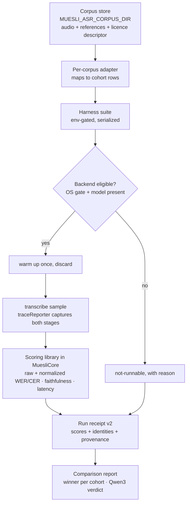
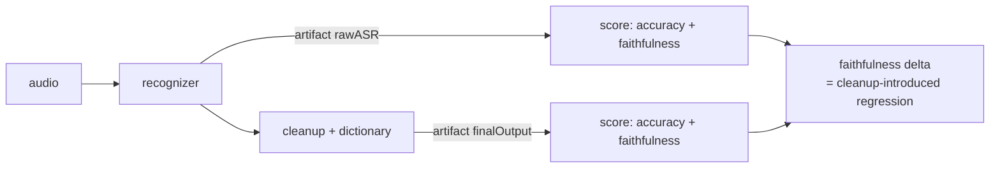

# Transcription Quality Measurement Harness - Plan

## Goal Capsule

- **Objective:** Give Muesli a repeatable, local-only harness that scores every reachable local ASR backend on English, Egyptian Arabic, and Arabic-English code-switching using public corpora, measures faithfulness (did the spoken language survive?) separately from word error, measures what the cleanup stage does to that faithfulness, and ends by ranking the backends per cohort.
- **Why now:** Three of the user's five reported quality complaints are unverifiable claims today. The repository can detect that a *committed* score changed, but it cannot measure a model, compare two models, or observe the cleanup stage at all. Every open model decision — keep or drop Qwen3, upgrade FluidAudio, add per-language switching, add hosted ASR — is currently a guess.
- **Product authority:** This plan owns transcription quality *measurement*. It does not own any change to transcription behaviour.
- **Execution profile:** Six dependency-ordered units. U1-U2 build the scoring library, U3 the corpus contract, U4 the runner, U5 the result artifact, U6 runs it and produces the verdict. Each unit leaves the package building and the existing frozen baseline reproducing.
- **Stop conditions:** Stop if extracting the existing metrics stops `baseline-v1.json` reproducing bit-exactly; if corpus audio, reference text, or any recognizable transcript would be committed to this repository; if a corpus's licence does not permit local evaluation use; or if the harness would run in CI.
- **Tail ownership:** The executor owns implementation, tests, shard registration, the corpus acquisition runbook, and the final measured report. Acting on the report's findings is out of scope by construction.
- **Open blockers:** None. Corpus acquisition (AE3) is sequenced work, not a blocker — U1-U5 proceed without it.

---

## Product Contract

### Summary

Muesli can freeze a quality score and detect drift, but it cannot *produce* a score for a model it has not already measured. This plan turns that frozen-fixture contract into a working measurement harness: an env-gated, maintainer-run test suite that drives the real transcription pipeline over locally-stored public speech corpora, scores each backend per cohort on accuracy, faithfulness, and latency, and writes back only derived numbers. The corpora never enter this repository. The harness's first job is to answer whether Qwen3 ASR earns the 2,188 lines it costs.

### Problem Frame

The existing fixture (`native/MuesliNative/Tests/MuesliTests/Fixtures/TranscriptionQuality/`) is well-built but is a *contract* test, not a measurement tool. Its own doc comment says it "does not run ASR". It holds nine synthetic samples produced by macOS `say`, scored against exactly one backend (`whisperkit` / `whisper-tiny`), captured with cleanup, dictionary, and summary all disabled.

Its recorded numbers already corroborate the user's complaints — English WER 0.111, Arabic 0.500, Arabic-English 0.913 with Latin-token preservation 0.1875 — but it cannot rank models, cannot represent Egyptian dialect (the Arabic voice is MSA), and structurally cannot observe the cleanup stage where the reported Arabic-to-English translation occurs.

Three further facts shape the design, each verified on `xshaheen/dev`:

- Every metric (`Metric`, `normalized`, `tokenPreservation`, `Distribution`, `levenshtein`) is a `private` function inside the test file. Nothing is reusable; scoring must be built, not extended.
- The CLI reaches only 9 of 12 backends, has no language flag, no cleanup stage, and reports latency only as free text on stderr. The **test target** links `MuesliNativeApp`, `MuesliCore`, *and* `MuesliCLI`, so it reaches everything the CLI cannot.
- `transcribeWithQwen3(url:)` takes no language argument on this branch, so Qwen3 cannot be pinned while its competitors can.

### Definitions

- **Cohort:** One of `english`, `egyptian-arabic`, `arabic-english` — the three scenarios the user prioritises.
- **Faithfulness:** Whether the output preserves the spoken language. Distinct from accuracy: a fluent English translation of Arabic speech can be poor faithfulness at any WER.
- **Stage:** A measurable point in the pipeline — `rawASR` (recognizer output) or `finalOutput` (after cleanup and dictionary).
- **Corpus store:** A local directory outside this repository holding downloaded public corpora, their per-corpus licence record, and their reference transcripts.
- **Run receipt:** The committed derived output of one evaluation — scores, latency distributions, model and corpus identities, host facts. Never audio or reference text.

### Key Decisions

- **Public corpora only; the corpus never enters this repository.** Downloaded corpora live in a local-only store outside the repo, located by environment variable. (session-settled: user-directed — chosen over recording a personal corpus, which the user initially proposed and then withdrew in favour of using existing public data.) Governs R1, R2, R14.
- **Measure the cleanup stage, not only ASR.** Cleanup is where the reported Arabic-to-English translation happens, so an ASR-only harness cannot see the user's worst complaint. (session-settled: user-approved — the user's "don't build any other thing" scope reduction was taken as excluding new infrastructure, not as excluding a stage the existing pipeline already emits.) Governs R7, R8.
- **Hosted models are out of this plan.** Measuring them needs credentials, egress, and cost controls that are their own work. (session-settled: user-directed.) Governs Scope Boundaries.
- **The plan runs the evaluation, not just builds it.** It ends with a ranking and the Qwen3 verdict in hand. (session-settled: user-directed.) Governs R13, U6.
- **Faithfulness is a first-class metric, not a WER footnote.** Published benchmarking finds plain WER inflates code-switching quality gaps roughly threefold by charging correct transliteration choices as errors, and that transliteration-then-normalization correlates best with human judgement. Reporting raw WER alone would mislead precisely on the user's worst cohort. Governs R5, R6.

### Requirements

**Corpus**

- R1. The harness MUST read corpora from a local store outside this repository, located by `MUESLI_ASR_CORPUS_DIR`, following the repository's existing `MUESLI_*_MODEL_DIR` convention. Absence of the variable MUST skip the harness, not fail it.
- R2. No corpus audio and no reference transcript text MUST be committed to this repository. Committed artifacts are limited to derived scores, corpus and model identities, content hashes, and provenance.
- R3. Each corpus in the store MUST carry a machine-readable descriptor naming its identifier, version or revision, licence, acquisition method, and cohort mapping. A corpus without a recorded licence MUST NOT be evaluated.
- R4. The harness MUST run with any non-empty subset of corpora present, reporting which cohorts had no data rather than failing. No single corpus may be a hard dependency.

**Metrics**

- R5. For every sample the harness MUST compute, at each measured stage: raw WER and CER (comparable to published figures), normalized WER and CER (the repository's existing Arabic-aware normalization), and a faithfulness score.
- R6. Faithfulness MUST be measured as **script distribution agreement**, computed independently of word accuracy: the share of script-bearing tokens that are Arabic versus Latin in the hypothesis, compared against the same share in the reference. It MUST NOT require hypothesis tokens to match reference tokens, so that badly-mistranscribed Arabic still scores as faithful Arabic while fluent English rendered from Arabic speech does not. Reported per cohort, never averaged into a single WER headline.
- R7. The harness MUST measure both `rawASR` and `finalOutput` stages independently in a single run, so the cleanup stage's effect on faithfulness is directly observable.
- R8. A faithfulness regression introduced *between* `rawASR` and `finalOutput` MUST be reported as its own signal, distinct from ASR error.
- R9. Latency MUST be reported as distributions (not means) per backend per cohort, using the existing nearest-rank method, alongside a real-time factor. Cold-start and warmup MUST be excluded from the reported distribution and reported separately.

**Execution**

- R10. The harness MUST be a maintainer-run, environment-gated test suite that skips cleanly when its inputs are absent, following the `WhisperBiasingManualReproTests` suite-trait precedent. It MUST be registered in a CI shard so the shard guard passes. Non-execution in CI MUST be **enforced in code, not assumed from configuration**: the suite runs only when all three hold — the corpus path is set, an explicit opt-in variable distinct from that path is set, and no CI indicator (`CI`, `GITHUB_ACTIONS`) is present. The CI denial MUST take precedence, so a runner that inherits the corpus path and the opt-in still skips.
- R11. The harness MUST run backends serially and MUST NOT hold multiple ASR models resident concurrently, so latency figures are not corrupted by contention or memory pressure.
- R12. A backend that cannot run on the host (macOS version gate) or whose model is not downloaded MUST be reported as a distinct not-runnable state, never as a zero or a failure.
- R13. The harness MUST produce a comparison report: per backend, per cohort, per stage — accuracy, faithfulness, latency — plus an explicit statement of which backend wins each cohort, produced by the R16 policy rather than by reviewer judgement.
- R17. Each measured backend's actual language configuration MUST be recorded in the receipt and surfaced in the report — `automatic` where the backend detects, or the pinned language where it cannot. A backend that cannot select the cohort's language MUST be marked as such in that cohort's ranking, so a pinned-English model is never silently presented as having failed to recognize Arabic.
- R16. Winner selection MUST be a deterministic, separately-testable function of the recorded scores, so identical measurements always yield an identical verdict. The policy is:
  1. **Faithfulness gate.** A backend whose `rawASR` faithfulness on a cohort falls below 0.90 is *ineligible* to win that cohort regardless of its error rate. Preserving the spoken language is a precondition, not a tiebreaker — a fluent English rendering of Arabic speech must never win the Arabic cohort by having low WER against a translated reference.
  2. **Ranking.** Eligible backends are ranked by normalized WER at `rawASR`, ascending. `finalOutput` is reported but does not select the winner, because it measures the cleanup stage rather than the recognizer.
  3. **Margin.** A winner is declared only if its advantage over the runner-up exceeds a paired bootstrap 95% confidence interval resampled over utterances. Within that interval the result MUST be reported as a tie, listing the tied backends.
  4. **Ties.** Tied backends are displayed in ascending p50 latency order, with no winner claimed.
  5. **Missing data.** A backend that is not-runnable or has no data for a cohort is excluded from that cohort's ranking entirely. It MUST NOT be ranked last.
  6. **Qwen3 verdict.** Keep if Qwen3 wins outright, or ties for first, on the Egyptian Arabic or Arabic-English cohort. Drop otherwise. The verdict MUST be stated as conditional on automatic language detection (KTD5) and MUST name the backend it was compared against.
  The thresholds above (0.90 faithfulness, 95% interval) are recorded in the receipt so a later run using different thresholds is not silently comparable.

**Continuity**

- R14. The existing `baseline-v1.json` MUST continue to reproduce bit-exactly (tolerance 1e-12) after the metric functions are extracted. The existing fixture contract test MUST continue to pass unchanged.
- R15. New result schemas MUST live in a **separate fixture directory** with an independent manifest and loader. The v1 contract test asserts exact set equality over every regular file in its own directory (`fixture.regularFilePaths == Set(manifest.files.map(\.path) + ["manifest.json"])`) and a 512 KiB total-bytes cap, so placing any new file beside it breaks the mandatory v1 gate. The v1 assertions MUST NOT be loosened to accommodate new data.

### Key Flows

- F1. Acquire a corpus
  - **Trigger:** A maintainer follows the acquisition runbook for one corpus.
  - **Steps:** Obtain per that corpus's licence terms → place under the corpus store → write its descriptor including licence and cohort mapping → the harness discovers it.
  - **Covered by:** R1, R3, R4
- F2. Measure one backend
  - **Trigger:** The maintainer runs the harness with the corpus store present.
  - **Steps:** Check host eligibility and local model presence → warm up once, discarded → transcribe each sample capturing both stages and per-stage timings → score → unload before the next backend.
  - **Covered by:** R7, R9, R10, R11, R12
- F3. Produce the verdict
  - **Trigger:** All eligible backends measured.
  - **Steps:** Aggregate per backend per cohort per stage → write the run receipt → render the comparison → name the per-cohort winner and the Qwen3 verdict.
  - **Covered by:** R2, R13

### Acceptance Examples

- AE1. Covers R14. Given the metric functions have been moved into the shared module, when the existing fixture contract test runs unchanged, then every score in `baseline-v1.json` still reproduces within 1e-12.
- AE2. Covers R1, R10. Given `MUESLI_ASR_CORPUS_DIR` is unset, when the test suite runs, then the harness suite reports as skipped, not failed, and the shard guard still passes.
- AE2b. Covers R10. Given the corpus path, the opt-in variable, and every model are all present, but `CI=true` is set, when the test suite runs, then the harness still skips and no transcription is attempted — the CI denial overrides an otherwise complete configuration.
- AE3. Covers R3, R4. Given only one corpus is present and a second lacks a licence record, when the harness runs, then it evaluates the licensed corpus, refuses the unlicensed one by name, and reports the cohorts it could not cover.
- AE4. Covers R6, R7, R8. Given an Arabic-script sample whose recognizer output is Arabic but whose post-cleanup output is fluent English, when the harness scores it, then `rawASR` faithfulness is high, `finalOutput` faithfulness is near zero, and the run reports a cleanup-introduced faithfulness regression — even if `finalOutput` WER against the Arabic reference is similar to `rawASR` WER.
- AE5. Covers R5, R6. Given an Arabic sample transcribed with the correct words but differing orthographic variants — alef forms, `ى` versus `ي`, diacritics, tatweel — when the harness scores it, then raw WER is high while normalized WER is near zero, both are reported rather than one replacing the other, and faithfulness stays high because the script did not change.
- AE5b. Covers R6 and the transliteration limitation. Given Arabic speech transcribed correctly but rendered entirely in Latin transliteration, when the harness scores it, then faithfulness is low (the script changed) and *both* raw and normalized WER stay high — the shipped normalization cannot map transliteration back to Arabic. The run MUST record this as a known measurement limitation rather than reporting the sample as a recognition failure.
- AE6. Covers R12. Given the host is macOS 14 and a macOS 15+ backend is selected, when the harness runs, then that backend is reported not-runnable with its reason, the run continues, and no zero score is recorded for it.
- AE7. Covers R11. Given several backends are measured in one run, when each finishes, then its model is unloaded before the next loads, and the recorded latency distribution excludes the discarded warmup sample.
- AE8. Covers R2. Given a completed run, when the committed artifacts are inspected, then they contain scores, identities, hashes, and provenance, and contain no audio and no reference or hypothesis transcript text.
- AE9. Covers R13, R15, R16. Given a completed run, when the report is produced, then it names a winner per cohort with its margin, states the Qwen3 verdict against the named best alternative, and is written to a v2 schema in its own directory that leaves v1 untouched.
- AE10. Covers R16. Given a backend with the lowest normalized WER on the Egyptian Arabic cohort but `rawASR` faithfulness of 0.4 — it translated the speech to English — when the winner is selected, then that backend is excluded as ineligible and the best *faithful* backend wins, with the exclusion and its reason stated in the report.
- AE11. Covers R16. Given the top two backends differ by less than the paired bootstrap interval, when the winner is selected, then the report declares a tie naming both rather than a winner; and given a third backend was not-runnable on that cohort, then it is absent from the ranking rather than placed last.

### Success Criteria

- A maintainer can answer "which local backend is best for Egyptian Arabic?" and "does Qwen3 earn its keep?" from a committed report rather than an opinion.
- The cleanup stage's effect on language preservation is a number, not a hypothesis.
- Re-running the harness after a model or pipeline change produces a diffable result that shows whether quality moved.
- Nothing in the public repository reveals corpus audio or transcripts.

### Scope Boundaries

#### Included

The scoring library, the corpus store contract and acquisition runbook, the env-gated runner, the result schema and report, and one full measured run producing the ranking and the Qwen3 verdict.

#### Deferred to Follow-Up Work

- Acting on any finding: keeping or dropping Qwen3, the FluidAudio 0.15.5 upgrade, dynamic per-language model switching, cleanup skip-when-good and cleanup deadlines.
- Hosted ASR measurement (`gpt-4o-transcribe` and peers) — needs credentials, egress policy, and cost control.
- Semantic scoring (BERTScore and similar) — needs an embedding model in the loop.
- Buckwalter or IPA transliteration before scoring. The published recipe favours it, and without it the code-switching WER figures carry the roughly threefold inflation the literature describes: Arabic correctly recognized but emitted in Latin transliteration is charged as a near-total error by both raw and normalized WER (AE5b). Faithfulness still catches the script change, so the failure is visible — but the CS accuracy numbers must be read as an upper bound on error, not a true one, and the report must say so. This is the first metric increment after the plan lands.
- A personal-voice corpus. Withdrawn from scope by the user; the domain-validity gap it would close is recorded under Risks.

#### Outside This Product Slice

- Any change to transcription, cleanup, or model-selection behaviour.
- Meeting-specific transcription quality. Dictation is the measured path; the meeting pipeline has its own cleanup contract.

### Sources / Research

- `native/MuesliNative/Tests/MuesliTests/TranscriptionQualityBaselineTests.swift` — the metric implementations to extract, the 1e-12 tolerance, and the fixture contract's hard assertions.
- `native/MuesliNative/Tests/MuesliTests/Fixtures/TranscriptionQuality/` — `manifest.json`, `PROVENANCE.md`, `samples.jsonl`, `baseline-v1.json`; the size caps and the non-redistribution stance to carry forward.
- `native/MuesliNative/Tests/MuesliTests/WhisperBiasingManualReproTests.swift` — the env-gated suite-trait precedent (`.enabled(if:)`), registered in a shard yet skipped on CI.
- `native/MuesliNative/Sources/MuesliNativeApp/TranscriptionRuntime.swift` — `traceReporter` artifact emission (`.rawASR`, `.cleanupResult`, `.finalOutput`), per-stage `elapsedMilliseconds`, `routeToBackend`, `withBackendInFlight`, and `transcribeWithQwen3(url:)` with no language argument.
- `native/MuesliNative/Sources/MuesliCore/SessionTraceModels.swift` — `SessionTraceArtifactKind` already matching the harness's row shape.
- `native/MuesliNative/Sources/MuesliNativeApp/TranscriptionBackendResidencyPolicy.swift` — model eviction between runs; the reason R11 exists.
- `native/MuesliNative/Sources/MuesliNativeApp/Models.swift` — `BackendOption.all`, model identities, macOS gates, `LanguageProfile` and `effectiveBehavior(for:)`.
- `native/MuesliNative/Sources/MuesliCore/ManagedASRModelDownloads.swift` — `isAvailableLocally` for cheap pre-flight.
- `native/MuesliNative/Package.swift` — the test target links `MuesliNativeApp`, `MuesliCore`, and `MuesliCLI`; `resources: [.copy("Fixtures")]`.
- `scripts/run_ci_test_shard.sh`, `scripts/test_ci_test_shards.sh` — mandatory shard registration.
- Corpora: [ArzEn](https://aclanthology.org/2020.lrec-1.523/) (12 h Egyptian Arabic-English code-switching), [ArzEn-ST](https://aclanthology.org/2022.wanlp-1.12/), [MGB-3](https://huggingface.co/datasets/MightyStudent/Egyptian-ASR-MGB-3), [Casablanca](https://aclanthology.org/2024.emnlp-main.1211/), [arabic-egy-cleaned](https://huggingface.co/datasets/MAdel121/arabic-egy-cleaned) (no licence stated — excluded under R3 unless clarified), Mixat and ZAEBUC-Spoken via the [code-switched Arabic NLP survey](https://aclanthology.org/2025.coling-main.307.pdf).
- Metric design: the same survey and the [commercial CS-ASR benchmark](https://arxiv.org/abs/2605.19069) — raw WER inflates CS quality gaps ~3x; transliteration-then-normalization correlates best with human judgement; report script-normalized figures alongside raw rather than replacing.

---

## Planning Contract

### Key Technical Decisions

- KTD1. **The harness is an env-gated test suite, not a CLI subcommand.** The test target links `MuesliNativeApp`, `MuesliCore`, and `MuesliCLI`, so it reaches all backends including Cohere, Indic ASR, and Gemma, and can pass a `traceReporter` to capture both stages in one run. The CLI reaches 9 of 12 backends, has no language flag, no cleanup stage, and emits latency only as stderr prose. Building a CLI contract good enough to drive this is a larger job than the harness itself. Governs R7, R10.
- KTD2. **Scoring moves to `MuesliCore` bit-exactly before anything new is added.** `Metric`, `normalized`, `tokenPreservation`, `Distribution`, and `levenshtein` become internal-to-package types with the existing behaviour unchanged; the existing test then consumes them. Extraction and extension are separate units so a v1 reproduction failure is unambiguous. Governs R14.
- KTD3. **Result schema v2 lives in its own directory, not beside v1.** The v1 contract test enumerates its fixture directory and requires the file set to equal its manifest exactly, so a v2 receipt dropped in alongside it would fail the gate this plan promises to keep green. v2 artifacts therefore go in a sibling `Fixtures/TranscriptionQualityRuns/` with an independent manifest and loader; `resources: [.copy("Fixtures")]` copies the whole tree, so no package manifest change is needed. Governs R15.
- KTD4. **Faithfulness is script *distribution agreement*, deliberately not the existing token-preservation function.** The existing `latinTokenPreservation` / `arabicTokenPreservation` are multiset token *recall* — they require hypothesis tokens to match reference tokens exactly, so Arabic transcribed in Arabic but with recognition errors scores as unfaithful. That collapses the one distinction this harness exists to make: mistranscription versus translation. The new metric instead compares the *script composition* of the hypothesis against the reference — what fraction of script-bearing tokens is Arabic, what fraction Latin — and is blind to whether the words are correct. Garbled Arabic scores faithful; fluent English from Arabic speech scores unfaithful. The existing token-recall figures are retained unchanged as a separate accuracy-flavoured signal for the Arabic-English cohort, so v1 keeps reproducing. Governs R6, R7, R8.
- KTD10. **The winner is computed, not judged.** R16's policy is a pure function over the receipt, unit-tested against constructed score sets, so the plan's headline output is reproducible rather than a reading of a table. Faithfulness enters as a gate rather than a weighted term because the two are not commensurable — no WER advantage should buy back a language change, which is precisely the failure the user reported. Governs R13, R16.
- KTD5. **Every backend is measured on its own shipped default, unsteered by the harness — which is automatic detection for most, but not all.** Qwen3 accepts no language argument on this branch, so pinning its competitors would compare a steered model against an unsteered one. *Correction found during U4:* `CohereTranscribeLanguage` and `IndicASRLanguage` have **no `auto` case at all** — their defaults are English and Hindi respectively, so "measure everything on automatic" is unsatisfiable for them. The harness therefore steers nothing and records what each backend actually ran under, per R17. This matters for how the report is read: a pinned-English model competing on the Egyptian Arabic cohort is not failing to detect Arabic, it was never able to try. Governs R5, R17, and is the reason the Qwen3 verdict is stated as "unsteered".
- KTD6. **Serial execution with explicit unload between backends, warmup discarded.** `TranscriptionBackendResidencyPolicy` already evicts non-designated models; the harness cooperates with it rather than pinning, so figures reflect what users experience. The suite is `.serialized`, matching 28 existing suites and avoiding ANE contention. Governs R9, R11.
- KTD7. **Corpus store located by `MUESLI_ASR_CORPUS_DIR`, with a per-corpus descriptor.** Follows the established `MUESLI_COHERE_MODEL_DIR` / `MUESLI_INDIC_ASR_MODEL_DIR` / `MUESLI_GEMMA4_LITERT_CACHE_DIR` convention rather than adding a config key for a maintainer-only path. Governs R1, R3.
- KTD8. **Model presence is pre-flighted, never auto-downloaded.** `ManagedASRModelPlan.isAvailableLocally` gates each backend so a run cannot silently pull ~9-10 GB mid-measurement. Missing models are a not-runnable state under R12. Governs R12.
- KTD9. **The harness must not write into the maintainer's real support directory — but the env override this plan first named does not achieve that.** *Corrected during review:* `MUESLI_SUPPORT_DIR` and `MUESLI_DB_PATH` are read only by `Sources/MuesliCLI/MuesliCLI.swift`, a separate executable target. The app target — the one KTD1 selects as the driver — resolves through `AppIdentity.supportDirectoryURL` → `MuesliPaths.defaultSupportDirectoryURL`, which derives from the home directory and never consults either variable. Setting them in-process isolated nothing while mutating the whole test process's environment. The harness therefore sets no environment variable; instead it enumerates the writes the sweep can actually make into the real support directory and refuses to run when one is armed. Today that is one: `TranscriptionRuntime` appends transcript-bearing rows to `postproc-pairs.jsonl` when `MUESLI_DEBUG_POSTPROC_LOGS` and `MUESLI_LOG_POSTPROC_PAIRS` are both set, so the gated suite hard-fails rather than leaking corpus text into a maintainer's data directory.

### Assumptions

- The maintainer runs on macOS 15 or later, so all **five** version-gated backends are eligible — Qwen3, Cohere, Indic ASR, Gemma 4, and Nemotron 3.5 (the last confirmed gated during U4, contrary to this plan's first draft). A macOS 14 host produces a valid but narrower report (R12, AE6).
- Corpus reference transcripts are usable as-is after the repository's existing Arabic normalization. Per-corpus quirks (speaker tags, overlap markers, code-switch annotations) are handled in that corpus's adapter, not by weakening the shared normalizer.
- The `traceReporter` seam delivers `.rawASR` and `.finalOutput` for dictation without production changes. If a stage proves unreachable read-only, U4 surfaces it rather than modifying `TranscriptionRuntime`.
- Full-sweep model downloads (~9-10 GB) are acquired once, out of band, before U6.

### High-Level Technical Design

Measurement flows in one direction; nothing writes back into the pipeline.

Two stages are scored from one transcription, which is what makes cleanup-introduced translation visible:

### Sequencing

1. U1 extract scoring to `MuesliCore` (v1 still reproduces) — unblocks U2, U4.
2. U2 add faithfulness, per-stage, and normalized metrics — unblocks U4, U5.
3. U3 corpus store contract, descriptors, and acquisition runbook — unblocks U4, U6.
4. U4 the env-gated runner with two-stage capture and residency discipline — unblocks U5, U6.
5. U5 run receipt v2, regression baseline, and report rendering.
6. U6 acquire corpora, execute the sweep, publish the verdict.

### Risks and Mitigations

- **Extraction breaks v1 reproduction.** The 1e-12 tolerance is unforgiving of any reordering that changes floating-point accumulation. Mitigation: U1 moves code without editing it, and runs the contract test before and after as its own gate.
- **The fixture contract test breaks on contact.** It asserts four manifest files, nine samples, three per cohort, and a single backend identity. Mitigation: KTD3's parallel v2 schema; U5 adds a manifest entry rather than changing counts the v1 test reads.
- **Public corpora do not represent the user's domain.** All candidates are broadcast, interview, or podcast speech; the user dictates technical vocabulary — identifiers, product names, acronyms — code-switched mid-sentence. A backend can win here and still disappoint in daily use. Mitigation: state this limitation in the report itself, so the ranking is read as ranking-on-public-data. The withdrawn personal corpus is the real closure and is recorded as deferred.
- **ArzEn may be unobtainable in reasonable time.** Its licence is not published and it is identifiable participant speech, so access likely requires contacting the authors. It is also the only corpus matching Egyptian *and* code-switching. Mitigation: R4's no-hard-dependency rule; Mixat and ZAEBUC-Spoken cover the language pair without Egyptian dialect, MGB-3 covers Egyptian without code-switching, and the report names which cohort rests on which corpus.
- **Qwen3 measured unsteered.** KTD5 makes this deliberate and disclosed, but the verdict must be phrased as conditional on automatic detection, or it will be over-read as a verdict on the model.
- **Cold start dominates on short clips.** Multi-gigabyte models plus Qwen3's ~30 s CoreML compilation can exceed the audio duration. Mitigation: R9's discarded warmup and separate warmup reporting, following the existing `PROVENANCE.md` practice.
- **Accidental disclosure through committed results.** A hypothesis string in a debug field would leak corpus content. Mitigation: R2 plus an explicit test asserting the receipt carries no transcript-shaped fields.
- **CI gate failure.** A new suite that is not registered in a shard fails the required check. Mitigation: registration is part of U4's definition of done, verified by `scripts/test_ci_test_shards.sh`.

---

## Implementation Units

### U1. Extract the existing scoring into a shared module

- **Goal:** Make the current metrics reusable without changing a single number.
- **Requirements:** R14; KTD2; AE1.
- **Dependencies:** None.
- **Files:**
  - `native/MuesliNative/Sources/MuesliCore/TranscriptionQualityScoring.swift` (new)
  - `native/MuesliNative/Tests/MuesliTests/TranscriptionQualityBaselineTests.swift` (consume the extracted types; assertions unchanged)
  - `native/MuesliNative/Tests/MuesliTests/TranscriptionQualityScoringTests.swift` (new — unit tests for the extracted functions)
- **Approach:** Move `Metric`, `Distribution`, `normalized(_:arabic:)`, `tokenPreservation(samples:output:script:)`, `token(_:belongsTo:)`, `levenshtein`, and `nearestRankIndex(percentile:count:)` into the shared module verbatim, preserving accumulation order exactly. Re-point the existing test at them and delete the private copies. Add direct unit tests for each function using small hand-computed cases, which the originals never had.
- **Execution note:** Characterization first — run the contract test before touching anything and record that it passes, then again after, and treat any difference as a failed extraction rather than a baseline to update.
- **Patterns to follow:** `MuesliCore` module conventions; the existing suite naming style.
- **Test scenarios:**
  - The existing fixture contract test passes unchanged, reproducing every `baseline-v1.json` score within 1e-12.
  - Levenshtein returns known distances for empty, identical, single-substitution, and transposition cases.
  - Arabic normalization folds alef variants, `ى → ي`, diacritics, and tatweel exactly as before.
  - Nearest-rank indices match the documented formula at the 0th, 50th, and 100th percentiles and for single-element inputs.
- **Verification:** `swift test --package-path native/MuesliNative --filter TranscriptionQualityFixtureContractTests --filter TranscriptionQualityScoringTests` green; package builds.

### U2. Add faithfulness, per-stage, and normalized metrics

- **Goal:** Give the scoring module the dimensions that make the user's actual failures visible.
- **Requirements:** R5, R6, R7, R8; KTD4; AE4, AE5.
- **Dependencies:** U1.
- **Files:**
  - `native/MuesliNative/Sources/MuesliCore/TranscriptionQualityScoring.swift`
  - `native/MuesliNative/Sources/MuesliCore/TranscriptionQualityModels.swift` (new — cohort, stage, sample, and score types)
  - `native/MuesliNative/Tests/MuesliTests/TranscriptionQualityScoringTests.swift`
- **Approach:** Introduce `Cohort` (`english`, `egyptianArabic`, `arabicEnglish`) and `Stage` (`rawASR`, `finalOutput`). Compute raw and normalized WER/CER side by side rather than one replacing the other. Add script distribution agreement as a *new* function — per KTD4 it compares the Arabic/Latin composition of hypothesis and reference and never compares tokens against each other, so it stays independent of recognition accuracy; the existing token-recall functions are left untouched so v1 keeps reproducing. Derive a faithfulness delta between stages. Keep every function pure and free of AppKit or backend imports so scoring stays testable without models.
- **Patterns to follow:** the existing `token(_:belongsTo:)` scalar-range classification; the existing micro-averaging approach.
- **Test scenarios:**
  - Covers AE4. An Arabic reference with an Arabic `rawASR` and an English `finalOutput` yields high raw-stage faithfulness, near-zero final-stage faithfulness, and a negative delta flagged as cleanup-introduced.
  - Covers AE5. An Arabic sample differing only in orthographic variants scores high raw WER, near-zero normalized WER, and unchanged faithfulness.
  - Covers AE5b. Arabic speech rendered wholly in Latin transliteration scores low faithfulness while both WER figures stay high, and the result carries the known-limitation marker.
  - **Faithfulness is independent of accuracy.** Arabic reference against a badly-mistranscribed but still Arabic-script hypothesis scores high faithfulness and high WER simultaneously — the discrimination the metric exists for.
  - Faithfulness is unchanged when only word accuracy varies and the script composition is held constant.
  - A perfect transcription scores zero WER and full faithfulness at both stages in all three cohorts.
  - An empty hypothesis scores maximal WER and zero faithfulness without dividing by zero.
  - A sample with no Arabic content reports Arabic preservation as not-applicable rather than zero.
- **Verification:** Scoring suite green; the v1 contract test still green (the new fields must not alter v1's computed values).

### U3. Corpus store contract, descriptors, and acquisition runbook

- **Goal:** Define where corpora live, prove none of it reaches the repository, and document how to obtain each one.
- **Requirements:** R1, R2, R3, R4; KTD7; AE2, AE3, AE8.
- **Dependencies:** None (parallel with U1/U2).
- **Files:**
  - `native/MuesliNative/Sources/MuesliCore/TranscriptionCorpusStore.swift` (new — discovery, descriptor decoding, licence gate)
  - `native/MuesliNative/Tests/MuesliTests/TranscriptionCorpusStoreTests.swift` (new)
  - `docs/transcription-quality-corpus.md` (new — the acquisition runbook)
  - `.gitignore` (guard against an accidentally-placed corpus directory)
- **Approach:** Define a descriptor carrying corpus id, version or revision, licence identifier and source URL, acquisition method, cohort mapping, and a sample index referencing audio paths plus reference text. Discovery reads `MUESLI_ASR_CORPUS_DIR`; a missing variable yields an empty store, and a corpus without a licence field is refused by name. The runbook documents per-corpus acquisition, including that ArzEn likely requires contacting the authors and that `arabic-egy-cleaned` states no licence and is therefore excluded until clarified.
- **Patterns to follow:** the existing `MUESLI_*_MODEL_DIR` override convention; `PROVENANCE.md`'s recording style.
- **Test scenarios:**
  - Covers AE2. Unset environment variable yields an empty store with no error.
  - Covers AE3. A store with one licensed and one unlicensed corpus evaluates the first, names the second as refused, and reports uncovered cohorts.
  - A descriptor with an unknown cohort is rejected with the offending value named.
  - A sample whose audio file is missing is reported per-sample without failing the corpus.
  - Reference text exceeding the field cap is rejected, mirroring the existing manifest caps.
- **Verification:** Corpus suite green; `rg` over the repository confirms no corpus audio or reference text is tracked.

### U4. The env-gated measurement runner

- **Goal:** Drive the real pipeline across eligible backends and cohorts, capturing both stages and honest timings.
- **Requirements:** R7, R9, R10, R11, R12; KTD1, KTD5, KTD6, KTD8, KTD9; AE6, AE7.
- **Dependencies:** U1, U2, U3.
- **Files:**
  - `native/MuesliNative/Tests/MuesliTests/TranscriptionQualityHarnessTests.swift` (new — the env-gated suite)
  - `native/MuesliNative/Tests/MuesliTests/Support/TranscriptionQualityRunner.swift` (new — the sweep logic)
  - `scripts/run_ci_test_shard.sh` (register the new suite)
- **Approach:** Gate the suite with `.enabled(if:)` on the three-part predicate from R10 — corpus path set, `MUESLI_ASR_HARNESS=1` opt-in set, and neither `CI` nor `GITHUB_ACTIONS` present — following `WhisperBiasingManualReproTests`, and mark it `.serialized`. Express the predicate as a testable pure function over an environment dictionary so the CI-denial branch can be asserted without mutating the process environment. For each backend: check the macOS gate and `isAvailableLocally`, recording a not-runnable reason instead of a score when either fails; redirect `MUESLI_SUPPORT_DIR` to a scratch directory; warm up on one sample and discard it; transcribe each sample through the app pipeline with a `traceReporter` capturing `.rawASR` and `.finalOutput` plus per-stage `elapsedMilliseconds`; unload before the next backend. All backends run on automatic language detection per KTD5.
- **Execution note:** Build the runner against injected fakes first so the sweep, eligibility, and unload logic are provable without touching a real model; only then point it at real backends.
- **Patterns to follow:** `MuesliCLITests`'s injected-fake construction; `withBackendInFlight` and the residency policy's designation model; the CLI's `MUESLI_SUPPORT_DIR` isolation.
- **Test scenarios:**
  - Covers AE6. A backend behind a macOS gate the host does not meet is recorded not-runnable with its reason; the sweep continues.
  - A backend whose model is absent locally is recorded not-runnable and triggers no download.
  - Covers AE7. Across a multi-backend sweep with fakes, each backend unloads before the next loads, and the first (warmup) sample is absent from the recorded distribution.
  - Both stages are captured for a single transcription, and a fake whose cleanup returns a different language produces the expected faithfulness delta.
  - With the environment variable unset, the suite reports skipped and `scripts/test_ci_test_shards.sh` still passes.
  - Covers AE2b. The gate predicate returns false when `CI=true` even with the corpus path and opt-in both set, and false when the opt-in is missing though the path is present; it returns true only for the full maintainer configuration.
  - Requirements list updated: R10's enforcement is proven by the predicate's unit tests, not by the suite's runtime behaviour alone.
- **Verification:** `./scripts/test_ci_test_shards.sh` green; suite skips cleanly without the environment variable; with fakes, the sweep produces a complete result matrix.

### U5. Run receipt v2, regression baseline, and report

- **Goal:** Persist derived results in a diffable form and render the comparison a human reads.
- **Requirements:** R2, R13, R15, R16; KTD3, KTD10; AE8, AE9, AE10, AE11.
- **Dependencies:** U2, U4.
- **Files:**
  - `native/MuesliNative/Sources/MuesliCore/TranscriptionQualityReceipt.swift` (new — v2 schema, encode/decode)
  - `native/MuesliNative/Tests/MuesliTests/Fixtures/TranscriptionQualityRuns/` (new directory — v2 receipt plus its own manifest; the v1 `TranscriptionQuality/` directory is not touched at all)
  - `native/MuesliNative/Tests/MuesliTests/TranscriptionQualityReceiptTests.swift` (new)
  - `docs/transcription-quality-corpus.md` (report format section)
- **Approach:** The receipt records host facts, corpus identities and revisions, backend and model identities, and per backend/cohort/stage scores and latency distributions — and nothing else. Add a test asserting the encoded receipt contains no transcript-shaped field. Implement the R16 decision policy as a pure, separately-tested function and render a markdown comparison table from its output. v2 lives in its own fixture directory per KTD3; verify explicitly that the v1 directory's file set is byte-identical after this unit.
- **Patterns to follow:** the existing `manifest.json` self-excluding hash scheme and size caps; `baseline-v1.json`'s shape.
- **Test scenarios:**
  - Covers AE8. A receipt built from a populated result set round-trips through JSON and contains no reference or hypothesis text.
  - Covers AE9, R15. Adding the v2 receipt in its own directory leaves the v1 contract test passing unchanged and the v1 directory's file set unaltered.
  - A receipt with a not-runnable backend renders that state in the report rather than a zero.
  - The report names a per-cohort winner and reports the margin between first and second.
  - Covers AE10. A low-WER but unfaithful backend is excluded by the gate and the best faithful backend wins, with the exclusion reason recorded.
  - Covers AE11. Two backends inside the bootstrap interval produce a declared tie, not a winner; a not-runnable backend is absent from the ranking rather than last.
  - The decision policy is deterministic: the same receipt scored twice yields identical winners, ties, and Qwen3 verdict.
  - The recorded thresholds (0.90 faithfulness, 95% interval) round-trip in the receipt.
  - A second receipt with degraded scores is detected as a regression against the first.
- **Verification:** Receipt and v1 contract suites green; a sample report renders with fake data.

### U6. Acquire corpora, run the sweep, publish the verdict

- **Goal:** Produce the measured answers this whole plan exists for.
- **Requirements:** R13; Success Criteria; AE3.
- **Dependencies:** U3, U4, U5.
- **Files:**
  - `native/MuesliNative/Tests/MuesliTests/Fixtures/TranscriptionQualityRuns/` (the measured v2 receipt)
  - `docs/transcription-quality-findings-2026-08.md` (new — the report)
- **Approach:** Follow the runbook to acquire what is obtainable, recording each licence. Download the model set out of band. Run the sweep on a quiet machine. Publish the receipt and a report that states, per cohort, which backend wins and by how much; what the cleanup stage does to faithfulness; and the Qwen3 verdict phrased as conditional on automatic language detection. State plainly which cohorts rest on which corpus and that all corpora are broadcast-style rather than technical dictation.
- **Test scenarios:** Test expectation: none — this unit executes the harness and records evidence.
- **Verification:** A committed v2 receipt, a report naming per-cohort winners and the Qwen3 verdict, and no corpus content in the diff.

---

## Verification Contract

| Gate | Command / check | Applies to | Done signal |
|---|---|---|---|
| v1 reproduction | `swift test --package-path native/MuesliNative --filter TranscriptionQualityFixtureContractTests` | U1, U2, U5 | Passes unchanged; every score within 1e-12 |
| Scoring units | `swift test --package-path native/MuesliNative --filter TranscriptionQualityScoringTests` | U1, U2 | Green |
| Corpus contract | `swift test --package-path native/MuesliNative --filter TranscriptionCorpusStoreTests` | U3 | Green, including the refusal cases |
| Harness with fakes | `swift test --package-path native/MuesliNative --filter TranscriptionQualityHarnessTests` | U4 | Complete matrix from injected fakes |
| Skip-when-absent | Run the suite with `MUESLI_ASR_CORPUS_DIR` unset | U4 | Reports skipped, not failed |
| CI denial | Unit-test the gate predicate with `CI=true` plus a complete configuration | U4 | Predicate false; no transcription attempted |
| Shard guard | `./scripts/test_ci_test_shards.sh` | U4, U5 | No unassigned suites |
| Full suite | `swift test --package-path native/MuesliNative` | before merge | Green apart from the documented flaky set |
| No corpus leakage | `git status` plus a search of tracked fixtures for audio extensions and transcript-shaped fields | U3, U5, U6 | Nothing found |
| Measured run | The harness with the corpus store and models present | U6 | v2 receipt committed; report names winners and the Qwen3 verdict |

---

## Definition of Done

- R1-R17 implemented; AE1-AE11 demonstrated by tests or by the measured run.
- `baseline-v1.json` still reproduces bit-exactly and the v1 contract test is unmodified.
- The harness skips cleanly without its environment variable, skips under a CI indicator even when fully configured, and is registered in a CI shard; `scripts/test_ci_test_shards.sh` passes.
- No corpus audio, reference text, or hypothesis text is tracked in this repository.
- A committed v2 receipt and a published report state the per-cohort winner, the cleanup stage's effect on faithfulness, and the Qwen3 verdict under automatic language detection.
- The report states its own limits: public broadcast-style corpora, which cohort rests on which corpus, and any cohort left uncovered.
- No abandoned experimental code remains in the diff — in particular, no partially-built CLI measurement path if the test-target driver was used.
