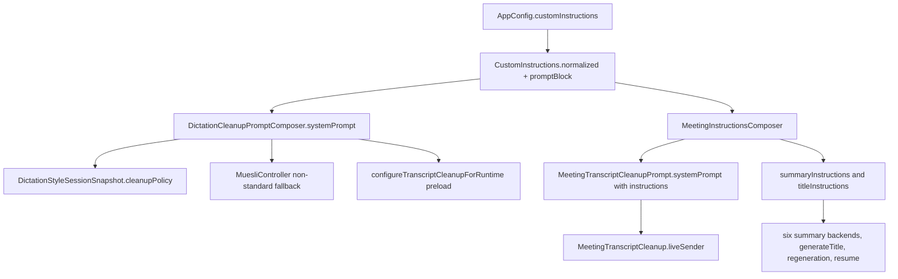

# Global Custom Instructions - Plan

## Goal Capsule

- **Objective:** A user writes their personal preferences once ("use British English", "be concise", "keep product names in English") and every place Muesli rewrites their words with an LLM honors them: dictation cleanup, meeting transcript cleanup, and meeting notes and titles.
- **Means:** One persisted free-text field, one prompt composer per side (KTD1, KTD2), threaded into the summary and title prompts (KTD3).
- **Authority hierarchy:** R-IDs own product behavior. KTDs own mechanism within their cited Rs. Existing tests that pin prompt bytes are characterization evidence and stay green when the field is empty (R4, R7).
- **Stop conditions:** Evidence that a session-settled decision is infeasible; a required edit outside the ownership boundary in KTD8 that cannot be avoided; the meeting cleanup validator rejecting real responses because of the instructions block with no framing fix available.
- **Execution profile:** Code. Swift Testing suites in `native/MuesliNative/Tests/MuesliTests`. Verification per the Verification Contract.
- **Tail ownership:** The invoking pipeline ships the branch as a PR against `dev`; this plan owns nothing after the Definition of Done.

---

## Product Contract

### Summary

Add a global "Custom instructions" setting stored in `config.json`, edited in a multi-line card in the Dictation settings pane, and injected as one delimited prompt block into dictation cleanup, meeting transcript cleanup, and meeting notes and title generation. Empty instructions leave every prompt byte-identical to today.

### Problem Frame

Muesli has no personal-context input for its LLM passes. Dictation prompts are whole-prompt presets and Writing Styles, so a preference such as "British spelling" has to be pasted into every style. Meeting cleanup uses a hard-coded system prompt (`MeetingTranscriptCleanupPrompt.systemPrompt`) and the summary and title prompts take only template, notes, and language. Users of tools like Monologue expect one free-text field that follows them everywhere. The dictation side also has two prompt-composition sites that already drift (`DictationStyleSessionSnapshot.cleanupPolicy` and `MuesliController.configureTranscriptCleanupForRuntime`), plus a non-adaptive branch that ships raw preset bytes, so any new block added in one place would be missing in the others.

### Key Decisions

- **KD1. Custom instructions apply to dictation cleanup, meeting transcript cleanup, and meeting notes/title.** (session-settled: user-approved — chosen over dictation-only Monologue parity: the user wants one personal-context field everywhere an LLM rewrites their words.) Governs R3, R7, R8.
- **KD2. The editor is a multi-line text area hosted in its own settings card, built as a reusable view.** (session-settled: user-directed — chosen over a single-line field: instructions are multi-line by nature, and a later Modes screen will host the same editor.) Governs R10.
- **KD3. Instructions are preferences that never override output structure, marker protocol, or output-language rules.** (session-settled: user-approved — chosen over inserting raw text at the top of each prompt: the meeting cleanup validator discards a whole transcript when structure changes, and template/language rules must keep precedence.) Governs R9, R12.

### Requirements

**Persistence and normalization**

- R1. `AppConfig` carries `customInstructions` (JSON key `custom_instructions`, String, default `""`); a missing or malformed key decodes to the default and the field round-trips through encode/decode.
- R2. One normalization owns the effective text everywhere: trim surrounding whitespace first, then cap at 2,000 characters; a normalized empty string means "no block" for every consumer. The editor never normalizes the live draft: it counts the trimmed length, truncates trailing characters only when the trimmed length would exceed the cap, and normalizes at commit.

**Dictation cleanup**

- R3. Every dictation cleanup system prompt includes the custom instructions block when it is non-empty, in this order: safety wrapper (adaptive only), base or style instructions, custom instructions block, speaker vocabulary. This covers the adaptive branch, the non-adaptive raw-preset branch, the non-standard session fallback in the controller, and the runtime preload prompt.
- R4. When the normalized instructions are empty, each dictation prompt is byte-identical to the prompt produced today for the same configuration.
- R5. The instructions used for a dictation are the ones present in the session config frozen at recording start; edits made during a recording apply to the next dictation.
- R6. When the selected cleanup model ignores prompts (S1-mini fixed prompt), the settings UI states that custom instructions do not affect dictation for that model.
- R13. On the on-device Qwen cleanup backend the block is limited to a fixed backend budget (KTD9) so its contribution to the model's 1,024-token context is bounded; hosted and Gemma backends use the full 2,000-character cap, and the settings UI discloses the on-device budget.

**Meeting cleanup and notes**

- R7. The meeting cleanup system prompt is: repair core, then the custom instructions block when non-empty, then the unit-marker protocol last. With empty instructions it is byte-identical to the current static prompt.
- R8. The summary instructions and the title instructions include the block after the template prompt and before the output-language instruction, for all six summary backends, title generation, notes regeneration from a cleaned transcript, and resumed regeneration.
- R9. The block's preamble states the text is user preferences and must not change unit count, markers, template headings, or the required output language.

**Settings UI**

- R10. A "Custom instructions" card in the Dictation pane shows a multi-line editor with placeholder text, a live character counter against the cap, and a caption saying the text also applies to meeting cleanup and meeting notes; the card is visible whether or not dictation cleanup is enabled.
- R11. Edits persist on a short debounce and on focus loss, and a persisted change re-configures the preloaded dictation cleanup runtime so the next dictation uses the new prompt.

**Safety**

- R12. The block is wrapped in fixed delimiters (`<CUSTOM-INSTRUCTIONS>` … `</CUSTOM-INSTRUCTIONS>`) and its text is inserted as data; the app never interprets it, and it removes only the reserved delimiter sequences (the block's own opening and closing tags and the meeting unit-marker prefix) before insertion so the block cannot be closed or a marker forged from inside.

### Acceptance Examples

- AE1. **Covers R3, R4.** Given adaptive styles on, a matched style, custom instructions "Use British spelling", and two dictionary words, when a standard dictation stops, then the frozen system prompt reads safety wrapper, `<STYLE-INSTRUCTIONS>`, `<CUSTOM-INSTRUCTIONS>` with the sentence, then "Speaker vocabulary". With instructions cleared, the prompt equals today's `compose` plus vocabulary output.
- AE2. **Covers R4.** Given adaptive styles off, preset bytes "Legacy prompt bytes", and empty instructions, then the frozen prompt equals `appendingSpeakerVocabulary(to: "Legacy prompt bytes", …)` exactly.
- AE3. **Covers R5.** Given a session snapshot created with instructions "A", when config changes to "B" before the stop, then the cleanup policy still carries "A".
- AE4. **Covers R7.** Given instructions "Keep Arabic names in Arabic script", then the meeting cleanup prompt starts with the repair core, contains the block, and ends with the marker-protocol paragraph; with empty instructions it equals `MeetingTranscriptCleanupPrompt.systemPrompt`.
- AE5. **Covers R8.** Given an Arabic transcript and instructions "Use bullet points", then `summaryInstructions` contains the template prompt, then the block, then the Arabic output instruction, in that order.
- AE6. **Covers R2, R10, R11.** Given the user pastes 100 spaces followed by 2,050 characters, then the draft keeps the 100 spaces plus the first 2,000 characters, the counter shows 2000/2000, and after the debounce `config.json` holds exactly the 2,000-character trimmed text. Given the user types "Use British English" with a trailing space, the draft keeps the space.
- AE7. **Covers R13.** Given 1,500 characters of instructions and the on-device Qwen backend selected, then the frozen dictation prompt carries only the budgeted prefix of the block; with a hosted backend selected the same config carries all 1,500 characters.
- AE8. **Covers R11.** Given the user types text and closes Settings within the debounce window, then the text is still persisted.

### Scope Boundaries

- Writing Styles, style groups, presets, and the `mixed-language-repair` preset are unchanged (owned by sibling work).
- Meeting cleanup consent, eligibility, and the enable toggle are unchanged.
- Language profiles, routing, `MeetingOutputLanguage`, and `MeetingSession` are unchanged; summary functions keep their existing `languageProfile` parameter.
- No per-app or per-mode instructions; no instructions in the CLI transcribe command.

#### Deferred to Follow-Up Work

- Per-mode instructions and the Modes screen hosting this editor (planned separately).
- A bilingual mixed-language repair block in the same composer slot (planned separately).
- A per-request token budget for the on-device Qwen cleanup model computed from the actual transcript length; this plan uses a fixed backend budget (KTD9) because the prompt is frozen before the transcript exists.

### Success Criteria

- A tester sets one instruction and observes it honored in a dictation, a cleaned meeting transcript, and regenerated meeting notes without touching any other setting.
- The full test suite passes with no new failures beyond the five pre-existing timing failures in `MeetingFinalizationRollbackTests` and `MeetingsNavigationTests`.

### Sources

- Subsystem maps used as evidence: dictation prompt assembly (`TranscriptionRuntime.swift` composer, `DictationCorrectionMonitor.swift` snapshot, `MuesliController.swift` preload and fallback), meeting cleanup (`MeetingTranscriptCleanup.swift`, `MeetingTranscriptCleanupValidator.swift`), summary prompts (`MeetingSummaryClient.swift`), settings surfaces (`SettingsView.swift`, `WritingStylesView.swift` editor styling).
- Characterization tests pinning current bytes: `Tests/MuesliTests/DictationStyleSessionTests.swift` ("adaptive styles disabled preserves legacy prompt bytes"), `Tests/MuesliTests/MeetingCleanupPromptTests.swift` (prefix and marker assertions), `Tests/MuesliTests/MeetingSummaryClientTests.swift` (template and Arabic cases).
- Source-scanning design gates: `Tests/MuesliTests/ThemeBoundaryTests.swift`, `TypographyTests.swift`, `MotionTests.swift`, `SemanticColorTests.swift`.

---

## Planning Contract

### Key Technical Decisions

- KTD1. **`DictationCleanupPromptComposer` becomes the single dictation composition entry point.** One function builds the full system prompt from a base prompt, the normalized custom instructions, and the dictionary, and every existing composition site calls it: `DictationStyleSessionSnapshot.cleanupPolicy` (both branches), the non-standard-session fallback in `MuesliController`, `configureTranscriptCleanupForRuntime`, and `DictationCleanupPolicy.init(enabled:selection:)`. New blocks arrive as optional parameters with defaults so later work adds a repair block and a mode block without touching call sites. Governs R3, R4. (session-settled: user-approved — chosen over appending the text in the UI layer or in only one site: the two composition sites already drift, and a single composer is the only way later blocks stay consistent.)
- KTD2. **A new pure `MeetingInstructionsComposer` derives the meeting-side block, and `MeetingTranscriptCleanupPrompt.systemPrompt` becomes a function of instructions with the marker protocol last.** The static `systemPrompt` stays as the empty-instructions form so existing call sites and tests compile. `MeetingTranscriptCleanup.liveSender` reads the prompt through the composer from its `config` argument. Governs R7, R9. (session-settled: user-approved — chosen over threading instructions into the sender closure signature: the sender already receives `AppConfig`, and the controller's sender-factory seam and its tests stay untouched.)
- KTD3. **`summaryInstructions` and `titleInstructions` gain a `customInstructions` parameter with an empty default; `summarizeOnce` and `generateTitle` compute the value once and pass it down.** The six `summarizeWith…` functions and the two shared chat-completions helpers receive it as a parameter. Placement is after `template.prompt` and before `languageInstructions`. Governs R8. (session-settled: user-approved — chosen over reading `config.customInstructions` independently at each call site: six sites already exist and one computed value avoids drift.)
- KTD4. **A shared `CustomInstructions` helper owns normalization, delimiter stripping, and the delimited block text.** It exposes the cap, `normalized(_:)`, and `promptBlock(_:)`, which removes the reserved delimiter sequences named in R12 before wrapping; both composers call it so the tag, the preamble sentence, the cap, and the stripping have one owner. Governs R2, R12.
- KTD5. **Block tag and preamble.** The tag is `<CUSTOM-INSTRUCTIONS>`. The preamble inside the block says the content is the user's standing preferences for wording and formatting, applied only where they do not conflict with the instructions above (dictation) or with the template, marker, and language rules (meetings). Governs R9, R12.
- KTD6. **`CustomInstructionsEditor` is a standalone SwiftUI view with an internal draft, a 600 ms debounce, a focus-loss commit, and a disappearance flush.** SwiftUI cancels view-scoped tasks on removal and focus changes are not a teardown signal, so the view also commits on disappear; the commit rule (normalize per KTD4, skip when unchanged) lives in a small pure helper so it is unit-testable without a view. The settings card calls a new controller method that persists the text and refreshes the preloaded cleanup runtime through the same path dictionary edits already use. Governs R10, R11. (session-settled: user-directed — the standalone view was chosen over inline `TextEditor` code in `SettingsView`: a later Modes screen hosts the same editor.)
- KTD7. **Storage keeps the normalized text; the live draft stays as typed; commit and compose both normalize.** The editor binding is never rewritten while typing, because trimming a live `TextEditor` binding deletes the space or newline the user just entered. The editor truncates trailing characters only when the trimmed length would exceed the cap, so leading whitespace never costs meaningful text, and the compose-time normalization protects against configs edited by hand. Governs R2.
- KTD9. **A fixed per-backend budget bounds the block in dictation prompts.** The composer takes a character limit for the block; the session policy, the controller fallback, and the runtime preload derive it from the selected cleanup backend: 500 characters for the on-device Qwen backend, the full cap (KTD4) for Gemma and hosted backends. The prompt is frozen at recording stop before the transcript exists, and `Qwen3PostProcessorConfig.maxContextTokens` is 1,024 tokens shared by the system prompt, up to 1,200 characters of app context, up to 80 dictionary terms, the dictated text, and the output, so a static budget is the only bound that can hold at policy time. Governs R13.
- KTD8. **Ownership boundary for parallel work.** This plan edits only: `Models.swift` (new key, CodingKey, decode, `MeetingTranscriptCleanupPrompt`), `TranscriptionRuntime.swift` composer region, `DictationCorrectionMonitor.swift` `cleanupPolicy`, `MuesliController.swift` (`configureTranscriptCleanupForRuntime`, the non-standard fallback policy, a new setter), `MeetingTranscriptCleanup.swift`, `MeetingSummaryClient.swift`, `SettingsView.swift` dictation cleanup area, new files, `CHANGELOG.md`, and tests. It does not touch language types, `MeetingSession.swift`, `MeetingOutputLanguage.swift`, `DictationStyle*` files, presets, or cleanup consent. (session-settled: user-approved — chosen over a wider cleanup of the drifting sites: sibling PRs own those files in parallel.)

### High-Level Technical Design

Block order inside each prompt:

| Consumer | Order |
|---|---|
| Dictation, adaptive | safety wrapper, `<STYLE-INSTRUCTIONS>`, `<CUSTOM-INSTRUCTIONS>`, speaker vocabulary |
| Dictation, non-adaptive | raw preset bytes, `<CUSTOM-INSTRUCTIONS>`, speaker vocabulary |
| Meeting cleanup | repair core, `<CUSTOM-INSTRUCTIONS>`, marker protocol |
| Meeting summary | base, note/manual/follow-up paragraphs, template prompt, `<CUSTOM-INSTRUCTIONS>`, language instruction |
| Meeting title | base title instructions, `<CUSTOM-INSTRUCTIONS>`, language instruction |

### Assumptions

Un-validated bets made without a synchronous user; correct them at review if wrong.

- The card sits directly after the "Dictation Cleanup" card in the Dictation pane and is always visible, with an extra caption when dictation cleanup is off ("Dictation cleanup is off; instructions still apply to meetings").
- Non-standard dictation sessions (voice note, computer use, dictation test) also receive the block, because they share the global-prompt fallback path.
- The debounce is 600 ms; a focus loss or view disappearance commits immediately.
- The on-device Qwen budget is 500 characters (about 125 tokens); the figure is a bet, not a measurement.
- Title generation honors the instructions (KD1 says notes and title).
- The block tag is the same in all three consumers; only the preamble sentence differs by side.
- `DictationCleanupPolicy.init(enabled:selection:)` gains a defaulted `customInstructions` parameter rather than being removed.

### Risks and Mitigations

| Risk | Mitigation |
|---|---|
| Local Qwen cleanup has a 1,024-token whole-context cap; a long block plus 80 dictionary terms plus 1,200 chars of app context can push the user text out, and Arabic text tokenizes worse than English so 500 characters is not a fixed token count. | Fixed 500-character on-device budget bounds the block's contribution (R13, KTD9); the 2,000-char global cap (R2); a UI caption that names the on-device budget; per-request budgeting stays a follow-up because the prompt is frozen before the transcript exists. |
| The user edits the field and leaves Settings inside the debounce window. | Disappearance flush plus focus-loss commit (KTD6); manual scenario AE8. |
| Instructions that ask for structural changes make the meeting cleanup validator reject and discard the whole cleanup. | Preamble states preferences never change unit count or markers (R9); marker protocol stays last (R7); test with a structure-changing instruction asserts the prompt still ends with the protocol. |
| Prompt-injection surface: user text lands in system prompts of hosted backends. | Fixed delimiters and data framing (R12); no interpretation in app code. |
| Fine-tuned local cleanup models were trained on the default prompt; arbitrary text can raise leakage. | Existing `Qwen3PostProcessorOutputCleaner` strips leaked prompt lines; block placed before vocabulary keeps the trained prompt prefix intact. |
| Sibling PRs edit `Models.swift`, `MuesliController.swift`, `SettingsView.swift`, and `MeetingSummaryClient.swift` concurrently. | Additive edits only, defaulted parameters, no signature removals (KTD8). |

### System-Wide Impact

- Prompt context: every LLM pass now carries user-authored text; telemetry and traces must not log the block (no new logging is added).
- Config: one new key; export/import codecs for Writing Styles do not carry it (by design).
- Runtime: the preloaded cleanup template re-resolves after each persisted edit; this is the same cost as a dictionary edit.

---

## Implementation Units

### U1. Config field and shared normalization

- **Goal:** Persist `customInstructions` and give both sides one normalization and block owner.
- **Requirements:** R1, R2, R12; KTD4, KTD5, KTD7.
- **Dependencies:** none.
- **Files:** `native/MuesliNative/Sources/MuesliNativeApp/Models.swift`; `native/MuesliNative/Sources/MuesliNativeApp/CustomInstructions.swift` (new); `native/MuesliNative/Tests/MuesliTests/ModelsTests.swift`; `native/MuesliNative/Tests/MuesliTests/CustomInstructionsTests.swift` (new).
- **Approach:**
  1. Add `var customInstructions: String = ""` near the cleanup fields in `AppConfig`, the `custom_instructions` CodingKey, and a tolerant decode line following the existing `(try? c.decode(...)) ?? defaults...` pattern.
  2. Create `CustomInstructions` with `maxLength = 2_000`, `normalized(_:)` (trim, prefix to cap), and `promptBlock(_:preamble:)` returning nil for empty input and the delimited block otherwise.
- **Patterns to follow:** decode block near `postProcessorSystemPrompt` in `Models.swift`; `MixedLanguageRepairPrompt` as an `enum` with static text.
- **Test scenarios:**
  - Encoding a config with instructions produces `custom_instructions` and decodes back to the same string.
  - Decoding JSON without the key yields `""`; decoding a non-string value yields `""`.
  - `normalized` trims leading and trailing whitespace and newlines and keeps interior newlines.
  - `normalized` truncates a 2,050-character string to 2,000 characters.
  - `promptBlock` returns nil for `""` and for whitespace-only input.
  - `promptBlock` output starts with `<CUSTOM-INSTRUCTIONS>` and ends with `</CUSTOM-INSTRUCTIONS>` and contains ordinary text verbatim.
  - Text containing `</CUSTOM-INSTRUCTIONS>` yields a block with exactly one closing tag, at the end.
  - Text containing `<CUSTOM-INSTRUCTIONS>` or `<<<U` has those sequences removed and the surrounding words kept.
  - Text that is only a reserved delimiter sequence yields nil.
- **Verification:** `ModelsTests` and the new suite pass; the "encode only canonical snake-case keys" test still passes.

### U2. Single dictation composer routed through every composition site

- **Goal:** Every dictation cleanup prompt includes the block in the fixed order, and empty instructions leave bytes unchanged.
- **Requirements:** R3, R4, R5, R13; KTD1, KTD9.
- **Dependencies:** U1.
- **Files:** `native/MuesliNative/Sources/MuesliNativeApp/TranscriptionRuntime.swift`; `native/MuesliNative/Sources/MuesliNativeApp/DictationCorrectionMonitor.swift`; `native/MuesliNative/Sources/MuesliNativeApp/MuesliController.swift`; `native/MuesliNative/Tests/MuesliTests/TranscriptionRuntimeTests.swift`; `native/MuesliNative/Tests/MuesliTests/DictationStyleSessionTests.swift`.
- **Approach:**
  1. Add one entry point on `DictationCleanupPromptComposer` that takes a base prompt, `customInstructions` (default `""`), a block character limit (default the KTD4 cap), and `customWords`, and returns base + optional block + vocabulary. Keep `compose(styleInstructions:)` as the adaptive base builder and `appendingSpeakerVocabulary` as the last stage.
  2. Add a convenience that resolves the base from `AppConfig`, an optional style selection, and the cleanup backend (for the KTD9 limit), so call sites are one line; the backend comes from the frozen `DictationCleanupRuntimeSnapshot.backend` when present, otherwise from `TranscriptCleanupBackendOption.resolved(config.postProcessorBackend)` as `updateConfig` already does.
  3. Route `DictationStyleSessionSnapshot.cleanupPolicy` (both branches), the fallback policy in the controller's pending-stop path, `configureTranscriptCleanupForRuntime`, and `DictationCleanupPolicy.init(enabled:selection:)` through it.
  4. Guarantee that with empty instructions the output equals the current output byte for byte (no extra separators).
- **Patterns to follow:** existing `appendingSpeakerVocabulary` separator style; `DictationCleanupPolicy` immutability.
- **Test scenarios:**
  - Covers AE1. Adaptive base with instructions and two dictionary words yields the four blocks in order (safety, style, custom, vocabulary).
  - Covers AE2. Non-adaptive base with empty instructions equals `appendingSpeakerVocabulary(to: base, customWords:)` exactly; the existing "preserves legacy prompt bytes" test stays unchanged and green.
  - Non-adaptive base with instructions yields raw bytes, then the block, then vocabulary.
  - Adaptive base with empty instructions equals `compose(styleInstructions:)` plus vocabulary exactly.
  - Covers AE3. A snapshot built with instructions "A" keeps "A" after the config changes to "B".
  - Whitespace-only instructions produce no block.
  - Covers AE7. 1,500-character instructions with the on-device Qwen backend yield a block whose text is the first 500 characters; the same config with a hosted backend yields all 1,500 characters.
  - The runtime preload helper produces the same prompt as the session policy for the same config, backend, and no style selection (pure helper compared side by side).
- **Verification:** `TranscriptionRuntimeTests` and `DictationStyleSessionTests` pass; a grep shows no remaining direct `appendingSpeakerVocabulary(to: ...postProcessorSystemPrompt` composition outside the composer.

### U3. Meeting cleanup prompt with instructions

- **Goal:** Meeting transcript cleanup carries the block between the repair core and the marker protocol.
- **Requirements:** R7, R9; KTD2, KTD5.
- **Dependencies:** U1.
- **Files:** `native/MuesliNative/Sources/MuesliNativeApp/MeetingInstructionsComposer.swift` (new); `native/MuesliNative/Sources/MuesliNativeApp/Models.swift` (`MeetingTranscriptCleanupPrompt`); `native/MuesliNative/Sources/MuesliNativeApp/MeetingTranscriptCleanup.swift`; `native/MuesliNative/Tests/MuesliTests/MeetingCleanupPromptTests.swift`; `native/MuesliNative/Tests/MuesliTests/MeetingInstructionsComposerTests.swift` (new).
- **Approach:**
  1. Add `MeetingTranscriptCleanupPrompt.systemPrompt(customInstructions:)` that emits core, optional block with the meeting preamble, then the marker paragraph; define the static `systemPrompt` as the empty-instructions call.
  2. Create `MeetingInstructionsComposer` with `customInstructions(for: AppConfig)` (normalized string) and `cleanupSystemPrompt(for: AppConfig)`.
  3. `liveSender(backend:config:)` uses `cleanupSystemPrompt(for: config)`.
- **Patterns to follow:** `DictationCleanupPromptComposer` enum shape; `MeetingCleanupPromptTests` assertions.
- **Test scenarios:**
  - Covers AE4. With instructions, the prompt has the core as prefix, contains the block, and its last paragraph is the marker protocol.
  - With empty instructions the function output equals the static `systemPrompt`; all existing prefix, marker, and no-app-context tests stay green.
  - An instruction containing the text `<<<U` reaches the prompt with that sequence removed, and the marker paragraph is unchanged.
  - `customInstructions(for:)` returns `""` for a default config and the normalized text otherwise.
  - The block text says it must not change unit count or markers (assert the preamble sentence).
- **Verification:** `MeetingCleanupPromptTests`, `MeetingTranscriptCleanupTests`, and the new suite pass.

### U4. Summary and title instructions

- **Goal:** Notes and titles honor the instructions on every backend and regeneration path.
- **Requirements:** R8, R9; KTD3.
- **Dependencies:** U1, U3 (composer).
- **Files:** `native/MuesliNative/Sources/MuesliNativeApp/MeetingSummaryClient.swift`; `native/MuesliNative/Tests/MuesliTests/MeetingSummaryClientTests.swift`.
- **Approach:**
  1. Add `customInstructions: String = ""` to `summaryInstructions` and `titleInstructions`; insert the block after `template.prompt` (summary) or after the base title text (title) and before `languageInstructions`.
  2. Compute the value once in `summarizeOnce` and `generateTitle` via `MeetingInstructionsComposer.customInstructions(for:)` and pass it through `summarizeWithOpenAI`, `summarizeWithOpenRouter`, `summarizeWithChatGPT`, `summarizeWithOllama`, `summarizeWithLMStudio`, `summarizeWithCustomLLM`, and the shared `summarizeWithChatCompletions` and `summarizeWithAnthropicMessages` helpers.
  3. Regeneration and resume paths call `summarize(config:)` and need no change; add a test that proves the config path reaches the instructions.
- **Patterns to follow:** existing `languageProfile` threading; keep the `languageProfile` parameter untouched.
- **Test scenarios:**
  - Covers AE5. Arabic transcript plus instructions: block index is greater than the template prompt index and less than the Arabic instruction index.
  - Empty instructions: `summaryInstructions` output equals today's output for the built-in and custom template cases.
  - Title instructions with instructions contain the block before the Arabic title instruction; empty leaves the base title text unchanged.
  - A request-body test for one backend (OpenAI or chat-completions helper) in `MeetingSummaryClientTests` shows the system/instructions field contains the block when config has instructions.
  - Instructions are not duplicated when both existing notes and manual notes are present.
- **Verification:** `MeetingSummaryClientTests` passes.

### U5. Settings card, editor, and runtime refresh

- **Goal:** Users can edit the instructions in Settings and the change reaches the next dictation and meeting.
- **Requirements:** R6, R10, R11, R13; KTD6, KTD7.
- **Dependencies:** U1, U2.
- **Files:** `native/MuesliNative/Sources/MuesliNativeApp/CustomInstructionsEditor.swift` (new); `native/MuesliNative/Sources/MuesliNativeApp/SettingsView.swift`; `native/MuesliNative/Sources/MuesliNativeApp/MuesliController.swift`; `native/MuesliNative/Tests/MuesliTests/CustomInstructionsEditorTests.swift` (new).
- **Approach:**
  1. Build `CustomInstructionsEditor` (initial text, `onCommit`): `TextEditor` styled like the Writing Styles editor (body font, `MuesliTheme.backgroundBase`, continuous-corner clip and `surfaceBorder` stroke), a placeholder overlay when empty, a counter `N / 2000` computed from the trimmed length of the draft, and an accessibility label and hint like the Writing Styles instructions editor. The live draft is never rewritten while typing; when a change would make the trimmed length exceed the cap, trailing characters are dropped until it fits (KTD7).
  2. Put the editing rules in a pure helper (`truncatedDraft(_:)`, `shouldCommit(draft:committed:)`, which compares normalized values) and drive the commit from a debounced task keyed on the draft, a focus-state change, and `onDisappear`; the commit passes the draft through `CustomInstructions.normalized`.
  3. Add `customInstructionsSettingsSection` after `dictationCleanupSettingsSection` in `dictationSettingsPane` with the caption on scope, the on-device budget line ("The on-device model reads the first 500 characters"), the cleanup-off caption, and the S1-mini inertness line reused from the fixed-prompt notice wording.
  4. Add `MuesliController.setCustomInstructions(_:)` that normalizes, calls `updateConfig`, and refreshes the preloaded runtime the way `refreshPostProcessorPromptAfterDictionaryChange` does.
- **Execution note:** This unit is mostly view code; prove it with the pure-helper tests plus a dev-lane launch that edits the field and reads back `config.json`.
- **Patterns to follow:** `settingsSection`/`settingsRow` helpers; `WritingStylesView.styleEditor` styling; design gates (`style: .continuous`, `MuesliTheme.font`, no materials, `MuesliTheme.Motion`).
- **Test scenarios:**
  - `truncatedDraft` keeps 100 leading spaces plus the first 2,000 characters of a 2,050-character paste, so no meaningful text is lost to leading whitespace.
  - `truncatedDraft` leaves a draft ending in a space or a newline unchanged when its trimmed length is under the cap.
  - `shouldCommit` is false when the normalized draft equals the committed value and true otherwise.
  - Covers AE6 (manual): pasting beyond the cap stops at 2,000 and the counter reads 2000/2000; after the debounce `config.json` contains the text under `custom_instructions`.
  - Covers AE8 (manual): type, then close Settings within one second; reopen and the text is present in the field and in `config.json`.
  - Manual: clearing the field persists `""` and the next dictation prompt has no block (verify via the dictation debug log or a unit test on the composer with the saved config).
  - Design-gate suites (`ThemeBoundaryTests`, `TypographyTests`, `MotionTests`, `SemanticColorTests`) pass with the new file present.
- **Verification:** New suite and design-gate suites pass; dev lane B build launches and the card renders in the Dictation pane.

### U6. Changelog

- **Goal:** Record the feature for the dev-branch changelog.
- **Requirements:** none (documentation).
- **Dependencies:** U1–U5.
- **Files:** `CHANGELOG.md`.
- **Approach:** Add a Features bullet under the Unreleased section describing the global custom instructions and where they apply.
- **Test expectation:** none -- documentation only.
- **Verification:** The bullet is present and accurate.

---

## Verification Contract

Scratch path for every SwiftPM command: `--scratch-path "$HOME/Library/Caches/muesli-spm/worktrees/feat-custom-instructions/test"` from the package at `native/MuesliNative`.

| Gate | Command | Applies to |
|---|---|---|
| Build | `swift build --package-path native/MuesliNative --scratch-path <scratch>` | every unit |
| Focused suites | `swift test --package-path native/MuesliNative --scratch-path <scratch> --filter <SuiteName>` | U1–U5 |
| Full suite | `swift test --package-path native/MuesliNative --scratch-path <scratch>` | before PR |
| Release build | `swift build --package-path native/MuesliNative -c release --product MuesliNativeApp --scratch-path <scratch>` | before PR |
| Dev lane smoke | `./scripts/dev-test.sh --lane B` then edit the field and inspect `~/Library/Application Support/MuesliDevB/config.json` | U5 |

Baseline: the untouched `dev` full run has five timing-sensitive failures in `MeetingFinalizationRollbackTests` and `MeetingsNavigationTests`; treat them as pre-existing unless the diff touches their code, and re-run the single suite in isolation before deciding.

---

## Definition of Done

- U1–U6 complete; every listed test scenario has a test or a recorded manual result.
- Full `swift test` shows no failures beyond the five baseline failures; release build succeeds.
- With `custom_instructions` empty, the prompt-byte characterization tests are unchanged and green.
- Only files inside the KTD8 boundary changed; any exception is recorded in the PR description.
- No dead-end code, no debug logging of the instruction text, `.context` not staged.
- `CHANGELOG.md` carries the feature entry.
