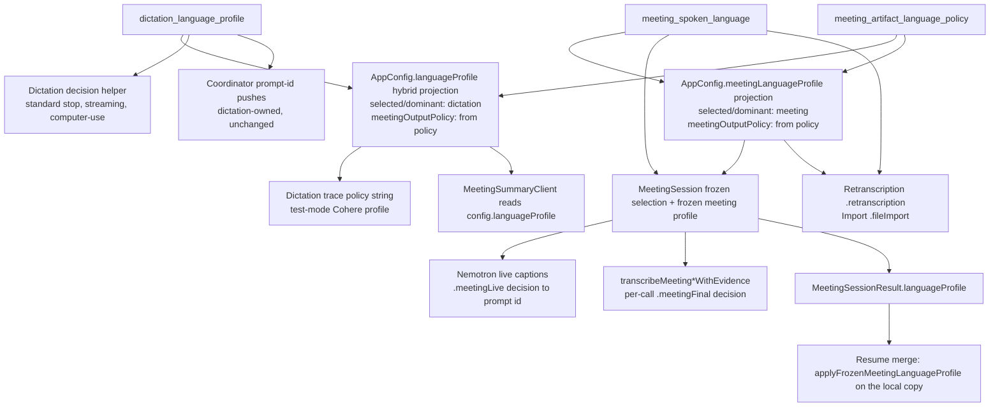
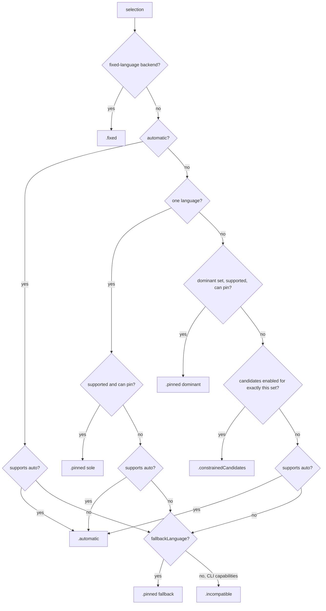
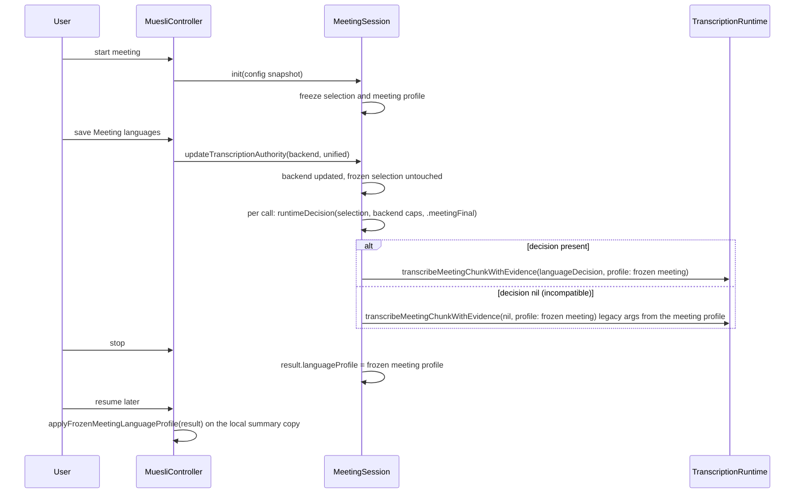

# Separate Meeting Languages and Language Conditioning - Plan

## Goal Capsule

- **Objective:** A user who speaks different languages in meetings than in dictation sets each once in Settings. Every meeting, import, retranscription and Nemotron live caption then follows the meeting selection (the Parakeet live preview does not, R10), meeting notes follow the explicit notes-language policy, dictation follows its own selection, and no language selection can turn a recording into an empty transcript.
- **Means:** One shared spoken-language profile type for both authorities, router semantics of "dominant pins, others accepted" with graceful degradation, a per-meeting frozen selection with a pure per-call decision, and a policy-driven artifact-language projection (KTD1, KTD3, KTD5, KTD7).
- **Authority hierarchy:** Requirements (R-IDs) own product behavior. Key Technical Decisions (KTD-IDs) own mechanism within their cited requirements. Units override neither. Acceptance Examples illustrate.
- **Stop conditions:** Evidence that the labeled Key Decision cannot work. A test failure outside the pinned baseline list in the Verification Contract that the unit cannot explain. Any edit outside the file ownership in System-Wide Impact beyond the one recorded exception (KTD12).
- **Execution profile:** Code. Verification is local only: CI does not run for pull requests against `dev` (`.github/workflows/ci.yml` triggers on `main`). Dev lane A for the manual smoke.
- **Tail ownership:** The implementing pipeline commits, pushes and opens the pull request against `dev`; the orchestrator merges.

---

## Product Contract

### Summary

Give meetings their own spoken-language profile (multi-select plus optional dominant) with a "Meeting languages" card in Settings › Meetings, freeze that profile per meeting, and route every meeting, import and retranscription call through a language decision derived from it. Make the router degrade instead of throw for every selection shape, unify the three dictation paths on the same rule, and make meeting notes take their output language from the explicit notes-language policy instead of the dictation dominant language.

### Problem Frame

`AppConfig.meetingSpokenLanguage` (`meeting_spoken_language`) is persisted but inert: its only references are its declaration, coding key, decode migration and `applyLegacyLanguageProfile` (`native/MuesliNative/Sources/MuesliNativeApp/Models.swift:2014, 2201, 2449-2461, 2772-2778`). It is single-valued (`MeetingSpokenLanguageSelection`, `native/MuesliNative/Sources/MuesliCore/TranscriptionLanguageRouting.swift:102-134`) and has no Settings UI.

Meeting transcription never computes a `LanguageRoutingDecision`. All five meeting transcribe call sites pass `profile: config.languageProfile` (`MeetingSession.swift:1205, 1593, 1987, 2102, 2135`), the deprecated projection built from the dictation profile (`Models.swift:2751-2765`), and `transcribeMeeting*WithEvidence` calls `route()` with no decision (`TranscriptionRuntime.swift:1931-1940, 1983-1992`). Live captions take the Nemotron prompt id from the dictation projection (`MeetingSession.swift:875, 881`). A user who says "this meeting is in Arabic" changes nothing.

The router cannot express the user's real setup. Every backend advertises `constrainedCandidateCapacity: 0` (`Models.swift:344-347`), so two or more selected languages resolve to `.incompatible(.tooManyLanguages)`, and one language on a backend that cannot pin (Parakeet v3, the default) or automatic selection on Cohere or Indic resolves `.incompatible` too. `routeToBackend` throws whenever a decision is `.incompatible` (`TranscriptionRuntime.swift:2484-2486`). Today only dictation reaches that throw: the standard-stop path resolves a decision and forwards it (`MuesliController.swift:12862-12885`), so those selection shapes fail dictation outright. Meetings pass no decision and never throw, but their chunk errors are counted and swallowed (`MeetingSession.swift:1226-1229, 1619-1622, 2014-2017`), so wiring meetings into the unchanged router would turn every non-pinnable or non-detecting selection into a completed meeting with an empty transcript, with no error shown.

Meeting notes language is welded to dictation. The projection maps the explicit `meeting_artifact_language_policy` to `.dominantLanguage` only when it equals the dictation dominant (`Models.swift:2754-2758`), so an explicit Arabic policy silently becomes script detection whenever the dictation dominant is unset or English.

The predecessor plan `docs/plans/2026-08-19-002-feat-language-aware-transcription-fluidaudio-upgrade-plan.md` scoped this as its U4 ("independent meeting spoken-language selector"); that unit never landed.

### Key Decisions

- KD1. **Meeting languages are a separate authority from dictation languages, each with its own Settings card.** (session-settled: user-directed — chosen over one shared language picker with a "use for meetings too" toggle: the user asked to select meeting languages separately from dictation languages.) Governs R1, R3, R5, R14.
- KD2. **A language selection never aborts transcription; the app degrades and explains.** Dictation already fails outright on the throwing shapes, and routing meetings through the unchanged router would produce silent empty meetings because chunk errors are swallowed; degrading is the only outcome that serves both. This is why the router change (U2) lands before meetings adopt the router (U3). Governs R8, R16, R17.
- KD3. **An explicit Arabic notes-language policy is honored unconditionally.** The dictation dominant language stops participating in artifact-language resolution. An explicit English instruction needs new switch arms in `MeetingSummaryClient.swift`, which a sibling change owns, so English is deferred (Scope Boundaries). Governs R6, R21.

### Requirements

**Language authorities and persistence**

- R1. The meeting spoken-language authority has the same shape as the dictation authority: a set of selected languages (empty means automatic) plus an optional dominant language that must be in the set.
- R2. The meeting authority persists under the existing `meeting_spoken_language` key; decoding accepts the new profile shape, the legacy `{mode, language}` shape, an absent key, and a malformed value without failing config load (derivation rule: KTD2).
- R3. Saving one authority never changes the other: a meeting save must not clear `language_profile_needs_confirmation` or rewrite the legacy provider pins, and a dictation save must not change the meeting profile.
- R4. The shared profile type exposes `isBilingual` (two or more selected languages) for both authorities.

**Settings**

- R5. Settings › Meetings shows a "Meeting languages" card directly after the Transcription card, with the same Spoken languages, Dominant language and Save rows as the dictation card; while `language_profile_needs_confirmation` is true and the meeting profile still equals the dictation profile, the meeting card shows the same review-then-save banner, and a meeting save does not clear the flag. The dictation card's rows and save behavior are unchanged; its footer copy follows R8.
- R6. The meeting card includes a "Notes language" row bound to `meeting_artifact_language_policy`, offering Automatic from the meeting and Arabic, saved on change through a seam that surfaces a failed save; a persisted English policy stays persisted and is shown as Automatic until English output is implemented.
- R7. The Meetings Transcription footer explains the meeting selection against the effective meeting source: the final backend with workload `.meetingFinal`, plus a Nemotron line with `.meetingLive` when Nemotron is the live or unified source.
- R8. Presentation copy names the effective behavior of a selection for a backend: automatic detection; pinned to the sole language; pinned to the dominant with the other languages accepted; detecting among several languages; provider fallback (Cohere to English, Indic to Hindi); a fixed-language model that ignores the selection; a model that cannot pin; a model that does not transcribe meetings.
- R9. Each language card carries a one-line caption naming the other card. While a recording is active, the Spoken languages and Dominant language rows say a change applies to the next meeting, and the Notes language row says a change applies to the next meeting and to any notes regenerated after the save (the running meeting's stop-time notes use the policy frozen at its start, A6).
- R10. When the live-preview backend is Parakeet Live Captions and the meeting selection is not English-only, the live-preview row says the preview does not follow meeting languages.

**Transcription conditioning**

- R11. Every meeting transcription call (system chunks, mic chunks, final chunks, the repair pass, the full-session fallback) receives a language decision resolved from the frozen meeting selection with workload `.meetingFinal`.
- R12. Retranscription resolves with `.retranscription` and audio import with `.fileImport`, both from the meeting selection current at the time of the action.
- R13. Nemotron live captions use a prompt id resolved from the frozen meeting selection with workload `.meetingLive`.
- R14. The meeting selection is frozen when a meeting starts; a settings save during a recording applies to the next meeting, and a resumed meeting freezes the selection current at resume.
- R15. When the meeting backend changes during a meeting, the language decision follows the new backend from the frozen selection.
- R16. No selection shape makes `routeToBackend` throw for any shipped app backend: unsupported or non-pinnable cases degrade to automatic detection or the provider's fallback language.
- R17. With two or more selected languages, a set dominant pins every backend that can pin; without a dominant, backends that can detect run automatic detection.
- R18. Dictation's three paths (standard stop, Nemotron streaming, computer-use dictation) resolve the same router decision from the dictation profile.
- R19. Whisper multilingual models accept a pin for every one of the 22 languages the app lists.
- R20. The CLI keeps failing fast on every incompatible decision and when the requested `--language`/`--model` pair would degrade (not pinned, provider fallback, fixed-language mismatch); two or more languages without a dominant on a detecting backend run automatic detection instead of erroring.

**Meeting notes language**

- R21. Meeting notes, titles and failure notes take their output language from `meeting_artifact_language_policy` alone: Arabic when the policy is Arabic, script detection when automatic; a persisted English policy behaves as automatic until English output lands (Scope Boundaries).
- R22. A finished meeting carries its frozen meeting language profile in its result, and the resume merge applies that frozen profile to the meeting authority of its local summary config only.

**Diagnostics and documentation**

- R23. Session traces for meeting start, resume, retranscription and import record the meeting selection with its workload instead of dictation routing.
- R24. `CLAUDE.md`, `CHANGELOG.md` and `scripts/run_ci_test_shard.sh` reflect the change; every new test suite struct is registered in a CI shard.

### Success Criteria

- A Cohere meeting with `[ar, en]` selected and no dominant completes with a non-empty transcript pinned to English, and Settings explains the fallback before the meeting starts.
- A table test proves that for every `BackendOption` and every selection shape (automatic, one supported, one unsupported, two or more with dominant, two or more without) the meeting resolver's decision is one `routeToBackend` accepts.
- The dictation card's rows, save flow and persisted keys are unchanged. Dictation routing for the shapes that threw before KTD3 (one language on a backend that cannot pin, automatic on Cohere or Indic, two or more languages without a dominant) now degrades per R16, and the dictation footer shows the R8 copy; the two reversed tests in KTD3 pin that change.
- The full `swift test` run fails only tests in the pinned baseline list (Verification Contract), and every test this branch adds or modifies passes.

### Acceptance Examples

- AE1. Upgrade from a legacy config
  - **Covers:** R2
  - **Given:** `config.json` holds `"meeting_spoken_language": {"mode":"explicit","language":"ar"}` and `dictation_language_profile` is `[ar, en]` with dominant `en`.
  - **When:** the app launches.
  - **Then:** the meeting card shows `[ar, en]` with dominant `en`, the next meeting is conditioned as meetings were before the upgrade, one stderr line reports the ignored legacy value, and config saves re-encode the profile shape.
- AE2. Cohere with an automatic meeting selection
  - **Covers:** R8, R16
  - **Given:** the meeting backend is Cohere Transcribe and the meeting selection is automatic.
  - **When:** a meeting runs.
  - **Then:** every chunk is transcribed with English pinned, no chunk throws, and the Transcription footer says Cohere cannot detect languages and will transcribe in English.
- AE3. Whisper with two languages and a dominant
  - **Covers:** R11, R17
  - **Given:** the meeting backend is Whisper Large Turbo and the meeting selection is `[ar, en]` with dominant `ar`.
  - **When:** a meeting runs.
  - **Then:** every chunk decision is `.pinned(.arabic)` and the footer says "pinned to Arabic; English also accepted".
- AE4. Change languages during a recording
  - **Covers:** R14
  - **Given:** a meeting is recording with selection `[en]`.
  - **When:** the user saves `[ar]` in the meeting card.
  - **Then:** the running meeting keeps `[en]`, the card shows the next-meeting caption, and the next meeting uses `[ar]`.
- AE5. Backend swap during a meeting
  - **Covers:** R15
  - **Given:** a meeting is recording on Whisper with selection `[ar]`.
  - **When:** the meeting backend is replaced by Parakeet v3 (model deleted).
  - **Then:** the frozen selection is unchanged, the next chunk resolves `.automatic` for Parakeet, and no chunk throws.
- AE6. Explicit Arabic notes with an automatic meeting selection
  - **Covers:** R21
  - **Given:** `meeting_artifact_language_policy` is `arabic`, the meeting selection is automatic, and the dictation dominant is `en`.
  - **When:** notes are generated for an English transcript.
  - **Then:** the summary and title instructions ask for Arabic output and failure notes use the Arabic heading.
- AE7. Meeting save leaves dictation alone
  - **Covers:** R3
  - **Given:** `language_profile_needs_confirmation` is true, the dictation profile is `[de, hi]`, and the provider pins are `cohere=de`, `indic=hi`.
  - **When:** the user saves `[en]` in the meeting card.
  - **Then:** the encoded `dictation_language_profile`, the four legacy pins and the confirmation flag are byte-identical before and after.

### Scope Boundaries

**In scope:** the shared profile type and decode rule, the router semantics and presentation copy, meeting-session freezing and decision plumbing, live-caption prompt id, retranscription and import decisions, dictation path unification, the artifact-language projection, the Settings card with its notes-language row and captions, trace workload, docs and CI shard registration.

**Non-goals:** removing the deprecated `AppConfig.languageProfile` projection (40+ call sites); editing `MeetingSummaryClient.swift` function signatures or call sites; touching the meeting realtime audio path beyond KTD12; changing Apple Speech's global locale picker; changing Models-tab language explanations; assigning the twelve theme-commit suites that the CI shard guard already reports missing on `dev`.

#### Deferred to Follow-Up Work

- Whisper constrained-candidate decoding for a selected pair (KTD13).
- Per-meeting persisted language and backend columns plus CloudKit fields, and a Re-transcribe tooltip that names the model and language that will be used.
- An explicit English notes instruction: honoring English needs a new `MeetingOutputLanguage` case and switch arms in `MeetingSummaryClient.swift`, which a sibling change edits now; land it after that change merges, and re-enable English in the Notes language row then.
- Surfacing the failed-chunk rate in the meeting record or notes instead of the trace only.
- Removing the inert legacy provider pins (`whisper_language`, `nemotron35_language`, `cohere_language`, `indic_asr_language`) and the legacy `.dominantLanguage` output policy case.
- A CLI `--dominant-language` flag so the CLI can reach a `.pinned` decision with two or more languages.
- Registering the twelve pre-existing unassigned theme suites in the CI shard script.
- Measured mixed-language quality as a release gate for "dominant pins, others accepted" (the transcription-quality harness owns that measurement).
- Capability-aware meeting backend selection (switching to a downloaded backend that can honor the selection), the routing direction the ideation document lists separately.
- A user-visible record or notification when a mid-meeting backend swap changes the effective language decision (today: trace only).
- A downgrade guard for the three profile keys; tier-A rollback loss is the pre-existing dictation contract.

### Sources

- `docs/plans/2026-08-19-002-feat-language-aware-transcription-fluidaudio-upgrade-plan.md` (U4 rows for the selector, freeze, and trace; the persisted-row and sync rows stay deferred).
- `docs/ideation/2026-08-31-transcription-multilingual-ideation.html`, idea 2 ("Wire the meeting language setting to real conditioning").
- Router and capabilities: `native/MuesliNative/Sources/MuesliCore/TranscriptionLanguageRouting.swift:44-100, 157-194, 196-240, 289-351`, `native/MuesliNative/Sources/MuesliNativeApp/Models.swift:287-355, 409-468, 542-555`.
- Runtime dispatch: `native/MuesliNative/Sources/MuesliNativeApp/TranscriptionRuntime.swift:1685-1796` (dictation template), `:1906-1994` (meeting variants), `:2447-2628` (`route`/`routeToBackend`), `:2680-2716` (Whisper candidates).
- Meeting session: `native/MuesliNative/Sources/MuesliNativeApp/MeetingSession.swift:447-459, 564-582, 657-665, 761-767, 857-896, 1159-1194, 1464`; construction pattern in `native/MuesliNative/Tests/MuesliTests/MeetingSessionTitleTests.swift:117-152`.
- Settings and persistence: `native/MuesliNative/Sources/MuesliNativeApp/SettingsView.swift:153-155, 373-385, 834-837, 842-936, 1025-1030, 1718-1720, 3546-3572`, `LanguageProfileSettingsModel.swift`, `AppState.swift:173`, `MuesliController.swift:2193-2212`, `ConfigStore.swift:71-74, 95-141`.
- Artifact language: `native/MuesliNative/Sources/MuesliNativeApp/MeetingOutputLanguage.swift:49-58`, `Models.swift:610-642, 660-763, 2428-2432, 2467-2474, 2751-2812`, `SessionTraceRuntime.swift:227-303`.
- Dictation paths: `MuesliController.swift:42-79, 1168, 3075, 10370-10391, 11484-11510, 11809-11810, 12148-12168, 12862-12885`.
- CI shard guard: `scripts/test_ci_test_shards.sh`, `scripts/run_ci_test_shard.sh`, `scripts/ci_unsharded_test_suites.txt`.

---

## Planning Contract

### Key Technical Decisions

- KTD1. **One shared profile type, `SpokenLanguageProfile`, produced by renaming `DictationLanguageProfile` in MuesliCore, with no compatibility alias.** The rename touches five source files and four test files mechanically (U1); `Package.swift` has no warnings-as-errors, but a deprecated alias would stamp about nineteen permanent warnings on files this plan keeps using. The type keeps its validating decoder (dominant must be in the set). Add `isBilingual` (R4). Do not add a second "dominant else sole" rule: `authoritativeLanguage` lives on `TranscriptionLanguageSelection` (the router input every consumer already holds) and `SpokenLanguageProfile` delegates to `selection.authoritativeLanguage`; the deprecated `LanguageProfile.authoritativeLanguage` stays until that type is removed. Naming rule to keep the two structs from being merged later: Profile is the validated Codable config value; Selection is the router input with a synthesized decoder. `AppConfig.meetingSpokenLanguage` becomes `SpokenLanguageProfile` with default `.automatic`. The `MeetingSpokenLanguageSelection` enum leaves MuesliCore (no CLI or test references) and survives only as a private decode-only adapter in `Models.swift` (A7). Rejected: a third struct (duplicate validation) and reusing `TranscriptionLanguageSelection` as the config type (its synthesized decoder bypasses validation). Cites KD1.
- KTD2. **Decode rule for `meeting_spoken_language`, legacy adapter probed first.** Order is load-bearing: the profile decoder uses optional keys, so `{}` and `{"mode":"automatic"}` both decode as a valid automatic profile if the profile shape is tried first. The rule, in `AppConfig.init(from:)`: (1) if the value is an object containing a `mode` key, it is legacy and carries no user intent (A1): copy the already-migrated dictation profile (selected set plus dominant) and log one stderr line; (2) else if it decodes and validates as `SpokenLanguageProfile`, use it; (3) else (absent, non-object, unknown language code, dominant outside the set) copy the dictation profile. The precedence table in High-Level Technical Design is the owning statement of every on-disk shape. "Copy" means a copy of the post-migration dictation profile, so a pin-derived, unconfirmed dictation set is inherited by meetings; the meeting card then shows the review banner while `language_profile_needs_confirmation` is true and the two profiles are equal (R5). Encoding writes only the profile shape with the same camelCase nested keys as `dictation_language_profile`; `.automatic` serializes as `{"selectedLanguages":[]}`. `applyLegacyLanguageProfile` writes the profile shape (onboarding keeps meeting equal to dictation). Rollback contract: Migration and Compatibility. Governs R2.
- KTD3. **Router semantics: reuse `.pinned` and `.automatic`, add a `fallbackLanguage` capability, and soften every selection-shape incompatibility.** `TranscriptionBackendCapabilities` gains `fallbackLanguage: TranscriptionLanguage?` (Cohere `.english`, Indic `.hindi`, others and the CLI's own capabilities builder nil). `TranscriptionLanguageRouter.resolve` keeps `backendUnavailable` and `unsupportedWorkload` as hard incompatibilities and resolves selection shapes as sketched in High-Level Technical Design. With app `BackendOption` capabilities, `.incompatible` for a selection reason is unreachable; with CLI capabilities (nil fallback) it stays reachable, which R20 relies on. Rejected: a new decision arm (ten exhaustive switches across `TranscribeCommand.swift`, `TranscriptionRuntime.swift`, `SessionTraceRuntime.swift`, `Models.swift`) and advertising candidate capacity on every backend (only Whisper implements candidates). Deliberate reversal: the test "an unsupported explicit language never becomes Auto" (`TranscriptionLanguageRoutingTests.swift:23-38`) and the `incompatible` expectation in `SessionTraceRuntimeTests.swift:8-29` invert; both were pinned before KD2. Challenge outcome: the directive scoped never-abort to `.tooManyLanguages`, but the identical throw fires for `.languageUnsupported` and `.automaticDetectionUnsupported`, so the softening covers all three. Governs R16, R17.
- KTD4. **Pure MuesliCore helpers drive the runtime, the Settings copy, and the CLI guard.** Both are typed on `TranscriptionBackendCapabilities`, never on `BackendOption`, so MuesliCore keeps zero dependencies and the CLI can use them. `TranscriptionLanguageRouter.runtimeDecision(selection:capabilities:workload:)` returns the router decision or nil when it is `.incompatible` for any reason, so callers on the nil-decision legacy branch never hand `route()` a throwing value. The hard reasons keep today's meeting behavior on that branch: an unavailable backend still fails at model load as it does now, and Nemotron under `.meetingFinal` (`.unsupportedWorkload`) still transcribes through the legacy prompt-id argument; nothing new is surfaced for them. `LanguageRoutingDecision.degradation(for selection:)` returns `.notPinned(language)` (the decision is `.automatic` and `selection.authoritativeLanguage` is non-nil), `.providerFallback(to: x)` (the decision is `.pinned(x)` and `x` differs from `selection.authoritativeLanguage`, which covers automatic, `[hi]` and `[ar, en]` on Cohere alike while `.pinned(sole)` and `.pinned(dominant)` stay degradation-free), or `.fixedLanguageIgnoresSelection(language)` (the decision is `.fixed(f)`, the selection is not automatic, and `selectedLanguages` contains a language other than `f`; the payload is the first such language). `LanguageSelectionPresentation` gains a `degradation` field and a `.degraded` state; its copy covers every R8 case, and the `.incompatible` arm splits so `.unsupportedWorkload` says the model does not transcribe meetings while the old "cannot honor" text remains only for CLI-shaped capabilities. The dead `LanguageProfileEffectiveBehavior` is not resurrected. The CLI keeps its existing fail-fast on every `.incompatible` decision and additionally errors when the degradation is non-nil (R20). One app-side owner maps a decision to a Nemotron prompt id (`.pinned`/`.fixed` of a Nemotron language to its id, everything else to the default), used by live captions (KTD5), streaming dictation (KTD9), and optionally the runtime's Nemotron arm.
- KTD5. **The meeting session freezes two constants and resolves the decision per call.** `MeetingSession` gains `frozenLanguageSelection: TranscriptionLanguageSelection` and `frozenMeetingProfile: LanguageProfile` (built by the meeting projection, KTD7), both seeded in `init` from the config snapshot and never re-read; the lock-held `TranscriptionAuthorityState`, `updateTranscriptionAuthority`, and `currentBackend()` are unchanged. Each of the five call sites reads the backend as today and computes `runtimeDecision(frozenLanguageSelection, backend.languageCapabilities(isAvailable: true), .meetingFinal)` in place, passing it as `languageDecision:` with `profile: frozenMeetingProfile`; a backend swap therefore changes the next decision by construction (R15) and there is no second mutable field to pair with the backend. Live captions resolve the same selection against `BackendOption.nemotron35Multilingual.languageCapabilities(isAvailable: true)` with `.meetingLive` and map through the KTD4 prompt-id owner, so the footer (R7) and the engine agree by construction. Rationale correction: Nemotron has `.meetingLive` but not `.meetingFinal`, and `MeetingLiveCaptionBackend` is not a `BackendOption`. In unified-Nemotron mode most final text comes from the live stream, so the `.meetingLive` prompt id conditions it; the chunk decision fills tails. The two coordinator-level prompt-id pushes (`MuesliController.swift:1168, 3075`) stay dictation-owned. Challenge outcome: "once per meeting" means the selection once and the decision per call, because a settings save or model deletion swaps the backend mid-meeting (`MuesliController.swift:3229-3234`). Governs R11, R13, R14, R15.
- KTD6. **Runtime seam mirrors dictation.** `transcribeMeeting`, `transcribeMeetingWithEvidence`, `transcribeMeetingChunk` and `transcribeMeetingChunkWithEvidence` gain `languageDecision: LanguageRoutingDecision? = nil` and forward it into `route`; the legacy language arguments stay because `routeToBackend` reads them only when the decision is nil. Governs R11, R12.
- KTD7. **Artifact language comes from the policy, through projections, without touching `MeetingSummaryClient.swift`.** `MeetingOutputLanguagePolicy` gains `.english` and `.arabic`; `.dominantLanguage` is marked deprecated and reachable only from the legacy `language_profile` decode. `MeetingOutputLanguage.resolve` switches on the explicit cases before the legacy branch; `.arabic` yields Arabic and `.english` yields the existing unspecified result, because an explicit English instruction needs new `MeetingOutputLanguage` and `MeetingSummaryClient` switch arms that are deferred (KD3), so the Notes language row does not offer English in this plan. Two conversion helpers are the single owners of the policy mapping: `MeetingArtifactLanguagePolicy.outputPolicy` and `MeetingOutputLanguagePolicy.artifactPolicy(dominantLanguage:)`, replacing the duplicated switches in the decode migration and `applyLegacyLanguageProfile`. The existing `AppConfig.languageProfile` projection becomes a hybrid: dictation selected/dominant, `meetingOutputPolicy` from the artifact policy; its doc comment says so. Its policy field has exactly three readers, `MeetingOutputLanguage.resolve` (through the ten `MeetingSummaryClient` reads), the dictation trace string, and the test-mode Cohere profile, so the behavior changes are: dictation traces emit `automatic|english|arabic`, the test-mode Cohere branch stops collapsing to the full dictation profile, and `ModelsTests.swift:603` flips from `.dominantLanguage`. A new deprecated `AppConfig.meetingLanguageProfile` projection (meeting selected/dominant plus the same policy) feeds the `profile:` arguments of meeting transcription, retranscription, import, and failure notes; both projections must agree on `meetingOutputPolicy` (parity test). Invariant: `LanguageProfile.init` gains no validation arm for the new cases, so the projections' `try?` fallback cannot collapse an explicit policy to `.automatic`. `MeetingSessionResult.languageProfile` is set from the frozen meeting projection. The resume merge's local summary config is derived by an internal `nonisolated static` helper on `MuesliController` that takes the base config and the result and returns the local copy through `AppConfig.applyFrozenMeetingLanguageProfile` (total mapping: `.arabic`, `.english`, `.dominantLanguage` by dominant else automatic, `.automatic`); the helper never mutates its input, so the isolation is testable without a session or a summarizer, and `applyLegacyLanguageProfile` leaves the resume path. Challenge outcome: the directive's literal "meeting dominant plus policy" formula collapses for the same structural reason as today (no explicit-language case), so the dominant language is dropped from artifact resolution and the policy is honored directly. Governs R21, R22.
- KTD8. **Settings card by parameterization, second model instance, and side-effect-free save seams.** A private `languageProfileSection(title:editor:client:backend:spokenLanguagesDescription:dominantLanguageDescription:saveTitle:showsMigrationConfirmation:)` renders both cards; the dictation wrapper passes today's values, and the meeting card passes the selected meeting backend so its footer explains the right source. `AppState.meetingLanguageProfileSettings` is a second `LanguageProfileSettingsModel` (no model change needed). `MuesliController.saveMeetingLanguageProfile` and `meetingLanguageProfileClient()` mirror the dictation seam; the client's presentation closure uses `.meetingLive` for a streaming backend and `.meetingFinal` otherwise (the same rule `languageCapabilities` applies). `ConfigStore.saveMeetingLanguageProfileConfiguration` calls only the canonical save (no banner clear, no pin mirroring). The section's migration-banner parameter becomes a condition: the dictation card shows it while the flag is true, the meeting card while the flag is true and the meeting profile equals the dictation profile (R5). The Notes language row saves through a throwing controller method on the same canonical seam so a quarantined config shows an error caption instead of the silent no-op `updateConfig` has under quarantine. `onAppear` loads and `onChange(of: appState.config.meetingSpokenLanguage)` resynchronizes the meeting editor. Governs R3, R5, R6, R7, R9, R10.
- KTD9. **Dictation paths converge on one helper.** The three sites keep their `LanguageProfile`-typed job structs (the legacy arguments still read them); a `nonisolated static` helper on the controller derives the router decision from the profile's selection and the backend's capabilities with `.dictation`, and the KTD4 prompt-id owner maps it for streaming. Standard stop, streaming, and computer-use all call the helper; computer-use passes the decision into `transcribeDictation`. Governs R18.
- KTD10. **Traces get a workload-aware overload.** `SessionTraceSnapshot.languageProfile(backend:selection:workload:meetingOutputPolicy:)` is added; the existing overload delegates with `.dictation` so its tests keep passing. Governs R23.
- KTD11. **Extend `WhisperKitLanguage` to all 22 codes.** WhisperKit takes the raw ISO code, so the enum gap is the only reason a `.pinned` decision for Dutch, Bengali, Greek, Kannada, Malayalam, Marathi, Polish, Tamil, Telugu or Vietnamese throws. Governs R19.
- KTD12. **Ownership exception, recorded.** The repair-pass call in `repairSystemSegmentsIfNeeded` (`MeetingSession.swift:2099-2105`) lies inside the sibling audio-pipeline zone; this plan changes only its `profile:`/`languageDecision:` arguments so the repair pass is conditioned like the other four call sites. No realtime, AEC or VAD logic is touched.
- KTD13. **Whisper constrained candidates stay deferred.** Cost is one full decode per candidate language per request, a silent candidate throws `invalidScore` (`TranscriptionRuntime.swift:2697-2699`), the conformance gate was left unproven by the predecessor plan, and capabilities have no per-workload candidate field. The dominant-pin and automatic arms deliver R17 without it. The stale comment at `Models.swift:344` that cites the predecessor's KTD3 is reworded to cite that plan by filename.

### High-Level Technical Design

Authorities, projections and consumers after the change:

Decode precedence for `meeting_spoken_language` (owning statement for KTD2):

| On-disk value | Result |
|---|---|
| absent | copy of the migrated dictation profile |
| object with a `mode` key (`{"mode":"automatic"}`, `{"mode":"explicit","language":"ar"}`, `{"mode":"explicit"}`, mixed with profile keys) | copy of the dictation profile, one stderr line |
| `{"selectedLanguages":["ar","en"],"dominantLanguage":"ar"}` | that profile |
| `{}` or an object with only unknown keys | automatic profile (this is the profile decoder's empty case) |
| `{"selectedLanguages":["ar","ar","en"]}` | normalized `[ar, en]` |
| dominant outside the set, unknown language code, `"dominantLanguage":"auto"` | copy of the dictation profile |
| non-object (`7`, `"ar"`, `null`, `[]`) | copy of the dictation profile |

Router resolution after KTD3 (selection shapes only; `backendUnavailable` and `unsupportedWorkload` stay hard):

With app backends every path reaches `.fixed`, `.automatic`, or `.pinned`. The degradation helper (KTD4) names the cases where the decision is not what the selection asked for.

Meeting lifecycle of the language authority, including the legacy branch where the silent-failure history lives:

### Assumptions

Un-validated agent bets made because this run had no synchronous user. Each names the alternative.

- A1. A persisted legacy `{mode, language}` value carries no user intent: no UI ever wrote it (its only writers are the decode fallback and `applyLegacyLanguageProfile`), it was never written by a tagged release (it exists on every identity that ran a `dev` build since 2026-08-19, including the maintainer's production identity), and it is dead at runtime today (zero readers). Copying the dictation profile is the no-behavior-change option; honoring `explicit(l)` as a one-language profile would change meeting conditioning for a value the user never saw. Alternative: honor it.
- A2. The "Notes language" row ships in this plan; without it the explicit policy is reachable only through migrated or hand-edited configs.
- A3. Degradations surface in the Settings footer, one stderr line at decode, and session diagnostics; there is no start-time alert. Precedent: model normalization logs to stderr only (`MuesliController.swift:2049`).
- A4. CLI `--language ar,en` without a dominant proceeds with automatic detection (a behavior change from today's error); degraded single-language combinations keep failing fast.
- A5. The exact caption wording in U6's copy list is the implementer's to finalize; the meaning of each caption is fixed by R8, R9 and R10.
- A6. A running meeting's stop-time summary and failure notes use the config snapshot frozen at its start, as today (`MeetingSession.config` is immutable). Regeneration paths (`resummarize`, `regenerateNotesFromCleanedTranscript`, launch-time pending regeneration) keep reading live meeting settings, as they read live dictation settings today. The resume merge is same-process: it applies the in-memory result's frozen profile to a local summary copy; nothing persists the frozen profile across an app restart (per-meeting persistence stays deferred).
- A7. `MeetingSpokenLanguageSelection` survives only as a private decode-only adapter in `Models.swift` that names the legacy keys; legacy-ness is decided by the `mode` key probe in KTD2, never by whether the adapter decodes.
- A8. Meeting cleanup gating by a sibling change (mixed-language repair) will read `isBilingual` from the live meeting profile at cleanup time; this plan only exposes the predicate.
- A9. The meeting card sits after the Transcription card (not first) so its footer explains the backend chosen directly above it; the dictation pane's languages-first order is not mirrored.

### Migration and Compatibility

- Config decode follows the precedence table (KTD2); encode writes the profile shape only. Round-trip tests assert exact serialized bytes under `sortedKeys`.
- `applyLegacyLanguageProfile` keeps its onboarding caller and writes the profile shape; the resume merge switches to `applyFrozenMeetingLanguageProfile` (KTD7).
- `MeetingOutputLanguagePolicy` gains two raw values; the only persisted surface is the free-form `meetingOutputPolicy` string in the session-trace `language_profile` artifact (schema version 3 unchanged, no parser). SQLite meeting rows and CloudKit records carry no language fields.
- Rollback, tier A (a tagged release from `main`): it reads only the four provider pins and its first re-save drops `dictation_language_profile`, `meeting_spoken_language` and `meeting_artifact_language_policy`. Re-upgrading re-derives dictation from the mirrored pins with the confirmation banner on, and meetings become a copy of that. Loss: meeting selection, dictation dominant, artifact policy, non-dominant dictation languages. This is the pre-existing dictation contract, now stated.
- Rollback, tier B (a `dev` build older than this change): its legacy adapter fails on the new shape, so it falls back to its pin-derived value and re-saves the legacy shape; re-upgrading copies dictation. Loss: the meeting selection only; the artifact policy survives under its own key.
- A pin-only config (for example a fresh lane identity) gains all three profile keys on its first save by the new build; pins still mirror only on dictation save or onboarding, as today.

### System-Wide Impact

- **Sibling pull requests in flight.** A custom-instructions change edits `MeetingSummaryClient.swift` signatures and `DictationCleanupPromptComposer`; this plan does not touch those files. A reverse-leak-suppression change owns the meeting realtime audio path and `MeetingNeuralAec.swift`; this plan touches only the repair-pass call arguments (KTD12), which the implementing pipeline must report.
- **CLI.** `MuesliCLI/TranscribeCommand.swift` gains the degradation guard (KTD4) so agent-facing behavior stays fail-fast; the only CLI behavior change is A4.
- **Traces.** Meeting traces switch from `.dictation` to their real workload (KTD10), and every trace's `meetingOutputPolicy` string now carries `automatic|english|arabic` instead of `automatic|dominant_language`; schema version unchanged.
- **Dictation-owned sites left in place.** The coordinator prompt-id pushes at `MuesliController.swift:1168, 3075` and the test-mode Cohere profile at `:12155-12159` keep reading the dictation projection by design.
- **CI shard guard.** `scripts/test_ci_test_shards.sh` fails the `main` build job when a new `@Suite` struct is unregistered; it already reports twelve unassigned theme suites on `dev`, so the gate for this branch is "adds no new missing suite". New suites use the two-line `@Suite("…")` / `struct …Tests` form the discovery script recognizes.
- **Docs.** `CLAUDE.md`'s Nemotron "Known Limitations" bullet describes a retired `nemotron35_language` picker and its tests line is stale (the tree has about 2,760 tests in about 246 suites); `CHANGELOG.md` gets a group under Unreleased; `docs/art-direction/muesli-app-shell/settings-ia.md` gets the new card in its map.

### Risks and Mitigations

| Risk | Mitigation |
|---|---|
| Meetings adopting the router abort on the first chunk for non-pinnable or non-detecting backends | KTD3 softens every selection-shape arm; the table test in U3 proves every app backend and shape yields an accepted decision; `runtimeDecision` maps `.incompatible` to nil |
| Profile shape probed before the legacy adapter makes the copy-dictation branch dead | KTD2 fixes the order; U1 asserts `{"mode":"automatic"}` with dictation `[ar]/ar` yields `[ar]/ar`, not automatic |
| A decision computed for one backend is used after a mid-meeting backend swap | KTD5 computes the decision per call from the backend just read; AE5 is a pure-function test |
| Meeting save reuses the dictation save seam and clears the dictation migration banner or mirrors pins | KTD8 adds a canonical-only save; AE7 pins byte-identical dictation keys, pins and flag |
| Dictation save mutates the meeting profile through a stale config snapshot | ConfigStoreTests: a dictation save with meeting `[ar, en]/ar` reloads the meeting profile unchanged |
| Explicit notes policy collapses to automatic through a future validation arm and the projection's `try?` | KTD7 invariant; U5 asserts `config.languageProfile.meetingOutputPolicy == .arabic` with dominant nil |
| Resume applies the frozen profile to the live config instead of the local copy | U5 asserts the resume-merge helper leaves its input config unchanged and returns a copy carrying the frozen profile |
| Upgraders resolve the dictation banner and meetings keep an unconfirmed pin-derived copy forever | R5 shows the same banner on the meeting card while the flag is true and the profiles are equal; the caption in R9 names the other card |
| Reversed router tests land as a side effect rather than a decision | KTD3 names the reversed tests; U2 rewrites them with the new expectation and reason |
| Whisper `.pinned` throws for the ten codes missing from `WhisperKitLanguage` | KTD11 extends the enum in U2 |
| Presentation copy misleads once Cohere/Indic fall back instead of "cannot honor" | KTD4 adds the degraded state and R8 copy in the same unit as the router change |
| Live captions and dictation streaming derive prompt ids by different rules | KTD4's single prompt-id owner is used by both (KTD5, KTD9) |
| New test suite structs break the `main` CI shard guard | U7 registers them and checks the guard's missing list |
| Parakeet Live Captions ignore the selection with no explanation | R10 caption; the live backend has no capabilities, so no routing explanation is possible |

### Delivery Sequence

U1 → U2 → U3 → U4 → U5 → U6 → U7. U2 depends on U1 step 1 only (`authoritativeLanguage` on the selection). U4 depends on U2 and can run alongside U3. U5 depends on U1 (projections) and U3 (result freeze). U6 depends on U1, U2 (presentation states) and U5 (notes-language seam).

---

## Implementation Units

### U1. Shared spoken-language profile type, meeting config decode, and projections

- **Goal:** Both authorities share one validated profile type, the meeting profile persists in the new shape, every legacy input decodes deterministically, and both projections exist for downstream units.
- **Requirements:** R1, R2, R3 (encode side), R4; KD1; KTD1, KTD2, KTD7 (projection definitions only).
- **Dependencies:** none.
- **Files:** `native/MuesliNative/Sources/MuesliCore/TranscriptionLanguageRouting.swift`; `native/MuesliNative/Sources/MuesliNativeApp/Models.swift` (`AppConfig.meetingSpokenLanguage`, the language decode block, `applyLegacyLanguageProfile`, the private legacy adapter, both projections, the projection doc comment); rename sites in `native/MuesliNative/Sources/MuesliNativeApp/LanguageProfileSettingsModel.swift`, `MuesliController.swift`, `SessionTraceRuntime.swift`; tests `native/MuesliNative/Tests/MuesliTests/ModelsTests.swift` (holds the `LanguageProfileTests` suite), `native/MuesliNative/Tests/MuesliTests/ConfigStoreTests.swift`, `native/MuesliNative/Tests/MuesliTests/NemotronStreamingTests.swift` (the `applyLegacyLanguageProfile` cases), plus the other test files that name the renamed type.
- **Approach:**
  1. Add `authoritativeLanguage` to `TranscriptionLanguageSelection` (KTD1); U2 depends on this step.
  2. Rename `DictationLanguageProfile` to `SpokenLanguageProfile` everywhere, add `isBilingual`, delegate `authoritativeLanguage` to the selection, and move the legacy adapter into `Models.swift` as a private type.
  3. Implement the KTD2 decode rule with the precedence table as the test oracle; emit the one-line stderr log for the legacy shape.
  4. Rewrite `applyLegacyLanguageProfile` to the profile shape.
  5. Add the `meetingLanguageProfile` projection and make the existing projection's policy come from the artifact policy through the KTD7 conversion helpers; rewrite the projection's doc comment.
- **Patterns to follow:** the profile's validating `init(from:)`; `AppConfig` tolerant decode with `try?` and `defaults`; `LegacyLanguageCodingKeys` second container; stderr logging as at `MuesliController.swift:2049`.
- **Test scenarios:**
  - Every row of the decode precedence table decodes to its stated result; the legacy-shape rows use dictation `[ar, en]/en` and assert `[ar, en]/en`. Covers AE1.
  - `{"mode":"automatic"}` with dictation `[ar]/ar` yields `[ar]/ar`, not an automatic profile.
  - Encoding `.automatic` writes exactly `"meeting_spoken_language":{"selectedLanguages":[]}` and `[ar, en]/ar` writes `{"dominantLanguage":"ar","selectedLanguages":["ar","en"]}` under `sortedKeys`; a save-and-reload round trip preserves the profile.
  - The new shape decoded through the retained legacy adapter yields nil (documents the tier-B fallback).
  - `isBilingual` is false for automatic and one language, true for two; `authoritativeLanguage` is the dominant, else the sole language, else nil.
  - `applyLegacyLanguageProfile` with selected `[ar, en]` and dominant `ar` writes the same profile to both authorities.
  - Provider-pin migration `cohere=de, indic=hi` yields dictation `[de, hi]`, confirmation true, meeting `[de, hi]`, artifact policy automatic.
  - Legacy `language_profile` with a dominant yields the mapped explicit artifact policy and a meeting profile equal to the migrated dictation profile.
  - Both projections report the same `meetingOutputPolicy` for every `MeetingArtifactLanguagePolicy` case; the meeting projection carries the meeting selection and the hybrid projection carries the dictation selection.
- **Verification:** `ModelsTests`, `ConfigStoreTests`, `NemotronStreamingTests` pass with the updated expectations; the app target and CLI compile with no remaining `DictationLanguageProfile` symbol.

### U2. Router degradation semantics, presentation copy, Whisper codes, CLI guard

- **Goal:** No selection shape resolves to a throwing decision for any shipped app backend, the effective behavior is explained, and the CLI keeps its fail-fast contract.
- **Requirements:** R8, R16, R17, R19, R20; KD2; KTD3, KTD4, KTD11, KTD13.
- **Dependencies:** U1 step 1.
- **Files:** `native/MuesliNative/Sources/MuesliCore/TranscriptionLanguageRouting.swift` (capabilities, `resolve`, `runtimeDecision`, degradation helper); `native/MuesliNative/Sources/MuesliNativeApp/Models.swift` (`BackendOption.languageCapabilities` and its stale comment, `LanguageSelectionPresentation`, the presentation extension, `WhisperKitLanguage`, the Nemotron prompt-id owner); `native/MuesliNative/Sources/MuesliCLI/TranscribeCommand.swift` (post-resolve guard); tests `native/MuesliNative/Tests/MuesliTests/TranscriptionLanguageRoutingTests.swift`, `native/MuesliNative/Tests/MuesliTests/LanguageSelectionPresentationTests.swift`, `native/MuesliNative/Tests/MuesliTests/SessionTraceRuntimeTests.swift`, `native/MuesliNative/Tests/MuesliTests/ModelsTests.swift`, `native/MuesliNative/Tests/MuesliTests/NemotronStreamingTests.swift` (`Nemotron35LanguageTests` for the prompt-id owner), and the existing CLI language tests if present.
- **Approach:**
  1. Add `fallbackLanguage` to the capabilities and set it for Cohere and Indic.
  2. Replace the selection-shape arms of `resolve` with the KTD3 sketch; keep the constrained-candidates arm reachable only for a no-dominant selection that exactly matches the advertised set; add `runtimeDecision`.
  3. Add the degradation helper, the `degradation` field and `.degraded` state, the split `.incompatible` copy, and copy for every R8 case ("pinned to X; Y also accepted", "detecting among X and Y").
  4. Add the Nemotron prompt-id owner beside `Nemotron35Language` and extend `WhisperKitLanguage` to the 22 codes.
  5. In the CLI, keep the existing `.incompatible` fail-fast and, after `resolve`, also error when the degradation is non-nil, with the existing "choose a compatible --model/--language" guidance.
  6. Rewrite the reversed tests with the new expectation and a one-line reason each; reword the stale predecessor-plan comment at the capabilities table.
- **Patterns to follow:** existing `resolve` arm order; `LanguageSelectionPresentation.State` and its `explanation` copy; `Nemotron35Language(rawValue:)` mapping style.
- **Test scenarios:**
  - `[en, ar]` dominant `ar` on Whisper multilingual resolves `.pinned(.arabic)`; presentation degradation is nil and copy says pinned to Arabic with English accepted. Covers AE3.
  - `[ar, en, fr]` without a dominant on Whisper resolves `.automatic`; presentation says detecting among the three.
  - `[en, ar]` without a dominant with candidates advertised for exactly that pair resolves `.constrainedCandidates`; with a dominant it resolves `.pinned(dominant)`.
  - Automatic on Cohere resolves `.pinned(.english)` with degradation `.providerFallback(.english)`; automatic on Indic resolves `.pinned(.hindi)`. Covers AE2.
  - `[hi]` on Cohere (unsupported, no auto) resolves `.pinned(.english)` with provider-fallback degradation.
  - `[ar]` on `BackendOption.parakeetMultilingual` (cannot pin) resolves `.automatic` with degradation `.notPinned(.arabic)`.
  - `[ar]` on Whisper `.en` (fixed English) resolves `.fixed(.english)` with degradation `.fixedLanguageIgnoresSelection(.arabic)`; `[ar, en]` without a dominant on the same model resolves `.fixed(.english)` with the same degradation.
  - `[ar, en]` without a dominant on Cohere resolves `.pinned(.english)` with degradation `.providerFallback(.english)` and copy naming the fallback (success criterion 1).
  - `[nl]` on Whisper multilingual resolves `.pinned(.dutch)` and `WhisperKitLanguage(rawValue:)` succeeds for all 22 codes.
  - An unavailable backend still resolves `.incompatible(.backendUnavailable)`; Nemotron with `.meetingFinal` still resolves `.incompatible(.unsupportedWorkload)` and its presentation says it does not transcribe meetings.
  - CLI-shaped capabilities (nil fallback) with automatic on a no-auto backend still resolve `.incompatible(.automaticDetectionUnsupported)`.
  - `runtimeDecision` returns nil for every `.incompatible` decision (selection-shape, `backendUnavailable`, `unsupportedWorkload`) and the decision otherwise.
  - CLI-shaped capabilities with automatic on a no-auto backend still make the CLI exit with the compatibility error (the existing `.incompatible` fail-fast).
  - Table test: for every `BackendOption` and each shape (automatic, one supported, one unsupported, two with dominant, two without) with the backend's real workloads, the decision never carries a selection-reason incompatibility.
  - Degradation is nil for `.pinned(sole)`, `.pinned(dominant)`, `.automatic` with no authoritative language, and `.fixed` matching the selection.
  - Prompt-id owner: `.pinned(.hindi)` maps to Hindi's id, `.pinned(.dutch)` and `.automatic` and `.fixed(.english)` map to the default.
  - CLI: `--language ar --model parakeet-v3` and `--language ar,en --model parakeet-v2` exit with the compatibility error; `--language ar,en --model whisper-large-turbo` runs with automatic detection.
- **Verification:** the routing, presentation, trace and Nemotron language suites pass with the rewritten expectations; the CLI target builds and its language tests pass.

### U3. Meeting session language authority and runtime seam

- **Goal:** Every meeting, retranscription and import transcription is conditioned by a decision from the meeting selection; the selection is frozen per meeting and the decision follows the backend; live captions and traces use the meeting selection.
- **Requirements:** R11, R12, R13, R14, R15, R23; KD1, KD2; KTD5, KTD6, KTD10, KTD12.
- **Dependencies:** U1, U2.
- **Files:** `native/MuesliNative/Sources/MuesliNativeApp/TranscriptionRuntime.swift` (the four meeting transcribe functions and `route` forwarding); `native/MuesliNative/Sources/MuesliNativeApp/MeetingSession.swift` (two frozen constants in `init`, the five call sites including the repair pass per KTD12, live-caption prompt id); `native/MuesliNative/Sources/MuesliNativeApp/MuesliController.swift` (retranscription block, import context, meeting start/resume trace calls); `native/MuesliNative/Sources/MuesliNativeApp/AudioFileImportController.swift` (transcribe call and context); `native/MuesliNative/Sources/MuesliNativeApp/SessionTraceRuntime.swift` (workload overload); new test file `native/MuesliNative/Tests/MuesliTests/MeetingSessionLanguageAuthorityTests.swift` (registered in the `meetings` shard); tests `native/MuesliNative/Tests/MuesliTests/SessionTraceRuntimeTests.swift`.
- **Approach:**
  1. Add the `languageDecision` parameter to the four meeting transcribe functions and forward it (KTD6).
  2. Add an internal `nonisolated static` on `MeetingSession` that, given the frozen selection, a `BackendOption` and a workload, returns the decision through `runtimeDecision` and, for `.meetingLive`, the prompt id through the KTD4 owner; retranscription and import call it too.
  3. Seed `frozenLanguageSelection` and `frozenMeetingProfile` in `init` (KTD5); leave the authority struct and its writer alone.
  4. At the five call sites, compute the decision from the backend just read and pass `languageDecision:` with `profile: frozenMeetingProfile`.
  5. Derive the live-caption prompt id from the frozen selection with `.meetingLive`.
  6. Retranscription and import: resolve with `.retranscription` and `.fileImport` from the live meeting selection; thread the decision and the meeting projection.
  7. Add the trace overload and switch meeting start, resume, retranscription and import traces to it.
- **Execution note:** Write the per-`BackendOption` table test before touching the session; it is the executable form of "never abort" and catches a missed arm first. The `MeetingSession` construction pattern is `MeetingSessionTitleTests.swift:124-137` (no audio starts until `start()`); the existing suites that construct a session live in the unsharded baseline and never run in CI, so the new suite must be a registered shard member.
- **Patterns to follow:** `transcribeDictationWithCleanupOutcome` decision forwarding; `MeetingSessionTitleTests` construction; the two-line `@Suite` form the shard discovery script recognizes.
- **Test scenarios:**
  - A session initialized with config selection `[ar]` exposes that frozen selection; the static resolver returns `.pinned(.arabic)` for Whisper and `.automatic` for `parakeetMultilingual`, so a backend swap changes the decision without touching the selection. Covers AE5.
  - `updateTranscriptionAuthority` still flips the unified flag and leaves the frozen selection unchanged.
  - Table: every `BackendOption` that supports meeting transcription, with each selection shape and `.meetingFinal`, yields a decision `routeToBackend` accepts.
  - Live prompt id: selection `[ar, en]/ar` yields Arabic's id; `[en, fr]` without dominant yields the default; `[nl]` yields the default.
  - The trace overload records `.meetingFinal` for a meeting start selection and `.retranscription`/`.fileImport` for those flows; the existing dictation overload output is byte-identical.
  - The repair-pass and full-fallback call sites pass the frozen meeting profile (verified by reading the diff; the runtime's `route` is private, so forwarding is compile-proven as the dictation path is).
- **Verification:** the new authority suite, the trace and routing suites pass; retranscription and import are proven by the build plus the U7 dev-lane smoke, because no test reaches their transcribe calls today.

### U4. Dictation paths converge on the router decision

- **Goal:** Standard stop, Nemotron streaming and computer-use dictation resolve the same decision from the dictation profile.
- **Requirements:** R18; KTD9.
- **Dependencies:** U2.
- **Files:** `native/MuesliNative/Sources/MuesliNativeApp/MuesliController.swift` (the shared helper; standard stop, streaming, computer-use sites); tests `native/MuesliNative/Tests/MuesliTests/TranscriptionLanguageRoutingTests.swift` (helper semantics through `resolve`) and `native/MuesliNative/Tests/MuesliTests/NemotronStreamingTests.swift` (`Nemotron35LanguageTests` for the streaming prompt id).
- **Approach:**
  1. Extract the standard-stop conversion into the KTD9 helper.
  2. Streaming: call the helper with `.dictation` against Nemotron's capabilities and map through the prompt-id owner.
  3. Computer-use: call the helper and pass `languageDecision` into `transcribeDictation`.
- **Patterns to follow:** the existing standard-stop resolve block; `Nemotron35Language(rawValue:)?.promptId` mapping.
- **Test scenarios:**
  - Dictation profile `[ar, en]/ar` yields `.pinned(.arabic)` for Whisper and Arabic's prompt id for streaming Nemotron.
  - Dictation profile `[ar]` on `parakeetMultilingual` yields `.automatic`.
  - Automatic dictation profile yields the default Nemotron prompt id for streaming.
- **Verification:** dictation suites pass; a dev-lane hold-to-talk and double-tap dictation each complete with the same language behavior (the streaming wiring has no test seam).

### U5. Meeting artifact language from the notes-language policy

- **Goal:** Notes, titles and failure notes obey `meeting_artifact_language_policy` directly; a finished meeting carries its frozen meeting profile; resume applies it to the local summary copy's meeting authority only.
- **Requirements:** R21, R22; KD3; KTD7.
- **Dependencies:** U1, U3 (result freeze site).
- **Files:** `native/MuesliNative/Sources/MuesliNativeApp/Models.swift` (`MeetingOutputLanguagePolicy` cases and labels, the conversion helpers, `applyFrozenMeetingLanguageProfile`); `native/MuesliNative/Sources/MuesliNativeApp/MeetingOutputLanguage.swift`; `native/MuesliNative/Sources/MuesliNativeApp/MeetingSession.swift` (result freeze and in-session failure notes argument); `native/MuesliNative/Sources/MuesliNativeApp/MuesliController.swift` (retranscription profile arguments, resume merge apply and failure notes); `native/MuesliNative/Sources/MuesliNativeApp/AudioFileImportController.swift` (profile arguments); tests `native/MuesliNative/Tests/MuesliTests/MeetingSummaryClientTests.swift`, `native/MuesliNative/Tests/MuesliTests/ModelsTests.swift`, `native/MuesliNative/Tests/MuesliTests/MeetingsNavigationTests.swift` (resume-merge isolation).
- **Approach:**
  1. Add `.english`/`.arabic`, deprecate `.dominantLanguage`, add the two conversion helpers, and route the decode migration and `applyLegacyLanguageProfile` through them.
  2. Switch on the explicit cases first in `resolve`.
  3. Set `MeetingSessionResult.languageProfile` from the frozen meeting projection; pass it to in-session failure notes.
  4. Re-point retranscription, import and failure-notes `profile:` arguments to the meeting projection.
  5. Extract the resume merge's summary-config derivation into the internal static helper (KTD7) and route it through `applyFrozenMeetingLanguageProfile`.
- **Patterns to follow:** `LanguageProfile` construction with `try?` in the projection; `MeetingSummaryClientTests` language cases for instruction assertions; `nonisolated static` helpers on the controller for pure seams.
- **Test scenarios:**
  - Policy `.arabic`, meeting selection automatic, dictation dominant `en`: `summaryInstructions` and `titleInstructions` ask for Arabic output, and `summaryFailureNotes` uses the Arabic heading. Covers AE6.
  - A persisted `.english` policy on an Arabic transcript: no Arabic instruction is emitted (characterizes the deferred English behavior).
  - Policy `.automatic`: script detection decides (existing detection tests unchanged).
  - Legacy `.dominantLanguage` cases in the existing suite still pass.
  - `config.languageProfile.meetingOutputPolicy == .arabic` with dictation dominant nil (the projection cannot collapse an explicit policy).
  - Conversion helpers: `.dominantLanguage` with `.english` maps to `.english`, with `.french` to `.automatic`; `.arabic` maps to `.arabic`; the inverse maps every artifact policy.
  - `applyFrozenMeetingLanguageProfile` with `[ar, en]/ar` and policy `.arabic` writes the meeting profile and policy and leaves `dictationLanguageProfile`, the pins and the confirmation flag byte-identical.
  - The resume-merge helper returns a local copy carrying the frozen meeting profile and policy while its input config is unchanged.
- **Verification:** `MeetingSummaryClientTests`, `ModelsTests` and the resume helper case pass; no diff in `MeetingSummaryClient.swift`.

### U6. Meeting languages Settings card, client and save seams

- **Goal:** The user selects meeting languages and the notes language in Settings › Meetings, sees the effective behavior for the meeting source, and never disturbs the dictation card.
- **Requirements:** R3, R5, R6, R7, R8 (copy consumed), R9, R10; KD1, KD3; KTD8.
- **Dependencies:** U1, U2, U5.
- **Files:** `native/MuesliNative/Sources/MuesliNativeApp/SettingsView.swift` (parameterized section, meetings pane insertion after Transcription, footer, captions, live-preview caption); `native/MuesliNative/Sources/MuesliNativeApp/AppState.swift` (second model instance); `native/MuesliNative/Sources/MuesliNativeApp/MuesliController.swift` (save, client and notes-policy save siblings); `native/MuesliNative/Sources/MuesliNativeApp/ConfigStore.swift` (canonical-only saves); tests `native/MuesliNative/Tests/MuesliTests/ConfigStoreTests.swift`, `native/MuesliNative/Tests/MuesliTests/LanguageSelectionPresentationTests.swift`.
- **Approach:**
  1. Extract the dictation card body into the parameterized private function (KTD8) with a backend parameter for the footer and a banner condition; the dictation wrapper keeps today's copy, and the meeting wrapper shows the banner only while the flag is true and the profiles are equal (R5).
  2. Add the meeting instance, client, controller saves, and the ConfigStore canonical-only saves.
  3. Insert the meeting card after Transcription; add the Notes language row (`FixedWidthPopUp` string variant over the Automatic and Arabic labels, a persisted English policy displayed as Automatic) saved through the throwing seam.
  4. Footer: unified or live Nemotron shows the `.meetingLive` presentation; otherwise the final backend with `.meetingFinal`; add the live-preview caption for Parakeet (R10) and the two mid-recording captions keyed on the recording state (R9).
  5. Add the `onAppear` load and `onChange` resynchronization for the meeting editor.
  6. Copy list to land together: card title "Meeting languages"; save title "Save meeting languages"; cross-reference captions on both cards; the next-meeting caption for the spoken-language rows and the current-meeting caption for the Notes language row; the Notes language row label; Parakeet live-preview caption; the quarantine error caption; the meeting-card banner text.
- **Execution note:** This unit is UI wiring with no snapshot tests; prove it by compiling, the design-gate suites, and a dev-lane A walk-through of AE4 and AE7.
- **Patterns to follow:** `settingsSection`, `settingsRow(_:description:controlWidth:)`, `settingsDescription`, `FixedWidthPopUp`, `MuesliTheme` helpers only (Typography, Motion and SemanticColor gates sweep `SettingsView.swift`); keep the literal `settingsRow("Dark mode")`; `ConfigStoreTests` `.serialized` construction with `ConfigStore(supportDirectory:)`.
- **Test scenarios:**
  - `saveMeetingLanguageProfileConfiguration` persists the meeting profile and leaves the encoded `dictation_language_profile`, the four legacy pins and `languageProfileNeedsConfirmation` byte-identical. Covers AE7.
  - A dictation save with meeting `[ar, en]/ar` reloads the meeting profile unchanged.
  - The notes-policy save persists the policy and throws under a quarantined dictation-style ruleset instead of silently not saving.
  - `presentation(for: .nemotron35Multilingual, workload: .meetingLive)` is `.automatic`/`.pinned`; a non-streaming backend with `.meetingFinal` and `[ar]` is `.pinned`.
  - The meeting client's presentation closure picks `.meetingLive` for a streaming backend and `.meetingFinal` otherwise.
  - Design-gate suites pass over the edited `SettingsView.swift`.
- **Verification:** the suites above pass; on dev lane A the meeting card renders after Transcription with all rows, saving works, the dictation card is visually unchanged, and AE4 holds.

### U7. Documentation, CI shard registration and acceptance smoke

- **Goal:** Maintainers and the CI guard see the new authority; the feature is verified end to end on a dev lane.
- **Requirements:** R24; success criteria.
- **Dependencies:** U1–U6.
- **Files:** `CLAUDE.md` (Nemotron "Known Limitations" bullet and the tests line); `CHANGELOG.md` (new group under Unreleased); `scripts/run_ci_test_shard.sh` (register `MeetingSessionLanguageAuthorityTests` in `meetings` and any other new struct); `docs/art-direction/muesli-app-shell/settings-ia.md` (map row for the card).
- **Approach:**
  1. Rewrite the Nemotron bullet to describe the two profiles, the `meeting_spoken_language` shape (snake_case key, camelCase nested keys), the per-meeting freeze, and the degrade-not-abort rule; recompute the tests line from the tree rather than incrementing it.
  2. Add a "Meeting languages and language conditioning" group with past-tense bullets naming config keys in backticks.
  3. Register new suite structs; run the shard-assignment check and confirm no suite from this branch is in its missing list.
  4. Dev-lane A smoke: AE2 on Cohere Transcribe (download it for the lane; if it cannot be run, record the AE2 gate as incomplete rather than substituting another backend), AE3, AE4, AE7, one retranscription, one audio-file import, and a hold-to-talk dictation.
- **Test expectation:** none for the docs; the shard check and the manual smoke are the proof.
- **Verification:** the shard guard reports no suite introduced by this branch; the smoke results are recorded in the pull request's Validation section.

---

## Verification Contract

Scratch path for every SwiftPM command: `--scratch-path "$HOME/Library/Caches/muesli-spm/worktrees/feat-meeting-languages/test"`. Multiple suites are selected with repeated `--filter` flags, as `scripts/run_ci_test_shard.sh` does.

| Gate | Command | Applies to | Done signal |
|---|---|---|---|
| Unit suites | `swift test --package-path native/MuesliNative --filter <Suite>` | per unit, suites named in each unit | all named suites pass |
| Full suite | `swift test --package-path native/MuesliNative` | U7 | the set of failing tests is a subset of the five pinned baseline failures below; every test this branch adds or modifies passes; a failure outside the pinned five, including in those two suites, is a regression |
| Release build | `swift build --package-path native/MuesliNative -c release --product MuesliNativeApp` | U7 | builds clean |
| CI shard guard | `./scripts/test_ci_test_shards.sh` | U7 | the missing-suite list contains no suite introduced by this branch (twelve theme suites are already missing on `dev`) |
| Design gates | `swift test --package-path native/MuesliNative --filter TypographyTests --filter MotionTests --filter MotionSourceTests --filter SemanticColorTests --filter SemanticColorSourceTests --filter UpdateFailureGuidanceTests` | U6 | pass |
| Dev-lane smoke | `./scripts/dev-test.sh --lane A` | U7 | app launches; AE2–AE4, AE7, one retranscription, one import, one dictation; results in the PR |

Pinned baseline failures on untouched `dev` at 5dc57cc5 (timing-sensitive under load; re-run the single suite in isolation before treating one as pre-existing): `MeetingFinalizationRollbackTests` "losing the terminal race removes a new meeting and its unreferenced recording", "losing the terminal race preserves a manual-note draft as failed without late transcript output", "losing the terminal race restores a resumed meeting and preserves recovery metadata until rollback"; `MeetingsNavigationTests` "disabling cleanup cancels in-flight chunk uploads", "changing cleanup destination cancels in-flight chunk uploads".

Shard placement for touched or new suites: `TranscriptionLanguageRoutingTests`, `LanguageSelectionPresentationTests`, `ConfigStoreTests`, `LanguageProfileSettingsModelTests`, `LanguageProfileTests` in `core`; `SessionTraceRuntimeTests`, `Nemotron35LanguageTests` in `dictation-transcription`; `MeetingSummaryClientTests`, `MeetingsNavigationTests`, `MeetingSessionLanguageAuthorityTests` in `meetings`. CI does not run on pull requests against `dev`; these local gates are the merge evidence.

---

## Definition of Done

**Global**

- All 24 requirements are implemented or explicitly deferred in Scope Boundaries; none is silently dropped.
- The Verification Contract gates pass; test expectations reversed by KTD3 are rewritten with a reason, not deleted.
- No edits outside the ownership list in System-Wide Impact except the KTD12 arguments, and that exception is reported.
- Abandoned or experimental code from approaches that did not pan out is removed from the diff.
- `CLAUDE.md` and `CHANGELOG.md` describe the shipped behavior.

**Per unit**

| Unit | Done when |
|---|---|
| U1 | every precedence-table row is tested, encode bytes are pinned, both projections agree on policy, no `DictationLanguageProfile` symbol remains |
| U2 | the table test proves no selection-reason incompatibility for app backends; presentation covers every R8 case; CLI keeps fail-fast; prompt-id owner tested |
| U3 | session freezes selection and profile, every call site resolves per call, live captions use `.meetingLive`; traces record the workload; the new suite is registered |
| U4 | three dictation paths share one helper |
| U5 | AE6 passes; resume isolation passes; `MeetingSummaryClient.swift` is untouched |
| U6 | the card is live on dev lane A; AE4 and AE7 hold; the notes-policy save is visible on failure |
| U7 | docs updated, shard guard adds nothing new, smoke recorded |
