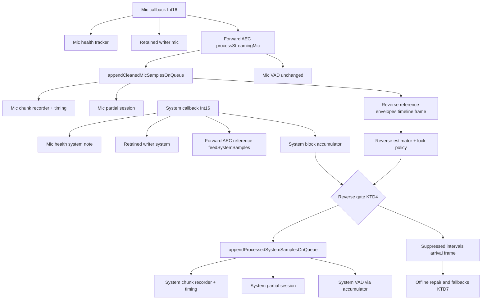
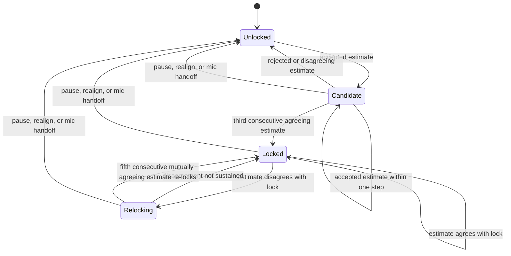
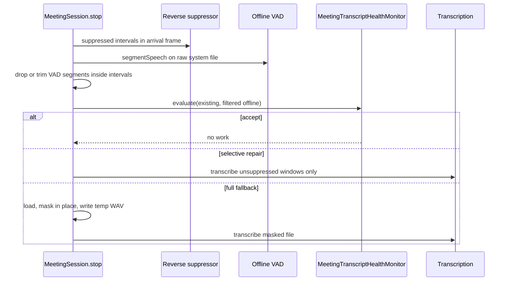

# Meeting Reverse-Leak Suppression - Plan

## Goal Capsule

- **Objective:** A meeting transcript shows the local speaker's words once, under "You", even when the remote party's uncancelled echo of those words returns through system audio. Genuine remote speech is never removed.
- **Means:** Gate leaked local speech out of the system track in the audio domain, before the system VAD and chunk recorder see it, using the AEC-cleaned mic as the reference (KTD1, KTD4, KTD5).
- **Authority hierarchy:** Product Contract requirements win on behavior; Key Technical Decisions win on mechanism within their cited requirements; units override neither. Session-settled entries are labeled inline and are not re-opened.
- **Stop conditions:** Stop and report instead of shipping when any control scenario in U2 or U5 suppresses genuine remote audio, when a settled decision proves infeasible (return `settled-decision-invalidated`), or when the full test suite regresses beyond the five pre-existing timing failures on `dev`.
- **Execution profile:** One PR against `dev`, feature-gated by a config key that defaults on and an environment override. No new dependencies.
- **Tail ownership:** The invoking x-autopilot pipeline owns simplification, review, PR creation, and merge readiness.

---

## Product Contract

### Summary

Add a reverse-reference suppression stage to the meeting audio pipeline. It estimates the offset between local speech on the mic and its echo on the system track, then gates the leaked spans to a noise floor before they reach the system VAD, the system chunk recorder, and the live caption feed. The text-layer reconciler stays untouched.

### Problem Frame

During a meeting Muesli records two tracks: the mic ("You") and system audio ("Others"). When the remote participant's device does not cancel the echo of the local speaker, the local utterance returns through system audio a few hundred milliseconds later, gets transcribed as "Others", and the transcript shows the same sentence twice.

The post-ASR reconciler (`TranscriptReconciler`) cannot fix this. It is preserve-first by design, dedupes system-vs-system only, refuses any segment of 12 or more visible characters, and system segment times are sentence-weighted spans rather than acoustic timings. The forward AEC (`MeetingNeuralAec`) only cleans the mic using the system track as reference; nothing treats the mic as the reference for the system track. Research confirms the leak delay sits mostly in the 300-700 ms range, drifts with jitter buffers, and is intermittent because remote AEC cancels short utterances but leaks long ones.

### Key Decisions

- **KD1. Decide duplication in audio, not text.** The reconciler and its 12-character guard stay as they are. (session-settled: user-directed - chosen over extending `dedupeSystemSegments` to mic-vs-system: the guard excludes every ordinary sentence and text-layer overlap is unreliable by construction.) Governs R1, R2, R9.
- **KD2. Ship enabled, with a kill switch.** The feature defaults on, with a Settings toggle and an environment override. (session-settled: user-approved - chosen over default off: the fix is wanted now; the switch bounds the blast radius.) Governs R11, R12, R14.
- **KD3. Playback and diarization keep the raw system audio.** The retained stereo recording, the forward AEC reference, and diarization read unprocessed system samples. (session-settled: user-approved - chosen over feeding processed audio everywhere: playback must keep what was heard and diarization labels on suppressed spans carry no text.) Governs R8.

### Requirements

**Suppression behavior**

- R1. Leaked local speech is gated out of the system track before the system VAD, the system chunk recorder, and the system live-caption feed consume it.
- R2. Genuine remote speech is never suppressed: a frame is gated only when the evidence in KTD4 holds, and the stage fails open whenever its reference is unavailable, the offset is not locked, or the feature is disabled.
- R3. A suppressed span reaches ASR as noise-floor material: gain at or below -40 dB plus comfort noise at the tracked system floor, clamped at or above -60 dBFS, so a chunk containing only suppressed audio transcribes to nothing.
- R4. Double-talk (genuine remote speech overlapping the leak) is left untouched; the duplicate survives rather than risking remote speech.

**Offset estimation**

- R5. The stage estimates the mic-to-system registration offset over 80 ms to 2 s, locks it after repeated support, re-locks when the offset drifts, and keeps every gate decision tied to fresh per-frame evidence.
- R6. Without a locked offset the stage is a pass-through.
- R7. Pause (resume starts from the cleared state), a system-capture realignment, and a completed mic handoff that switched the input device reset the offset state, the gate hangover, and the ramp state; suppressed intervals already exported for the session are kept until the session is discarded.

**Pipeline invariants**

- R8. The audio the system VAD hears is the audio the system chunk transcribes; the retained recording, the forward AEC reference, the mic health tracker, and diarization keep consuming raw system samples (KD3).
- R9. `TranscriptReconciler` and `TranscriptFormatter` are unchanged (KD1).
- R10. The offline system-transcript repair pass and every full-file fallback exclude suppressed spans, so a suppressed utterance is never re-inserted as "Others".
- R15. Sample count through the stage is one-to-one; chunk timing and the retained-recording timeline stay correct.
- R16. The system VAD feed receives only complete 4096-sample frames; a flushed remainder never reaches a VAD controller. The mic VAD feed is unchanged.

**Controls and observability**

- R11. A config key `meeting_reverse_leak_suppression` (Bool, default `true`) with one toggle row in Settings > Meetings > Advanced controls the feature (KD2).
- R12. `MUESLI_REVERSE_LEAK_SUPPRESSION=0` in the environment disables the feature regardless of config (KD2).
- R13. The session diagnostics record the reverse offset, its history, lock, re-lock, reset, and gap-reset counts, gate-open count, suppressed seconds, reference-unavailable frames, interval count, block processing time, offline speech seconds that fell inside suppressed intervals, and the resolved enabled flag, with tolerant decoding of older payloads.
- R14. Turning the toggle off during a meeting forces the gate open for the running meeting; turning it back on releases the force and the gate resumes from the estimator's current lock state. The environment override is read once at meeting start.

**Quality**

- R17. Synthetic-signal tests prove the estimator locks on 300-1500 ms leaks and never locks on turn-taking, forward-residual, or genuine-remote control signals.
- R18. A session-level harness drives the realtime enqueue path with fake mic and system recorders, in both mic buffer shapes the app produces, and inspects rotated system chunk audio.
- R19. Per-block gate cost and per-estimate cost stay under committed caps measured by a performance test (KTD11).

### Acceptance Examples

- AE1. Leaking remote
  - **Covers:** R1, R3, R5
  - **Given** the user speaks for 8 s and a delayed copy at 500 ms arrives on the system track at -20 dB
  - **When** three consecutive estimates at the 2 s cadence agree and the gate evaluates the next leaked span
  - **Then** the leaked span in the system chunk sits at or below -40 dB with comfort noise, the system VAD reports no speech for it, and no "Others" segment is produced for it.
- AE2. Remote with working echo cancellation
  - **Covers:** R2, R6
  - **Given** local speech with no correlate on the system track
  - **When** the estimator runs for the whole meeting
  - **Then** no lock is recorded and every system sample passes through unchanged.
- AE3. Double-talk
  - **Covers:** R4
  - **Given** a locked offset and a genuine remote utterance overlapping the leaked span
  - **When** the gate evaluates those frames
  - **Then** the level-consistency and correlation checks fail and the frames pass through.
- AE4. Turn-taking control
  - **Covers:** R2, R17
  - **Given** alternating mic and system bursts with a fixed 400 ms gap and no shared content
  - **When** the estimator runs
  - **Then** no lock is recorded.
- AE5. Speaker-residual control
  - **Covers:** R2, R17
  - **Given** system bursts plus a 0.25-gain copy in the cleaned mic 120 ms earlier
  - **When** the estimator runs
  - **Then** no lock is recorded because the forward-residual exclusion removes those reference frames.
- AE6. All-leak meeting
  - **Covers:** R10
  - **Given** a meeting where every system-track utterance was suppressed and no system segments exist
  - **When** the offline health check runs at stop
  - **Then** the offline speech list is empty after filtering, the decision is accept, and no full-file fallback re-transcribes the raw file.
- AE7. Kill switch
  - **Covers:** R11, R12, R14
  - **Given** a running meeting with a locked offset
  - **When** the user turns the toggle off
  - **Then** the gate is forced open until the toggle is turned back on, at which point gating resumes from the current lock state; with the environment variable set to `0` the next meeting starts disabled.
- AE8. Pause and resume
  - **Covers:** R7
  - **Given** a locked offset
  - **When** the user pauses and resumes
  - **Then** the lock is cleared, the reset count increments, and suppression resumes only after a new lock.
- AE9. Late system callback
  - **Covers:** R10, R15
  - **Given** one system callback arrives 500 ms late (a forward timeline gap) before a leaked span
  - **When** the meeting stops and the masked fallback WAV is written
  - **Then** the masked interval lands at the span's position in the raw file, not at its timeline position.

### Success Criteria

- Zero suppressed frames on the control scenarios (AE2, AE4, AE5) and zero suppressed frames on genuine-remote bursts in AE1 and AE3.
- In the suppressor unit with the reference available (U2), at least 90 percent of leaked-burst frames are gated once the estimator is locked, for synthetic delays of 300, 700, and 1500 ms. Through the real enqueue path (U5), the same holds at 700 ms for both mic buffer shapes and at 300 ms for the 512-sample shape.
- The full `swift test` run has no new failures relative to the five pre-existing timing failures on `dev`.
- A new meeting with the toggle off produces a diagnostics summary whose resolved enabled flag is `false` and whose suppressed seconds are zero.

### Scope Boundaries

- The retained stereo recording and the re-transcribe-from-recording path keep the leak; playback fidelity and re-transcription are not changed (KD3).
- Diarization may still form a speaker cluster for the leaked local voice; speaker counts are not corrected.
- Interjections shorter than the evidence window are not suppressed.
- No user-visible indicator that suppression fired; diagnostics only.
- No change to dictation, to `TranscriptionRuntime` routing, or to the meeting language and backend authority (sibling work owns those).
- The forward AEC decision code in `MeetingNeuralAec` is not refactored; only the estimator gains a second scoring mode.

#### Deferred to Follow-Up Work

- Bounded hold of the processed system stream so offsets below roughly 316 ms on the AVAudioEngine mic route can be gated (see A1).
- Adaptive correlation threshold tracking once real-meeting diagnostics exist.
- Rendering the reverse offset in `SessionDiagnosticsView`.
- Masking the retained recording for re-transcription.
- Re-blocking the mic VAD feed to complete frames (today `VadManager` repeat-last-pads short mic buffers), as its own forward-path change with its own coverage.
- Moving `MeetingNeuralAecTests` and `StreamingVadControllerTests` from the legacy unsharded baseline into the meetings CI shard so the forward-path regression guard runs in PR CI.

### Sources

- Ideation: `docs/ideation/2026-08-31-transcription-multilingual-ideation.html`, idea 6.
- Signal path and seams: `native/MuesliNative/Sources/MuesliNativeApp/MeetingSession.swift` (`enqueueRealtimeSystemSamples`, `appendCleanedMicSamplesOnQueue`, `recordingOffsetOnQueue`, `rotateSystemChunkOnQueue`, `handleSystemAudioCaptureInterruption`, `handleMicHandoffResultOnQueue`, `repairSystemSegmentsIfNeeded`, `fallbackToFullSessionSystemTranscription`), `MeetingNeuralAec.swift` (`MeetingAecDelayEstimator`, `delayDecision`), `MeetingTranscriptHealthMonitor.swift` (`evaluate`), `MeetingRecordingWriter.swift` (`MeetingRecordingTimeline`), `StreamingVadController.swift`, `MeetingSessionDiagnostics.swift`, `MeetingMicRepair.swift`, `WavWriter.swift`.
- Raw-file frame: `SystemAudioRecorder.swift` and `CoreAudioSystemRecorder.swift` write each callback's samples contiguously and hand the same array to `onPCMSamples`, so file position equals the cumulative raw sample count seen by the session.
- CI shard guard: `scripts/test_ci_test_shards.sh`, `scripts/run_ci_test_shard.sh`, `scripts/ci_unsharded_test_suites.txt`.
- Performance-cap precedent: `native/MuesliNative/Tests/MuesliTests/SessionTracePerformanceTests.swift` and `Fixtures/TranscriptionQuality/baseline-v1.json`.
- ASR level invariance: Whisper `audio.py` log-mel clamp; NeMo `audio_preprocessing.py` per-feature normalization.
- Residual echo suppression depth and comfort noise: speexdsp `speex_preprocess.h` (`-40` single-talk depth); ITU-T G.168 NLP practice.
- Delay tracking and hysteresis: WebRTC AEC3 `echo_canceller3_config.h`, `matched_filter_lag_aggregator.cc`; WebRTC NetEQ jitter-buffer documentation; Gao and Su, Interspeech 2024.
- Double-talk precedents: Duttweiler/Geigel thresholds; AEC3 dominant-nearend hold of 200 ms.
- Silero VAD level behavior: FluidAudio `VadManager.swift` (no normalization; `VadManager()` downloads the model when absent); silero-vad discussion 349.

---

## Planning Contract

### Key Technical Decisions

- KTD1. **Suppression is a floor gate, not a partial cut.** Gated frames are scaled to at or below -40 dB and mixed with comfort noise at the tracked system noise floor, clamped at or above -60 dBFS. The mask is decided per 20 ms envelope frame; envelope frames are anchored at 320-sample multiples of the system arrival count, so a 4096-sample block spans a partial frame at each end. A trailing partial frame with at least 128 samples is decided on its own samples; a shorter one inherits the previous frame's decision, and envelope accumulators carry the remainder into the next block. Gain moves through 10 ms ramps that start at frame edges inside the block, never at callback edges. (session-settled: user-approved - chosen over zeroing samples: a floor keeps VAD hysteresis and ramps continuous and avoids digital-zero runs that trigger Whisper hallucination.) Conflict call-out: research shows Whisper and Parakeet front-ends remove any constant gain shallower than about -40 dB, so "attenuate" is instantiated at floor depth; no intermediate depth ships without the manual measurement harness in U8.
- KTD2. **Envelope-domain estimator with a second scoring mode.** `MeetingAecDelayEstimator` gains a scoring mode that operates on precomputed 20 ms envelope arrays: zero-mean Pearson correlation over an 8 s window (400 envelope frames) at a 2 s cadence, across a 20 ms grid from 80 ms to 2000 ms, with an active-reference mask. The forward instance keeps its labels, grid, cosine scoring, thresholds, failure reason strings, and `Failure` field names byte-identical; the new mode is reached through a separate entry point whose result carries the active-reference frame count and the peak-to-runner-up ratio as defaulted trailing fields, so the memberwise `Result` construction in tests still compiles. Band-limiting (high-pass about 250 Hz) and RMS envelopes are computed once on ingest, never per lag. An estimate is accepted only when the window holds at least 1.5 s of active reference frames, peak correlation is at least 0.6, and the peak exceeds the runner-up found outside two grid steps by a ratio of at least 1.3. (session-settled: user-approved - chosen over reusing the forward instance and its 0-800 ms grid: that instance shifts the wrong direction and its cosine on positive envelopes is DC-biased.)
- KTD3. **Standalone reverse lock policy.** `MeetingReverseLeakLockPolicy` is a new queue-confined value type (a `struct` with `private(set)` state and a mutating observe method returning a decision); the forward decision code in `MeetingNeuralAec` stays untouched. Semantics: lock after three consecutive accepted estimates within one grid step; re-lock after five consecutive accepted estimates that disagree with the lock but agree with each other within one step; reset on pause (resume starts from the cleared state), system realign, and a completed mic handoff that switched input, where reset clears lock, candidate, hangover, and ramp state but never the session's accumulated suppressed intervals (KTD7); the gate tolerates plus or minus 60 ms around the lock. (session-settled: user-approved - chosen over a fixed per-meeting constant: jitter-buffer retargeting moves the leak delay by 100 ms or more mid-meeting.) Conflict call-out: the settled wording says "per-meeting registration offset"; the tracked value is still per-meeting state and resets per the settled rule, but it may re-lock within a meeting. Sharing one policy with the forward path was rejected: the forward acceptance is three branches plus a recency-weighted median and its decision strings are persisted, so a shared type would carry two state machines and enlarge the diff in a file sibling work also touches.
- KTD4. **Gate decision.** A 20 ms system frame at time `t` is gated only when all hold: (a) the cleaned mic is active (envelope above its noise floor plus 10 dB) somewhere in `[t - D - 60 ms, t - D + 60 ms]`; (b) the short-window (0.75 s) correlation at lag `D` is at least 0.6, raised to 0.7 until the leak-gain median has at least 1 s of support; (c) the system envelope is at most twice the leak gain times the mic envelope, where leak gain is the median over a fixed-size ring of the last 250 confirmed leak frames (5 s), seeded from the frames of the three windows that produced the lock. Reference frames are excluded when the system envelope was active in the preceding 300 ms and cleaned-mic energy is below 0.3 times raw-mic energy (forward-residual exclusion). The gate exits when correlation drops below 0.4 or (c) fails, with a hangover of at most 200 ms. A frame whose reference has not yet arrived passes through. The plus or minus 60 ms tolerance also absorbs registration wobble between the two sources (KTD6). (session-settled: user-approved - chosen over recall-tuned gating: a false suppression deletes remote speech irreversibly and no regression corpus exists.)
- KTD5. **System-side funnel and re-blocking.** `appendProcessedSystemSamplesOnQueue` takes over the system chunk write, the system chunk timing append, the system partial-session feed, and the system VAD feed. Raw samples still go to the mic health tracker, the retained recording writer, and `neuralAec.feedSystemSamples`. A `StreamingVadFrameAccumulator` sits in `MeetingSession` in front of the system `StreamingVadController.processAudio` call; the gate decides per completed 4096-sample block, and the chunk write and partial feed happen per gated block. VAD-driven chunk rotation happens at block edges: the pending remainder stays in the accumulator and belongs to the next chunk. The remainder is flushed only on pause, stop, and system-capture interruption (before the timing realign); the flush passes through the gate using its current hangover state, is written to the chunk recorder, appended to the timing tracker, and fed to the partial session, but is never pushed to a VAD controller (R16). The mic VAD feed keeps its two existing call sites and cleaned-mic release sizes. Conflict call-out: the settled brief asked to re-block both feeds; the mic feed is deferred because the gate never reads the mic VAD, and re-blocking it would change forward "You" chunk boundaries on the 512-sample mic route without coverage in this PR. The funnel and the flush do not guard on `isRecording` or `isPaused` (mirroring `appendCleanedMicSamplesOnQueue`), because `stop` clears `isRecording` before it flushes. (session-settled: user-approved - chosen over gating only the VAD feed: the chunk file is written before the float conversion today, so VAD-only gating would not change what is transcribed.)
- KTD6. **Two frames, each used where it is exact.** The gate and the estimator work in the `MeetingRecordingTimeline` frame: cleaned-mic samples arrive indexed by AEC arrival count, so the funnel keeps an ordered list of `(arrivalStart, timelineStart, count)` ranges appended per raw mic callback and consumed as AEC output is released; a system block's timeline position is the offset of its first sample, intra-block gaps up to the gate tolerance are ignored, and a gap larger than the tolerance closes the current block early (the short block passes ungated) so a block never straddles a realign or stall gap. Reverse histories are envelope-domain (20 ms frames), position-indexed with a history start frame, retained for the estimator window plus the maximum candidate delay plus the short window plus the tolerance; gap fill is capped at that retention, and a larger gap resets that history and increments a gap-reset counter. Suppressed intervals (KTD7) are exported in the system arrival frame instead. (session-settled: user-approved - chosen over the AEC arrival-count frame for the gate because arrival counts hide capture gaps that the timeline records (stalls, tap rebuilds, mic handoffs, the AEC reference wait) and the chunk timing already lives in the timeline frame.)
- KTD7. **Offline coordination in the raw-file frame.** The suppressor exports suppressed intervals as coalesced, sorted, non-overlapping gate-open spans (open to close plus hangover) in the system arrival frame: a running count of every raw system callback the recorder delivered, incremented on `chunkRotationQueue` before the session's recording and paused guard so callbacks the guard drops are still counted, divided by 16000 for seconds. This matches the raw system file, which both recorders write contiguously per callback before invoking the session; the timeline frame would misregister by the cumulative callback lateness. Intervals accumulate for the whole session and survive every reset (KTD3); they are cleared only by `discard` or a new `start`. `repairSystemSegmentsIfNeeded` subtracts the suppressed intervals (padded by 100 ms on each side) from every offline VAD segment before `MeetingTranscriptHealthMonitor.evaluate` runs: a segment fully covered is dropped, and every unsuppressed portion at least the health monitor's minimum segment length is kept as its own segment regardless of overlap percentage, so genuine remote speech that follows a leak inside one VAD segment stays eligible for repair. `fallbackToFullSessionSystemTranscription` gains a suppressed-intervals parameter: it loads the file, masks the intervals in place with the KTD1 floor, writes a temporary WAV, transcribes that URL, and falls back to the raw URL only if loading fails. Diarization keeps the raw file. (session-settled: user-approved - chosen over filtering repair segments only: unsuppressed leak time drives the coverage thresholds that trigger a full-file fallback, and the all-leak meeting hits `no_live_segments`.) Conflict call-out: filtering before `evaluate` removes the repair pass as a recovery path for a false suppression; accepted because audio-domain evidence cannot separate the two cases at stop time, and mitigated by KTD4's precision bias, the live disable (R14), and the offline-speech-inside-intervals metric (KTD9).
- KTD8. **Kill switch resolution.** `AppConfig.meetingReverseLeakSuppression` follows the three-line Bool pattern used by `useCoreAudioTap`. `MeetingReverseLeakSuppressor` exposes a static environment check that takes an injected environment dictionary defaulting to the process environment (the `Gemma4LiteRTBackend` shape); a value of `0` for `MUESLI_REVERSE_LEAK_SUPPRESSION` disables. `MeetingSession` resolves `config && !disabledByEnvironment` once at init. `MuesliController.updateConfig` captures the previous value and, when it turns false, calls an idempotent force-open method on the preparing and active sessions exactly as it calls `stopStreamingPartials`; that method hops to `chunkRotationQueue` before touching suppressor state, forces the gate open, and leaves the estimator running for diagnostics; when the value turns true, the symmetric idempotent release method restores gating from the current lock state. Conflict call-out on KD2: research recommends shipping the estimator with gating off until real-meeting diagnostics calibrate thresholds; the settled default stays on, mitigated by KTD4's fail-open rules, the live disable, and KTD9's observability.
- KTD9. **Diagnostics as a sibling summary.** `MeetingReverseLeakDiagnosticsSnapshot` is passed as a sibling parameter to `writeFinalReport` and flattened into an optional `Summary.reverseLeak` of a new `ReverseLeakSummary`; `MeetingAecDiagnosticsSnapshot` and `AecSummary` are unchanged, and `Summary` stays synthesized `Codable` so older payloads decode with `nil`. The snapshot carries the enabled flag, locked delay ms, a delay history reusing `MeetingAecDelayObservation`, a direction-neutral skip history (`MeetingReverseLeakDelaySkip`), lock, re-lock, reset, and gap-reset counts, gate-open count, suppressed seconds, reference-unavailable frames, interval count, observed offset spread, mean and max block processing microseconds, and offline speech seconds inside suppressed intervals (set by the repair pass when it runs, `nil` otherwise). `Summary.schemaVersion` stays 1. No view renders these; `LocalDiagnostics` export carries them.
- KTD10. **Test seams.** `MeetingSession.init` gains `systemAudioRecorder: SystemAudioCapturing? = nil` and `neuralAec: MeetingNeuralAec? = nil`; tests inject `MeetingNeuralAec(preloadedProcessor:)` with a passthrough processor, which makes `preload()` a no-op. An internal chunk-rotation hook fires synchronously on `chunkRotationQueue` with the chunk URL and timing snapshot after a successful rotate and before the transcription task, and again in `stop` for the final chunk; tests read the WAV inside the hook (data after the 44-byte header) and synchronize with a semaphore or `confirmation`. Because the harness runs with no `VadManager` (both VAD controllers are `nil`), an internal rotation-request method dispatches `rotateSystemChunkOnQueue` on `chunkRotationQueue` exactly as the VAD boundary closure does. An internal processed-system-samples observation hook fires inside `appendProcessedSystemSamplesOnQueue` so the harness can assert the stream the partial session would receive, since partial sessions are `nil` without downloaded caption models. Test helpers under `Tests/MuesliTests/Support` are `internal` types with no `@Suite`: the passthrough AEC processor moves there, `FakeMeetingMicRecorder` is promoted there (dropping `private`), and a `FakeSystemAudioRecorder` implements the protocol's required members (the rest carry extension defaults) and returns `nil` from `stop` so repair and diarization are skipped. The harness must not create the diagnostics enable flag and keeps `meetingRecordingSavePolicy` at `.never`.
- KTD11. **No new dependencies; envelope-domain cost with a committed budget.** Envelopes, band-limiting, correlation, ramps, and comfort noise use Accelerate vDSP; comfort noise comes from a cached tiled noise buffer scaled per frame. Envelopes are computed once on ingest; the estimate correlates 97 lags over roughly 400-frame envelope arrays every 2 s of reference audio, phased 1 s off the forward estimator so the two bursts do not coincide; the gate runs per 4096-sample block at envelope granularity; no model inference is added to `chunkRotationQueue`. Budget: gate at most 0.5 ms mean and 2 ms p95 per block, estimate at most 5 ms, measured on a 60 s synthetic leak stream with the first 5 samples discarded; committed caps of 2 ms per block and 20 ms per estimate live in a new fixture `native/MuesliNative/Tests/MuesliTests/Fixtures/ReverseLeak/performance-caps.json`, read the way `SessionTracePerformanceTests` reads its caps; the transcription-quality manifest pins `baseline-v1.json` by SHA-256, so that file is not touched.
- KTD12. **Live captions consume the processed stream.** Because the system partial session is fed from the funnel, the leak disappears from live "Others" captions, and from the authoritative live transcript when `use_live_meeting_transcript_as_final` is on.
- KTD13. **New suites are assigned to the meetings CI shard.** `scripts/test_ci_test_shards.sh` fails the required CI gate when a top-level `@Suite` is missing from every shard, so every new suite name is added to the meetings list in `scripts/run_ci_test_shard.sh`, including the environment-gated manual harness.

### Assumptions

These are un-validated agent bets made without a synchronous user; downstream review should scrutinize them.

- A1. Zero lookahead is acceptable for v1: a frame whose cleaned-mic reference has not arrived passes through. On the AVAudioEngine mic route cleaned mic for time `T` arrives about 256 ms after `T` plus any AEC reference wait, so within a 4096-sample block the first frames are covered for offsets of about 60 ms and up and the last frames for about 316 ms and up; the 512-sample AudioQueue route covers nearly everything. A smaller block would reduce coverage, so 4096 is kept as the only lookahead until the deferred bounded hold ships. Reference-unavailable frames are counted so the hold can be sized from field data.
- A2. The thresholds in KTD2, KTD3, and KTD4 are starting values chosen from AEC3, Geigel, and Speex precedents; they are expected to be tuned from real-meeting diagnostics, not from the synthetic corpus alone.
- A3. Comfort noise is white noise scaled to the tracked system floor; the floor tracker takes minimum statistics over fixed 1.5 s sub-windows held in a bounded ring, clamped at -60 dBFS.
- A4. The Silero level measurement is a manual, environment-gated harness (U8) rather than a CI gate, because no speech fixture exists in the test tree; constructing `VadManager` downloads the model when it is absent.
- A5. Writing the system chunk per gated 4096 block (up to 256 ms after the samples arrived) is acceptable; VAD-driven rotation keeps the remainder for the next chunk.
- A6. One capture-and-push block in `MuesliController.updateConfig` and two optional `MeetingSession.init` parameters are acceptable touches outside the audio path.
- A7. The retained recording and the re-transcribe path keep the leak; the Settings row description says so.
- A8. Both recorders write a callback's samples to the raw file before invoking the session, and `pause` sets the session's paused flag before pausing the recorder, so callbacks can be written to the file yet dropped by the session guard; counting the arrival frame before that guard (KTD7) keeps the counter equal to the file length across repeated pauses, and the 100 ms pad covers only sub-callback jitter.

### High-Level Technical Design

Realtime data flow after the change. Raw consumers are unchanged; the processed funnel is new.

Lock state machine for the reverse offset (KTD3).

Offline coordination at stop (KTD7).

### Implementation Constraints and Sequencing

- Queue-confined mutable state (the suppressor and the arrival-to-timeline map) lives in plain `final class` or `struct` values touched only from `chunkRotationQueue`, with the "accessed only from MeetingSession's chunkRotationQueue" comment `MeetingNeuralAec` uses, and no `Sendable` conformance; `StreamingVadFrameAccumulator` is the exception, a `Sendable` value type per U4, and snapshots that cross threads are `struct: Sendable`.
- The forward AEC path stays byte-identical: existing `MeetingNeuralAecTests` and `StreamingVadControllerTests` pass unchanged, and forward failure reason strings and `Failure` field names are unchanged because they are persisted `Codable` keys.
- Settings UI uses the existing `settingsRow`, `settingsSwitch`, `settingsDescription`, and `Divider().background(MuesliTheme.surfaceBorder)` helpers; no new shapes or animations, so the source-scanning design gates stay green.
- Sequence: U1, U3, U4 (foundations with no behavior change) then U2 (suppressor) then U5, U6, U7 (integration and controls) then U8 (docs and manual harness).

### System-Wide Impact

- Live captions and the authoritative live transcript change content when the gate fires (KTD12).
- The system chunk write and the live-caption feed lag by up to 256 ms (mean 128 ms) on top of the existing 320 ms feed and 250 ms publication cadence; chunk boundaries are unchanged and no partial-session drops are added because a 4096 push queues at most one 5120-sample chunk.
- Mic failover and handoff now also reset reverse-leak state; the forward AEC is unchanged.
- The local-diagnostics JSON export gains an optional `reverseLeak` summary; consumers decode it tolerantly.
- `MeetingSession.init` gains two optional parameters; all existing call sites keep compiling.
- `scripts/run_ci_test_shard.sh` gains the new suite names (KTD13).

### Risks and Mitigations

| Risk | Mitigation |
|---|---|
| False lock on conversational turn-taking or forward-echo residual deletes remote speech | Pearson scoring, peak-ratio test, minimum active reference, forward-residual exclusion (KTD2, KTD4); no-lock control tests are acceptance criteria (AE4, AE5) |
| Gate deletes genuine remote speech and no offline layer can restore it (KTD7 by design; unified-transcript mode never runs the repair pass) | Precision-first gate (KTD4), live disable (R14), offline-speech-inside-intervals metric (KTD9) to bound the false-suppression rate before thresholds tighten |
| Thresholds untuned for real calls | Diagnostics fields (KTD9) plus manual measurement harness (U8); live disable (R14) |
| Jitter drift disables suppression silently | Re-lock policy and gate tolerance (KTD3); lock events in history |
| CPU on the serial queue | Envelope-domain math only, 2 s cadence phased off the forward estimator, per-block gating, bounded rings for the leak-gain median and floor tracker; committed caps enforced by a performance test (KTD11, R19) |
| Unbounded memory on capture stalls | Envelope-domain histories with capped gap fill and gap reset (KTD6) |
| Offline fallback re-inserts the leak | Filter before evaluate and masked WAV for every fallback in the raw-file frame (KTD7, AE6, AE9) |
| Live caption latency up to 256 ms worse | Rotation at block edges; harness asserts through the processed-samples hook that every sample is released within one block |
| Sibling PRs touch `MeetingSession.swift` and `MuesliController.swift` | Changes stay inside the realtime audio path, `init`, `discard`, the repair pass, and one block in `updateConfig`; report every touch outside the audio path |

### Alternatives Considered

- **Second neural AEC pass with roles swapped.** Rejected: doubles model inference on the serial hot queue and alters remote speech for ASR (settled).
- **Waveform cross-correlation or coherence double-talk detection.** Rejected: the leak passes through a codec, remote AEC residual, and jitter-buffer time-stretching, so linear-path detectors score low even on real leaks; envelopes survive that path.
- **One lock policy shared with the forward AEC.** Rejected: two state machines behind configuration flags plus a reproduction burden for persisted forward decision strings (KTD3).
- **Bounded hold of the processed system stream for short offsets.** Deferred: adds a second buffering stage and lifecycle flushes; field diagnostics decide whether it is needed (A1).

---

## Implementation Units

### U1. Add the envelope-domain scoring mode to the delay estimator

- **Goal:** Give `MeetingAecDelayEstimator` a Pearson scoring entry point over precomputed envelopes for the reverse direction, with the forward path unchanged.
- **Requirements:** R5, R17; KTD2, KTD11, KTD13.
- **Dependencies:** none.
- **Files:** `native/MuesliNative/Sources/MuesliNativeApp/MeetingNeuralAec.swift`; `native/MuesliNative/Tests/MuesliTests/MeetingNeuralAecTests.swift` (unchanged assertions); new `native/MuesliNative/Tests/MuesliTests/MeetingReverseLeakEstimatorTests.swift`; `scripts/run_ci_test_shard.sh` (meetings shard).
- **Approach:**
  1. Keep the forward entry points, labels (`micHistory`, `systemHistory`), grid, constants, failure reasons, and `Failure` fields exactly as they are; the forward call sites in `updateDelayEstimateIfNeeded` and `trimHistoryBuffersIfNeeded` do not change.
  2. Add an envelope-scoring entry point that takes a reference envelope array, a near-end envelope array, an active-reference mask, a candidate grid in frames, and returns the best lag, its Pearson score, the active-reference frame count, and the peak-to-runner-up ratio (runner-up searched outside two grid steps); expose these as defaulted trailing `var` fields on the result (Swift's memberwise initializer omits defaulted `let` properties) so `makeDelayResult` and the memberwise sites compile untouched.
  3. Add the shared envelope helpers (biquad high-pass, 20 ms RMS, zero-mean) as static functions used by the suppressor on ingest; do not call them per lag.
- **Patterns to follow:** `MeetingAecDelayEstimator.estimateAttempt` result shape; `rmsEnvelope` and `activeSystemCosineSimilarity` structure.
- **Test scenarios:**
  - Existing `MeetingNeuralAecTests` pass unchanged, including `delayEstimatorFindsDelayedMicEcho`, the grid-pinning test, and the failure-reason test.
  - Envelope mode finds 400, 900, and 1500 ms delays on sine-burst references with a -20 dB delayed copy, score at least 0.8.
  - Envelope mode rejects a window with fewer than 1.5 s of active reference frames.
  - Peak-ratio test rejects a periodic burst pattern (250 ms period) whose runner-up is within 1.3 of the peak.
  - Band-limit plus RMS on a known signal yields the expected frame count and energy.
- **Verification:** Forward AEC tests green and unchanged; new estimator tests green; the shard guard script passes.

### U2. MeetingReverseLeakSuppressor and its lock policy

- **Goal:** A queue-confined component that owns reverse envelope histories, the reverse estimator and lock policy, the gate decision, mask application, suppressed-interval export, block cost measurement, and its diagnostics snapshot.
- **Requirements:** R1, R2, R3, R4, R5, R6, R7, R12, R13, R15, R17, R19; KTD1, KTD2, KTD3, KTD4, KTD6, KTD7 (interval export), KTD8 (environment check), KTD11, KTD13.
- **Dependencies:** U1, U3.
- **Files:** new `native/MuesliNative/Sources/MuesliNativeApp/MeetingReverseLeakSuppressor.swift` (suppressor, `MeetingReverseLeakLockPolicy`, `MeetingSuppressedInterval`, environment check); new `native/MuesliNative/Tests/MuesliTests/MeetingReverseLeakSuppressorTests.swift`; new `native/MuesliNative/Tests/MuesliTests/MeetingReverseLeakLockPolicyTests.swift`; new `native/MuesliNative/Tests/MuesliTests/Fixtures/ReverseLeak/performance-caps.json` (committed caps, outside the SHA-pinned transcription-quality manifest); `scripts/run_ci_test_shard.sh`.
- **Approach:**
  1. `final class MeetingReverseLeakSuppressor` with the `MeetingNeuralAec` confinement comment and no `Sendable`. API: feed cleaned-mic and raw-mic energy with a timeline position; process one 4096-sample system block given its timeline position and its arrival-frame start, returning the same count of samples; export intervals; reset; set enabled; force open and release; read a diagnostics snapshot. It also owns the static environment check per KTD8, taking an injected environment dictionary that defaults to the process environment; `0` for `MUESLI_REVERSE_LEAK_SUPPRESSION` disables.
  2. Histories are envelope arrays in the timeline frame (reference envelope, raw-mic energy, system envelope), position-indexed with a start frame, retained per KTD6, with capped gap fill and gap reset.
  3. Run the estimator every 2 s of reference audio, phased 1 s off the forward cadence; drive `MeetingReverseLeakLockPolicy`; record observations and direction-neutral skips.
  4. Gate per KTD4 with the leak-gain ring and floor tracker (A3); apply the KTD1 floor, comfort noise from a cached buffer, and ramps at frame edges; keep hangover and ramp state; reset both on `reset`.
  5. Coalesce gate-open spans (plus hangover) into sorted, non-overlapping intervals in the arrival frame; keep them for the whole session so `reset` never clears them, and clear them only through an explicit discard.
  6. Count gate-open events, suppressed seconds, reference-unavailable frames, lock, re-lock, reset, and gap-reset events, offset spread, and block processing time.
- **Technical design (directional):** the block processor updates the system envelope accumulator, looks up the reference envelope at `t - D` within tolerance, evaluates the three gate conditions per frame, builds a per-frame gain vector with ramps, and multiplies plus adds noise with vDSP.
- **Patterns to follow:** `MeetingNeuralAec` history buffers and trimming; `MeetingMicFailoverPolicy` and `MeetingAutoStopTracker` for the struct-with-mutating-observe policy shape; `SessionTracePerformanceTests` for cap-backed timing.
- **Test scenarios:**
  - Lock policy: three agreeing estimates lock; a fourth disagreeing estimate does not unlock; five consecutive mutually agreeing disagreements re-lock; reset clears everything.
  - Leak at 300, 700, and 1500 ms: after three windows the lock matches within one grid step and at least 90 percent of leaked-burst frames are gated; output sample count equals input count.
  - Gated frames sit at or below -40 dB relative to input and above the -60 dBFS floor clamp; no consecutive zero run longer than 5 ms.
  - The same leak driven at two different block phases produces masks that differ by at most one 20 ms frame at each edge.
  - Genuine-remote burst absent from the reference passes with unchanged samples while a lock exists (AE1 control).
  - No correlate at all: no lock, no gated frames (AE2).
  - Turn-taking with a fixed 400 ms gap: no lock (AE4).
  - Speaker residual: system bursts plus a 0.25-gain copy in the cleaned mic 120 ms earlier, with raw-mic energy provided: no lock (AE5).
  - Double-talk: genuine remote burst overlapping a leaked span: those frames pass (AE3).
  - Reference not yet available for the block: frames pass and the reference-unavailable counter increments.
  - Hangover never exceeds 200 ms after evidence stops.
  - Ramp continuity: the maximum sample-to-sample jump at gate edges stays below a fixed bound.
  - Adjacent and overlapping gate-open spans merge on export; intervals are in the arrival frame.
  - A 60 s timeline gap on either source resets that history, increments the gap-reset counter, and the next lock is fresh.
  - Disabled or forced open: histories still update, no frame is gated.
  - Reset clears lock, hangover, and ramp state, keeps previously exported intervals, and increments the reset count; discard clears the intervals.
  - Performance: on a 60 s synthetic leak stream, p95 block time and estimate time stay under the committed caps from the reverse-leak caps fixture; a 30 min synthetic soak keeps the last-minute mean block time within twice the first-minute mean.
- **Verification:** Both suites green; each acceptance example above maps to at least one test; shard guard passes.

### U3. Diagnostics summary fields

- **Goal:** Persist reverse-leak observability in the session diagnostics as a sibling summary with tolerant decoding.
- **Requirements:** R13; KTD9.
- **Dependencies:** none.
- **Files:** `native/MuesliNative/Sources/MuesliNativeApp/MeetingSessionDiagnostics.swift`; `native/MuesliNative/Tests/MuesliTests/MeetingSessionDiagnosticsTests.swift`.
- **Approach:**
  1. Add `MeetingReverseLeakDiagnosticsSnapshot` and `MeetingReverseLeakDelaySkip` (direction-neutral fields), and `ReverseLeakSummary` next to `AecSummary`.
  2. Add an optional `reverseLeak` parameter (default `nil`) to `writeFinalReport` and an optional `Summary.reverseLeak`; `Summary` stays synthesized `Codable`; `MeetingAecDiagnosticsSnapshot` and `AecSummary` are untouched.
- **Patterns to follow:** `AecSummary` flattening in `writeFinalReport`; existing `Summary` field shapes.
- **Test scenarios:**
  - A `Summary` payload without `reverseLeak` decodes with `nil`.
  - Round-trip encode and decode preserves every reverse field.
  - `writeFinalReport` with a reverse snapshot produces the flattened summary; without one, `reverseLeak` is absent.
- **Verification:** Diagnostics tests green; `Summary.schemaVersion` unchanged; existing AEC legacy-payload test unchanged.

### U4. StreamingVadFrameAccumulator

- **Goal:** Re-block the system VAD feed to complete `VadManager.chunkSize` frames without touching `StreamingVadController`.
- **Requirements:** R16; KTD5, KTD13.
- **Dependencies:** none.
- **Files:** new `native/MuesliNative/Sources/MuesliNativeApp/StreamingVadFrameAccumulator.swift`; new `native/MuesliNative/Tests/MuesliTests/StreamingVadFrameAccumulatorTests.swift`; `scripts/run_ci_test_shard.sh`.
- **Approach:** A `struct StreamingVadFrameAccumulator: Sendable` with a mutating push that accepts arbitrary-length float arrays and returns complete frames in arrival order, a mutating flush that returns the remainder, and a reset. Frame length is `VadManager.chunkSize`, never the mic buffer size. It lives outside the controller so the seven existing controller tests are untouched, and only the system feed uses it in this PR.
- **Patterns to follow:** `MeetingChunkTimingTracker` as the small `Sendable` value type in its own file.
- **Test scenarios:**
  - Eight pushes of 512 samples yield one frame after the eighth push.
  - A push of 6000 samples yields one frame and keeps 1904 samples pending.
  - Flush returns the pending remainder and empties the accumulator.
  - Ordering is preserved across mixed push sizes.
- **Verification:** New tests green; `StreamingVadControllerTests` unchanged and green.

### U5. MeetingSession integration and test seams

- **Goal:** Wire the funnel, the accumulators, the timeline map, the reference feed, lifecycle resets, enabled resolution, diagnostics, and the test seams into the realtime path.
- **Requirements:** R1, R7, R8, R12, R13, R15, R16, R18; KTD5, KTD6, KTD8, KTD9, KTD10, KTD12, KTD13.
- **Dependencies:** U2, U3, U4.
- **Files:** `native/MuesliNative/Sources/MuesliNativeApp/MeetingSession.swift` (init, `discard`, `configureRealtimeAudioCallbacks`, `enqueueRealtimeMicSamples`, `enqueueRealtimeSystemSamples`, `appendCleanedMicSamplesOnQueue`, new `appendProcessedSystemSamplesOnQueue`, `pause`, `stop`, `handleSystemAudioCaptureInterruption`, `handleMicHandoffResultOnQueue`, `rotateSystemChunkOnQueue`, the `writeFinalReport` call); new `native/MuesliNative/Tests/MuesliTests/MeetingSessionReverseLeakHarnessTests.swift`; new `native/MuesliNative/Tests/MuesliTests/Support/FakeSystemAudioRecorder.swift`; `native/MuesliNative/Tests/MuesliTests/Support/FakeMeetingMicRecorder.swift` (promoted from `RouteAwareMeetingMicRecorderTests.swift`); `native/MuesliNative/Tests/MuesliTests/Support/PassthroughAecProcessor.swift` (moved from `MeetingNeuralAecTests.swift`); `scripts/run_ci_test_shard.sh`.
- **Approach:**
  1. Add the optional `systemAudioRecorder` and `neuralAec` init parameters, the rotation hook, the rotation-request method, and the processed-samples observation hook; keep the default construction identical. For ungated frames pass the original Int16 samples through so byte parity holds even at full-scale negative values.
  2. Resolve the enabled flag at init from the config snapshot and the environment check.
  3. System callback: increment the arrival-frame counter inside the queued block before the recording and paused guard, keep raw consumers, push floats into the system block accumulator while tracking each block's timeline start; when a callback's timeline offset exceeds the block's expected continuation by more than the KTD6 tolerance, close the pending block early and hand it to `appendProcessedSystemSamplesOnQueue` ungated before starting a new block at the late callback; for each completed block hand it to the suppressor with its timeline position and arrival-frame start, then to `appendProcessedSystemSamplesOnQueue`, which writes Int16 to the chunk recorder, appends timing, feeds the partial session, and pushes the block to the system VAD accumulator.
  4. In `appendCleanedMicSamplesOnQueue` translate arrival positions through the ordered range list and feed the reverse reference (this funnel is reached from both callbacks, so it is the only correct feed point); keep the mic VAD feed at its two existing call sites unchanged.
  5. Lifecycle, with exact anchors: in `pause`, flush the system remainder before `rotateSystemChunkOnQueue` and reset the suppressor beside `neuralAec.resetForStreaming`, clearing the arrival-to-timeline range list and its arrival counter wherever `resetForStreaming` runs (`pause` and `configureRealtimeAudioCallbacks`) because AEC arrival positions restart at zero there; in `stop`, flush after the existing mic flush and before `systemChunkRecorder?.stop()` so the samples are counted before `finish`; in the interruption handler, flush and reset inside the queued block before `rotateSystemChunkOnQueue()` (and therefore before the realign flag is set); in `handleMicHandoffResultOnQueue`, reset when the handoff switched input; in `discard`, drop accumulator and suppressor state, including intervals, without flushing. Resets never clear intervals. Flush helpers are idempotent. VAD-driven rotation does not flush.
  6. Pass the suppressor snapshot to `writeFinalReport` as the sibling parameter; the repair pass (U6) sets the offline-speech metric before that call.
  7. Force-open method: hops via `chunkRotationQueue.async`, idempotent, safe for the preparing and active session.
- **Execution note:** Prove the funnel before the gate: first assert with the suppressor disabled that the rotated chunk bytes equal the raw input, then enable gating.
- **Patterns to follow:** `appendCleanedMicSamplesOnQueue` as the funnel template; `handleSystemAudioCaptureInterruption` for queue hops; `MeetingSessionTitleTests` for constructing a session without devices; the real `TranscriptionCoordinator` is safe because an unloaded backend throws immediately and the chunk is deleted within milliseconds, which is why the hook must run before the transcription task.
- **Test scenarios:**
  - Disabled suppressor: rotated system chunk data (after the 44-byte header) equals the raw input for both mic buffer shapes, and timing snapshot durations match sample counts (R8, R15).
  - Leak scenario through fake recorders with passthrough AEC, mic delivered as 4096-sample buffers 256 ms behind the system callbacks: at 700 ms at least 90 percent of leaked frames in the rotated chunk sit at or below -40 dB and the genuine burst is unchanged; at 300 ms the reference-unavailable counter is positive.
  - Same scenario with 512-sample mic buffers 32 ms behind: at least 90 percent gated at both 300 and 700 ms.
  - Max-duration rotation in the middle of a leaked span: no ungated leak samples reach the rotated chunk; the remainder appears at the start of the next chunk.
  - Interruption with a pending remainder: the remainder is written before the realign and counted in the interrupted chunk's timing.
  - Late mic callback (forward timeline gap): the reference still aligns and gating continues.
  - One system callback 500 ms late before a leaked span: the pending short block passes ungated, gating resumes on the next full block, and the exported interval's arrival-frame position equals the span's position in the raw file, not its timeline position (AE9).
  - No mic callbacks at all: system stream passes through and reference-unavailable frames are counted.
  - Environment override set to `0`: diagnostics enabled flag is `false` and no frame is gated.
  - Pause then resume: reset count increments once, previously exported intervals are still reported at stop, no frame is gated until a new lock, and a fresh lock forms and gating resumes after enough post-resume local speech.
  - Three pause and resume cycles with callbacks delivered while paused: the arrival-frame counter equals the raw file length in samples.
  - Mic handoff that switched input: reset count increments and no frame is gated until a new lock.
  - Partial block pending at `stop`: the flushed samples are written, counted, and the final-chunk hook sees them.
  - Caption feed parity: the processed-samples hook receives every sample within one block of arrival, in order, with counts matching the input.
- **Verification:** Harness suite green; `MeetingSessionTitleTests`, `RouteAwareMeetingMicRecorderTests`, and `MeetingSessionDiagnosticsTests` green; shard guard passes.

### U6. Offline repair and fallback coordination

- **Goal:** Keep suppressed spans out of the offline repair pass and every full-file fallback, in the raw-file frame.
- **Requirements:** R10, R13; KTD7, KTD13.
- **Dependencies:** U5.
- **Files:** `native/MuesliNative/Sources/MuesliNativeApp/MeetingSession.swift` (`repairSystemSegmentsIfNeeded`, `fallbackToFullSessionSystemTranscription` and its three call sites); new `native/MuesliNative/Sources/MuesliNativeApp/MeetingReverseLeakMaskPlanner.swift`; new `native/MuesliNative/Tests/MuesliTests/MeetingReverseLeakMaskPlannerTests.swift`; `scripts/run_ci_test_shard.sh`.
- **Approach:**
  1. `enum MeetingReverseLeakMaskPlanner` with static helpers: subtract sorted, padded intervals from a `VadSegment` list with a single two-pointer sweep (drop fully covered segments, emit every unsuppressed portion as a new `VadSegment` in seconds, discard portions shorter than the health monitor's minimum, which becomes `internal` so the planner can read it); mask float samples in place inside intervals with the KTD1 floor and cached noise; write a temporary WAV through `WavWriter.writeTemporaryWAV` with directory name `muesli-meeting-system-mask`; compute offline speech seconds inside intervals.
  2. Take the arrival-frame intervals from the suppressor at stop; no timeline conversion.
  3. Filter the offline segment list before `MeetingTranscriptHealthMonitor.evaluate`; record the offline-speech metric for the diagnostics summary; for selective repair transcribe only the filtered windows.
  4. Give `fallbackToFullSessionSystemTranscription` a suppressed-intervals parameter: load the file with `AudioConverter().resampleAudioFile`, mask in place, write the temporary WAV, transcribe it under a deferred removal, and fall back to the raw URL only if loading fails (logged). All three call sites pass the intervals. Diarization keeps the raw URL.
- **Patterns to follow:** `MeetingMicRepairPlanner` (filter plus temporary WAV); the deferred `removeItem` after `writeTemporaryWAV` in the repair pass.
- **Test scenarios:**
  - A segment fully inside an interval is dropped; a segment with 30 percent overlap keeps its unsuppressed part; a 10 s segment with 6 s of leak followed by 4 s of remote speech keeps the 4 s portion; a segment with no overlap is unchanged; edges within the 100 ms pad count as suppressed.
  - Masked samples inside intervals sit at or below -40 dB and outside intervals are unchanged; sample count is preserved; masking is in place.
  - All offline speech inside intervals: the filtered list is empty and `evaluate` returns accept (AE6).
  - Intervals empty: filtering and masking are identity operations.
  - Offline speech seconds inside intervals equals the summed overlap.
- **Verification:** New suite green; `MeetingTranscriptHealthMonitorTests` and `MeetingMicRepairPlannerTests` unchanged and green; shard guard passes.

### U7. Config key, environment override, Settings toggle, live disable

- **Goal:** Expose the kill switch and make disabling effective immediately.
- **Requirements:** R11, R12, R14; KD2, KTD8.
- **Dependencies:** U5.
- **Files:** `native/MuesliNative/Sources/MuesliNativeApp/Models.swift` (one declaration, one CodingKey, one decode line); `native/MuesliNative/Sources/MuesliNativeApp/SettingsView.swift` (one row plus description in the Meetings pane Advanced section); `native/MuesliNative/Sources/MuesliNativeApp/MuesliController.swift` (`updateConfig` capture-and-push, mirroring `stopStreamingPartials`); `native/MuesliNative/Tests/MuesliTests/ModelsTests.swift`; `native/MuesliNative/Tests/MuesliTests/MeetingReverseLeakSuppressorTests.swift` (environment resolution).
- **Approach:**
  1. Add the key next to the other meeting keys with the `useCoreAudioTap` pattern.
  2. Add the Settings row "Suppress echoed local speech in system audio" with a description naming that diagnostics record the effect and that playback and re-transcription keep the raw audio.
  3. Cover environment resolution (absent, `1`, `0`, other values) in `MeetingReverseLeakSuppressorTests`; the check itself lands in U2.
  4. In `updateConfig`, capture the previous value before mutation and, when it changes, call the force-open method (turned false) or the release method (turned true) on the preparing and active sessions.
- **Patterns to follow:** Models.swift lines for `useCoreAudioTap`; the Advanced section rows in `meetingsSettingsPane`; the previous-value capture and `stopStreamingPartials` push in `updateConfig`.
- **Test scenarios:**
  - Missing key decodes to `true`; explicit `false` decodes to `false`; encoding emits `meeting_reverse_leak_suppression`.
  - Environment `0` disables; absent, `1`, or other values do not.
  - Config `true` plus environment `0` resolves disabled; config `false` plus no environment resolves disabled.
- **Verification:** `ModelsTests` and suppressor tests green; design-gate suites green; the dev-lane app shows the toggle in Settings > Meetings > Advanced.

### U8. Documentation and manual level measurement harness

- **Goal:** Record the feature and give the maintainer a way to measure Silero behavior on gated audio.
- **Requirements:** R3 (measurement), R13 (documentation of fields); KTD13.
- **Dependencies:** U5, U7.
- **Files:** `CHANGELOG.md`; `CLAUDE.md` (known-limitations entry); new `native/MuesliNative/Tests/MuesliTests/ReverseLeakLevelMeasurementManualTests.swift`; `scripts/run_ci_test_shard.sh`.
- **Approach:**
  1. CHANGELOG feature line under the current unreleased section; CLAUDE.md limitation entry naming the kill switch, the environment override, the raw-audio boundaries, the diagnostics fields, the arrival-frame interval convention, and the one-time Silero download the harness may trigger.
  2. Manual harness declared with `@Suite(.enabled(if:))` keyed on `MUESLI_REVERSE_LEAK_MEASURE_WAV`, mirroring `WhisperBiasingManualReproTests`: build `VadManager()`, feed 4096-sample blocks at 0, -20, and -40 dB plus comfort noise through `processStreamingChunk`, print per-block probabilities, and assert probability at or below 0.5 on the -40 dB blocks.
- **Test scenarios:**
  - Test expectation: the suite is disabled when the environment variable is absent, so the default run skips it.
- **Verification:** Documentation reads correctly; the harness is disabled in the default test run; shard guard passes.

---

## Verification Contract

Scratch path for every SwiftPM command: `--scratch-path "$HOME/Library/Caches/muesli-spm/worktrees/feat-meeting-reverse-leak/test"`. Runs longer than a minute go through `x-job start --owner autopilot-feat-meeting-reverse-leak`.

| Check | Command | Applies to | Pass signal |
|---|---|---|---|
| Focused suites | `swift test --package-path native/MuesliNative --filter MeetingNeuralAecTests` and the same for `MeetingReverseLeakEstimatorTests`, `MeetingReverseLeakLockPolicyTests`, `MeetingReverseLeakSuppressorTests`, `MeetingSessionDiagnosticsTests`, `StreamingVadFrameAccumulatorTests`, `StreamingVadControllerTests`, `MeetingSessionReverseLeakHarnessTests`, `MeetingReverseLeakMaskPlannerTests`, `MeetingTranscriptHealthMonitorTests`, `MeetingMicRepairPlannerTests`, `ModelsTests` | U1-U7 | All green |
| Queue cost | `swift test --package-path native/MuesliNative --filter MeetingReverseLeakSuppressorTests` | U2 | p95 block and estimate times under the committed caps |
| Shard assignment | `./scripts/test_ci_test_shards.sh` | U1, U2, U4-U6, U8 | Assignments verified |
| Full suite | `swift test --package-path native/MuesliNative` | all | No failures beyond the five pre-existing `dev` timing failures (`MeetingFinalizationRollbackTests` losing-the-terminal-race cases, `MeetingsNavigationTests` cancels-in-flight-chunk-uploads cases) |
| Release build | `swift build --package-path native/MuesliNative -c release --product MuesliNativeApp` | all | Build succeeds |
| Design gates | `swift test --package-path native/MuesliNative --filter ThemeBoundaryTests` plus `TypographyTests`, `MotionTests`, `SemanticColorTests` | U7 | All green |
| Dev lane smoke | `./scripts/dev-test.sh --lane C` | U7 | App launches; Settings > Meetings > Advanced shows the toggle; no screenshots during a recording |
| Manual level measurement | `MUESLI_REVERSE_LEAK_MEASURE_WAV=<wav> swift test --package-path native/MuesliNative --filter ReverseLeakLevelMeasurementManualTests` | U8 | Probability at or below 0.5 on -40 dB blocks |

---

## Definition of Done

Global:

- Every unit's verification passes and the full suite shows no new failures.
- Forward AEC behavior and the seven `StreamingVadController` tests are unchanged.
- Control scenarios AE2, AE4, and AE5 record zero locks and zero gated frames.
- Every new suite is assigned in the meetings shard and the shard guard passes.
- Abandoned experiments, debug prints, and unused helpers are removed from the diff.
- Every file touched outside the realtime audio path, `MeetingSession.init` and `discard`, the repair pass, `Models.swift`, `SettingsView.swift`, and the one `updateConfig` block is listed in the PR description.

Per unit:

| Unit | Done when |
|---|---|
| U1 | Envelope scoring mode exists; forward entry points, labels, and persisted strings unchanged; forward tests unchanged |
| U2 | Suppressor and lock policy pass every scenario in their lists, including all control cases and the cost caps |
| U3 | Sibling summary round-trips and payloads without it decode |
| U4 | Accumulator tests green; controller tests untouched |
| U5 | Harness proves pass-through parity when disabled and gating when enabled in both mic shapes; lifecycle resets and flushes covered |
| U6 | All-leak meeting resolves to accept; fallbacks transcribe masked audio in the raw-file frame |
| U7 | Toggle, key, and environment override behave per tests; live disable forces the gate open and live enable releases it |
| U8 | CHANGELOG and CLAUDE.md updated; manual harness disabled by default |
