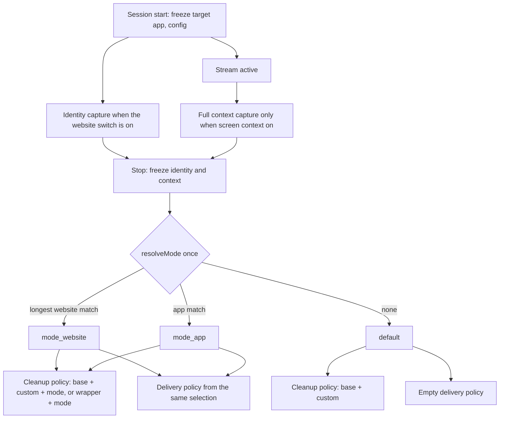
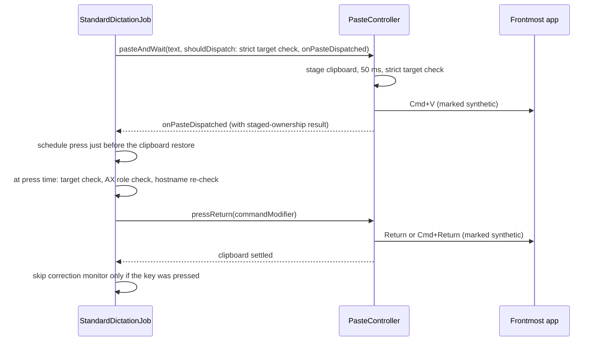
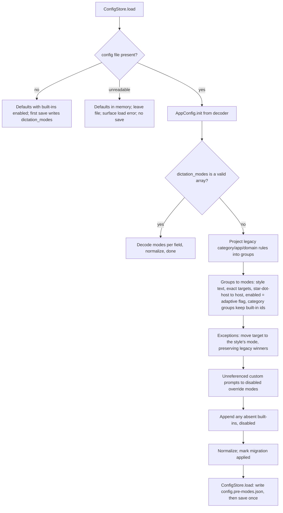
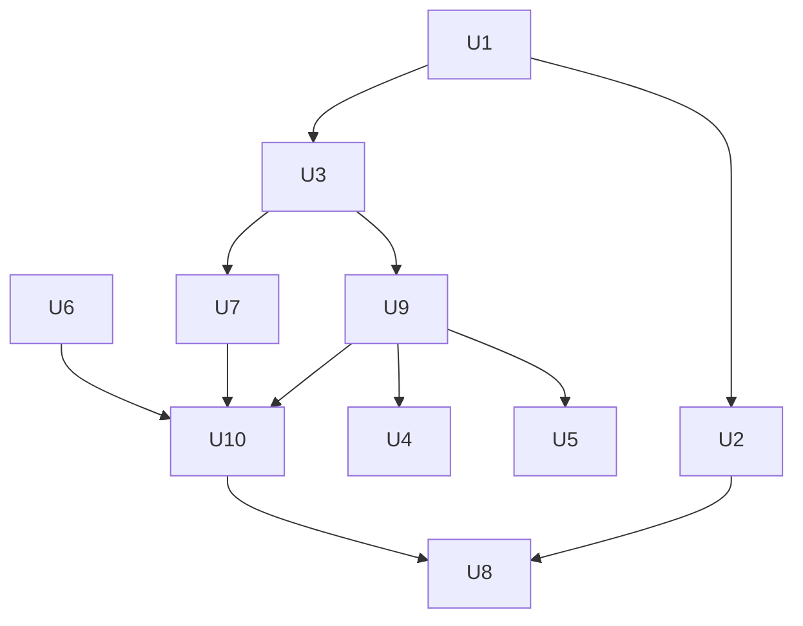

# Dictation Modes - Plan

## Goal Capsule

- **Objective:** A user sets up dictation once per destination: "in Slack, keep it casual and press Enter for me; in VS Code, keep code words verbatim; in Mail, write full sentences." Muesli then picks the right behavior by itself from the app or website they are dictating into, and an existing Writing Styles user keeps the prompt they had, with one named exception (R5).
- **Means:** One `DictationMode` entity replaces styles, groups, and exceptions (KD1, KTD1); modes resolve by exact app or website identity (KTD2); the composer gets a mode block (KTD3); auto-enter rides a frozen delivery policy to the paste site (KTD5); a Modes screen replaces the Writing Styles workspace (KD3).
- **Authority hierarchy:** R-IDs own product behavior. KTDs own mechanism within their cited Rs. Existing tests that pin prompt bytes for the no-mode path are characterization evidence and stay green (R12).
- **Stop conditions:** Evidence that a session-settled decision is infeasible; a required change to the files another in-flight PR owns (Scope Boundaries); a migration case that would lose a user's prompt text with no representable mode.
- **Execution profile:** Code. Swift Testing suites in `native/MuesliNative/Tests/MuesliTests`. Verification per the Verification Contract.
- **Tail ownership:** The invoking pipeline ships the branch as a PR against `dev`; this plan owns nothing after the Definition of Done.

---

## Product Contract

### Summary

Replace the Writing Styles system with Modes. A mode has a name, an enabled flag, its own instructions, an "override default" flag, activation apps, activation websites, and an optional auto-enter key. Modes are chosen automatically from the frontmost app's bundle id or the browser page's hostname when a dictation stops. A Modes screen in Settings shows the global Custom instructions editor, a grid of mode cards, "Reset modes", "Create mode", and an editor sheet with a searchable installed-app picker. Existing styles, groups, exceptions, and the global prompt migrate into modes once, deterministically, with a backup of the old file. Users who never turned on Adaptive Styles keep byte-identical prompts; users who did get one named change (R5).

### Problem Frame

Writing Styles split one idea across three entities (styles, groups, exceptions), matched with wildcard patterns that needed a specificity and ambiguity validator, and guarded that validator with a quarantine that refuses every config save when the ruleset is invalid (`ConfigStore.swift`). The JSON ruleset codec, the category and app/domain rule projections, the "Adaptive Styles" switch, and the "Global style" popup all exist to serve that shape. Users of Monologue and similar tools expect one list of modes, each with its own instructions and app list, plus an auto-send key for chat apps. The global Custom Instructions field shipped in PR #16 already gives the default path a personal-context block, so a per-mode block is the missing layer.

### Key Decisions

- **KD1. Replace Writing Styles with Modes; do not add Modes beside them.** (session-settled: user-directed — chosen over a re-skin of the existing model and over adding Modes alongside: two overlapping systems would confuse users and double the maintenance.) Governs R1, R2, R3, R20, R21.
- **KD2. "Override default" makes a mode's instructions replace the default cleanup rules and the global custom instructions.** (session-settled: user-directed — chosen over "override replaces only the base rules": Monologue's toggle reads "use these instructions instead of the default ones, even if there are none".) Governs R10, R11.
- **KD3. The Modes screen mirrors Monologue: global Custom instructions on top, mode cards in a grid, Reset modes, Create mode, and an editor sheet with Name, Activation apps, Activation websites, Override default, Custom instructions, and Auto enter.** (session-settled: user-directed — chosen over keeping the sidebar workspace layout: the user supplied the reference screens.) Governs R16, R17, R18, R19, R23.
- **KD4. Auto enter presses Return or Command-Return after a successful paste.** (session-settled: user-directed — chosen over no delivery action: the reference product ships it and chat apps are the primary mode use case.) Governs R14, R15.

### Requirements

**Data model and persistence**

- R1. `AppConfig` carries `dictationModes` (JSON key `dictation_modes`, always encoded) where each mode has `id`, `name`, `is_enabled`, `instructions`, `override_default_instructions`, `app_bundle_ids`, `website_hostnames`, and `auto_enter` (`null`, `"return"`, or `"command_return"`).
- R2. A mode element decodes per field with defaults; an element is dropped only when it is not a JSON object. A missing or blank `id` gets a deterministic id derived from its array index (`mode-<index>`). No decode path quarantines the config or refuses unrelated saves.
- R3. Nine legacy keys become decode-only and are not written back: `active_transcript_cleanup_prompt_id`, `custom_transcript_cleanup_prompts`, `adaptive_dictation_styles_enabled`, `dictation_style_ruleset_initialized`, `dictation_style_groups`, `dictation_style_exact_exceptions`, `dictation_style_category_assignments`, `dictation_style_app_rules`, and `dictation_style_domain_rules`. `post_processor_system_prompt` stays a live, encoded key: it is the base cleanup prompt the no-mode path composes from and the text an override mode replaces.
- R4. Both decode and save normalize modes without throwing and without reordering them: trimmed names with a fallback, unique ids (the first element in array order keeps a duplicated id; every later duplicate is reassigned its deterministic index-derived id from R2), normalized and de-duplicated targets (a target belongs to the first mode in array order that lists it), instructions capped at the custom-instructions cap for user-entered text, and unknown `auto_enter` values coerced to none. The normalizer is idempotent, so memory equals disk after load.

**Migration**

- R5. When `dictation_modes` is absent, the legacy keys migrate into modes once: each group becomes a mode named after the group with the style's prompt as instructions, `override_default_instructions` false, its exact bundle-id and hostname matchers as targets, and `is_enabled` equal to the legacy adaptive flag. A hostname matcher of the exact form `*.<host>` becomes the website entry `<host>`; any other matcher containing `*`, and any single-label host, is dropped with a log line. **Named behavior change:** for a user who had Adaptive Styles on, a matched migrated mode now composes as base rules plus global instructions plus the mode block, where the old style replaced the base rules. The mode text still reaches the model and the user can restore the old shape by turning on Override default. This is the only intended prompt change on upgrade and R22 records it.
- R6. Each exact exception moves its target to the mode that carries the exception's style (creating that mode when needed) and removes the target from every other mode. Migration output preserves the legacy winner for every target that more than one legacy rule could match, so the first post-upgrade dictation into that target resolves the same style text it resolves today.
- R7. Every custom prompt not referenced by a group or an exception becomes a mode with the prompt's name, its exact bytes as instructions, `override_default_instructions` true, no targets, and `is_enabled` false, so no prompt text is lost. Migration never truncates a migrated prompt; the R4 cap applies to text a user types, not to migrated bytes.
- R8. Migrated category groups (`starter-group-<category>` and `legacy-group-<category>`) whose style is the category's default style keep the built-in mode id for that category (Writing maps to Notes) so "Reset modes" restores them; other groups keep their own id. Built-in modes absent after migration are appended disabled, so Reset is not the only path to them. A fresh install (no config file) seeds the four built-ins enabled; the memberwise default `AppConfig()` seeds them disabled. An unreadable or unparsable existing config file is not a fresh install: it loads defaults in memory, leaves the file untouched, writes no config, and surfaces a recoverable load error.
- R9. The migration is deterministic, including ids. The migrating launch first copies the pre-migration bytes to `config.pre-modes.json` (0o600, never overwritten once present), then writes the config once so the new key is on disk and the nine legacy keys leave it; a failed backup aborts the migrating save and leaves the legacy file intact. Only a valid `dictation_modes` **array** suppresses re-migration; `null`, an object, or a malformed value is treated as absent so legacy data is never discarded by a hand-edited key. The backup carries the same plaintext contents as `config.json`, including provider API keys, and R22 tells users to delete it once the upgrade is confirmed.

**Resolution and prompt composition**

- R10. At dictation stop, the resolver picks, among enabled modes: the mode whose matching website entry is the longest (host equal to the entry, or ending in `.` plus the entry), else the mode whose app list contains the target bundle id, else no mode. Website beats app; array order breaks ties only between equally long website entries and between app matches.
- R11. The cleanup system prompt is composed once per dictation from the resolved mode: with no mode, the base prompt (`post_processor_system_prompt`), then the global custom-instructions block, then speaker vocabulary; with a non-override mode, the same plus a `<MODE-INSTRUCTIONS>` block after the custom block; with an override mode, the safety wrapper plus the mode block replace the base prompt and the custom block, and speaker vocabulary still follows (KD2). The mode block's preamble states that these instructions apply to this destination and take precedence over the standing preferences above. Both blocks share one on-device budget, filled global-first then mode. Mode-tag stripping applies only when a mode block is present, so the no-mode path keeps today's reserved-sequence behavior.
- R12. With no mode matched, every dictation prompt is byte-identical to the prompt produced today for the same configuration, including a user's edited `post_processor_system_prompt`.
- R13. Website identity (bundle id plus browser hostname, nothing else) is captured for a standard dictation when a "Match modes by website" setting is on, Accessibility is trusted, and any enabled mode in the frozen session config lists a website. The setting defaults on for a fresh install and off for a migrated config whose `enable_screen_context` was false. The identity value never enters a prompt, the database, session traces, telemetry, or a log line; document text, selected text, and OCR stay behind the existing screen-context toggles, whose current behavior is unchanged.

**Delivery**

- R14. When the resolved mode has an auto-enter key, Muesli presses that key once, only if all of these held: the paste command dispatched, Muesli still owned the staged clipboard at dispatch, the frontmost application at press time is the frozen target by process id and bundle id (Muesli itself never qualifies), the focused element's Accessibility role is text-like or cannot be read, and — for a website-matched mode — the browser's hostname still matches the entry that selected the mode. The paste itself is never blocked by these conditions. Auto-enter never fires for voice notes, the onboarding dictation test, computer use, or streaming delivery. Hands-free toggle dictations on a non-streaming backend use the standard paste path and are covered.
- R15. When auto-enter actually presses the key, the post-paste correction monitor does not start for that dictation. When the press was suppressed, the monitor starts as it does today.

**Modes screen**

- R16. Settings > Dictation shows a "Modes" row with a "Manage modes…" button whether or not AI cleanup is enabled; the row's caption states that instructions are inert while cleanup is off or the model uses a fixed prompt, that auto-enter still works, and that website matching reads the focused browser window's address, with the switch that turns it off.
- R17. The Modes sheet shows the global Custom instructions editor on top, then a two-column grid of mode cards (name, enabled switch, activation-app icons and website chips truncated with an overflow count, Edit, Delete); a mode with neither apps nor websites shows "Not used in any app". Card switches persist immediately.
- R18. "Create mode" opens an empty editor. "Reset modes" asks for confirmation whose text states that customized built-in modes lose their name, instructions, targets, and auto-enter, that custom modes are kept, and that a shipped target held by a custom mode moves back to its built-in; on confirm it rewrites each present built-in in place with its shipped fields including `is_enabled` at the fresh-install value, appends absent built-ins at the end, reclaims shipped targets and reports the moves, and suffixes a restored built-in's name when a custom mode already carries it.
- R19. The editor sheet has Name (required, unique case-insensitively among the other modes), Activation apps (chips with icons and a remove control, a "+" popover that lists installed and running apps with icons, a focused search field, a progress row while the scan runs and a "No apps match" row when the filter is empty, plus "Choose Application…" for a file), Activation websites (rows with a remove control and an add field that accepts a host or a URL and rejects single-label hosts with an inline message, plus a caption that Muesli reads the focused browser window's address to match and never stores or sends it), Override default, Custom instructions (multi-line, same cap as global instructions), and Auto enter (switch plus Enter / Cmd+Enter picker with a caption that the key is pressed in whatever has keyboard focus after the paste, and Cmd+Enter labeled as the app's send or submit shortcut). Save is disabled when the name is empty or duplicate, or when override is on and instructions are empty. Adding a target already used by another mode moves it in the draft and says so; cancelling the editor discards the move. A status slot renders save, file-picker, and validation errors. Every icon-only control carries an accessibility label naming its mode or target.
- R20. The Writing Styles sheet, the Global style popup, the prompt preview, the Adaptive Styles switch, the JSON ruleset import/export, and the unused prompt manager view are removed.
- R23. A mode can be deleted from its card behind a confirmation alert; deleting a built-in is allowed and Reset restores it.

**History, telemetry, and docs**

- R21. Dictation history rows keep rendering their existing style provenance; new rows store the mode id (or `default`), the mode name (or `Default`), and a selection source of `mode_app`, `mode_website`, or `default` in the existing `dictation_style_*` columns, each with a badge label. The style payload of the dictation telemetry event stays exactly four content-free keys and never carries a mode id or name; the event's existing `backend` and `paste_method` fields are unchanged.
- R22. `docs/privacy.html` is updated wherever it describes Writing Styles or the browser address: the Accessibility statement gains the mode-matching address read and its off switch, the Writing Styles export and style-provenance statements become Modes statements, and the local-only storage of mode names, app lists, website lists, and instructions is stated. The CHANGELOG records the migration, the backup file as the manual rollback plus the advice to delete it because it contains provider API keys, the R5 adaptive-on prompt change, and the downgrade caveats.

### Acceptance Examples

- AE1. **Covers R5, R8, R9.** Given a config with adaptive styles on, a group "Team chat" with style Message and exact matchers `com.tinyspeck.slackmacgap` and `web.whatsapp.com`, when the app launches, then `config.pre-modes.json` holds the old bytes and `config.json` holds `dictation_modes` with an enabled mode "Team chat" carrying those targets, and none of the nine legacy keys.
- AE2. **Covers R5.** Given adaptive styles off and the same group, then the migrated mode has `is_enabled` false and a Slack dictation produces the same prompt bytes as before the upgrade.
- AE3. **Covers R7, R11, R12.** Given adaptive off and an edited `post_processor_system_prompt`, then no mode carries those bytes, they remain the base prompt, and a dictation into an unlisted app produces the pre-upgrade prompt byte for byte; two unreferenced custom prompts exist as disabled override modes.
- AE4. **Covers R10.** Given an enabled mode listing `notion.so` and a Safari page at `www.notion.so/workspace`, then the resolver picks that mode; given `docs.notion.so`, it also matches; given `notion.software`, it does not.
- AE5. **Covers R10.** Given mode A listing `notion.so` and mode B listing `www.notion.so`, and a page at `www.notion.so`, then mode B wins on the longer entry regardless of array order.
- AE6. **Covers R11, R12.** Given no matching mode, global instructions "Use British spelling", and two dictionary words, then the prompt equals today's base prompt with the custom block and vocabulary; given a matching non-override mode "Casual", the `<MODE-INSTRUCTIONS>` block sits after the custom block and before the vocabulary.
- AE7. **Covers R11.** Given a matching override mode with instructions "Return only code", then the prompt is the safety wrapper plus the mode block plus vocabulary, with no base prompt and no custom block.
- AE8. **Covers R14, R15.** Given a Messaging mode with auto-enter Return and a standard dictation into Slack, when the paste dispatches with Muesli owning the staged clipboard and the target still frontmost with a text-like focus, then a Return follows and the correction monitor does not start; given Finder became frontmost before the press, no key is pressed and the correction monitor starts normally.
- AE9. **Covers R13.** Given screen context off, "Match modes by website" on, Accessibility trusted, and an enabled mode listing `chatgpt.com`, when the user dictates into Chrome on `chatgpt.com`, then the mode matches and the stored dictation's app context equals the app-only context, with an empty trace context-sources artifact.
- AE10. **Covers R18, R23.** Given the user renamed the built-in "Email" mode, deleted "Coding", created "Standup", and moved Mail into "Standup", when they confirm Reset modes, then "Email" has its shipped fields at its old index, "Coding" is appended, Mail returns to "Email" with the move reported, and "Standup" survives with its other targets.
- AE11. **Covers R19.** Given mode "Coding" lists VS Code and the user adds VS Code to "Notes" and saves, then VS Code is listed only in "Notes" and the editor showed "Moved from Coding"; cancelling instead leaves VS Code in "Coding".
- AE12. **Covers R2, R4.** Given `dictation_modes` with one valid mode, one object missing `name` whose instructions are 2,000 characters, and one string element, when the config loads and is saved, then two modes remain, the nameless one has the fallback name and its full instructions, and the string element is gone.
- AE13. **Covers R4, R9.** Given the same legacy fixture decoded twice, then the two mode arrays are equal including ids; given modes in order C, A, B, then sanitize, encode, and decode keep that order; given `"dictation_modes": null` beside legacy keys, then the migration runs.

### Scope Boundaries

- The mode block and the global block share the 2,000-character cap and the 500-character on-device budget from PR #16.
- Streaming (double-tap) delivery, voice notes, computer use, the onboarding dictation test, and meeting transcript cleanup never resolve a mode.
- The four built-in modes are Email, Notes, Coding, and Messaging; their instruction text comes from the existing built-in presets and their targets from the existing curated app and hostname catalogs. Messaging ships `auto_enter: "return"`; the other three ship none.
- Shipping built-in website targets means the Accessibility address read is on by default for browser dictations on a fresh install, behind the R13 switch.

#### Deferred to Follow-Up Work

- Auto-enter for streaming delivery (needs a focus check the streaming stop path does not have).
- Extending the browser list beyond the six bundle ids in `ScreenContextCapture.swift`.
- Verifying the target application's code-signing identity in addition to its bundle id.
- A curated icon or template picker for modes.
- Repo docs beyond R22 (`docs/art-direction/muesli-app-shell/settings-ia.md`, `README.md`).

#### Outside this plan (owned by in-flight sibling PRs)

- `MixedLanguageRepairPrompt`, `MeetingTranscriptCleanupPrompt`, the `mixed-language-repair` preset entry and `mixedLanguageRepairID`, the meeting cleanup toggle and consent code, and any bilingual auto-enable logic.
- Language profile types, the language settings cards, and meeting transcription routing.
- The meeting audio pipeline.

### Success Criteria

- A user who never turned on Adaptive Styles sees no prompt change after upgrade; a user with groups sees the same modes they had, under the same names, with the R5 change named in the CHANGELOG.
- Dictating into a chat app with a Messaging mode sends the message without touching the keyboard.

### Sources

- `native/MuesliNative/Sources/MuesliNativeApp/DictationStyleResolver.swift` — wildcard resolution, curated catalogs, starter and legacy group ids, legacy projection, canonical validation (to be retired).
- `native/MuesliNative/Sources/MuesliNativeApp/ConfigStore.swift` — quarantine and canonical gate on every save; atomic write; migration save-on-load hook.
- `native/MuesliNative/Sources/MuesliNativeApp/TranscriptionRuntime.swift` — `DictationCleanupPromptComposer` after PR #16.
- `native/MuesliNative/Sources/MuesliNativeApp/CustomInstructions.swift` — block builder and reserved sequences.
- `native/MuesliNative/Sources/MuesliNativeApp/DictationCorrectionMonitor.swift` — `DictationStyleSessionSnapshot`, resolve-at-stop contract.
- `native/MuesliNative/Sources/MuesliNativeApp/PasteController.swift` — `paste(onPasteDispatched:)`, `requireStagedClipboardOwnership`, `shouldDispatchPaste`, `postPhysicalKey`, synthetic-event marking, the AX request timeout constant.
- `native/MuesliNative/Sources/MuesliNativeApp/ScreenContextCapture.swift` — `browserPage(for:)`, browser bundle ids, hostname normalization, the stderr URL log line in `capture(app:)`.
- `native/MuesliNative/Sources/MuesliNativeApp/ComputerUseExecutor.swift` — installed-app enumeration to extract.
- `native/MuesliNative/Sources/MuesliNativeApp/SettingsView.swift`, `WritingStylesView.swift`, `MeetingTemplatesManagerView.swift`, `NewMeetingContactView.swift`, `TargetApplicationIconView.swift`, `CustomInstructionsEditor.swift`, `LanguageProfileSettingsModel.swift` — UI recipes, the client seam, and design gates.
- `docs/privacy.html` — the Writing Styles and Accessibility statements R22 changes.
- `docs/plans/2026-08-09-001-feat-per-app-dictation-styles-plan.md`, `docs/plans/2026-08-10-001-feat-dynamic-dictation-style-groups-plan.md` — the system being replaced.
- `docs/plans/2026-09-05-0207-feat-custom-instructions-plan.md` — the composer and editor this plan extends.

---

## Planning Contract

### Key Technical Decisions

- KTD1. **One `DictationMode` struct in `Models.swift` plus a `DictationModes` helper file own the model, the non-throwing normalizer, the built-in seeds, and the deterministic legacy migration; retirement of the old stack happens only after every consumer is re-pointed.** The nine legacy keys move into `LegacyDictationStyleCodingKeys`, which already exists for older keys, so they decode but never encode; `post_processor_system_prompt` stays live because it is the base prompt (R3). `TranscriptCleanupPrompts`, `TranscriptCleanupPromptPreset`, and `CustomTranscriptCleanupPrompt` stay untouched: they are the source of built-in instruction text, the legacy decode type, and a sibling PR's test dependency. Governs R1-R9 (inherits KD1's label).
- KTD2. **`DictationModeResolver` does normalized matching with longest-website-wins, then app, then none.** A user types `notion.so` and expects `www.notion.so` to match, so a website entry matches when the captured host equals it or ends with `.` plus it; the longest matching entry wins so a more specific mode beats a broader one without a reorder control, and this also maps the common legacy `*.host` matcher losslessly. Single-label entries are rejected because one of them would arm every site. No wildcards, no specificity scoring, no ambiguity validation. `normalizeBundleID`, `normalizeHostname`, the lenient `normalizedHostnameInput`, and the dotted-identifier check co-locate in the new resolver file because `ScreenContextCapture`, `DictationSessionTarget`, and the settings model depend on them; `browserPage(from:)` stays the only capture-side URL-to-host path. Governs R4, R5, R10, R19.
- KTD3. **The low-level composer overload gains a trailing `modeInstructions` parameter that defaults to nil; the config-level overload replaces its `selection:` slot with a mode selection in the same position; the block order is base, custom, mode, vocabulary; an override mode reuses the safety wrapper with the mode block and an empty custom block.** Specific instructions come after general ones and the mode block's own preamble says so, so a mode instruction that contradicts a standing preference wins. The mode block is a sibling of `CustomInstructions.promptBlock` that shares the reserved-sequence stripping and draws from one on-device budget filled global-first; the mode tags enter the stripped set only when a mode block is present, so the no-mode path stays byte-identical. A sibling PR appends another defaulted parameter after the mode slot. Governs R11, R12 (inherits KD2's label for the override arm).
- KTD4. **Website identity is captured by an identity-only capture started in `beginDictationStyleSession` at user-initiated priority, frozen next to the stopped context, and read by the session snapshot.** The existing `captureDictationContextAsync` emits the URL into the prompt, the database, and a stderr line, and starts only after audio is live at utility priority, so it cannot serve users with screen context off or short dictations. The identity type holds only session id, process id, bundle id, and normalized hostname; it calls `browserPage(for:)` directly, never `capture(app:)`, after the same PID-bound target check; it is gated on the R13 switch, the frozen session config, standard mode, not dictation test, and Accessibility trusted; the session's clear and freeze helpers list it explicitly; a latency mark records whether identity landed before stop. The resolver reads identity first, then the full context hostname. Governs R13.
- KTD5. **Auto-enter is a `DictationDeliveryPolicy` derived from the same mode selection as the cleanup policy, carried through `PendingStandardDictationStop` and `StandardDictationJob`, and fired from `onPasteDispatched` through a main-queue delay that lands just before the clipboard restore.** The dispatch callback runs synchronously before the restore is scheduled, so the press is scheduled from it, not awaited inside it. The paste keeps today's `requireStagedClipboardOwnership: false` so no paste that works today starts failing; ownership at dispatch is instead one of the press preconditions, read from the paste's own dispatch result. The remaining preconditions are the strict target check (frontmost process id and bundle id equal the frozen target, no `lastExternalApp` fallback, Muesli never qualifies), a text-like or unreadable Accessibility role on the focused element under the existing AX request timeout, and, for website modes, a re-read hostname that still matches. `PasteController.pressReturn(commandModifier:)` wraps the private `postPhysicalKey` with key code 36 and marks the event, so the hotkey monitors ignore it. Nothing proves the destination finished inserting the text; the delay is the only mitigation and the Risks table names that. The cleanup policy stays untouched so `TranscriptionRuntime` does not learn about delivery. Governs R14, R15 (inherits KD4's label).
- KTD6. **The session snapshot exposes one `resolveMode` over frozen inputs, and the cleanup policy and delivery policy are pure functions of that selection.** Both inputs are frozen synchronously at stop, which is what makes resolution deterministic; the hazard is two resolutions at different times, so the controller resolves once in the pending-stop capture and derives both policies. The existing `cleanupPolicy(enabled:context:)` convenience stays so current test call sites compile, and the snapshot remains a pure function of the context passed in. The no-session fallback carries an empty delivery policy. Governs R10, R14.
- KTD7. **The Modes sheet replaces the Writing Styles sheet in the same Settings slot; the Dictation pane keeps its Custom instructions card and the Modes sheet shows the same editor on top; the pane flushes any pending debounce before presenting the sheet.** The card's caption is the only place a meetings user learns the field also applies to meeting cleanup and notes, and the sheet is the parity surface; both commit through `setCustomInstructions`, which already refreshes the runtime, so the sheet adds no second commit path. Flushing on present removes the race where a stale debounce lands behind the sheet's edit. One shared helper computes the scope note so the two surfaces cannot drift. Governs R16, R17.
- KTD8. **`DictationModesSettingsModel` persists through an injected `DictationModesClient` (`load`, throwing `save`) that the controller implements once; card switches, deletes, and the editor all go through it.** This mirrors `LanguageProfileClient` and makes the failed-persistence, toggle, and delete scenarios testable without a controller; the store's save no longer throws for content, so the seam surfaces only I/O errors. `updateDictationModesConfiguration` replaces `updateDictationStyleConfiguration` and does not refresh the post-processor prompt, because the per-dictation snapshot already carries the mode. Governs R17, R18, R19, R23.
- KTD9. **`settingsSection`, both `settingsRow` variants, `settingsSwitch`, and `compactActionButton` move to an internal `SettingsControls` enum; `TargetApplicationIconResolver` becomes internal with a URL-based overload and `TargetApplicationIconView` takes an accessibility label.** Only these helpers are needed; the four divergent `actionButton` helpers stay where they are. Governs R17, R19.
- KTD10. **`InstalledApplicationCatalog` extracts the enumeration from `ComputerUseExecutor` and merges installed, running, and file-chosen apps; the executor keeps its early-exit, cancellable scan.** Enumerate `/Applications`, `/System/Applications`, and `~/Applications` with `.skipsPackageDescendants` off the main thread, normalize ids, keep the executor's match-name set per candidate, resolve icons lazily on the main actor, exclude Muesli and non-regular activation policies, and filter by name or bundle id. The catalog is owned by the Modes view as state and publishes a scanning flag the picker renders. Governs R19.
- KTD11. **`DictationStyleSelectionSource` keeps its seven cases and adds `mode_app`, `mode_website`, and `default`; `DictationCleanupStyleProvenance` swaps `categoryID`/`groupID` for `modeID`.** History rows are parsed back by raw value, the store tests insert literal old values, the row view's switch is exhaustive, and provenance is excluded from the sync wire model, so older builds only lose the badge. Governs R21.
- KTD12. **U8 retires what earlier units left behind: the resolver, the ruleset codec, the settings model, the legacy fields, and three style test suites (`DictationStyleResolverTests`, `DictationStyleSettingsTests`, `DictationStyleRulesetCodecTests`).** Earlier units own the rest: U1 the quarantine, U3 the observability source and its suite (replaced), U6 the unused prompt manager view, U10 the workspace view and the controller preset CRUD. Units keep the package building at every commit. Retained `*Style*` names that must survive the grep gate: `DictationStyleSelectionSource`, `DictationCleanupStyleProvenance`, `DictationStyleSessionSnapshot`, `DictationStyleSessionMode`, `beginDictationStyleSession`, `freezeDictationStyleSessionAtStop`, `activeDictationStyleSession`, `stoppedDictationStyleSession`, `DictationStyleSessionTests.swift`, and the `dictation_style_*` columns. Governs R20 (inherits KD1's label).
- KTD13. **Migration ids are derived, never random, and the migrating launch writes a one-time backup before its single save.** A failed or interrupted save-on-load re-runs the migration next launch while history rows may already reference ids from the first run; derived ids (`group.id`, `legacy-style-<styleID>`, `legacy-prompt-<promptID>`, the built-in ids) make both runs equal. `config.pre-modes.json` restores rollback for a downgrade and for a migration bug, because the forced save is the moment the legacy keys leave disk. Governs R9.
- KTD14. **New types and files use the `Dictation` prefix.** `DictationModesView`, `DictationModeEditorView`, `DictationModesSettingsModel`, `DictationModeObservability`; bare `Mode*` collides with `DictationStyleSessionMode` and `DictationOutputMode`. `allowsAdaptiveStyles` becomes `allowsDictationModes`.

### High-Level Technical Design

Resolution and composition at dictation stop:

Auto-enter delivery:

Migration decision flow:

### Assumptions

- Built-in modes ship disabled for an existing user whose adaptive flag was off, so an upgrade never changes their output; a fresh install gets them enabled.
- Longest-website-wins is a refinement of the settled "exact matching" decision, not a departure from it.
- A target used in two modes is resolved by moving it, not by blocking the save.
- The auto-enter press is scheduled to land just before the 0.5 s clipboard restore, inside the awaited paste transaction; the exact constant is pinned above the worst paste-to-render latency observed in the U5 lane walkthrough.
- `NSWorkspace.icon(forFile:)` is called on the main actor only; the catalog loads names and ids off-main.
- Docs pages beyond R22 are follow-up work.

### Risks and Mitigations

- **A migration case loses prompt text.** Invariant: every prompt the user could select survives. Protection: the base prompt stays a live key (R3), unreferenced custom prompts become disabled modes (R7), and migration never truncates. The only loss set is non-leading wildcard matchers and single-label hosts, logged.
- **A failed migrating save re-runs the migration with different ids.** Protection: derived ids (KTD13); AE13.
- **Auto-enter submits before the destination finished inserting the paste.** No runtime signal proves insertion; the delay is the only mitigation, measured in the U5 lane walkthrough against a native and a web composer. Unmitigated in the general case and named here deliberately.
- **Auto-enter reaches the wrong app or a non-text control.** Protection: staged-ownership, strict target, AX role, and hostname preconditions at press time (KTD5); the paste itself is never blocked by them.
- **A hand-edited Quill Carbon hotkey equal to Cmd+Return fires on the synthetic press.** The recorder cannot produce such a hotkey; the residual is accepted and the marked-event contract is pinned by a test (U5).
- **Removing the quarantine lets a bad array through.** Protection: per-field lenient decode, normalize at decode end and on save, idempotent normalizer (R2, R4).
- **A downgrade to an older build drops modes.** Invariant: the pre-migration bytes exist until the user deletes them. Rollback: rename `config.pre-modes.json` back before launching the old build. The backup holds provider API keys, so R22 tells users to delete it once the upgrade is confirmed.
- **Short dictations resolve before the hostname lands.** Protection: identity capture starts at session start at user-initiated priority; a latency mark shows whether it beat stop; the resolver falls through to the app list (KTD4).
- **Design-gate suites reject the new views.** U6 and U10 use only the tokens and shapes listed in the settings research; the swept-file list is updated in the same unit that deletes each old view.

### System-Wide Impact

- Config schema: one new key, nine keys demoted to decode-only, one live key retained, one backup file; `ConfigStore.save` stops throwing for content.
- Dictation prompt: a new optional block; the no-mode path is byte-identical; adaptive-on users get the R5 change.
- Paste path: the paste is unchanged; a synthetic key event may follow it under the R14 preconditions; the correction monitor is skipped only when the key was pressed; hands-free non-streaming dictations are included.
- Accessibility: identity capture reads the focused browser window's document URL for standard dictations when the R13 switch is on and a website mode exists; disclosed in the editor, the Modes row, and the privacy page, and switchable off.
- History and telemetry: new selection-source raw values with badge labels, same columns and four style keys; synced rows show no badge on older builds.
- Runtime refresh: mode edits do not reconfigure the preloaded runtime; only custom-instructions edits do.

---

## Implementation Units

Units U1 through U7 and U9 add beside the old code and keep the package building at every commit; U6 and U10 also delete the views they replace; U8 retires the rest. Dependency graph:

### U1. Mode model, config key, normalizer, and quarantine removal

- **Goal:** `AppConfig` persists modes, loads them per field, normalizes them at decode end and on save, and no ruleset state can refuse a config save.
- **Requirements:** R1, R2, R3, R4; KTD1.
- **Dependencies:** none.
- **Files:** `native/MuesliNative/Sources/MuesliNativeApp/Models.swift`; `native/MuesliNative/Sources/MuesliNativeApp/DictationModes.swift` (new); `native/MuesliNative/Sources/MuesliNativeApp/ConfigStore.swift`; `native/MuesliNative/Tests/MuesliTests/ModelsTests.swift`; `native/MuesliNative/Tests/MuesliTests/ConfigStoreTests.swift`; `native/MuesliNative/Tests/MuesliTests/DictationModesTests.swift` (new).
- **Approach:**
  1. Add `DictationMode` (Codable, Identifiable, Equatable, Sendable) with snake_case coding keys, per-field lenient decode like `DictationStyleAppRule`, and an `auto_enter` enum decoded leniently.
  2. Add `AppConfig.dictationModes`, its coding key, and array decode that drops only non-object elements; the memberwise default seeds the four built-ins disabled.
  3. Move the nine legacy keys into `LegacyDictationStyleCodingKeys`, keeping `post_processor_system_prompt` in the live CodingKeys; keep the legacy `AppConfig` properties as decode-only members for U2.
  4. Add `DictationModes.sanitized(_:)` (non-throwing, order-preserving, idempotent) and apply it at the end of `AppConfig.init(from:)` in place of the `sanitizeConfiguration` call and in `ConfigStore.save` and `saveCanonicalConfiguration` in place of `prepareCanonicalConfiguration`; delete the quarantine reason and load-result type, fold the load back into `load()`, keep `saveDictationStyleRulesetConfiguration` as a shim until U8.
  5. Keep atomic writes, `0o600`, sorted keys, and the migration save-on-load hook.
- **Patterns to follow:** `LegacyDictationStyleCodingKeys` and its second container; `DictationStyleAppRule.init(from:)` per-field defaults; the `retiredASRBackendMigrationApplied` non-encoded flag.
- **Test scenarios:**
  - A config with two valid modes round-trips through encode and decode with identical fields.
  - Covers AE12. A nameless object keeps its 2,000-character instructions under the fallback name; a string element is dropped.
  - `auto_enter: "banana"` decodes as none; a blank `id` becomes `mode-<index>`; a later duplicate id is reassigned its index-derived id while the first keeps the value, and a second `sanitized` pass changes nothing.
  - A saved config contains `dictation_modes` and `post_processor_system_prompt` but none of the nine legacy keys.
  - Normalizer: a name of spaces becomes the fallback name; a bundle id listed at index 0 and 2 stays only in index 0; a hostname with a path is dropped; a single-label host is dropped; typed instructions over the cap are truncated.
  - Covers AE13. Order C, A, B survives sanitize, encode, and decode.
  - `AppConfig()` with target `com.apple.mail` resolves no mode (protects the byte pins).
  - `ConfigStore.save` writes a config whose modes array contains a duplicate target instead of refusing.
  - The existing quarantine and fidelity-mismatch tests are removed; the language-profile atomic path test still passes.
- **Verification:** `ModelsTests`, `ConfigStoreTests`, and the new suite pass; the package builds at this commit with the old resolver present.

### U2. Deterministic legacy migration with backup

- **Goal:** Every existing Writing Styles configuration becomes an equivalent, reproducible set of modes once, with the old file kept as a backup and no prompt text lost.
- **Requirements:** R5, R6, R7, R8, R9; KTD1, KTD13.
- **Dependencies:** U1.
- **Files:** `native/MuesliNative/Sources/MuesliNativeApp/DictationModes.swift`; `native/MuesliNative/Sources/MuesliNativeApp/Models.swift`; `native/MuesliNative/Sources/MuesliNativeApp/ConfigStore.swift`; `native/MuesliNative/Tests/MuesliTests/DictationModeMigrationTests.swift` (new); `native/MuesliNative/Tests/MuesliTests/ModelsTests.swift`; `native/MuesliNative/Tests/MuesliTests/ConfigStoreTests.swift`.
- **Approach:**
  1. Define the migration as a pure function from a private legacy snapshot to `[DictationMode]`, with derived ids per KTD13 and pinned output order: groups in legacy order, then exception-created modes, then unreferenced prompt modes, then appended built-ins.
  2. Copy the legacy category/app/domain projection into the migration file so pre-August configs take the already-tested path first.
  3. Implement groups to modes (including `*.host` mapping, single-label rejection, and category-group id mapping for both id families), exception target moves that preserve the legacy winner, unreferenced custom prompts as disabled override modes, name-collision suffixing, and built-in appending per R8.
  4. Decide "fresh install" only at `ConfigStore.load` for a missing file; an unreadable file leaves the file untouched and writes nothing. Set a non-encoded `dictationModesMigrationApplied` flag on the decode path; extend the save-on-load hook to write `config.pre-modes.json` once (0o600, never overwritten) before the single save, abort the save when the backup fails, and log a distinct line on failure.
  5. Rewrite the `ModelsTests` cases that pinned the old sanitize and fallback behavior as migration cases.
- **Execution note:** Build fixtures first from real config shapes and prove each expected mode set, including ids and order, before implementing.
- **Patterns to follow:** `projectLegacyConfiguration` and `starterGroups` in the retired resolver; `applyLegacyLanguageProfile` for a decode-time migration.
- **Test scenarios:**
  - Covers AE1. Group with two exact matchers migrates with instructions and targets; the backup equals the original bytes with 0o600; a second load does not touch the backup.
  - Covers AE2. Adaptive off yields `is_enabled` false.
  - `*.example.com` becomes `example.com`; `mail-*.example.com` and a single-label host are dropped and the mode is still created.
  - Covers AE3. An edited base prompt stays in `post_processor_system_prompt` and no mode carries it; two unreferenced custom prompts become disabled override modes; a 3,000-character legacy prompt migrates untruncated.
  - An exception targeting a style with no group creates `legacy-style-<id>` and removes the target from the group that also listed it; a target matched by both a group and an exception resolves to the exception's text after migration.
  - `starter-group-email` and `legacy-group-email` both map to the built-in Email id; absent built-ins are appended disabled.
  - Group "Formal" plus custom style "Formal" yields two saveable modes.
  - No config file seeds four enabled built-ins and the first save writes `dictation_modes`; an unreadable file writes nothing and leaves the file byte-identical.
  - Covers AE13. `dictation_modes: null`, `{}`, and a malformed value all migrate; a valid `[]` does not.
  - The same fixture decoded twice yields equal arrays including ids; output order is pinned.
- **Verification:** New suite, `ModelsTests`, and `ConfigStoreTests` pass; a lane B launch with a copied legacy config shows the expected modes and the backup file.

### U3. Resolver, identity normalizers, selection sources, and provenance

- **Goal:** One resolver picks a mode from a normalized identity, and history, telemetry, and the debug logger carry mode provenance with values that stay valid on older builds.
- **Requirements:** R10, R21; KTD2, KTD11, KTD14.
- **Dependencies:** U1.
- **Files:** `native/MuesliNative/Sources/MuesliNativeApp/DictationModeResolver.swift` (new); `native/MuesliNative/Sources/MuesliNativeApp/Models.swift`; `native/MuesliNative/Sources/MuesliNativeApp/DictationCorrectionMonitor.swift`; `native/MuesliNative/Sources/MuesliNativeApp/ScreenContextCapture.swift`; `native/MuesliNative/Sources/MuesliNativeApp/DictationModeObservability.swift` (new); `native/MuesliNative/Sources/MuesliNativeApp/DictationStyleObservability.swift` (delete); `native/MuesliNative/Sources/MuesliNativeApp/TranscriptCleanupDebugLogger.swift`; `native/MuesliNative/Sources/MuesliNativeApp/DictationRowView.swift`; `native/MuesliNative/Sources/MuesliNativeApp/TranscriptionRuntime.swift` (provenance struct only); `native/MuesliNative/Sources/MuesliNativeApp/MuesliController.swift` (provenance write and telemetry call only); `native/MuesliNative/Tests/MuesliTests/DictationModeResolverTests.swift` (new); `native/MuesliNative/Tests/MuesliTests/DictationModeObservabilityTests.swift` (new); `native/MuesliNative/Tests/MuesliTests/DictationStyleObservabilityTests.swift` (delete); `native/MuesliNative/Tests/MuesliTests/DictationStoreTests.swift`.
- **Approach:**
  1. Create `DictationModeResolver` with the co-located normalizers and identifier check, `DictationModeTarget`, `DictationModeSelection`, and `resolve(config:target:)` per KTD2; re-point `DictationSessionTarget.matches`, `DictationContext`, and `DictationStyleTarget`'s normalizer calls to it; leave `DictationStyleResolver` in place for its remaining callers.
  2. Add the new selection-source cases, swap the provenance fields per KTD11, add the three badge labels to the exhaustive switch, and write `default` rows as id `default` and name `Default`.
  3. Replace the observability enum with a mode-aware one keeping the same four style keys, delete the old source and its suite, and switch the debug logger fields to the mode id.
- **Patterns to follow:** `DictationStyleResolver.normalizeBundleID` and `normalizeHostname` semantics; `DictationStyleSettingsModel.normalizedHostnameInput` leniency for user input.
- **Test scenarios:**
  - Covers AE4. Suffix matching accepts equal host and subdomain, rejects a longer label.
  - Covers AE5. The longest matching website entry wins regardless of array order; website beats app; app matches break ties by array order.
  - A disabled mode listing the target is skipped and the next enabled mode wins.
  - Normalizer pins moved from the style suites: uppercase bundle id lowercases; hostname with port, trailing dot, path, or query; `https://chatgpt.com/c/1` input becomes `chatgpt.com`; a single-label entry is rejected; an invalid dotted identifier is rejected.
  - Provenance for a website match stores `mode_website`, the mode id, and the mode name; for no match stores `default` and `Default`.
  - Old history rows with `group` and `app` sources still render their labels; new rows render the new labels; an unknown source renders no badge and no crash.
  - The telemetry style payload is exactly the four allow-listed keys with `style_class` in `mode|default|none`, no parameter value equals the mode id or name, and the event still carries `backend` and `paste_method`.
- **Verification:** Suites above pass; the package builds at this commit.

### U9. Composer mode block and session policies from one selection

- **Goal:** A standard dictation resolves one mode at stop and derives its cleanup prompt and its delivery policy from that selection, with the no-mode prompt byte-identical.
- **Requirements:** R11, R12; KTD3, KTD6.
- **Dependencies:** U3.
- **Files:** `native/MuesliNative/Sources/MuesliNativeApp/TranscriptionRuntime.swift`; `native/MuesliNative/Sources/MuesliNativeApp/CustomInstructions.swift`; `native/MuesliNative/Sources/MuesliNativeApp/DictationCorrectionMonitor.swift`; `native/MuesliNative/Sources/MuesliNativeApp/MuesliController.swift` (pending-stop capture and fallback only); `native/MuesliNative/Tests/MuesliTests/TranscriptionRuntimeTests.swift`; `native/MuesliNative/Tests/MuesliTests/DictationStyleSessionTests.swift`; `native/MuesliNative/Tests/MuesliTests/CustomInstructionsTests.swift`.
- **Approach:**
  1. Add a `<MODE-INSTRUCTIONS>` block builder beside `CustomInstructions.promptBlock` with its own preamble, sharing the stripping helper; the mode tags join the stripped set only when a mode block is present.
  2. Extend the low-level and config-level composer overloads per KTD3, with one on-device budget filled global-first then mode; the config-level overload reads the mode's override flag to choose the wrapper arm; leave `DictationCleanupPolicy.init(enabled:selection:)` compiling until U8.
  3. Add `DictationDeliveryPolicy` and `resolveMode(context:identity:)`, `cleanupPolicy(readiness:selection:)`, and `deliveryPolicy(selection:)` on the session snapshot per KTD6; keep `cleanupPolicy(enabled:context:)` as a convenience; rename `allowsAdaptiveStyles`.
  4. In the pending-stop capture, resolve once and derive both policies; the no-session fallback composes with no mode and an empty delivery policy.
- **Patterns to follow:** `DictationCleanupPromptComposer.systemPrompt(base:customInstructions:customInstructionsLimit:customWords:)`; `CustomInstructions.promptSuffix`; the freeze-at-start session tests.
- **Test scenarios:**
  - Covers AE6. No-mode prompt bytes equal today's base-prompt path with custom block and vocabulary, including an edited base prompt; a non-override mode block sits between custom block and vocabulary.
  - Covers AE7. Override mode drops the base prompt and custom block, keeps vocabulary, and wraps the instructions in the mode block with its preamble.
  - A mode instruction that contradicts a global instruction is the one the composed prompt tells the model to follow.
  - Custom text containing `</MODE-INSTRUCTIONS>` is left untouched when no mode is present and stripped when one is; mode text containing `</CUSTOM-INSTRUCTIONS>` is stripped.
  - With both blocks present on the on-device backend the combined body is bounded by the single 500-character budget, global first.
  - S1-mini substitution still replaces the whole composed prompt.
  - A session snapshot created before a config edit keeps the earlier mode set.
  - Delivery policy is present when readiness is disabled; resolving twice over frozen inputs yields the same selection; the no-session fallback carries an empty policy.
  - `emptyCustomInstructionsKeepBytes`, the preload-parity test, and `cleanupRequestDoesNotChangeAfterCommit` pass unchanged.
- **Verification:** Suites above pass; the package builds at this commit.

### U4. Identity capture independent of screen context

- **Goal:** Website modes match even when screen context is off and for short dictations, without the URL reaching any prompt, store, trace, or log, and with a switch that turns the read off.
- **Requirements:** R13; KTD4.
- **Dependencies:** U9.
- **Files:** `native/MuesliNative/Sources/MuesliNativeApp/ScreenContextCapture.swift`; `native/MuesliNative/Sources/MuesliNativeApp/MuesliController.swift`; `native/MuesliNative/Sources/MuesliNativeApp/DictationCorrectionMonitor.swift`; `native/MuesliNative/Sources/MuesliNativeApp/Models.swift` (the website-matching switch key); `native/MuesliNative/Tests/MuesliTests/DictationStyleSessionTests.swift`; `native/MuesliNative/Tests/MuesliTests/ModelsTests.swift`.
- **Approach:**
  1. Add the `match_modes_by_website` key with the R13 default rule (on for a fresh install, off when a migrated config had screen context off).
  2. Add `DictationContextCapture.captureIdentity(target:)` returning only process id, bundle id, and normalized hostname, built on `browserPage(for:)` after the PID-bound target check, with no log line and no display URL.
  3. Start the identity task in `beginDictationStyleSession` at user-initiated priority, gated per KTD4; store it in a session-bound field; add it to the clear and freeze helpers; record an `identity_capture_ready` latency mark.
  4. Feed the frozen identity into the snapshot's matching context ahead of the full context hostname, and keep `formatForPrompt`, `formatForStorage`, and the trace context-sources artifact sourced from the full context only.
- **Patterns to follow:** `captureDictationContextAsync` session-id and state re-validation; `DictationSessionTarget.matches`; the existing `context_capture_base_ready` latency mark.
- **Test scenarios:**
  - Covers AE9. With screen context off, the switch on, and an identity hostname `chatgpt.com`, the snapshot resolves the website mode, the prompt context is nil, the storage context equals the app-only context, and the trace artifact is empty.
  - With the switch off, or with no enabled website mode in the frozen config, the identity capture is not started.
  - A migrated config whose screen context was off decodes with the switch off; a fresh config decodes with it on.
  - An identity captured for a stale session id is discarded; identity is nil after the session is cleared.
  - When both identity and full context carry a hostname, the identity value is used.
- **Verification:** Session tests pass; a lane B sub-second dictation into a browser page with a website mode and screen context off logs `mode_website`.

### U5. Auto-enter delivery

- **Goal:** A mode with auto-enter presses its key only when every precondition held, and never blocks the paste.
- **Requirements:** R14, R15; KTD5.
- **Dependencies:** U9.
- **Files:** `native/MuesliNative/Sources/MuesliNativeApp/PasteController.swift`; `native/MuesliNative/Sources/MuesliNativeApp/MuesliController.swift`; `native/MuesliNative/Sources/MuesliNativeApp/HotkeyMonitor.swift` (test seam only if needed); `native/MuesliNative/Tests/MuesliTests/PasteControllerTests.swift`; `native/MuesliNative/Tests/MuesliTests/HotkeyMonitorTests.swift`; `native/MuesliNative/Tests/MuesliTests/DictationStyleSessionTests.swift`.
- **Approach:**
  1. Add `PasteController.pressReturn(commandModifier:)` on the private physical-key path with an injectable press action, and a named delay constant scheduled to land just before `clipboardRestoreDelay`.
  2. Give `pasteAndWait` passthroughs for `shouldDispatchPaste` and an `onPasteDispatched` that reports whether Muesli still owned the staged clipboard; leave `requireStagedClipboardOwnership` at its current default so paste behavior is unchanged.
  3. Add the strict target check, the AX role check under the existing request timeout (proceed on text-like or unreadable roles, skip on known non-text roles), and the website hostname re-check.
  4. Carry `DictationDeliveryPolicy` through `PendingStandardDictationStop` and `StandardDictationJob`; schedule the press from the dispatch callback, evaluate every precondition at press time, and skip the correction monitor only when the key was pressed.
  5. Leave voice-note, empty-result, streaming, computer-use, dictation-test, and Quill branches untouched.
- **Patterns to follow:** Quill's monitor cancellation in `onPasteDispatched`; `simulatePaste` flags-only posting; `MuesliSyntheticKeyboardEvent.mark`.
- **Test scenarios:**
  - `pressReturn` posts key code 36 with no flags for Return and with the command flag for Cmd+Return, marked synthetic; it reports false when the event source cannot be created and the job still completes.
  - `simulatePasteAction` returning false, or `shouldDispatchPaste` false, never invokes the press action; a paste that would succeed today still succeeds with a policy attached.
  - Staged ownership lost at dispatch: the paste still happens, the press does not.
  - Strict target check is false when the frontmost app is Muesli even though `lastExternalApp` matches, and false on a bundle id or process id mismatch.
  - A known non-text focused role skips the press; an unreadable role proceeds.
  - A website-matched mode whose hostname changed before the press skips the key.
  - Covers AE8. A policy job presses after dispatch, the lifecycle order still has `paste_dispatched` immediately before `clipboard_restore_scheduled`, and the correction monitor does not start; with the target changed at press time no key is posted and the monitor starts.
  - A no-policy job behaves exactly as today, including monitor start.
  - The lifecycle diagnostics allowlist test passes with any new category added.
  - `HotkeyMonitor.handle` returns false for a marked key-down with key code 36 and command flags.
  - Voice note and dictation test jobs never carry a delivery policy.
- **Verification:** `PasteControllerTests`, hotkey tests, and session tests pass; on lane B a Messaging mode sends in Messages and in one web composer, the observed paste-to-render latency is recorded and the delay constant is pinned above it, and bringing Muesli Settings forward during a dictation pastes and submits nothing.

### U6. Shared settings controls, icon resolver access, installed-app catalog, and prompt-manager removal

- **Goal:** The building blocks the Modes screen needs exist outside `SettingsView`, pass the design gates, and the dead prompt manager view is gone.
- **Requirements:** R17, R19, R20; KTD9, KTD10, KTD14.
- **Dependencies:** none.
- **Files:** `native/MuesliNative/Sources/MuesliNativeApp/SettingsControls.swift` (new); `native/MuesliNative/Sources/MuesliNativeApp/SettingsView.swift`; `native/MuesliNative/Sources/MuesliNativeApp/TargetApplicationIconView.swift`; `native/MuesliNative/Sources/MuesliNativeApp/InstalledApplicationCatalog.swift` (new); `native/MuesliNative/Sources/MuesliNativeApp/ComputerUseExecutor.swift`; `native/MuesliNative/Sources/MuesliNativeApp/TranscriptCleanupPromptsManagerView.swift` (delete); `native/MuesliNative/Tests/MuesliTests/InstalledApplicationCatalogTests.swift` (new); `native/MuesliNative/Tests/MuesliTests/ComputerUseExecutorTests.swift`; `native/MuesliNative/Tests/MuesliTests/SemanticColorTests.swift`.
- **Approach:**
  1. Move `settingsSection`, both `settingsRow` variants (explicit control width defaulting to 220), `settingsSwitch`, and `compactActionButton` into an internal `SettingsControls` enum of static view builders; keep thin private wrappers in `SettingsView`.
  2. Make `TargetApplicationIconResolver` internal, add a URL-based overload cached under the same key, and give `TargetApplicationIconView` an accessibility label parameter defaulting to the current text.
  3. Extract the application enumeration into `InstalledApplicationCatalog` (main-actor observable with a scanning flag, off-main cancellable scan, candidates with bundle id, display name, application URL, and the executor's match-name set); have the executor consume the cancellable scan so its early exit is kept.
  4. Add a pure `filter(_:query:)` and a merge with running apps that excludes Muesli and non-regular activation policies; keep the `.app` URL candidate builder with its two error cases.
  5. Delete `TranscriptCleanupPromptsManagerView.swift` and its swept-list line.
- **Patterns to follow:** `LanguageProfileSettingsModel` shape; `ModelsView` detached-task-then-main-actor publish; `DictationStyleSettingsModel.applicationCandidate(at:)`; `ComputerUseExecutor` cancellation every 25 URLs.
- **Test scenarios:**
  - Filter matches on display name and bundle id case-insensitively and returns all for an empty query.
  - Merge de-duplicates a running app that is also installed, excludes the current bundle id, and excludes a background-only app.
  - Candidate creation from a `.app` URL normalizes the bundle id; a non-`.app` URL and a bundle without an id each surface their error.
  - The executor resolves an application URL by folder name, `CFBundleName`, and `CFBundleDisplayName` through the catalog, and a cancelled scan stops early.
  - Design-gate suites pass with the new files present and the deleted view absent.
- **Verification:** New suites and design-gate suites pass; a lane B check shows `SettingsView` unchanged.

### U7. Modes settings model and client

- **Goal:** A testable model owns the modes draft, validation, target moves, delete, Reset semantics, and persistence through one injected client.
- **Requirements:** R17, R18, R19, R23; KTD8, KTD14.
- **Dependencies:** U3.
- **Files:** `native/MuesliNative/Sources/MuesliNativeApp/DictationModesSettingsModel.swift` (new); `native/MuesliNative/Sources/MuesliNativeApp/MuesliController.swift` (client and `updateDictationModesConfiguration`); `native/MuesliNative/Tests/MuesliTests/DictationModesSettingsModelTests.swift` (new).
- **Approach:**
  1. Add `DictationModesClient` (`load`, throwing `save` returning the persisted modes) and `MuesliController.dictationModesClient()` implemented over `updateDictationModesConfiguration`, which persists and publishes without refreshing the post-processor prompt.
  2. The model exposes the draft list, `save(using:)`, `setEnabled(id:using:)`, `delete(id:using:)`, name and target validation with the moved-from message, draft-only target moves, the Reset algorithm per R18, and an error message on failure with the draft retained.
- **Patterns to follow:** `LanguageProfileClient` and `LanguageProfileSettingsModel`; `failedSaveRetainsDraft`; `hasGroupNamed(_:excludingID:)` for the duplicate check that ignores the edited id.
- **Test scenarios:**
  - Save is blocked for an empty name, a case-insensitive duplicate name of another mode, and override with empty instructions; the edited mode's own name is allowed.
  - Covers AE11. Adding a target present in another mode moves it in the draft and reports the source mode; cancelling discards the move.
  - Covers AE10. Reset rewrites a renamed built-in in place with `is_enabled` at the fresh-install value, appends a deleted one, reclaims a shipped target from a custom mode and reports the move, keeps the custom mode's other targets, and suffixes the restored name when a custom mode holds it.
  - `setEnabled` persists only `is_enabled`; `delete` removes the mode and a deleted built-in returns on Reset.
  - A throwing client leaves the draft and published modes unchanged and sets the error message.
- **Verification:** New suite passes; the package builds at this commit.

### U10. Modes screen, editor sheet, app picker, Settings integration, and Writing Styles removal

- **Goal:** Users manage modes from Settings in the Monologue layout, and the Writing Styles workspace is gone.
- **Requirements:** R16, R17, R18, R19, R20, R23; KTD7, KTD9, KTD10, KTD14.
- **Dependencies:** U6, U7, U9.
- **Files:** `native/MuesliNative/Sources/MuesliNativeApp/DictationModesView.swift` (new); `native/MuesliNative/Sources/MuesliNativeApp/DictationModeEditorView.swift` (new); `native/MuesliNative/Sources/MuesliNativeApp/SettingsView.swift`; `native/MuesliNative/Sources/MuesliNativeApp/MuesliController.swift` (preset CRUD and ruleset replace removal); `native/MuesliNative/Sources/MuesliNativeApp/WritingStylesView.swift` (delete); `native/MuesliNative/Tests/MuesliTests/SemanticColorTests.swift`.
- **Approach:**
  1. `DictationModesView`: sheet shell from the templates manager recipe, `CustomInstructionsEditor` on top committing through `setCustomInstructions`, the shared scope-note helper, a two-column grid of cards showing app icons and website chips with an overflow count, per-card switch, Edit and Delete (alert-confirmed), Create and Reset (alert-confirmed with the R18 copy), a status slot for model errors, and the catalog owned as view state.
  2. `DictationModeEditorView`: form-sheet recipe with the sections, captions, remove controls, picker states, and accessibility labels in R19; the "+" opens a `.popover(arrowEdge: .bottom)` with a focused search field, a progress row, a lazy list of catalog rows with icons, an empty-result row, and "Choose Application…"; websites use the lenient hostname input with inline rejection.
  3. `SettingsView`: rename the sheet flag, flush the pane's pending custom-instructions debounce before presenting, present the Modes view, replace the cleanup-prompt block with the Modes row per R16 including the website-matching switch, keep the Custom instructions card, remove preset state and helpers, and drop the preset CRUD and `replaceDictationStyleRuleset` from the controller.
  4. Delete `WritingStylesView.swift` and replace it in the swept-file list with the two new view files.
- **Execution note:** Prove the model in U7; verify the sheet, editor, popover, Delete, Reset, and the pane-to-sheet editor hand-off in a lane B launch, since the repo has no UI tests.
- **Patterns to follow:** `MeetingTemplatesManagerView` shell and delete-with-alert; `NewMeetingContactView` form sheet; `DictionaryView` popover; `mutedDetectionAppButton` chip; `WritingStylesView` discard guard, trash-button rows, and add-row.
- **Test scenarios:**
  - Design-gate suites pass with the new files and without the deleted one.
  - Lane walkthrough: create a mode, pick an app from the popover while the scan is running, add a website by URL, reject `localhost`, remove an app chip, toggle a card, delete a mode, Reset modes, see a file-picker error inline, type in the pane editor then open the sheet within the debounce and confirm both surfaces agree.
- **Verification:** Design-gate suites pass; the lane walkthrough is recorded in the PR.

### U8. Retire the remaining Writing Styles surface and record the change

- **Goal:** No dead code, no stale test suites, correct privacy and changelog text.
- **Requirements:** R3, R20, R22; KTD12.
- **Dependencies:** U2, U10.
- **Files:** `native/MuesliNative/Sources/MuesliNativeApp/DictationStyleResolver.swift` (delete); `native/MuesliNative/Sources/MuesliNativeApp/DictationStyleRulesetCodec.swift` (delete); `native/MuesliNative/Sources/MuesliNativeApp/DictationStyleSettingsModel.swift` (delete); `native/MuesliNative/Sources/MuesliNativeApp/Models.swift` (legacy fields, `DictationStyleSelectionResult`, `DictationStyleTarget`, legacy rule types made private to the migration); `native/MuesliNative/Sources/MuesliNativeApp/ConfigStore.swift` (shim); `native/MuesliNative/Sources/MuesliNativeApp/TranscriptionRuntime.swift` (`DictationCleanupPolicy.init(enabled:selection:)`); `native/MuesliNative/Tests/MuesliTests/DictationStyleResolverTests.swift` (delete); `native/MuesliNative/Tests/MuesliTests/DictationStyleSettingsTests.swift` (delete); `native/MuesliNative/Tests/MuesliTests/DictationStyleRulesetCodecTests.swift` (delete); `native/MuesliNative/Tests/MuesliTests/ConfigStoreTests.swift`; `docs/privacy.html`; `CHANGELOG.md`.
- **Approach:**
  1. Delete the files and members above once no caller remains; grep every retired symbol and confirm zero `DictationStyle`-prefixed references under `Sources/MuesliNativeApp` and `Tests/MuesliTests` outside KTD12's retained-names list.
  2. Update every privacy statement R22 names.
  3. Add a CHANGELOG section under Unreleased describing Modes, the migration and backup file (including that it holds provider API keys and should be deleted once the upgrade is confirmed), the R5 adaptive-on prompt change, the removed keys, the Accessibility address read and its switch, and the downgrade caveats.
- **Test scenarios:** Test expectation: none -- deletion and docs; the full suite is the proof.
- **Verification:** Full `swift test` passes; the retired-symbol grep returns nothing outside the retained list and `docs/`.

---

## Verification Contract

| Check | Command or gate | Applies to |
|---|---|---|
| Focused suites | `swift test --package-path native/MuesliNative --scratch-path "$HOME/Library/Caches/muesli-spm/worktrees/feat-dictation-modes/test" --filter <Suite>` | every unit |
| Package builds | `swift build --package-path native/MuesliNative --scratch-path <same>` | every unit's commit |
| Full suite | the test command without `--filter`; every failure outside the five baseline tests below blocks completion | U8 and before PR |
| Design gates | `ThemeBoundaryTests`, `TypographyTests`, `MotionTests`, `SemanticColorTests` | U6, U10 |
| Release build | `swift build --package-path native/MuesliNative -c release --product MuesliNativeApp --scratch-path <same>` | before PR |
| Lane launch | `./scripts/dev-test.sh --lane B` then the walkthroughs named in U2, U4, U5, U10 | U2, U4, U5, U10 |
| Byte pins | `emptyCustomInstructionsKeepBytes`, preload parity, freeze-at-start, and `cleanupRequestDoesNotChangeAfterCommit` stay green | U9 |

Baseline failures allowed on `dev` at 5dc57cc5 (2,763 tests, 5 issues), all timing-sensitive under load and passing in isolation:

- `MeetingFinalizationRollbackTests` — "losing the terminal race removes a new meeting and its unreferenced recording", "losing the terminal race preserves a manual-note draft as failed without late transcript output", "losing the terminal race restores a resumed meeting and preserves recovery metadata until rollback" (FileManager existence expectation after a 3 s wait).
- `MeetingsNavigationTests` — "disabling cleanup cancels in-flight chunk uploads", "changing cleanup destination cancels in-flight chunk uploads" (`await probe.sendCount == 1` after ~6 s).

---

## Definition of Done

- Every R1-R23 is implemented and traced to a unit; AE1-AE13 each have a passing test or a recorded lane walkthrough.
- No file is modified outside the union of the `Files` entries of U1-U10, except `ComputerUseExecutor.swift` and its tests (extraction), `HotkeyMonitor.swift` and its tests (marked-event pin and test seam), `docs/privacy.html` (R22), and `CHANGELOG.md` (R22).
- The retired symbols have zero references in Sources and Tests; KTD12's retained names are the only `DictationStyle`-prefixed survivors; the swept-file list names only existing files.
- Full suite green apart from the five named baseline tests; release build passes; lane B walkthroughs recorded.
- Abandoned experiments and dead code from the branch are removed before the PR.
