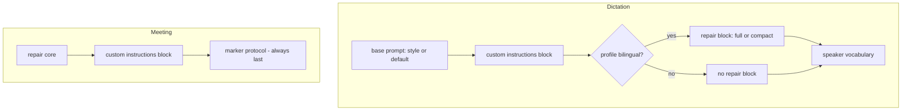
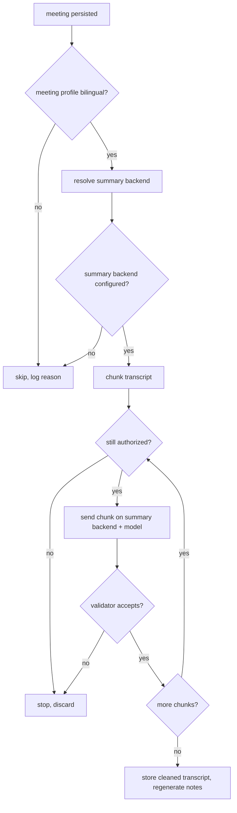

# Default-On Mixed-Language Repair for Bilingual Users - Plan

## Goal Capsule

- **Objective:** A person who dictates and meets in two languages gets their technical terms back in the right script, without finding and enabling anything.
- **Means:** Derive repair from the spoken-language selections instead of a preset and a toggle (KTD1), and move meeting cleanup onto the summary endpoint (KTD3).
- **Authority hierarchy:** Product behavior follows the R-IDs. Implementation mechanism follows the KTDs within their cited R constraints. Units override neither.
- **Execution profile:** Eight units, dependency-ordered. Prompt-composition units are pure and prove out in unit tests; the transport and gate units carry the risk.
- **Stop conditions:** Stop and report if removing the consent fingerprint cannot preserve mid-flight cancellation (R12), or if the summary backend cannot carry the marker protocol (R9).
- **Tail ownership:** This plan ends at a merged change. Measuring repair quality against the Arabic corpus belongs to the transcription-quality harness, not here.

---

## Product Contract

### Summary

Make mixed-language repair a consequence of the languages the user selected. Dictation composes a repair block into its cleanup prompt whenever the dictation profile carries two or more languages. Meetings run transcript cleanup automatically on the already-configured summary backend whenever the meeting profile carries two or more languages. The dictation repair preset, the meeting cleanup toggle, and the per-endpoint consent fingerprint all come out.

### Problem Frame

The repair for the maintainer's top complaint already ships, and almost nobody will ever see it. Arabic speech carrying English technical terms comes back phonetically mangled into Arabic script: `البرايمريكية` for "primary key". The fix exists as a dictation prompt preset named "Mixed-Language Repair (Arabic + English)" that has to be picked by hand, behind a post-processor that is off by default. Meetings have a second, unrelated switch for the same repair, gated by a consent fingerprint that re-arms itself whenever the backend or its URL changes.

So the capability is complete and the discovery path is not. A bilingual user has no reason to go looking behind two opt-ins for a feature whose absence reads as the recognizer being bad at Arabic. Meanwhile the app already knows the user is bilingual: the spoken-language profile is an explicit, persisted selection, and since the language-authority split there is one for dictation and one for meetings.

### Key Decisions

- **Repair is derived from the language selection, not chosen from a list.** (session-settled: user-approved — chosen over dictionary-script heuristics: the language selection is an explicit, persisted user signal.) Governs R1, R2, R3.
- **The dictation post-processor turns itself on for a bilingual user.** (session-settled: user-approved — chosen over keeping the manual preset: two opt-ins hide a shipped fix.) Governs R7, R8.
- **Meeting cleanup uses the meeting summary endpoint.** (session-settled: user-approved — chosen over auto-granting consent on the dictation post-processor endpoint: sending meeting transcripts to an endpoint the user approved only for dictation would be a new disclosure.) Governs R9, R10.

### Requirements

**Bilingual detection**

- R1. Dictation cleanup applies mixed-language repair when the dictation spoken-language profile carries two or more selected languages.
- R2. Meeting transcript cleanup applies mixed-language repair when the meeting spoken-language profile carries two or more selected languages.
- R3. Repair text uses the Arabic-and-English examples only when both Arabic and English are selected; any other bilingual pair receives script-neutral repair text carrying the same rules.

**Dictation**

- R4. The repair block sits after the custom-instructions block and before the speaker vocabulary in the composed dictation prompt.
- R5. The repair block authorizes restoring a term the recognizer mangled into the wrong script, without licensing paraphrase of words it heard correctly.
- R6. On-device cleanup receives a shortened repair block sized for the 1,024-token whole-context budget.
- R7. Muesli enables the dictation post-processor once for a bilingual profile, and never re-enables it after the user turns it off.
- R8. Settings state whether repair is actually running, including the case where the post-processor model is not downloaded.

**Meetings**

- R9. Meeting transcript cleanup runs on the meeting summary backend, using that backend's model, credentials, and resolved URL.
- R10. Meeting cleanup runs when the meeting profile is bilingual and the summary backend is configured, with no separate toggle and no consent fingerprint.
- R11. The Meetings pane shows a read-only status line naming whether repair is on and which destination would receive transcripts.
- R12. An in-flight cleanup stops before its next chunk leaves the process once its authorizing conditions stop holding.

**Migration and compatibility**

- R13. A config selecting the removed repair preset loads onto the default cleanup prompt without changing unrelated settings.
- R14. The removed cleanup and consent keys decode without error and are dropped on the next save.

### Acceptance Examples

- AE1. **Covers R1, R4, R5.** Given a dictation profile with Arabic and English selected and the post-processor on, when a dictation is cleaned, then the system prompt contains the repair block positioned after any custom-instructions block and before the vocabulary list.
- AE2. **Covers R3.** Given a profile with French and English selected, when the prompt is composed, then the repair block carries the script-neutral text and no Arabic examples.
- AE3. **Covers R7.** Given a bilingual profile and a user who has turned the post-processor off, when the app relaunches, then the post-processor stays off.
- AE4. **Covers R10, R12.** Given a bilingual meeting profile and a configured summary backend, when a meeting finishes and the user then removes a language mid-cleanup, then no further chunk is sent.
- AE5. **Covers R13.** Given a config whose `active_transcript_cleanup_prompt_id` is `mixed-language-repair`, when it loads, then the active prompt is the default one and the custom prompts, styles, and language profiles are unchanged.

### Scope Boundaries

- The repair prompt text itself is reused, not rewritten. `MixedLanguageRepairPrompt.core` stays the single source (KTD5 adds variants around it).
- Meeting notes and titles get no repair block; they summarize already-cleaned text.

#### Deferred to Follow-Up Work

- Measuring repair quality against the Arabic corpus. That belongs to the transcription-quality harness.
- Making on-device meeting cleanup possible. The 1,024-token whole-context ceiling still rules it out.
- A per-language-pair repair vocabulary mined from the user's own transcripts.

#### Outside this product's identity

- Sending meeting transcripts anywhere the user has not already configured for meeting content.

---

## Planning Contract

### Key Technical Decisions

- KTD1. **Bilingual is a derived predicate read per surface.** Dictation reads `config.dictationLanguageProfile.isBilingual`; meetings read `config.meetingSpokenLanguage.isBilingual`. Both already exist on `SpokenLanguageProfile`. Instantiates the language-selection Key Decision governing R1, R2, R3. (session-settled: user-approved — chosen over dictionary-script heuristics: the language selection is an explicit, persisted user signal.)
- KTD2. **The dictation composer gains exactly one optional repair parameter.** `DictationCleanupPromptComposer.systemPrompt` takes a repair variant alongside the existing custom-instructions inputs. One parameter keeps the merge with the parallel Modes work trivial, since that change adds its own separate block parameter to the same function. Governs the mechanism behind R4.
- KTD3. **Meeting cleanup runs on the summary backend, resolved through a new transport owner.** A small `MeetingCleanupTransport` resolves backend, model, and readiness from the summary configuration, and `TranscriptCleanupClient.clean` gains an optional model override so the transport can supply the summary-side model. Instantiates the summary-endpoint Key Decision governing R9, R10. (session-settled: user-approved — chosen over auto-granting consent on the dictation post-processor endpoint: sending meeting transcripts to an endpoint the user approved only for dictation would be a new disclosure.) The no-new-disclosure claim rests on summarization running for every completed meeting, which it does today with no enabling flag; if that ever becomes conditional, this decision needs revisiting.
- KTD4. **Authorization replaces consent, and keeps the mid-flight recheck.** The consent fingerprint disappears; the `isAuthorized` closure that runs before every chunk now asserts the meeting profile is still bilingual, the summary backend is unchanged, and it is still configured. The recheck point is what R12 protects, and it survives the removal.
- KTD5. **On-device cleanup gets a compact repair variant.** The full repair text is 1,243 characters against a 1,024-token budget shared by prompt, dictated text, and output. A compact variant carries the same instruction without the worked examples. Governs the mechanism behind R6.
- KTD6. **The post-processor auto-enable is a one-time latch, not a standing rule.** A new persisted boolean records that the flip already happened, so a user who turns cleanup off keeps it off. Governs the mechanism behind R7.
- KTD7. **The repair block enters the meeting cleanup prompt before the marker protocol.** The marker protocol must stay last and authoritative, because the validator rejects any response whose markers drifted, and a rejection discards the whole transcript.

### High-Level Technical Design

Prompt composition, both surfaces:

Meeting cleanup gate and transport:

### Assumptions

- Every summary backend can serve cleanup. All six summary identifiers map onto hosted cleanup options with a non-nil `llmBackend`, so eligibility passes for each. U4 verifies this rather than assuming it at runtime.
- Flipping the post-processor on for an already-bilingual user at first launch after upgrade is wanted. The latch in KTD6 bounds the blast radius to one flip.
- The privacy posture rests on repository evidence rather than external guidance. The change reduces the number of endpoints receiving transcripts rather than adding one, and local patterns for both prompt composition and cleanup transport are strong.

### Sequencing

U1 and U7 are prompt-and-config foundations. U2 and U3 complete dictation. U4, U5, and U6 complete meetings. U8 documents. U4 must land before U5, because the gate calls the transport.

---

## Implementation Units

### U1. Repair prompt variants and selection

- **Goal:** One owner decides which repair text a surface gets, and returns nothing when the surface is monolingual.
- **Requirements:** R1, R2, R3, R6.
- **Dependencies:** none.
- **Files:** `native/MuesliNative/Sources/MuesliNativeApp/Models.swift`; `native/MuesliNative/Tests/MuesliTests/MixedLanguageRepairPromptTests.swift` (new).
- **Approach:**
  1. Keep `MixedLanguageRepairPrompt.core(subject:)` as the Arabic-and-English text and the single source, per the Scope Boundaries.
  2. Add a script-neutral variant carrying the same MUST and MUST NOT rules with no Arabic examples, for R3.
  3. Add a compact variant for the on-device budget, per KTD5: the instruction and the rules, without the worked examples.
  4. Add a selector taking a `SpokenLanguageProfile` and a compactness flag, returning the block text or nil when the profile is not bilingual. The profile is the only input, per KTD1.
  5. The dictation block is delimited like the custom-instructions block so the model sees a bounded region.
- **Patterns to follow:** `CustomInstructions.promptBlock` for delimited-block shape and the nil-when-empty contract.
- **Test scenarios:**
  - A profile with Arabic and English returns the block containing the `primary key` example.
  - A profile with French and English returns the script-neutral block, and that block contains no Arabic characters.
  - A profile with one language returns nil.
  - An automatic profile with no selected languages returns nil.
  - The compact variant is materially shorter than the full one and still carries the do-not-translate and do-not-omit rules.
  - Both variants name the restoration allowance required by R5.
- **Verification:** The new suite passes and the repair text has one definition per variant.

### U2. Compose the repair block into dictation cleanup

- **Goal:** Every dictation cleanup prompt carries the repair block when the dictation profile is bilingual.
- **Requirements:** R1, R4, R5, R6.
- **Dependencies:** U1.
- **Files:** `native/MuesliNative/Sources/MuesliNativeApp/TranscriptionRuntime.swift`; `native/MuesliNative/Sources/MuesliNativeApp/DictationCorrectionMonitor.swift`; `native/MuesliNative/Sources/MuesliNativeApp/MuesliController.swift`; `native/MuesliNative/Tests/MuesliTests/TranscriptionRuntimeTests.swift`; `native/MuesliNative/Tests/MuesliTests/DictationStyleSessionTests.swift`.
- **Approach:**
  1. Add one optional repair parameter to both `DictationCleanupPromptComposer.systemPrompt` overloads, per KTD2, defaulting to no block so existing callers are unchanged.
  2. Order the composition base, then custom instructions, then repair, then vocabulary, per R4.
  3. Resolve the variant in the config-taking convenience overload: read the dictation profile and pass the compact variant when the cleanup backend is on-device, per R6.
  4. Leave the fixed-prompt substitution for S1-mini last, as it is today.
- **Execution note:** Pin the existing empty-instructions byte-identity test before changing the composer; a monolingual profile must produce the exact prompt it produces today.
- **Patterns to follow:** the existing `customInstructions` parameter threading and its `promptSuffix` blank-line convention.
- **Test scenarios:**
  - Covers AE1. A bilingual config places the repair block after the custom-instructions block and before the vocabulary.
  - A monolingual config produces a prompt byte-identical to the current output.
  - A bilingual config with empty custom instructions still gets the repair block.
  - An on-device cleanup backend gets the compact variant; a hosted backend gets the full one.
  - Covers AE2. A French-and-English config gets the script-neutral variant.
  - The frozen session snapshot keeps the repair decision made at dictation start when the profile changes mid-dictation.
- **Verification:** Both suites pass, and no call site composes a cleanup prompt outside the composer.

### U3. One-time post-processor auto-enable and its readiness caption

- **Goal:** A bilingual user gets cleanup switched on once, and Settings tell the truth about whether repair is running.
- **Requirements:** R7, R8.
- **Dependencies:** U2.
- **Files:** `native/MuesliNative/Sources/MuesliNativeApp/Models.swift`; `native/MuesliNative/Sources/MuesliNativeApp/MuesliController.swift`; `native/MuesliNative/Sources/MuesliNativeApp/SettingsView.swift`; `native/MuesliNative/Tests/MuesliTests/BilingualRepairAutoEnableTests.swift` (new).
- **Approach:**
  1. Add the persisted latch key from KTD6 with tolerant decode, defaulting to not-yet-flipped.
  2. Add a controller entry point that flips the post-processor on once when the dictation profile is bilingual, the latch is unset, and the existing readiness check passes; set the latch whenever it runs, including when readiness refuses, so it never retries.
  3. Call it at launch and after a dictation language-profile save.
  4. Route the flip through the existing `setPostProcessorEnabled` so its model-availability guards apply rather than being duplicated.
  5. Add a caption under the cleanup toggle stating that repair is on for bilingual profiles, and naming the missing model when readiness refuses, for R8.
- **Patterns to follow:** `setPostProcessorEnabled` availability guards; the existing fixed-prompt notice for caption shape.
- **Test scenarios:**
  - A bilingual profile with the latch unset and readiness satisfied enables the post-processor and sets the latch.
  - Covers AE3. A bilingual profile with the latch set leaves the post-processor off.
  - A monolingual profile neither enables nor sets the latch.
  - Readiness refusing leaves the post-processor off, sets the latch, and surfaces the reason.
  - Saving a language profile that becomes bilingual triggers exactly one flip.
  - The latch survives a save-and-reload round trip.
- **Verification:** The new suite passes and a second launch produces no second flip.

### U4. Meeting cleanup transport on the summary backend

- **Goal:** A cleanup request goes to the meeting summary backend with that backend's model and credentials.
- **Requirements:** R9.
- **Dependencies:** U1.
- **Files:** `native/MuesliNative/Sources/MuesliNativeApp/MeetingCleanupTransport.swift` (new); `native/MuesliNative/Sources/MuesliNativeApp/TranscriptCleanupClient.swift`; `native/MuesliNative/Sources/MuesliNativeApp/MeetingTranscriptCleanup.swift`; `native/MuesliNative/Sources/MuesliNativeApp/MeetingInstructionsComposer.swift`; `native/MuesliNative/Sources/MuesliNativeApp/Models.swift`; `native/MuesliNative/Tests/MuesliTests/MeetingCleanupTransportTests.swift` (new); `native/MuesliNative/Tests/MuesliTests/MeetingCleanupPromptTests.swift`.
- **Approach:**
  1. Add the transport owner resolving three things from config: the cleanup backend option for the configured summary backend, the summary-side model for that backend, and whether it is configured.
  2. Resolve the summary identifier through `MeetingSummaryBackendOption.resolved` before mapping it to a cleanup option. Mapping the raw string straight through the cleanup option's resolver turns an empty stored value into the on-device option, which is ineligible, so cleanup would silently never run for a user on the default backend while readiness still reported configured.
  3. Reuse `MeetingSummaryClient.isBackendConfigured` for readiness rather than reimplementing per-backend credential rules.
  4. Add an optional model override to `TranscriptCleanupClient.clean`, defaulting to today's post-processor-scoped resolution so dictation is untouched.
  5. Point `MeetingTranscriptCleanup.liveSender` at the transport for backend and model, keeping its existing request options including provider-retention refusal.
  6. Extend the meeting cleanup prompt to carry the repair block before the marker protocol, per KTD7, and let the instructions composer supply it.
- **Execution note:** The model-key mapping is the error-prone part; prove each backend's model key with a table-driven test before wiring the sender.
- **Patterns to follow:** `MeetingSummaryClient` model defaults for empty model strings; the existing `liveSender` request options.
- **Test scenarios:**
  - Each of the six summary backends resolves to a cleanup option with a non-nil LLM backend.
  - An empty stored summary backend resolves to the default backend and stays eligible, rather than falling back to the on-device option.
  - Each resolves the summary-side model key, and an empty configured model falls back to that backend's default where one exists.
  - Readiness is false for a summary backend missing its credential, and true once supplied.
  - The composed meeting prompt ends with the marker protocol even when both custom instructions and the repair block are present.
  - A monolingual meeting profile composes the prompt with no repair block.
  - The model override is absent for dictation cleanup, leaving its resolved model unchanged.
- **Verification:** Both suites pass; a cleanup request names the summary model.

### U5. Bilingual gate replaces the consent gate

- **Goal:** Meeting cleanup runs on the bilingual condition alone, and still stops mid-flight when that condition breaks.
- **Requirements:** R2, R10, R12.
- **Dependencies:** U4.
- **Files:** `native/MuesliNative/Sources/MuesliNativeApp/MeetingTranscriptCleanup.swift`; `native/MuesliNative/Sources/MuesliNativeApp/MeetingTranscriptCleanupPolicy.swift`; `native/MuesliNative/Sources/MuesliNativeApp/MuesliController.swift`; `native/MuesliNative/Tests/MuesliTests/MeetingTranscriptCleanupTests.swift`; `native/MuesliNative/Tests/MuesliTests/MeetingsNavigationTests.swift`.
- **Approach:**
  1. Rewrite `isEnabled` as the meeting profile being bilingual per KTD1, the transport being eligible, and the transport being configured.
  2. Delete the consent fingerprint, its grant, revoke, has-current, and reconcile functions, and every call site including the ones in config decode and the config-update path.
  3. Keep `locality` and its disclosure text; the status line in U6 needs them.
  4. Rewrite the mid-flight authorization closure per KTD4 to assert the profile is still bilingual and the summary backend is unchanged and configured.
  5. Keep the per-component skip logging, substituting the new components for the consent one.
- **Execution note:** Two of the tests this unit rewrites are on the pinned baseline-flaky list; re-run that suite in isolation before attributing a failure to this change.
- **Patterns to follow:** the existing all-or-nothing discard contract in `clean`; the existing skip-logging line.
- **Test scenarios:**
  - A bilingual profile with a configured summary backend enables cleanup.
  - A monolingual profile disables it, and the skip log names the profile as the failing component.
  - A bilingual profile with an unconfigured summary backend disables it.
  - Covers AE4. Removing a language mid-cleanup stops the run before the next chunk is sent.
  - Changing the summary backend mid-cleanup stops the run before the next chunk is sent.
  - A rejected chunk still discards the entire transcript.
  - Config decode no longer revokes anything, and updating unrelated config does not cancel an in-flight cleanup.
- **Verification:** Both suites pass; no consent symbol remains in the sources.

### U6. Meetings pane status line

- **Goal:** The Meetings pane states whether repair is on and where transcripts would go, with nothing to toggle.
- **Requirements:** R11.
- **Dependencies:** U5.
- **Files:** `native/MuesliNative/Sources/MuesliNativeApp/SettingsView.swift`; `native/MuesliNative/Tests/MuesliTests/MeetingCleanupStatusTests.swift` (new).
- **Approach:**
  1. Replace the toggle row with a read-only status row.
  2. Put the status string in a pure helper so it is testable without a view: on with its destination, off because the profile is monolingual, or off because the backend is unconfigured.
  3. Reuse the existing disclosure text for the destination phrasing.
- **Patterns to follow:** the `settingsRow` description-only shape; MuesliTheme tokens, since the design gates scan this file.
- **Test scenarios:**
  - A bilingual profile with a configured backend produces an on status naming the destination.
  - A monolingual profile produces an off status naming the language selection as the reason.
  - A bilingual profile with an unconfigured backend produces an off status naming the backend as the reason.
  - A loopback backend is described as staying on the machine.
- **Verification:** The new suite and the design-gate suites pass.

### U7. Remove the repair preset and retire the cleanup keys

- **Goal:** The preset and the removed keys disappear without disturbing anything else in a user's config.
- **Requirements:** R13, R14.
- **Dependencies:** U1.
- **Files:** `native/MuesliNative/Sources/MuesliNativeApp/Models.swift`; `native/MuesliNative/Tests/MuesliTests/ModelsTests.swift`; `native/MuesliNative/Tests/MuesliTests/MeetingCleanupPromptTests.swift`; `native/MuesliNative/Tests/MuesliTests/DictationStyleResolverTests.swift`.
- **Approach:**
  1. Remove the repair preset from the built-in list and remove its identifier, leaving the other built-ins and the reserved-identifier set otherwise intact.
  2. Map a persisted active-prompt identifier of `mixed-language-repair` onto the default identifier during the existing post-decode sanitize, without resetting the stored system prompt or any other field, for R13.
  3. Map a stored system prompt equal to the old repair text onto the default prompt in the same place.
  4. Demote the cleanup-enable and consent-fingerprint keys to decode-only legacy keys so old files load, and stop writing them, for R14.
  5. Update the two tests that reference the removed identifier to use another preset.
- **Execution note:** Removing an identifier from the reserved set lets a custom style claim it later; confirm the resolver's validation still refuses an unknown identifier before relying on that path.
- **Patterns to follow:** the existing post-decode sanitize block that already resets an unknown active preset.
- **Test scenarios:**
  - Covers AE5. A config naming the removed preset loads with the default prompt and unchanged custom prompts, styles, and language profiles.
  - A config whose stored system prompt is the old repair text loads onto the default prompt.
  - A config with an unrelated custom preset is untouched.
  - A config carrying the retired cleanup and consent keys decodes without error.
  - A save after that decode omits both retired keys.
  - The built-in preset list no longer contains the repair preset.
- **Verification:** All four suites pass and no source references the removed identifier.

### U8. Documentation

- **Goal:** The repository describes repair as automatic.
- **Requirements:** none directly; supports R7, R10.
- **Dependencies:** U3, U6.
- **Files:** `CHANGELOG.md`; `CLAUDE.md`.
- **Approach:**
  1. Add a changelog entry covering the automatic behavior, the removed preset, and the removed toggle.
  2. Update the project guide where it describes the cleanup toggle and the preset.
- **Test expectation:** none — documentation only.
- **Verification:** No stale reference to the toggle or the preset remains.

---

## System-Wide Impact

- **Privacy posture.** The consent fingerprint disappears, so removing it must not widen where transcripts go. It does not: cleanup moves onto the endpoint the summary already uses, which receives the full transcript for notes today. The disclosure text survives in the status line (R11).
- **Config compatibility.** Two keys retire and one is added. Every path is tolerant-decode, so an older build reading a newer file ignores the latch and a newer build reading an older file migrates it (R13, R14).
- **Shared prompt seams.** Both composer seams are also being changed by parallel work on dictation modes. KTD2 keeps this change to one additive parameter so the two land independently.

## Risks & Dependencies

- **The all-or-nothing discard hides prompt regressions.** A repair block that disturbs the marker protocol makes every meeting silently keep its raw transcript. KTD7 puts the protocol last; U4 tests the composed order directly.
- **Auto-enabling cleanup costs a model pass per dictation.** The latch means it happens once and stays reversible, and the readiness caption keeps it honest when the model is missing (R8).
- **On-device context pressure.** Even the compact variant competes with dictated text inside 1,024 tokens. U1 sizes it; if it still crowds the text, the fallback is to skip repair on-device and say so in the caption.
- **The 12-character reconciler guard is unrelated and stays.** Nothing here touches transcript reconciliation.

## Verification Contract

| Gate | Command | Applies to |
|---|---|---|
| Focused suites | `swift test --package-path native/MuesliNative --scratch-path "$HOME/Library/Caches/muesli-spm/worktrees/feat-bilingual-repair/test" --filter <SuiteName>` | Each unit as it lands |
| Full suite | `swift test --package-path native/MuesliNative --scratch-path "$HOME/Library/Caches/muesli-spm/worktrees/feat-bilingual-repair/test"` | Before the pull request |
| Release build | `swift build --package-path native/MuesliNative -c release --product MuesliNativeApp` | Before the pull request |
| Design gates | Included in the full suite | Any unit touching a view file |

Five tests across two suites fail on the untouched base branch for timing reasons. Treat a failure in those as pre-existing unless the diff touches the code under test, and re-run the suite in isolation before deciding.

## Definition of Done

- Every requirement R1 through R14 is met, and each unit's test scenarios exist as tests.
- The full suite passes with no failures beyond the pinned baseline set.
- The release build succeeds.
- No source or test references the removed preset identifier, the consent fingerprint, or the cleanup-enable toggle.
- A monolingual user's composed dictation prompt is byte-identical to the current output.
- Abandoned or experimental code from approaches that did not work out is removed rather than left in the diff.
